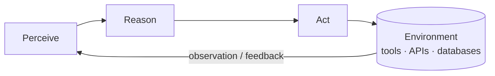
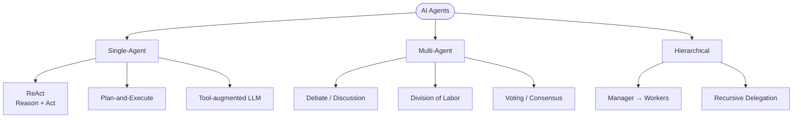

# What are AI Agents?

## Overview

An AI agent is a software system that perceives its environment, reasons about what it observes, and takes actions to
achieve a goal. Unlike a simple chatbot that produces a single response to a single prompt, an agent operates in a loop:
it observes, thinks, acts, and then observes the result of its action before deciding what to do next. This
perception-reasoning-action cycle is the defining characteristic that separates agents from static question-answering
systems.

The idea is not new. In the 1970s, Terry Winograd built SHRDLU, a program that could understand natural-language
commands and manipulate blocks in a simulated world. SHRDLU could parse sentences like "pick up the red block" and
execute the corresponding action in its environment. It was, in a meaningful sense, one of the earliest AI agents.
However, SHRDLU worked only in a tiny, closed world. The language understanding was brittle, and the environment was
trivial.

Through the 1980s and 1990s, researchers explored rule-based expert systems, planning agents (like STRIPS), and
reinforcement-learning agents that learned policies by interacting with environments. The Belief-Desire-Intention (BDI)
architecture formalized how an agent could maintain beliefs about the world, desires about outcomes, and intentions that
guide action selection. Robotics gave us embodied agents that navigated physical spaces.

The modern era of AI agents began when large language models (LLMs) became capable enough to serve as the reasoning
core. Instead of hand-coded rules, an LLM can interpret open-ended instructions, break problems into steps, decide which
tools to invoke, and adapt its plan based on feedback. Systems like AutoGPT (2023) demonstrated that an LLM could be
placed inside a loop with access to tools such as web search, code execution, and file I/O, effectively turning a
language model into an autonomous agent.

It is important to distinguish between a chat interface and an agent. A chat interface is reactive: the user sends a
message, the model replies, and the interaction is over until the user speaks again. An agent is proactive: given a
goal, it autonomously decides what steps to take, executes them, evaluates results, and continues until the goal is met
or it determines it cannot proceed. The user may not need to intervene at all after providing the initial objective.

AI agents can be classified along several axes. A single-agent system has one LLM instance running one loop. A
multi-agent system involves multiple agents that communicate with each other, each potentially specialized for a
different subtask (for example, one agent writes code while another reviews it). A hierarchical system adds layers: a
manager agent delegates tasks to worker agents and synthesizes their outputs. Frameworks like CrewAI and CAMEL formalize
these multi-agent patterns.

The power of agents comes from composability. By combining a reasoning engine (the LLM) with a set of tools (APIs,
databases, code interpreters) and a memory system (conversation history, vector stores), you can build systems that
tackle complex, multi-step tasks that no single prompt-response interaction could handle.

---

## Key Concepts

- **Perception-Reasoning-Action Loop**: The agent observes the current state of the world (or the result of its last action), reasons about what to do next, and executes an action. This loop repeats until a termination condition is met.
- **Environment**: The external context the agent interacts with. This could be a codebase, a web browser, an API, a database, or even a physical space for robotic agents.
- **Tools**: External capabilities the agent can invoke. Examples include web search, code execution, file reading/writing, and API calls.
- **Memory**: Information the agent retains across loop iterations. Short-term memory is the current conversation or scratchpad. Long-term memory might be a vector database of past interactions.
- **Goal / Objective**: The task the agent is trying to accomplish. Well-defined goals lead to better agent performance.
- **Single-Agent vs Multi-Agent**: A single agent handles everything alone. Multi-agent systems split work across specialized agents that coordinate.
- **Hierarchical Agents**: A manager agent breaks a task into subtasks and delegates them to worker agents, aggregating results.

---

## Code Examples

Below is minimal pseudocode for a ReAct-style agent loop. ReAct interleaves reasoning ("Thought") with tool use
("Action") and observation of results ("Observation").

```python
# Minimal ReAct Agent Pseudocode

def react_agent(goal, tools, llm, max_steps=10):
    """
    A simple agent loop following the ReAct pattern.

    Args:
        goal: The objective the agent should accomplish.
        tools: A dictionary mapping tool names to callable functions.
        llm: A language model that generates text given a prompt.
        max_steps: Maximum number of loop iterations.
    """
    # Initialize the scratchpad with the goal
    scratchpad = f"Goal: {goal}\n"

    for step in range(max_steps):
        # Ask the LLM to produce a Thought and an Action
        prompt = scratchpad + "Thought:"
        response = llm(prompt)  # LLM generates reasoning + action

        # Parse the response into thought and action
        thought, action, action_input = parse_response(response)
        scratchpad += f"Thought: {thought}\n"

        # Check if the agent wants to finish
        if action == "finish":
            return action_input  # Final answer

        # Execute the chosen tool
        if action in tools:
            observation = tools[action](action_input)
        else:
            observation = f"Error: tool '{action}' not found."

        scratchpad += f"Action: {action}({action_input})\n"
        scratchpad += f"Observation: {observation}\n"

    return "Max steps reached without a final answer."
```

Line-by-line explanation:
- **Lines 1-11**: We define the function signature. The agent receives a goal, a set of tools, a language model, and a step limit.
- **Line 13**: The scratchpad accumulates the agent's reasoning history so each LLM call has full context.
- **Lines 15-17**: Each iteration prompts the LLM with the current scratchpad and asks it to think and choose an action.
- **Lines 19-20**: A parser extracts the structured thought, action name, and action input from the LLM's free-text output.
- **Lines 23-24**: If the agent outputs `finish`, the loop terminates and returns the answer.
- **Lines 27-30**: Otherwise, the selected tool is called and its output becomes the next observation.
- **Line 33**: A safety net in case the agent never converges.

---

## Math/Formulas (KaTeX)

The agent loop can be expressed as a state transition system. At each time step $t$, the agent is in state $s_t$. It
selects an action $a_t$ according to its policy $\pi$:

$$a_t = \pi(s_t, h_t)$$

where $h_t = (s_0, a_0, o_0, s_1, a_1, o_1, \ldots, s_t)$ is the full history of states, actions, and observations.
After executing $a_t$, the environment returns an observation $o_t$ and the agent transitions to a new state:

$$s_{t+1} = T(s_t, a_t, o_t)$$

The agent continues until it reaches a terminal state $s_T$ where $T$ is the first time step satisfying a goal predicate
$G(s_T) = \text{true}$.

---

## Diagrams

**Agent loop**



**Taxonomy of AI agents**



---

## Exercises

1. **Trace the loop**: Given the goal "What is the population of France?", a `web_search` tool, and a `finish` action, write out the full scratchpad (Thought, Action, Observation sequence) that a ReAct agent might produce. Include at least two iterations.

2. **Classify agents**: For each of the following, decide whether it is a single-agent, multi-agent, or hierarchical system: (a) a coding assistant that writes and tests code on its own, (b) a system where one LLM writes code and another reviews it, (c) a manager agent that breaks a research task into subtasks and assigns each to a specialist agent.

3. **Implement a trivial agent**: Write a Python agent that has access to two tools, `calculator(expression)` and `finish(answer)`. The agent should solve the problem "What is (17 * 23) + (45 / 9)?" by calling the calculator and then finishing with the result. You may simulate the LLM with hard-coded responses.

4. **History and comparison**: Research SHRDLU and compare its architecture to a modern LLM-based agent. What are the key differences in how they handle language understanding, planning, and world interaction?

---

## Further Reading

- [ReAct: Synergizing Reasoning and Acting in Language Models (Yao et al., 2022)](https://arxiv.org/abs/2210.03629)
- [A Survey on Large Language Model based Autonomous Agents (Wang et al., 2023)](https://arxiv.org/abs/2308.11432)
- [AutoGPT GitHub Repository](https://github.com/Significant-Gravitas/AutoGPT)
- [LangChain Documentation - Agents](https://python.langchain.com/docs/modules/agents/)
- [The BDI Agent Architecture (Rao & Georgeff, 1995)](https://www.aaai.org/Papers/KR/1991/KR91-049.pdf)
