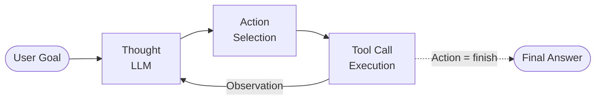
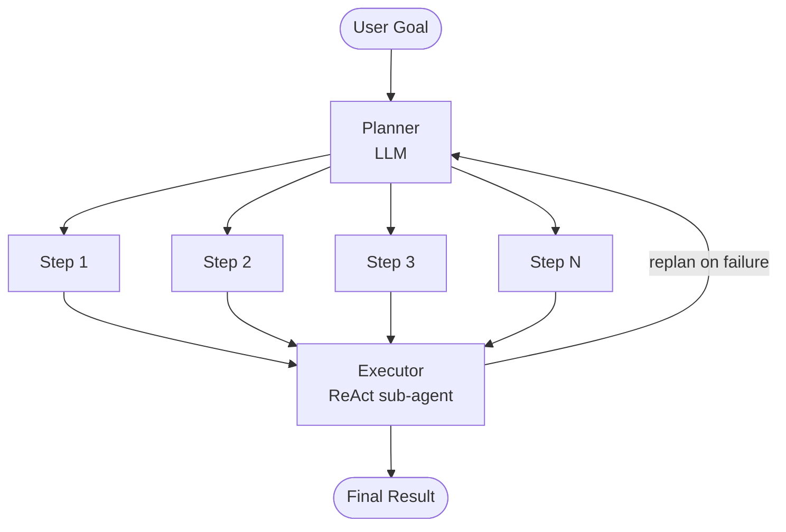
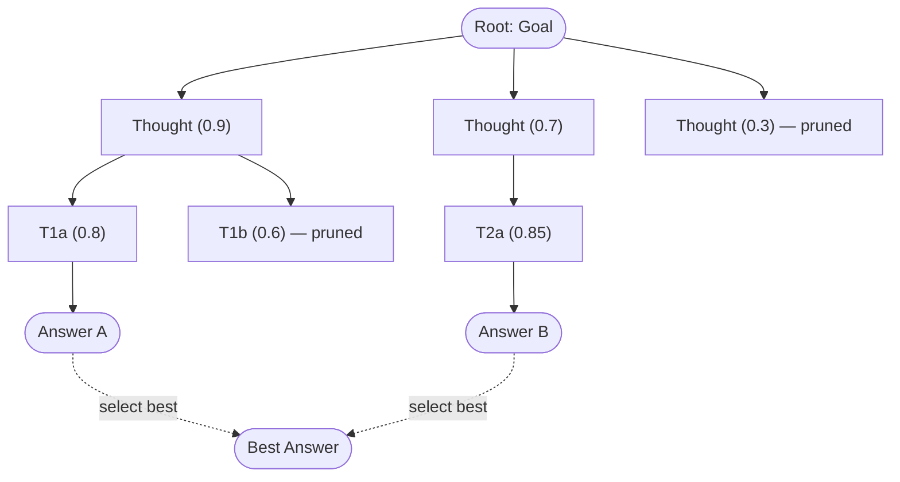

# Agent Architectures

## Overview

The architecture of an AI agent determines how it interleaves reasoning with action, how it plans, and how it recovers
from mistakes. Choosing the right architecture is one of the most consequential design decisions when building an agent
system. In this lesson, we examine three major paradigms: ReAct, Plan-and-Execute, and Tree of Thoughts.

**ReAct (Reason + Act)** is the most widely adopted architecture for LLM-based agents. Introduced by Yao et al.
(2022), ReAct interleaves free-form reasoning traces with concrete tool-calling actions. At each step, the agent
generates a "Thought" that explains its current understanding and strategy, then produces an "Action" that invokes a
tool, and finally receives an "Observation" from the environment. This tight loop means the agent can adjust its
reasoning after every single action, making it highly adaptive. The downside is that it can be myopic: because it only
plans one step at a time, it may wander or repeat itself on complex tasks that require multi-step foresight.

**Plan-and-Execute** addresses this limitation by separating planning from execution. First, a planner module (often an
LLM prompted for planning) generates a complete, ordered list of steps needed to achieve the goal. Then, an executor
module carries out each step sequentially. If a step fails, the planner can be re-invoked to revise the remaining plan.
This architecture excels at tasks with clear structure (e.g., "research topic X, then write a summary, then format it as
a report") because the upfront plan provides global coherence. However, it is less adaptive than ReAct when the
environment is unpredictable, because the initial plan may become stale.

A hybrid approach combines both: use Plan-and-Execute for the high-level strategy but use ReAct within each execution
step. This gives you both global coherence and local adaptiveness. LangGraph's "Plan-and-Execute" template implements
exactly this pattern.

**Tree of Thoughts (ToT)**, introduced by Yao et al. (2023), generalizes chain-of-thought reasoning into a tree
structure. Instead of following a single reasoning path, the agent explores multiple branches at each decision point. It
generates several candidate "thoughts" (partial solutions), evaluates them using a heuristic or the LLM itself, and then
decides which branches to expand further. This is essentially a search algorithm over the space of reasoning paths, and
it can be implemented with breadth-first search (BFS) or depth-first search (DFS). ToT is particularly powerful for
tasks that require exploration, such as puzzle solving, creative writing, or mathematical proof search. The cost is
higher token usage, since multiple branches are explored in parallel.

An important consideration across all architectures is the action space. The set of tools available to the agent defines
what actions it can take. A narrow action space (e.g., only web search and a calculator) constrains the agent but makes
it more predictable. A broad action space (e.g., arbitrary code execution, file system access, API calls) makes the
agent more capable but harder to control. The architecture must handle tool selection, argument formatting, error
handling, and result parsing for every tool in the action space.

Another cross-cutting concern is context management. As the agent takes more steps, the accumulated history (thoughts,
actions, observations) grows and may exceed the LLM's context window. Strategies include summarizing older history,
using a sliding window, or offloading details to an external memory store and retrieving them as needed.

---

## Key Concepts

- **ReAct**: Interleaves Thought, Action, and Observation in a single stream. Adaptive but potentially myopic on long tasks.
- **Plan-and-Execute**: Generates a full plan upfront, then executes step by step. Provides global coherence but can be brittle if the environment changes.
- **Tree of Thoughts (ToT)**: Explores multiple reasoning branches, evaluates them, and prunes. Good for exploration-heavy tasks but token-expensive.
- **Action Space**: The set of all tools the agent can invoke. Determines capability and controllability.
- **Context Management**: Strategies for keeping the agent's working memory within the LLM's context window as the interaction grows.
- **Hybrid Architectures**: Combining Plan-and-Execute at the macro level with ReAct at the micro level for both coherence and adaptability.

---

## Code Examples

A basic ReAct loop implementation in Python:

```python
import json

def react_agent(goal, tools, llm, max_steps=10):
    """
    ReAct agent: interleave reasoning and action.

    tools: dict of {name: {"fn": callable, "description": str}}
    llm: function(prompt) -> str
    """
    # Build tool descriptions for the system prompt
    tool_desc = "\n".join(
        f"- {name}: {info['description']}"
        for name, info in tools.items()
    )

    system = f"""You are a ReAct agent. You have these tools:
{tool_desc}

At each step, output exactly:
Thought: <your reasoning>
Action: <tool_name>
Action Input: <input string>

To finish, use:
Thought: <reasoning>
Action: finish
Action Input: <final answer>"""

    messages = [
        {"role": "system", "content": system},
        {"role": "user", "content": f"Goal: {goal}"}
    ]

    for step in range(max_steps):
        # Get LLM response
        response = llm(messages)
        messages.append({"role": "assistant", "content": response})

        # Parse Thought, Action, Action Input
        thought, action, action_input = parse_react(response)
        print(f"Step {step+1} | Thought: {thought}")
        print(f"         | Action: {action}({action_input})")

        if action == "finish":
            return action_input

        # Execute tool and feed observation back
        if action in tools:
            observation = tools[action]["fn"](action_input)
        else:
            observation = f"Error: unknown tool '{action}'"

        print(f"         | Observation: {observation}\n")
        messages.append({
            "role": "user",
            "content": f"Observation: {observation}"
        })

    return "Reached max steps without finishing."

def parse_react(text):
    """Extract Thought, Action, and Action Input from LLM output."""
    thought = ""
    action = ""
    action_input = ""
    for line in text.strip().split("\n"):
        if line.startswith("Thought:"):
            thought = line[len("Thought:"):].strip()
        elif line.startswith("Action:"):
            action = line[len("Action:"):].strip()
        elif line.startswith("Action Input:"):
            action_input = line[len("Action Input:"):].strip()
    return thought, action, action_input
```

Key implementation details:
- **Lines 10-15**: Tool descriptions are injected into the system prompt so the LLM knows what tools are available and how to use them.
- **Lines 17-27**: The system prompt enforces the Thought/Action/Action Input format. Structured output is critical for reliable parsing.
- **Lines 34-37**: Each LLM response is appended to the message history, giving the model full context of its prior reasoning.
- **Lines 44-49**: Tool execution happens outside the LLM. The observation is fed back as a user message, maintaining the conversational structure.

---

## Math/Formulas (KaTeX)

**ReAct as a policy**: At each step $t$, the agent produces a thought $\tau_t$ and action $a_t$:

$$(\tau_t, a_t) = \text{LLM}(q, \tau_1, a_1, o_1, \ldots, \tau_{t-1}, a_{t-1}, o_{t-1})$$

where $q$ is the original query and $o_i$ is the observation from step $i$.

**Tree of Thoughts search**: Let $S$ be the set of all partial thought sequences. A value function $V(s)$ estimates the
promise of a partial sequence $s \in S$. At each level of the tree, we generate $k$ candidate next thoughts and keep the
top $b$ by value:

$$s_{t+1}^{(i)} = \arg\!\operatorname{top\text{-}b}_{s' \in \text{expand}(s_t)} V(s')$$

The branching factor is $k$ and the beam width is $b$. Total cost scales as $O(T \cdot k)$ LLM calls for depth $T$,
compared to $O(T)$ for a single chain of thought.

**Plan-and-Execute decomposition**: Given a goal $G$, the planner produces a sequence of subgoals:

$$[g_1, g_2, \ldots, g_n] = \text{Plan}(G)$$

Each subgoal $g_i$ is executed by a ReAct sub-agent: $r_i = \text{ReAct}(g_i, \text{tools})$. If execution of $g_i$
fails, re-planning is triggered:

$$[g_i', g_{i+1}', \ldots, g_m'] = \text{Replan}(G, r_1, \ldots, r_{i-1}, \text{failure}(g_i))$$

---

## Diagrams

**ReAct Architecture**



**Plan-and-Execute Architecture**



**Tree of Thoughts (BFS, beam width = 2)**



---

## Exercises

1. **ReAct trace**: Given the goal "Find the GDP of Japan and convert it to euros", tools `web_search(query)` and
   `calculator(expr)`, write the full ReAct trace (Thought/Action/Observation for each step). Assume the search returns
   "Japan GDP: $4.2 trillion" and the exchange rate is 1 USD = 0.92 EUR.

2. **Plan-and-Execute design**: For the task "Write a blog post about climate change with cited sources", design a plan
   (list of 4-6 steps) that a Plan-and-Execute agent would generate. For each step, specify which tool(s) would be used.

3. **ToT branching**: Suppose you are solving the problem "Write a persuasive essay about renewable energy." Generate 3
   candidate opening paragraphs (the first level of the tree). Write a scoring rubric (0-10) and score each candidate.
   Select the top 2 to expand further.

4. **Architecture comparison**: Build both a ReAct agent and a Plan-and-Execute agent for the same task (e.g., "research
   and summarize the top 3 Python web frameworks"). Compare the number of LLM calls, total tokens used, and quality of
   the final output.

---

## Further Reading

- [ReAct: Synergizing Reasoning and Acting in Language Models (Yao et al., 2022)](https://arxiv.org/abs/2210.03629)
- [Tree of Thoughts: Deliberate Problem Solving with Large Language Models (Yao et al., 2023)](https://arxiv.org/abs/2305.10601)
- [Plan-and-Solve Prompting (Wang et al., 2023)](https://arxiv.org/abs/2305.04091)
- [LangGraph Plan-and-Execute Tutorial](https://langchain-ai.github.io/langgraph/tutorials/plan-and-execute/plan-and-execute/)
- [Reflexion: Language Agents with Verbal Reinforcement Learning (Shinn et al., 2023)](https://arxiv.org/abs/2303.11366)
