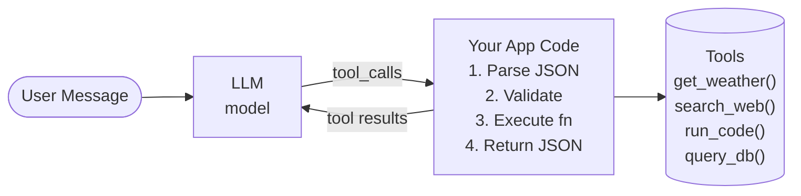
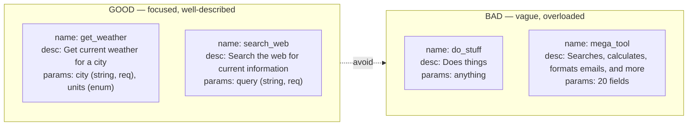

# Tool Use & Function Calling

## Overview

Tool use is what transforms a language model from a text generator into an agent. Without tools, an LLM can only produce tokens. With tools, it can search the web, execute code, query databases, send emails, and interact with arbitrary APIs. Function calling is the mechanism by which modern LLMs express their intent to use a tool in a structured, parseable format rather than as free-form text.

The core idea is straightforward. You define a set of tools, each described by a name, a natural-language description, and a schema specifying the parameters it accepts. These definitions are provided to the LLM as part of its prompt or through a dedicated API field. When the LLM determines that it needs to use a tool, instead of generating a plain text response, it outputs a structured function call: the tool name and the arguments formatted as JSON. Your application code intercepts this structured output, executes the corresponding function, and feeds the result back to the LLM as an observation. The LLM can then reason about the result and decide whether to call another tool or produce a final answer.

OpenAI popularized this pattern with their function calling API (later renamed to "tool use"), and it has since been adopted by Anthropic, Google, Mistral, and others. The key insight is that by training the model to produce structured JSON rather than free-text tool invocations, you get dramatically more reliable parsing. Before function calling APIs, developers had to prompt the model to output tool calls in a specific text format and then parse that text with fragile regex or string matching. Structured function calling eliminates most parsing failures.

Designing good tool schemas is an art. Each tool should have a single, clear responsibility. The description should explain not just what the tool does but when to use it, so the model can make informed selection decisions. Parameters should have descriptive names, clear types, and sensible defaults. Overly complex tool schemas confuse the model; overly simple schemas may require too many sequential calls. A common best practice is to provide 3-8 tools, each focused and well-documented.

Multi-tool orchestration adds another layer of complexity. When an agent has access to many tools, it must decide which tool to call, in what order, and how to combine their outputs. Some tasks require parallel tool calls (e.g., searching two databases simultaneously), while others require sequential calls where the output of one tool feeds into the next. Modern APIs support parallel tool calling, where the model can request multiple tool invocations in a single response, and the application executes them concurrently before returning all results.

Error handling is critical in tool-use systems. Tools can fail (network errors, invalid inputs, rate limits), and the agent must handle these failures gracefully. Common strategies include: returning the error message as the observation so the LLM can reason about it and try a different approach; implementing automatic retries with exponential backoff for transient errors; and setting timeouts to prevent the agent from hanging on a slow tool call.

Security is an equally important concern. If an agent can execute arbitrary code or make API calls, a prompt injection attack could cause it to perform malicious actions. Tool-use systems should implement sandboxing (run code in containers), input validation (check tool arguments before execution), output filtering (redact sensitive information), and permission boundaries (restrict which tools are available in which contexts).

---

## Key Concepts

- **Function Calling**: A structured output mode where the LLM produces a JSON object specifying a tool name and arguments, rather than free text.
- **Tool Schema**: A JSON Schema definition that describes a tool's name, purpose, and the parameters it accepts (with types, descriptions, and constraints).
- **Tool Selection**: The model's decision of which tool to use given the current context. Influenced by tool descriptions and the agent's reasoning.
- **Parallel Tool Calls**: The ability to invoke multiple tools in a single turn, with results returned together.
- **Observation**: The result returned by a tool after execution, fed back to the LLM for further reasoning.
- **Grounding**: Tools connect the LLM to real-world data, reducing hallucination by providing factual observations.

---

## Code Examples

Defining tools and handling function calls with the OpenAI API:

```python
from openai import OpenAI
import json

client = OpenAI()

# Step 1: Define tool schemas
tools = [
    {
        "type": "function",
        "function": {
            "name": "get_weather",
            "description": "Get the current weather for a city. "
                           "Use when the user asks about weather.",
            "parameters": {
                "type": "object",
                "properties": {
                    "city": {
                        "type": "string",
                        "description": "City name, e.g. 'San Francisco'"
                    },
                    "units": {
                        "type": "string",
                        "enum": ["celsius", "fahrenheit"],
                        "description": "Temperature unit (default: celsius)"
                    }
                },
                "required": ["city"]
            }
        }
    },
    {
        "type": "function",
        "function": {
            "name": "search_web",
            "description": "Search the web for current information. "
                           "Use when you need up-to-date facts.",
            "parameters": {
                "type": "object",
                "properties": {
                    "query": {
                        "type": "string",
                        "description": "The search query"
                    }
                },
                "required": ["query"]
            }
        }
    }
]

# Step 2: Implement actual tool functions
def get_weather(city, units="celsius"):
    """Simulated weather API call."""
    # In production, call a real weather API here
    return {"city": city, "temp": 18, "units": units, "condition": "cloudy"}

def search_web(query):
    """Simulated web search."""
    return {"results": [f"Result for: {query}"]}

# Map tool names to functions
tool_functions = {
    "get_weather": get_weather,
    "search_web": search_web,
}

# Step 3: Agent loop with function calling
def run_agent(user_message):
    messages = [{"role": "user", "content": user_message}]
    
    while True:
        # Call the LLM with tools
        response = client.chat.completions.create(
            model="gpt-4o",
            messages=messages,
            tools=tools,
            tool_choice="auto"  # Let model decide
        )
        
        msg = response.choices[0].message
        messages.append(msg)
        
        # If no tool calls, we have the final answer
        if not msg.tool_calls:
            return msg.content
        
        # Process each tool call
        for tool_call in msg.tool_calls:
            fn_name = tool_call.function.name
            fn_args = json.loads(tool_call.function.arguments)
            
            print(f"Calling: {fn_name}({fn_args})")
            
            # Execute the function
            result = tool_functions[fn_name](**fn_args)
            
            # Append the tool result to messages
            messages.append({
                "role": "tool",
                "tool_call_id": tool_call.id,
                "content": json.dumps(result)
            })

# Run it
answer = run_agent("What's the weather in Tokyo?")
print(answer)
```

Explanation of the critical sections:
- **Lines 7-50**: Tool schemas follow JSON Schema conventions. Each tool has a `name`, `description`, and `parameters` block. The description is what the model reads to decide when to use the tool.
- **Lines 53-59**: The actual implementations are plain Python functions. They could call real APIs, query databases, or run any computation.
- **Lines 72-76**: The `tool_choice="auto"` parameter lets the model decide whether to call a tool or respond directly. Alternatives include `"none"` (never call tools) and `{"type": "function", "function": {"name": "..."}}` (force a specific tool).
- **Lines 82-83**: When the model does not produce tool calls, the loop exits and we return the text response.
- **Lines 86-97**: Each tool call is executed and the result is appended as a `"tool"` role message, linked to the specific `tool_call_id` so the model can match results to calls.

---

## Math/Formulas (KaTeX)

The tool selection problem can be modeled as a discrete choice. Given a set of $n$ tools $\{t_1, t_2, \ldots, t_n\}$ and the current context $c$, the agent selects tool $t^*$:

$$t^* = \arg\max_{t_i} P(t_i \mid c)$$

where $P(t_i \mid c)$ is the model's probability of selecting tool $t_i$ given the context. In practice, this probability is implicitly computed by the LLM's next-token prediction.

For parallel tool calls, the agent selects a subset $S \subseteq \{t_1, \ldots, t_n\}$:

$$S^* = \arg\max_{S} P(S \mid c) \quad \text{subject to } |S| \leq k$$

The expected information gain from calling tool $t_i$ with input $x$ can be expressed as:

$$\text{IG}(t_i, x) = H(A \mid c) - H(A \mid c, o_{t_i}(x))$$

where $A$ is the answer random variable, $H$ is entropy, and $o_{t_i}(x)$ is the observation returned by tool $t_i$ on input $x$. The agent should prefer tools that maximally reduce its uncertainty about the answer.

---

## Diagrams

**Function Calling Flow**



**Tool Schema Design Principles**



---

## Exercises

1. **Design a tool set**: You are building a research agent. Design schemas for 4 tools: `search_academic_papers`, `read_paper_abstract`, `summarize_text`, and `save_notes`. For each, write the complete JSON schema with name, description, and parameters.

2. **Error handling**: Extend the code example above to handle three failure cases: (a) the tool function raises an exception, (b) the LLM produces an invalid tool name, (c) the LLM produces malformed JSON for the arguments. For each, return a helpful error message as the observation.

3. **Parallel calls**: Modify the agent to handle the query "Compare the weather in Tokyo and London." Verify that the model produces two `get_weather` calls in a single response and that both are executed before returning results.

4. **Security audit**: Given an agent with a `run_python_code(code: str)` tool, list 5 potential security risks and propose a mitigation strategy for each.

5. **Token efficiency**: You have 10 tools available but only 3 are relevant to most queries. Design a two-stage tool selection system where a lightweight first pass selects the top 3 tools, and only those 3 are included in the main LLM call. Write pseudocode for this approach.

---

## Further Reading

- [OpenAI Function Calling Guide](https://platform.openai.com/docs/guides/function-calling)
- [Anthropic Tool Use Documentation](https://docs.anthropic.com/en/docs/build-with-claude/tool-use)
- [Gorilla: Large Language Model Connected with Massive APIs (Patil et al., 2023)](https://arxiv.org/abs/2305.15334)
- [Toolformer: Language Models Can Teach Themselves to Use Tools (Schick et al., 2023)](https://arxiv.org/abs/2302.04761)
- [ToolBench: Evaluating LLMs as Tool Agents (Qin et al., 2023)](https://arxiv.org/abs/2305.16504)
