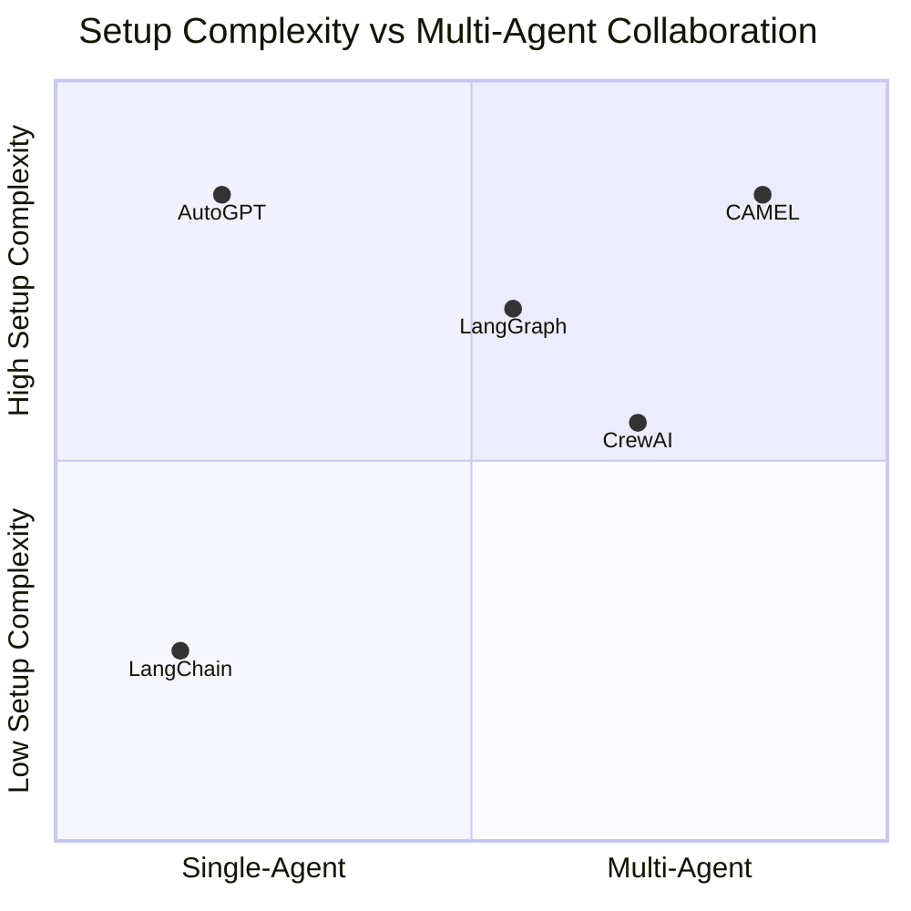
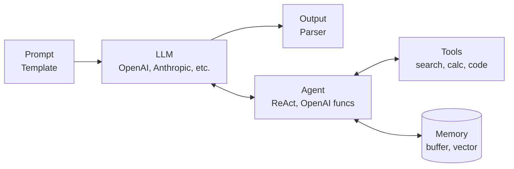
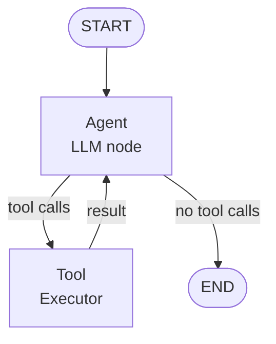

# Introduction to Agent Frameworks

## Overview

Building an AI agent from scratch requires implementing tool management, prompt construction, output parsing, memory
handling, error recovery, and loop control. Agent frameworks provide these building blocks as reusable abstractions so
you can focus on your application logic rather than reinventing infrastructure. In this lesson, we survey the major
frameworks, compare their design philosophies, and build a minimal agent using LangChain.

**LangChain** is the most widely adopted agent framework. Originally released in late 2022, it provides a modular
toolkit of chains (sequences of LLM calls), agents (LLM-driven decision-making loops), tools (integrations with external
services), and memory (conversation and document storage). LangChain's strength is its breadth: it has pre-built
integrations with dozens of LLM providers, vector stores, and tools. Its LangChain Expression Language (LCEL) lets you
compose chains declaratively using a pipe syntax. However, LangChain has been criticized for over-abstraction: simple
tasks sometimes require navigating many layers of classes and callbacks.

**LangGraph** is LangChain's companion library for building stateful, multi-step agent workflows as graphs. While
LangChain agents run a simple loop, LangGraph lets you define explicit nodes (processing steps) and edges (transitions
between steps), including conditional branching and cycles. This makes it ideal for Plan-and-Execute architectures,
multi-agent systems, and any workflow where you need fine-grained control over the execution flow. LangGraph also
provides built-in support for persistence, human-in-the-loop approval, and streaming.

**AutoGPT** was one of the first autonomous agent projects to capture public attention (early 2023). It places GPT-4 in
a loop with access to web browsing, file operations, and code execution, pursuing a user-defined goal with minimal human
intervention. AutoGPT demonstrated the potential of autonomous agents but also their limitations: it frequently looped,
wasted tokens on redundant actions, and struggled with complex multi-step goals. It remains an important reference
implementation and has evolved significantly since its initial release.

**CrewAI** focuses on multi-agent collaboration. You define a "crew" of agents, each with a specific role (e.g.,
"Researcher," "Writer," "Editor"), a backstory, and a set of tools. The crew then collaborates on a task, with agents
delegating subtasks to each other. CrewAI provides higher-level abstractions for role-based agent design and inter-agent
communication, making it easier to build systems where specialized agents work together.

**CAMEL** (Communicative Agents for "Mind" Exploration of Large Language Model Society) takes a research-oriented
approach to multi-agent systems. It uses role-playing between agents to explore complex tasks, with agents assuming
specific personas and communicating through structured dialogue. CAMEL is particularly useful for studying emergent
behaviors in multi-agent systems.

When choosing a framework, consider these factors. For simple, single-agent tasks with tool use, LangChain or even raw
API calls may suffice. For complex workflows with branching logic, LangGraph offers the most control. For multi-agent
collaboration, CrewAI provides the most ergonomic abstractions. For research and experimentation, CAMEL and AutoGPT
offer interesting starting points. And for production systems requiring reliability, LangGraph's explicit state
management and human-in-the-loop features are compelling.

The core building blocks shared across most frameworks are: **Chains** (sequences of operations), **Agents** (LLM-driven
decision makers), **Tools** (external capabilities), **Memory** (short-term and long-term storage), and
**Callbacks/Hooks** (observability and control). Understanding these abstractions in one framework makes it easier to
work with any of them.

---

## Key Concepts

- **Chains**: Composable sequences of LLM calls and transformations. The simplest chain is prompt-then-call-LLM. Chains can be nested and branched.
- **Agents**: Decision-making components that use an LLM to choose which tool to call next based on the current context.
- **Tools**: Wrappers around external functions or APIs that an agent can invoke. Each tool has a name, description, and callable implementation.
- **Memory**: Systems for persisting information across interactions. Includes conversation buffer memory, summary memory, and vector-store-backed retrieval memory.
- **LCEL (LangChain Expression Language)**: A declarative syntax for composing chains using the `|` (pipe) operator, similar to Unix pipes.
- **Graph-Based Workflows**: In LangGraph, the agent's control flow is an explicit directed graph with nodes and conditional edges.

---

## Code Examples

A minimal agent using LangChain Expression Language (LCEL) and the OpenAI function calling API:

```python
from langchain_openai import ChatOpenAI
from langchain_core.tools import tool
from langchain_core.messages import HumanMessage
from langgraph.prebuilt import create_react_agent

# Step 1: Define tools using the @tool decorator
@tool
def calculator(expression: str) -> str:
    """Evaluate a mathematical expression. Use for any math calculations.

    Args:
        expression: A valid Python math expression, e.g. '2 + 3 * 4'
    """
    try:
        result = eval(expression)  # Safe for simple math
        return f"Result: {result}"
    except Exception as e:
        return f"Error: {e}"

@tool
def search_knowledge(query: str) -> str:
    """Search the knowledge base for factual information.

    Args:
        query: A natural language search query
    """
    # Simulated search - replace with real retrieval
    knowledge = {
        "python creator": "Python was created by Guido van Rossum in 1991.",
        "speed of light": "The speed of light is approximately 3e8 m/s.",
    }
    for key, value in knowledge.items():
        if key in query.lower():
            return value
    return "No relevant information found."

# Step 2: Initialize the LLM
llm = ChatOpenAI(model="gpt-4o", temperature=0)

# Step 3: Create a ReAct agent using LangGraph's prebuilt helper
agent = create_react_agent(
    model=llm,
    tools=[calculator, search_knowledge]
)

# Step 4: Run the agent
result = agent.invoke({
    "messages": [HumanMessage(content="What is 17 * 23 + 5?")]
})

# Print the conversation
for msg in result["messages"]:
    role = msg.__class__.__name__
    print(f"{role}: {msg.content}")
```

Explanation of each section:

- **Lines 7-19**: The `@tool` decorator converts a Python function into a LangChain tool. The docstring becomes the
  tool's description that the LLM reads. Type hints in the function signature define the parameter schema automatically.
- **Lines 21-35**: A second tool demonstrates that tools can implement any logic. In a real application, this might query
  a vector database or search API.
- **Line 38**: The LLM is initialized with `temperature=0` for deterministic, reproducible agent behavior.
- **Lines 41-44**: `create_react_agent` is LangGraph's convenience function that wires up the full ReAct loop: LLM call,
  tool execution, observation feedback, and termination detection.
- **Lines 47-49**: `invoke` runs the agent synchronously. The input is a dictionary with a `messages` key containing the
  conversation history.

For a more manual approach using LCEL pipe syntax:

```python
from langchain_core.prompts import ChatPromptTemplate
from langchain_openai import ChatOpenAI
from langchain_core.output_parsers import StrOutputParser

# A simple chain (not a full agent, but shows LCEL composability)
prompt = ChatPromptTemplate.from_messages([
    ("system", "You are a helpful assistant. Be concise."),
    ("user", "{input}")
])

llm = ChatOpenAI(model="gpt-4o")
parser = StrOutputParser()

# LCEL: compose with the pipe operator
chain = prompt | llm | parser

# Run the chain
response = chain.invoke({"input": "Explain AI agents in one sentence."})
print(response)
```

The `|` operator chains components: the prompt template formats the input, passes it to the LLM, and the output parser
extracts the string content.

---

## Math/Formulas (KaTeX)

The agent decision process in these frameworks can be abstracted as a Markov Decision Process (MDP). The agent's state
at time $t$ is:

$$s_t = (m_t, h_t, e_t)$$

where $m_t$ is the current message history, $h_t$ is the memory state, and $e_t$ is the environment state. The agent's
policy $\pi_\theta$ (parameterized by the LLM weights $\theta$) maps states to tool-call distributions:

$$\pi_\theta(a \mid s_t) = P_{\text{LLM}}(\text{tool\_call} = a \mid m_t, h_t)$$

The expected utility of the agent over an episode of length $T$ is:

$$U = \mathbb{E}\left[\sum_{t=0}^{T} \gamma^t \cdot r(s_t, a_t)\right]$$

where $\gamma \in [0,1]$ is a discount factor and $r(s_t, a_t)$ is the reward at step $t$ (e.g., task completion, user
satisfaction). Frameworks do not optimize this explicitly, but good architecture choices implicitly improve $U$ by
reducing $T$ (fewer steps) and increasing $r$ (better tool selection).

---

## Diagrams

**Framework Comparison (Setup Complexity vs Collaboration Level)**



**LangChain Architecture**



**LangGraph: Agent as a Graph**



---

## Exercises

1. **First agent**: Install LangChain and LangGraph (`pip install langchain langchain-openai langgraph`). Create a ReAct
   agent with a `calculator` tool and a `current_date` tool. Test it with the query "How many days until December 31,
   2025?"

2. **Compare frameworks**: Install CrewAI (`pip install crewai`). Create a crew with two agents: a "Researcher" who
   searches for information and a "Writer" who composes text. Give them the task "Write a 3-paragraph summary of quantum
   computing." Compare the output quality and token usage to a single-agent approach.

3. **Custom tool integration**: Write a LangChain tool that wraps a public API of your choice (e.g., a weather API, a
   news API, or a Wikipedia API). Register it with an agent and test it on 3 different queries.

4. **LCEL chains**: Build an LCEL chain that takes a topic, generates 3 questions about it, then answers each question.
   Use the pipe operator to compose the steps.

5. **Framework selection**: For each of the following use cases, recommend a framework and justify your choice: (a) a
   customer support chatbot with tool access, (b) a code review system with multiple specialist reviewers, (c) an
   autonomous research assistant, (d) a simple RAG pipeline.

---

## Further Reading

- [LangChain Documentation](https://python.langchain.com/docs/get_started/introduction)
- [LangGraph Documentation](https://langchain-ai.github.io/langgraph/)
- [CrewAI Documentation](https://docs.crewai.com/)
- [CAMEL: Communicative Agents for "Mind" Exploration (Li et al., 2023)](https://arxiv.org/abs/2303.17760)
- [AutoGPT GitHub Repository](https://github.com/Significant-Gravitas/AutoGPT)
- [LangChain vs LangGraph: When to Use What](https://blog.langchain.dev/langgraph-multi-agent-workflows/)
