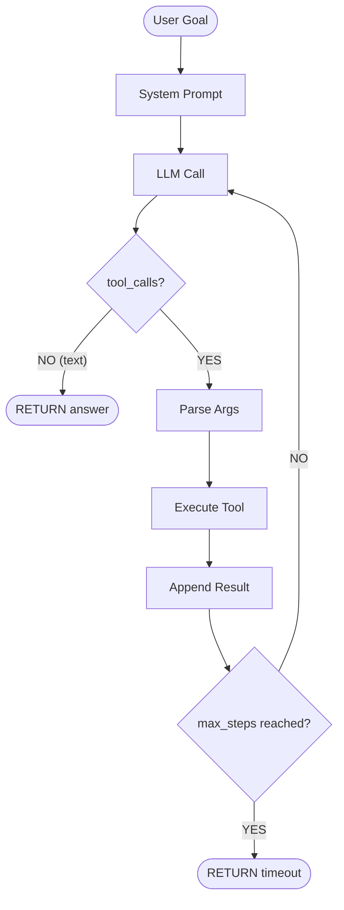
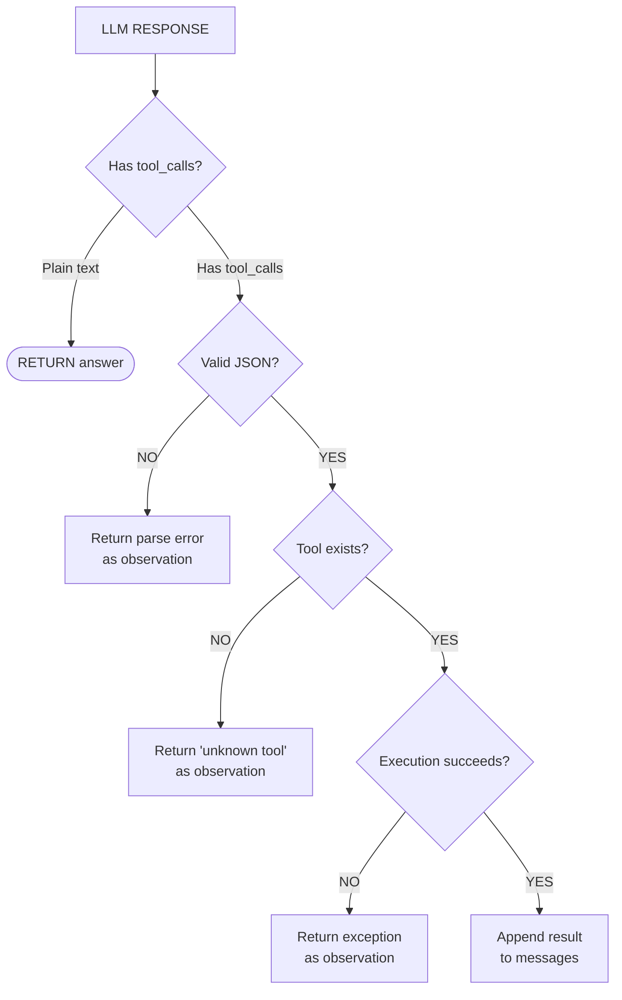

# Building Your First Simple Agent

## Overview

In this lesson, we build a complete, working AI agent from scratch in under 100 lines of Python. No frameworks, no heavy abstractions -- just the OpenAI API, a few tool definitions, and a loop. By the end, you will have a functional agent that can answer questions using a calculator and a knowledge lookup tool, with proper error handling and retry logic.

The architecture is simple. We define tools as plain Python functions with JSON schema descriptions. We send these schemas to the LLM along with the conversation history. When the LLM decides to call a tool, we parse its structured output, execute the function, and feed the result back. This loop continues until the LLM produces a final text response with no tool calls. This is the same pattern used by every agent framework internally; we are just implementing it directly.

**Stateless vs Stateful Agents**: A stateless agent treats each invocation independently. It receives a goal, runs its loop, returns an answer, and forgets everything. A stateful agent maintains state across invocations -- it remembers previous conversations, accumulates knowledge, and can reference past interactions. Stateless agents are simpler to build, debug, and scale because they have no side effects between runs. Stateful agents are more powerful for ongoing tasks but require a persistence layer (database, file system, or in-memory store). Our first agent will be stateless, with a clear path to adding state later.

**Error Handling and Retry Strategies**: Real-world agents encounter failures constantly. The LLM might produce malformed JSON that does not parse. A tool call might throw an exception. The API might rate-limit you. A robust agent must handle all of these gracefully. Our strategy is threefold. First, we wrap every tool execution in a try/except block and return the error message as the observation, so the LLM can reason about what went wrong. Second, if the LLM's output does not contain valid tool calls or text, we add a system message asking it to try again. Third, we implement a maximum retry count to prevent infinite loops when the agent is stuck.

The step-by-step approach is: (1) define the tools with their implementations and JSON schemas, (2) construct the system prompt that tells the LLM how to behave, (3) implement the main agent loop that alternates between LLM calls and tool execution, and (4) add error handling at every boundary. Let us build each piece.

One important design decision is how to handle the conversation history. Each LLM call receives the full message list, which grows with every tool call and observation. For a simple agent running 5-10 steps, this fits easily within the context window. For longer-running agents, you would need to implement context management: summarizing old messages, dropping tool observations after they have been used, or using a sliding window. Our agent includes a configurable `max_steps` parameter that serves as a hard cap on loop iterations.

Another consideration is temperature. For agent loops, a temperature of 0 (or very low) is strongly recommended. Non-deterministic outputs can cause the agent to take inconsistent paths, making debugging nearly impossible. Save creative temperature settings for the final output generation, not for the tool-selection loop.

## Key Concepts

- **Stateless Agent**: Processes a single goal per invocation with no memory between runs. Simple, predictable, and easy to test.
- **Stateful Agent**: Persists conversation history, learned facts, or accumulated context across multiple invocations.
- **Error Propagation**: When a tool fails, the error message is returned as the observation rather than crashing the agent. The LLM can then reason about the failure and try a different approach.
- **Retry with Backoff**: For transient API errors (rate limits, timeouts), wait and retry with exponentially increasing delays.
- **Max Steps Guard**: A hard limit on loop iterations to prevent runaway agents from consuming unbounded resources.
- **Temperature Control**: Using `temperature=0` during the agent loop for deterministic tool selection.

## Code Examples

The complete agent in under 100 lines:

```python
"""A complete AI agent in <100 lines. No frameworks required."""

import json
import time
from openai import OpenAI

client = OpenAI()  # Uses OPENAI_API_KEY env var

# ── Tool Definitions ──────────────────────────────────────────────

TOOLS_SCHEMA = [
    {
        "type": "function",
        "function": {
            "name": "calculator",
            "description": "Evaluate a math expression. Supports +, -, *, /, **, sqrt, etc.",
            "parameters": {
                "type": "object",
                "properties": {
                    "expression": {
                        "type": "string",
                        "description": "Math expression, e.g. '(17 * 23) + 5'"
                    }
                },
                "required": ["expression"]
            }
        }
    },
    {
        "type": "function",
        "function": {
            "name": "lookup",
            "description": "Look up a fact in the knowledge base by keyword.",
            "parameters": {
                "type": "object",
                "properties": {
                    "keyword": {
                        "type": "string",
                        "description": "The topic to look up"
                    }
                },
                "required": ["keyword"]
            }
        }
    }
]

def calculator(expression: str) -> str:
    """Safely evaluate a math expression."""
    import math
    allowed = {
        k: v for k, v in math.__dict__.items()
        if not k.startswith("_")
    }
    allowed["__builtins__"] = {}  # Block builtins for safety
    try:
        result = eval(expression, allowed)
        return json.dumps({"result": result})
    except Exception as e:
        return json.dumps({"error": str(e)})

def lookup(keyword: str) -> str:
    """Search a simple knowledge base."""
    kb = {
        "earth radius": "The Earth's mean radius is 6,371 km.",
        "pi": "Pi is approximately 3.14159265358979.",
        "python": "Python is a programming language created by Guido van Rossum.",
        "gravity": "Standard gravity on Earth is 9.80665 m/s^2.",
    }
    keyword_lower = keyword.lower()
    for key, value in kb.items():
        if key in keyword_lower or keyword_lower in key:
            return json.dumps({"fact": value})
    return json.dumps({"fact": "Not found. Try a different keyword."})

TOOL_MAP = {"calculator": calculator, "lookup": lookup}

# ── Agent Loop ────────────────────────────────────────────────────

def run_agent(goal: str, max_steps: int = 8, max_retries: int = 3) -> str:
    """Run a tool-using agent to accomplish the given goal."""
    messages = [
        {"role": "system", "content": (
            "You are a helpful agent. Use the provided tools to answer "
            "the user's question. Reason step by step. When you have "
            "the final answer, respond with plain text (no tool call)."
        )},
        {"role": "user", "content": goal}
    ]

    for step in range(max_steps):
        # ── Call the LLM ──
        for attempt in range(max_retries):
            try:
                response = client.chat.completions.create(
                    model="gpt-4o",
                    messages=messages,
                    tools=TOOLS_SCHEMA,
                    tool_choice="auto",
                    temperature=0,
                )
                break  # Success
            except Exception as e:
                if attempt < max_retries - 1:
                    wait = 2 ** attempt  # Exponential backoff
                    print(f"  API error: {e}. Retrying in {wait}s...")
                    time.sleep(wait)
                else:
                    return f"Agent failed: API error after {max_retries} retries."

        msg = response.choices[0].message
        messages.append(msg)

        # ── No tool calls → final answer ──
        if not msg.tool_calls:
            print(f"[Step {step+1}] Final answer produced.")
            return msg.content

        # ── Execute each tool call ──
        for tc in msg.tool_calls:
            fn_name = tc.function.name
            print(f"[Step {step+1}] Calling {fn_name}...")

            try:
                fn_args = json.loads(tc.function.arguments)
            except json.JSONDecodeError as e:
                result = json.dumps({"error": f"Invalid JSON: {e}"})
                messages.append({"role": "tool", "tool_call_id": tc.id, "content": result})
                continue

            if fn_name not in TOOL_MAP:
                result = json.dumps({"error": f"Unknown tool: {fn_name}"})
            else:
                try:
                    result = TOOL_MAP[fn_name](**fn_args)
                except Exception as e:
                    result = json.dumps({"error": f"Tool error: {e}"})

            print(f"          Result: {result}")
            messages.append({"role": "tool", "tool_call_id": tc.id, "content": result})

    return "Agent reached max steps without a final answer."

# ── Main ──────────────────────────────────────────────────────────

if __name__ == "__main__":
    questions = [
        "What is the Earth's circumference in km? Use the Earth's radius from the knowledge base and the formula C = 2 * pi * r.",
        "What is the square root of 144 plus the cube of 3?",
    ]
    for q in questions:
        print(f"\nGoal: {q}")
        print(f"Answer: {run_agent(q)}\n")
        print("-" * 60)
```

Line-by-line walkthrough of the agent loop:
- **Lines 80-88**: The system prompt sets the agent's behavior. The instruction "respond with plain text when you have the final answer" is critical -- it tells the model how to signal termination.
- **Lines 90-104**: The LLM call is wrapped in a retry loop with exponential backoff. If the API fails three times, the agent exits gracefully.
- **Lines 108-110**: When the model responds with text (no tool calls), the loop ends and we return the answer.
- **Lines 113-114**: We iterate over all tool calls. The model may request multiple tools in a single response.
- **Lines 117-120**: JSON parsing of tool arguments can fail if the model outputs malformed JSON. We catch this and return a descriptive error.
- **Lines 122-127**: Tool execution is wrapped in try/except. Any exception becomes an error observation that the LLM can reason about.

## Math/Formulas (KaTeX)

The agent's execution can be modeled as a finite sequence of states. Let $N$ be the maximum number of steps. The agent produces a trajectory:

$$\tau = (s_0, a_0, o_0, s_1, a_1, o_1, \ldots, s_T)$$

where $T \leq N$ is the termination step. The total cost of the trajectory in API tokens is:

$$C(\tau) = \sum_{t=0}^{T} \left( c_{\text{input}}(|m_t|) + c_{\text{output}}(|r_t|) \right)$$

where $|m_t|$ is the token count of the message history at step $t$, $|r_t|$ is the token count of the LLM response, and $c_{\text{input}}, c_{\text{output}}$ are the per-token prices for input and output respectively. Because the message history grows with each step, the cost is roughly:

$$C(\tau) \approx c_{\text{input}} \cdot \sum_{t=0}^{T} (|m_0| + t \cdot \bar{d}) + c_{\text{output}} \cdot T \cdot \bar{r}$$

where $\bar{d}$ is the average tokens added per step and $\bar{r}$ is the average response length. This shows that cost grows quadratically with the number of steps, making the `max_steps` parameter crucial for cost control.

The retry strategy uses exponential backoff. The wait time before attempt $k$ is:

$$w_k = 2^k \text{ seconds}, \quad k = 0, 1, \ldots, K-1$$

The total maximum wait before giving up is $\sum_{k=0}^{K-1} 2^k = 2^K - 1$ seconds.

## Diagrams

**Agent Execution Flow**



**Error Handling Strategy**



## Exercises

1. **Run the agent**: Copy the complete code example, set your `OPENAI_API_KEY` environment variable, and run it. Observe the step-by-step output. Try asking "What is the surface area of the Earth?" (the agent should combine the `lookup` tool for the radius and the `calculator` tool for $4\pi r^2$).

2. **Add a new tool**: Add a `current_time` tool that returns the current date and time. Update `TOOLS_SCHEMA`, write the implementation, and add it to `TOOL_MAP`. Test with the query "What day of the week is it today?"

3. **Make it stateful**: Modify the agent to accept an optional `history` parameter (a list of previous messages). After each run, return the updated history alongside the answer. Demonstrate a two-turn conversation where the second query references the first.

4. **Error stress test**: Intentionally break things and verify the agent recovers: (a) pass an invalid math expression to the calculator, (b) look up a keyword that does not exist, (c) temporarily set `max_steps=1` and verify the timeout message.

5. **Token cost analysis**: Run the agent on 5 different queries and record the number of steps and total tokens used (available in `response.usage`). Plot steps vs. total tokens. Does the relationship look linear or quadratic? How does this match the formula in the Math section?

6. **Streaming output**: Modify the agent to use the streaming API (`stream=True`) so that the final answer is printed token-by-token as it is generated. Keep tool calls non-streamed for simplicity.

## Further Reading

- [OpenAI Assistants API Documentation](https://platform.openai.com/docs/assistants/overview)
- [Building Effective Agents (Anthropic Blog)](https://www.anthropic.com/research/building-effective-agents)
- [Devin: AI Software Engineer (Cognition)](https://www.cognition.ai/blog/introducing-devin)
- [The Landscape of Emerging AI Agent Architectures (Weng, 2023)](https://lilianweng.github.io/posts/2023-06-23-agent/)
- [OpenAI Cookbook: How to call functions with chat models](https://cookbook.openai.com/examples/how_to_call_functions_with_chat_models)
