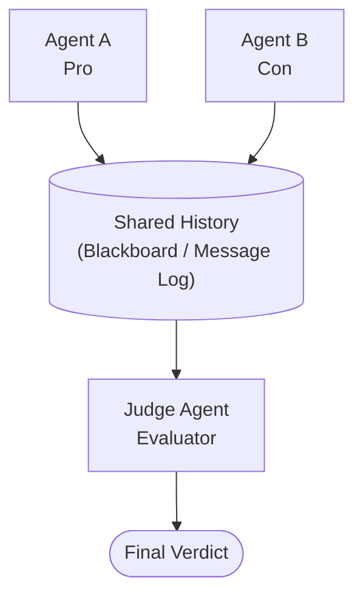
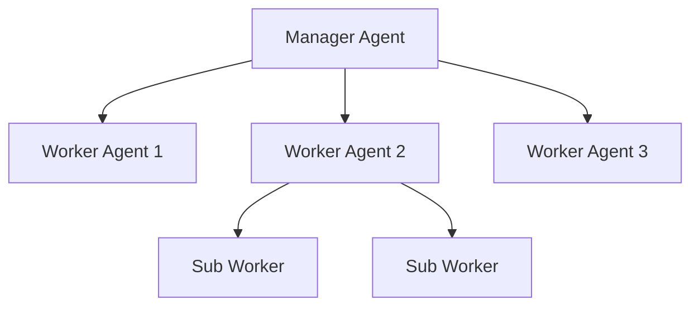

# Advanced Agent Patterns

## Overview

As individual AI agents mature, the frontier of agent research shifts toward **multi-agent systems**, where several specialized agents collaborate, debate, and coordinate to solve problems that exceed any single agent's abilities. This lesson explores four advanced patterns: multi-agent architectures, hierarchical task decomposition, self-critique loops, and debate-based reasoning.

### Multi-Agent Systems

A multi-agent system (MAS) consists of two or more autonomous agents that interact within a shared environment. Each agent has a distinct **role**, a private or shared **state**, and a **communication protocol** for exchanging messages.

Why use multiple agents instead of one? The same reasons humans form teams: specialization reduces complexity, parallel work increases throughput, and diverse perspectives improve quality. A "researcher" agent can search for evidence while a "writer" agent drafts prose, and a "critic" agent reviews the output -- all operating concurrently.

**Role Assignment** can be static (hard-coded at design time) or dynamic (negotiated at runtime). Static roles are simpler and more predictable. Dynamic roles allow the system to adapt -- for instance, an agent that detects it lacks domain expertise can delegate to a specialist.

**Communication Protocols** range from simple message passing (agent A sends a string to agent B) to structured formats like JSON-schema-validated messages. The choice of protocol determines how reliably agents coordinate. A common pattern is the **blackboard architecture**, where agents read from and write to a shared data structure rather than messaging each other directly.

### Hierarchical Task Decomposition

Complex tasks benefit from a tree-structured breakdown. A **manager agent** receives a high-level goal, decomposes it into subtasks, and assigns each subtask to a **worker agent**. Workers may further decompose their subtasks, creating a hierarchy.

The manager uses a planning step to produce a task graph. Each node in the graph has a description, dependencies, and an assigned agent. Execution proceeds bottom-up: leaf tasks run first, and their outputs feed into parent tasks.

The key mathematical concept here is the expected total cost. If a task $T$ is decomposed into subtasks $T_1, T_2, \ldots, T_n$, the total cost is:

$$C(T) = C_{\text{plan}} + \sum_{i=1}^{n} C(T_i) + C_{\text{merge}}$$

where $C_{\text{plan}}$ is the planning overhead and $C_{\text{merge}}$ is the cost of combining results. Decomposition is worthwhile only when the subtask costs are individually manageable and the overhead is low relative to the gain in quality.

### Self-Critique and Self-Reflection

Self-critique is a pattern where an agent evaluates its own output before presenting it. The agent generates a draft, then switches to a "critic" persona that identifies errors, missing information, or logical gaps. The agent then revises its draft accordingly.

The reflection loop can be formalized as iterative refinement. Let $y_0$ be the initial output and $f_{\text{critique}}$ be the critique function. At each step:

$$y_{t+1} = f_{\text{revise}}(y_t, f_{\text{critique}}(y_t))$$

The loop terminates when the critique score $s(y_t)$ exceeds a threshold $\tau$ or after a maximum of $k$ iterations to prevent infinite loops:

$$\text{stop when } s(y_t) \geq \tau \text{ or } t \geq k$$

Research shows that self-critique improves factual accuracy by 10-30% on benchmarks, but diminishing returns set in after 2-3 rounds.

### Two-Agent Debate

In a debate system, two agents argue opposing positions on a question. A judge agent (or the user) evaluates the arguments. This adversarial structure surfaces weaknesses in reasoning that a single agent might overlook.

---

## Key Concepts

- **Role specialization**: Assign distinct capabilities and system prompts to each agent in a multi-agent system
- **Blackboard architecture**: A shared memory space where agents post and read intermediate results
- **Task graph**: A directed acyclic graph (DAG) representing subtask dependencies in hierarchical decomposition
- **Self-critique loop**: Generate-then-evaluate cycle with a fixed iteration budget
- **Adversarial debate**: Two agents argue opposing sides; a judge selects the stronger argument
- **Communication protocol**: The format and rules governing inter-agent message exchange

---

## Code Examples

### Two-Agent Debate System

```python
import openai

client = openai.OpenAI()

def agent_respond(role: str, position: str, history: list[dict]) -> str:
    """One debate agent generates a response given its role and the debate history."""
    system_prompt = (
        f"You are a debate agent arguing the '{position}' position. "
        f"Your role: {role}. Be concise, logical, and cite evidence. "
        f"Respond in 2-3 paragraphs."
    )
    messages = [{"role": "system", "content": system_prompt}] + history
    response = client.chat.completions.create(
        model="gpt-4o",
        messages=messages,
        temperature=0.7,
        max_tokens=500,
    )
    return response.choices[0].message.content


def judge_debate(history: list[dict]) -> str:
    """A judge agent evaluates the debate and picks a winner."""
    system_prompt = (
        "You are an impartial judge. Read the debate below and decide "
        "which side presented stronger arguments. Explain your reasoning "
        "in 1-2 paragraphs, then declare a winner."
    )
    messages = [{"role": "system", "content": system_prompt}] + history
    response = client.chat.completions.create(
        model="gpt-4o",
        messages=messages,
        temperature=0.3,
        max_tokens=400,
    )
    return response.choices[0].message.content


def run_debate(topic: str, rounds: int = 2) -> str:
    """Orchestrate a multi-round debate between two agents."""
    history = [{"role": "user", "content": f"Debate topic: {topic}"}]

    for round_num in range(rounds):
        # Agent A argues FOR the topic
        a_response = agent_respond("Agent A", "for", history)
        history.append({"role": "assistant", "content": f"[Agent A - Round {round_num+1}]: {a_response}"})

        # Agent B argues AGAINST the topic
        b_response = agent_respond("Agent B", "against", history)
        history.append({"role": "assistant", "content": f"[Agent B - Round {round_num+1}]: {b_response}"})

    # Judge evaluates
    verdict = judge_debate(history)
    return verdict


# Run the debate
result = run_debate("AI agents should be given internet access by default", rounds=2)
print(result)
```

**Line-by-line explanation:**

- `agent_respond` creates a system prompt that locks the agent into a specific debate position, then appends the shared debate history so each agent sees what the other said.
- `judge_debate` uses a lower temperature (0.3) for more deterministic, analytical evaluation.
- `run_debate` alternates between Agent A (pro) and Agent B (con) for a configurable number of rounds, accumulating history so each response builds on prior arguments.
- The shared `history` list acts as a lightweight blackboard -- both agents read from the same conversation record.

---

## Math/Formulas (KaTeX)

The **Nash equilibrium** concept applies to multi-agent systems. In a two-agent cooperative game, each agent $i$ selects a strategy $s_i$ to maximize a shared utility:

$$U(s_1, s_2) = \sum_{i=1}^{2} r_i(s_i, s_{-i})$$

where $r_i$ is the reward for agent $i$ and $s_{-i}$ is the strategy of the other agent.

For the self-critique loop, we can measure improvement as the expected quality gain per iteration:

$$\Delta Q_t = \mathbb{E}[s(y_{t+1}) - s(y_t)] = \mathbb{E}[s(f_{\text{revise}}(y_t, f_{\text{critique}}(y_t))) - s(y_t)]$$

Empirically, $\Delta Q_t$ decreases with $t$, following an approximate power law: $\Delta Q_t \propto t^{-\alpha}$ with $\alpha \approx 0.5$ to $1.0$.

---

## Diagrams

**Multi-Agent Debate Architecture**



**Hierarchical Task Decomposition**



---

## Exercises

1. **Extend the debate system**: Add a "moderator" agent that summarizes each round before the next begins. Measure whether this improves the quality of the final verdict.

2. **Implement self-critique**: Write a function that takes an agent's initial response, generates a critique, and produces a revised response. Test it on a factual question and compare the initial vs. revised answers.

3. **Task decomposition**: Given the goal "Write a research report on climate change," design a task graph with at least 4 subtasks. Implement the manager agent that produces this decomposition programmatically.

4. **Communication protocol**: Design a JSON schema for inter-agent messages that includes fields for sender, recipient, message type (request, response, critique), and content. Implement validation.

5. **Scaling analysis**: Run the debate system with 2, 3, and 4 rounds. Plot the judge's confidence score vs. number of rounds. At what point do diminishing returns appear?

---

## Further Reading

- [AutoGen: Enabling Next-Gen LLM Applications via Multi-Agent Conversation](https://arxiv.org/abs/2308.08155)
- [CAMEL: Communicative Agents for "Mind" Exploration of Large Language Models](https://arxiv.org/abs/2303.17760)
- [Self-Refine: Iterative Refinement with Self-Feedback](https://arxiv.org/abs/2303.17651)
- [Debate: AI Safety via Debate (Irving et al.)](https://arxiv.org/abs/1805.00899)
- [LangGraph Multi-Agent Documentation](https://langchain-ai.github.io/langgraph/)
