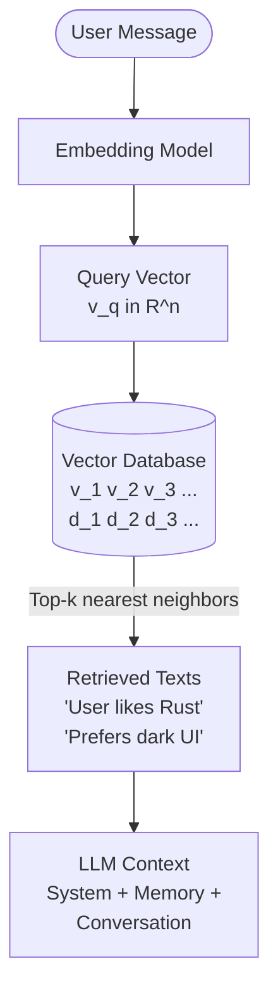
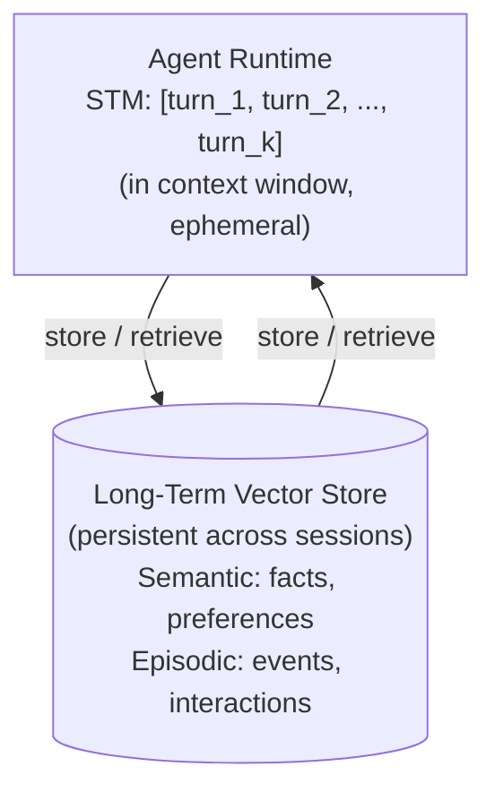

## Memory Systems

## Overview

A stateless LLM forgets everything the moment a conversation ends. For an AI agent to be truly useful, it needs
**memory** -- the ability to retain, organize, and retrieve information across interactions.

Memory systems transform a forgetful chatbot into a persistent assistant that learns from experience.

### Short-Term Memory: Conversation History

The simplest form of memory is the conversation history itself. Every message exchanged between the user and the agent
is stored in a list and included in each subsequent API call. This is **short-term memory** (STM) -- it persists within
a session but vanishes when the session ends.

The challenge is that LLMs have finite context windows. A model with a context length of $L$ tokens can hold at most $L$ tokens of combined system prompt, memory, and current input.

As conversations grow, you must decide what to keep and what to discard. Two main strategies address this.

**Turn windows** are the most common short-term memory strategy: keep only the last $k$ turns of conversation. If each turn averages $t$ tokens, the memory cost is approximately $k \cdot t$ tokens. The tradeoff is clear -- larger $k$ means more context but higher latency and cost.

**Summarization** is a more sophisticated alternative: periodically compress older turns into a summary, retaining key facts while freeing token budget. The compressed representation might reduce $n$ turns into a summary of $s$ tokens where $s \ll n \cdot t$.

These two strategies are not mutually exclusive -- many production systems use a sliding window for recent turns and summarize everything older.

### Long-Term Memory: Vector Databases

Long-term memory (LTM) persists across sessions. The dominant approach uses **vector databases** that store text as
high-dimensional embeddings and retrieve relevant passages via similarity search.

The pipeline works as follows:

1. **Encode**: Convert text into a vector using an embedding model. A text chunk $d$ becomes a vector $\mathbf{v}_d \in \mathbb{R}^n$ where $n$ is the embedding dimension (typically 768 to 3072).
2. **Store**: Insert the vector and its associated metadata into a vector database.
3. **Query**: When the agent needs to recall information, encode the query $q$ as $\mathbf{v}_q$ and find the $k$ nearest neighbors in the database.
4. **Retrieve**: Return the original text associated with the top-$k$ closest vectors.

Several popular vector databases serve different use cases:

- **FAISS** (Facebook AI Similarity Search): Open-source, runs locally, excellent for prototyping. Supports exact and approximate nearest neighbor search.
- **Pinecone**: Managed cloud service with automatic scaling. Good for production deployments.
- **Milvus**: Open-source, distributed, handles billions of vectors. Strong choice for large-scale applications.

Regardless of which database you choose, the similarity between two vectors is typically measured using **cosine similarity**:

$$\text{sim}(\mathbf{v}_q, \mathbf{v}_d) = \frac{\mathbf{v}_q \cdot \mathbf{v}_d}{\|\mathbf{v}_q\| \cdot \|\mathbf{v}_d\|}$$

This value ranges from $-1$ (opposite directions) to $1$ (identical direction). In practice, embedding models produce mostly positive similarities, so the effective range is roughly $[0, 1]$.

### Semantic vs. Episodic Memory

Borrowing terminology from cognitive science, agent memory can be categorized into two types:

- **Semantic memory** stores general facts and knowledge: "Python is a programming language," "The user prefers dark mode." These are context-free truths that do not depend on when they were learned.
- **Episodic memory** stores specific events and experiences: "On Tuesday, the user asked me to refactor the auth module," "The API returned a 503 error during the last deployment." These are time-stamped, context-rich records.

An effective agent memory system maintains both. Semantic memory provides stable background knowledge, while episodic
memory enables the agent to reference specific past interactions and learn from mistakes.

### Memory Retrieval Strategies

Naive nearest-neighbor retrieval often returns irrelevant results. Several strategies can improve retrieval quality:

- **Hybrid search**: Combine vector similarity with keyword (BM25) search. This catches cases where the query and document share exact terms but have different embeddings.
- **Recency weighting**: Multiply similarity scores by a time-decay factor $e^{-\lambda \Delta t}$ where $\Delta t$ is the time since the memory was stored and $\lambda$ controls decay speed.
- **Importance scoring**: Assign an importance weight $w_i$ to each memory at storage time. The retrieval score becomes $\text{score} = \alpha \cdot \text{sim} + \beta \cdot w_i + \gamma \cdot \text{recency}$.
- **Maximum marginal relevance (MMR)**: Penalize retrieved items that are too similar to each other, ensuring diversity in recalled memories.

---

## Key Concepts

- **Short-term memory (STM)**: Conversation history within a session, limited by context window size $L$
- **Long-term memory (LTM)**: Persistent storage using vector databases, survives across sessions
- **Embedding**: A fixed-length vector representation $\mathbf{v} \in \mathbb{R}^n$ of a text chunk
- **Cosine similarity**: The standard metric for comparing embedding vectors
- **Semantic memory**: General, context-free facts (what the agent knows)
- **Episodic memory**: Time-stamped event records (what the agent experienced)
- **Hybrid retrieval**: Combining vector similarity with keyword search for better recall
- **Recency weighting**: Preferring recent memories via exponential time decay

---

## Code Examples

### Adding Vector Memory to an Agent

```python
import openai
import numpy as np
from dataclasses import dataclass, field
from datetime import datetime

client = openai.OpenAI()

@dataclass
class Memory:
    """A single memory entry with text, embedding, and metadata."""
    text: str
    embedding: list[float]
    timestamp: datetime = field(default_factory=datetime.now)
    importance: float = 0.5  # 0.0 to 1.0

class VectorMemoryStore:
    """Simple in-memory vector store using NumPy (FAISS-like behavior)."""

    def __init__(self, embedding_model: str = "text-embedding-3-small"):
        self.memories: list[Memory] = []
        self.embedding_model = embedding_model

    def _get_embedding(self, text: str) -> list[float]:
        """Call the OpenAI embedding API to convert text to a vector."""
        response = client.embeddings.create(
            model=self.embedding_model,
            input=text,
        )
        return response.data[0].embedding

    def add(self, text: str, importance: float = 0.5) -> None:
        """Store a new memory with its embedding."""
        embedding = self._get_embedding(text)
        memory = Memory(text=text, embedding=embedding, importance=importance)
        self.memories.append(memory)

    def retrieve(self, query: str, top_k: int = 3, recency_weight: float = 0.1) -> list[str]:
        """Retrieve the top-k most relevant memories for a given query."""
        if not self.memories:
            return []

        query_vec = np.array(self._get_embedding(query))
        now = datetime.now()
        scores = []

        for mem in self.memories:
            # Cosine similarity
            mem_vec = np.array(mem.embedding)
            cos_sim = np.dot(query_vec, mem_vec) / (
                np.linalg.norm(query_vec) * np.linalg.norm(mem_vec) + 1e-8
            )

            # Recency factor: exponential decay over hours
            hours_ago = (now - mem.timestamp).total_seconds() / 3600
            recency = np.exp(-0.05 * hours_ago)

            # Combined score
            score = 0.7 * cos_sim + 0.2 * mem.importance + recency_weight * recency
            scores.append(score)

        # Get top-k indices sorted by score (descending)
        top_indices = np.argsort(scores)[::-1][:top_k]
        return [self.memories[i].text for i in top_indices]

class MemoryAgent:
    """An agent that uses vector memory for context-aware responses."""

    def __init__(self):
        self.memory = VectorMemoryStore()
        self.conversation: list[dict] = []

    def chat(self, user_message: str) -> str:
        """Process a user message, retrieve memories, and respond."""
        # Retrieve relevant memories
        relevant = self.memory.retrieve(user_message, top_k=3)
        memory_context = "\n".join(f"- {m}" for m in relevant) if relevant else "None"

        # Build system prompt with memory
        system = (
            "You are a helpful assistant with access to memory.\n"
            f"Relevant memories:\n{memory_context}\n"
            "Use these memories if relevant to the conversation."
        )

        self.conversation.append({"role": "user", "content": user_message})
        messages = [{"role": "system", "content": system}] + self.conversation[-10:]

        response = client.chat.completions.create(
            model="gpt-4o",
            messages=messages,
            max_tokens=500,
        )
        reply = response.choices[0].message.content
        self.conversation.append({"role": "assistant", "content": reply})

        # Store the exchange as a new memory
        self.memory.add(f"User asked: {user_message}", importance=0.5)
        self.memory.add(f"Assistant replied: {reply}", importance=0.3)

        return reply

# Usage
agent = MemoryAgent()
print(agent.chat("My favorite programming language is Rust."))
print(agent.chat("What do I like to code in?"))  # Should recall Rust
```

**Explanation:**

- `VectorMemoryStore` wraps embedding generation, storage, and retrieval.
  Each memory is a dataclass with text, embedding vector, timestamp, and
  importance score.
- `retrieve` computes a weighted combination of cosine similarity,
  importance, and recency for each stored memory, then returns the top-$k$
  results.
- `MemoryAgent` integrates the store into a conversational agent. Before
  each response, it retrieves relevant memories and injects them into the
  system prompt.
- The conversation is trimmed to the last 10 turns (`[-10:]`) to manage
  short-term memory within the context window.

---

## Math/Formulas (KaTeX)

The combined retrieval score for a memory $m$ given query $q$ combines three signals -- semantic similarity, importance, and recency:

$$\text{score}(m, q) = \alpha \cdot \frac{\mathbf{v}_q \cdot \mathbf{v}_m}{\|\mathbf{v}_q\| \cdot \|\mathbf{v}_m\|} + \beta \cdot w_m + \gamma \cdot e^{-\lambda \Delta t_m}$$

where:
- $\alpha, \beta, \gamma$ are mixing weights (typically $\alpha = 0.7, \beta = 0.2, \gamma = 0.1$)
- $w_m \in [0, 1]$ is the importance score
- $\Delta t_m$ is the elapsed time since the memory was created
- $\lambda$ controls the rate of temporal decay

The context window budget determines how much memory can fit at all. The available space is what remains after accounting for the system prompt, current user message, and reserved response space:

$$L_{\text{available}} = L_{\text{max}} - L_{\text{system}} - L_{\text{current}} - L_{\text{reserved}}$$

where $L_{\text{system}}$ is the system prompt length, $L_{\text{current}}$ is the current user message, and $L_{\text{reserved}}$ is space kept for the model's response.

---

## Diagrams

**Memory Pipeline**



The following diagram shows how short-term and long-term memory interact within an agent:

**Short-Term vs Long-Term Memory**



---

## Exercises

Practice implementing memory systems by completing the following exercises. Each builds on the code examples from earlier in this lesson.

1. **Implement summarization**: Write a function that takes the last 20 conversation turns and produces a 3-sentence summary using an LLM. Replace the oldest 15 turns with this summary in the agent's history.

2. **FAISS integration**: Replace the NumPy-based vector store with FAISS. Use `faiss.IndexFlatIP` for inner product search. Benchmark retrieval speed with 1,000 vs. 10,000 stored memories.

3. **Hybrid search**: Add BM25 keyword search alongside vector search. Implement a function that merges results from both, giving 60% weight to vector similarity and 40% to BM25 score.

4. **Memory importance**: Design a heuristic or LLM-based system that automatically assigns importance scores when storing memories. Test whether high-importance memories are retrieved more often when relevant.

5. **Episodic vs. semantic separation**: Modify the `VectorMemoryStore` to maintain two separate collections -- one for facts and one for events. Implement logic that routes memories to the correct collection based on content analysis.

---

## Further Reading

- [Generative Agents: Interactive Simulacra of Human Behavior (Park et al.)](https://arxiv.org/abs/2304.03442)
- [MemGPT: Towards LLMs as Operating Systems](https://arxiv.org/abs/2310.08560)
- [FAISS Documentation](https://faiss.ai/)
- [Pinecone: Vector Database for AI](https://www.pinecone.io/learn/)
- [LangChain Memory Module Documentation](https://python.langchain.com/docs/modules/memory/)
