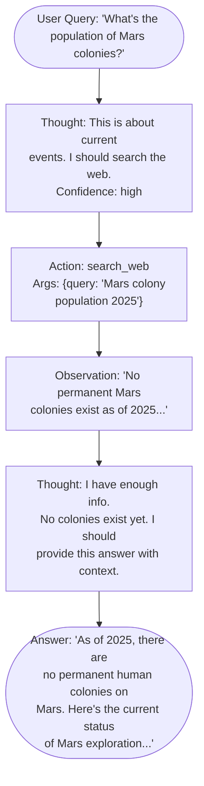
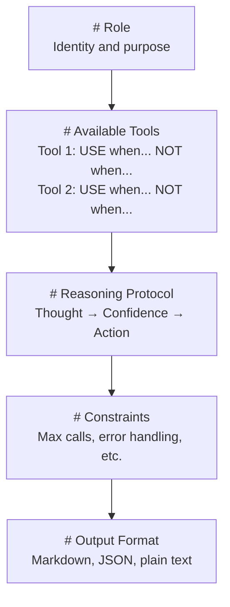

# Prompt Engineering for Agents

## Overview

Prompt engineering for agents is fundamentally different from prompt engineering for single-turn question answering. An agent prompt must guide the model through multi-step reasoning, tool selection, output formatting, and error recovery -- often across dozens of turns. A poorly written agent prompt leads to tool misuse, hallucinated actions, and infinite loops. A well-crafted one produces a reliable, predictable system.

### Structured Output for Agent Instructions

The most effective agent prompts use explicit structure to reduce ambiguity. Rather than a paragraph of natural language, break the system prompt into labeled sections:

1. **Identity and role**: Who is the agent? What is its purpose?
2. **Available tools**: List each tool with its name, description, and when to use it.
3. **Behavioral rules**: Constraints the agent must follow (e.g., "never execute code without user confirmation").
4. **Output format**: Specify whether the agent should use JSON, markdown, or plain text.
5. **Examples**: One or two demonstrations of correct tool usage.

This structure works because LLMs are sensitive to formatting. Research shows that structured prompts with headers and bullet points reduce instruction-following errors by 15-40% compared to unstructured paragraphs.

The information-theoretic intuition is straightforward: a structured prompt has lower **entropy** in its instruction signal. If we model the LLM's interpretation as a distribution over possible behaviors $P(b | \text{prompt})$, a good prompt concentrates probability mass on the desired behavior:

$$H(B | \text{prompt}_{\text{structured}}) < H(B | \text{prompt}_{\text{unstructured}})$$

where $H(B | \text{prompt})$ is the conditional entropy of the agent's behavior given the prompt.

### Implicit vs. Explicit Reasoning Traces

When an agent needs to make decisions (which tool to call, what arguments to pass), it can reason in two ways:

- **Implicit reasoning**: The model reasons internally within its forward pass. The output jumps directly to an action. This is fast but opaque -- you cannot debug why the agent chose a particular tool.
- **Explicit reasoning (Chain-of-Thought)**: The model writes out its reasoning before acting. For example: "The user wants weather data. I should use the `get_weather` tool with city='London'." This is slower but more reliable and debuggable.

For agents, explicit reasoning is almost always preferable. The prompt should instruct the model to "think step by step" before each action. A common pattern is the **Thought-Action-Observation** loop:

```
Thought: [The agent reasons about what to do next]
Action: [The agent calls a tool with specific arguments]
Observation: [The tool returns a result]
... repeat ...
Thought: [The agent decides it has enough information]
Answer: [The agent provides the final response]
```

This format, inspired by the ReAct framework, makes agent behavior predictable and easy to log.

### Tool Selection Prompting

When an agent has access to many tools (10+), selecting the right one becomes a challenge. The model must match the user's intent to the correct tool without exhaustive search.

Effective strategies include:

- **Tool descriptions as few-shot selectors**: Write descriptions that emphasize *when* to use the tool, not just *what* it does. "Use `search_web` when the user asks about current events or information you don't know" is better than "Searches the web."
- **Negative examples**: Specify when *not* to use a tool. "Do NOT use `run_code` for simple math; use your built-in reasoning instead."
- **Tool grouping**: Organize tools into categories (information retrieval, data manipulation, communication). The agent first selects the category, then the specific tool.
- **Confidence thresholds**: Instruct the agent to state its confidence before calling a tool. If confidence is below a threshold, ask the user for clarification instead.

The tool selection problem can be viewed as a classification task. Given a user query $q$ and tools $\{t_1, t_2, \ldots, t_n\}$, the agent must estimate:

$$t^* = \arg\max_{t_i} P(t_i | q, \text{context})$$

where the prompt engineering challenge is shaping $P$ so that the correct tool has the highest probability.

### Multi-Modal Agent Prompts

Modern agents increasingly handle multiple modalities: text, images, code, and structured data. Multi-modal prompts must specify how to handle each modality:

- **Image inputs**: "When the user provides an image, describe what you see before deciding on an action."
- **Code context**: "When analyzing code, first identify the language and framework, then determine the relevant tool."
- **Structured data**: "When given a CSV or JSON, summarize the schema (columns, types, row count) before processing."

The key principle is **modality-aware routing**: the agent should identify the input type first, then apply modality-specific reasoning before acting.

### Common Prompt Anti-Patterns

Avoid these pitfalls in agent prompts:

- **Over-constraining**: Too many rules cause the agent to freeze or ignore some rules. Keep constraints under 10.
- **Ambiguous tool boundaries**: If two tools overlap in functionality, the agent will oscillate between them. Define clear boundaries.
- **Missing error guidance**: Without explicit error handling instructions, agents often retry the same failed action indefinitely.
- **No termination condition**: Always specify when the agent should stop. "If you cannot solve the task in 5 tool calls, summarize what you've found and ask the user for guidance."

## Key Concepts

- **Structured prompting**: Using headers, sections, and bullet points to reduce ambiguity in agent instructions
- **Chain-of-Thought (CoT)**: Explicit step-by-step reasoning before each action
- **ReAct pattern**: Thought-Action-Observation loop for systematic agent behavior
- **Tool descriptions**: Written to emphasize *when* to use each tool, not just what it does
- **Negative examples**: Specifying what the agent should NOT do in specific situations
- **Termination conditions**: Explicit rules for when the agent should stop and return a response
- **Modality-aware routing**: Identifying input type before applying modality-specific reasoning

## Code Examples

### Well-Structured Agent Prompt

```python
import openai
import json

client = openai.OpenAI()

# A well-engineered system prompt for a research agent
SYSTEM_PROMPT = """# Role
You are a research assistant that finds and summarizes information.

# Available Tools
1. **search_web**: Search the internet for current information.
   - USE when: the user asks about recent events, statistics, or facts you're unsure of.
   - DO NOT use when: the question is about well-known general knowledge.
   
2. **read_url**: Fetch and read the content of a specific URL.
   - USE when: you need detailed information from a specific source.
   - DO NOT use when: you don't have a specific URL to read.

3. **calculate**: Evaluate a mathematical expression.
   - USE when: the user needs precise numerical computation.
   - DO NOT use when: the math is simple enough to do mentally (e.g., 2+2).

# Reasoning Protocol
Before EVERY action, write your reasoning in this format:
- **Thought**: What do I need to do? Which tool is most appropriate?
- **Confidence**: How sure am I this is the right tool? (high/medium/low)
- If confidence is "low", ask the user for clarification instead of guessing.

# Constraints
- Maximum 5 tool calls per user request
- Always cite sources when presenting factual claims
- If a tool call fails, try a different approach rather than retrying the same call
- After gathering information, synthesize a clear answer (do not just dump raw results)

# Output Format
Respond in clear markdown with headers for distinct sections."""

def run_research_agent(question: str) -> str:
    """Run the research agent with the engineered prompt."""
    messages = [
        {"role": "system", "content": SYSTEM_PROMPT},
        {"role": "user", "content": question},
    ]

    response = client.chat.completions.create(
        model="gpt-4o",
        messages=messages,
        temperature=0.3,  # Lower temperature for more consistent behavior
        max_tokens=1000,
    )
    return response.choices[0].message.content


# Comparing good vs bad prompts
BAD_PROMPT = "You are a helpful assistant. You can search the web and read URLs."

def demonstrate_prompt_impact(question: str):
    """Show the difference between a structured and unstructured prompt."""
    good_result = run_research_agent(question)
    
    messages = [
        {"role": "system", "content": BAD_PROMPT},
        {"role": "user", "content": question},
    ]
    bad_result = client.chat.completions.create(
        model="gpt-4o", messages=messages, max_tokens=1000
    ).choices[0].message.content

    print("=== Structured Prompt ===")
    print(good_result)
    print("\n=== Unstructured Prompt ===")
    print(bad_result)


demonstrate_prompt_impact("What were the key AI breakthroughs in 2025?")
```

**Explanation:**

- The system prompt is divided into five clear sections (Role, Tools, Reasoning Protocol, Constraints, Output Format), each with a markdown header.
- Tool descriptions include both positive ("USE when") and negative ("DO NOT use when") guidance, reducing misuse.
- The Reasoning Protocol section forces explicit chain-of-thought reasoning and confidence assessment.
- Constraints include a tool call budget (5 max), error recovery instructions, and synthesis requirements.
- `temperature=0.3` reduces randomness in the agent's behavior, making it more predictable.
- The comparison function demonstrates the measurable impact of structured vs. unstructured prompts.

## Math/Formulas (KaTeX)

The probability of correct tool selection given a prompt can be modeled as:

$$P(t^* | q, \text{prompt}) = \frac{\exp(s(t^*, q, \text{prompt}) / \tau)}{\sum_{i=1}^{n} \exp(s(t_i, q, \text{prompt}) / \tau)}$$

where $s(t, q, \text{prompt})$ is the affinity score between tool $t$ and query $q$ given the prompt, $\tau$ is the temperature parameter, and $n$ is the number of available tools.

The expected number of tool calls before task completion:

$$\mathbb{E}[N] = \frac{1}{p_{\text{correct}}} + \frac{(1 - p_{\text{correct}})}{p_{\text{correct}}} \cdot \mathbb{E}[N_{\text{recovery}}]$$

where $p_{\text{correct}}$ is the probability of selecting the right tool and $N_{\text{recovery}}$ is the number of additional calls needed to recover from a wrong selection.

## Diagrams

**ReAct (Thought-Action-Observation) Loop**



**Prompt Structure**



## Exercises

1. **A/B test prompt structures**: Take a simple agent with 3 tools. Write two versions of the system prompt -- one structured and one unstructured. Run 20 test queries through each and measure the rate of correct tool selection.

2. **Add chain-of-thought**: Modify an existing agent prompt to require explicit reasoning before each tool call. Compare the accuracy and debuggability of the output with and without CoT.

3. **Optimize for tool count**: Start with an agent that has 15 tools. Group them into 3-4 categories and rewrite the prompt to use a two-stage selection process (category first, then tool). Measure whether this reduces incorrect tool calls.

4. **Negative example engineering**: For each tool in your agent, write 2-3 "DO NOT use when" examples. Test whether adding these negative examples reduces tool misuse.

5. **Termination tuning**: Run an agent on a deliberately impossible task (e.g., "Find the email of a fictional character"). Adjust the termination conditions in the prompt until the agent reliably stops within 3 tool calls and explains why it cannot complete the task.

## Further Reading

- [ReAct: Synergizing Reasoning and Acting in Language Models](https://arxiv.org/abs/2210.03629)
- [Prompt Engineering Guide](https://www.promptingguide.ai/)
- [Chain-of-Thought Prompting Elicits Reasoning (Wei et al.)](https://arxiv.org/abs/2201.11903)
- [Toolformer: Language Models Can Teach Themselves to Use Tools](https://arxiv.org/abs/2302.04761)
- [Anthropic Prompt Engineering Documentation](https://docs.anthropic.com/en/docs/build-with-claude/prompt-engineering/)
