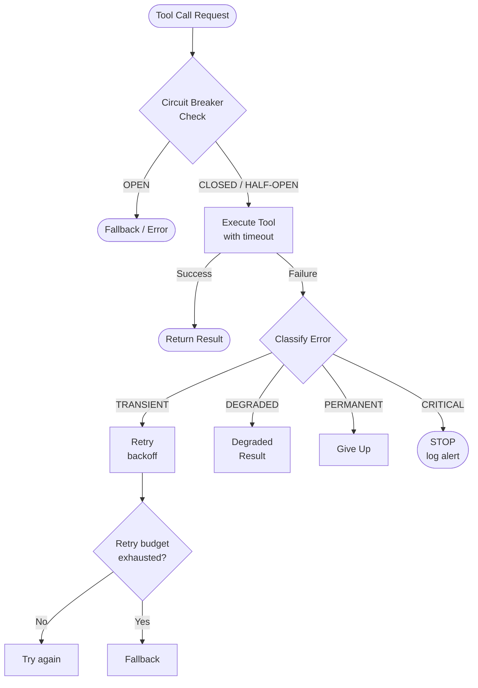
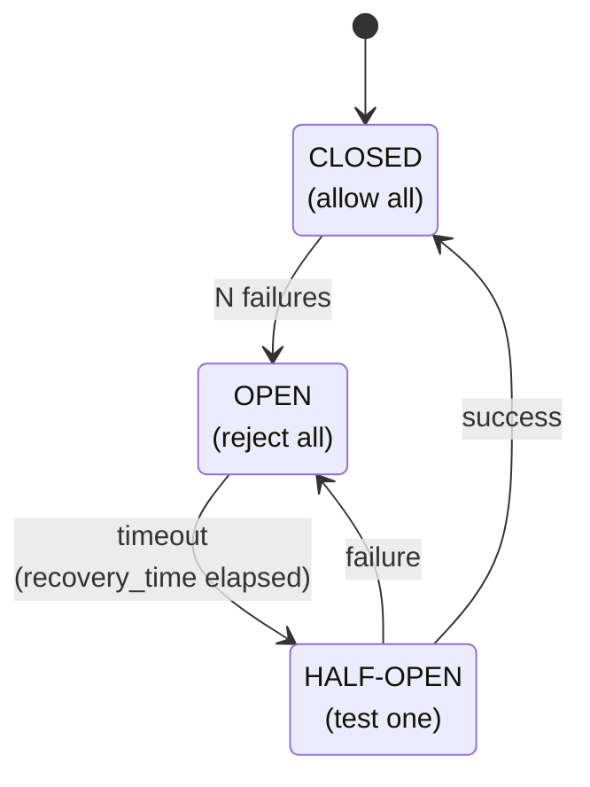

# Error Handling & Robustness

## Overview

AI agents operate in unpredictable environments. APIs go down, models hallucinate tool arguments, code execution produces runtime errors, and network connections time out. A robust agent must handle every failure mode gracefully -- recovering when possible, degrading when necessary, and never crashing silently.

### Graceful Degradation When Tools Fail

Graceful degradation means the agent continues to provide value even when some capabilities are unavailable. If the weather API is down, the agent should say "I cannot fetch live weather data right now, but based on historical patterns for this region and season..." rather than returning a cryptic error or hanging.

The degradation hierarchy typically follows three levels:

1. **Full capability**: The tool works normally, and the agent uses its output.
2. **Partial capability**: The tool partially fails (e.g., returns incomplete data). The agent uses what it can and notes the limitation.
3. **Fallback mode**: The tool is completely unavailable. The agent falls back to its parametric knowledge, cached results, or an alternative tool.

Implementing this requires wrapping every tool call in error handling that classifies the failure and routes to the appropriate fallback. The agent's system prompt should also include instructions for fallback behavior so the LLM knows how to respond when a tool returns an error.

### Fallback Strategies and Retry Budgets

Not all errors deserve a retry. A **retry budget** limits how many times the agent retries a failed operation before giving up. Without a budget, an agent can burn tokens and time in an infinite retry loop.

The retry budget can be defined per tool or globally. A reasonable default:

- **Per-tool budget**: 3 retries maximum
- **Global budget**: 10 retries total across all tools in a single task
- **Token budget**: Stop if total token consumption exceeds a threshold $T_{\text{max}}$

The expected cost of retries follows a geometric series. If each retry has a probability $p$ of succeeding and a cost $c$, the expected total cost before success or exhaustion is:

$$\mathbb{E}[C] = c \cdot \sum_{k=0}^{N-1} (1-p)^k = c \cdot \frac{1 - (1-p)^N}{p}$$

where $N$ is the retry budget. For $p = 0.7$ and $N = 3$, the expected cost is $c \cdot \frac{1 - 0.027}{0.7} \approx 1.39c$ -- only 39% more than a single attempt.

**Fallback strategies** go beyond simple retries:

- **Alternative tool**: If `search_web` fails, try `search_cached_knowledge`
- **Simplified query**: Retry with fewer parameters or a simpler request
- **Human escalation**: Ask the user for help when automated recovery fails
- **Cached result**: Return a stale but previously valid result with a freshness warning

### Timeout Handling for External APIs

External API calls can hang indefinitely without proper timeout configuration. An agent making a tool call should enforce three types of timeouts:

- **Connection timeout**: How long to wait for the TCP connection to establish (typically 5-10 seconds)
- **Read timeout**: How long to wait for the server to send a response (typically 10-30 seconds)
- **Total timeout**: Maximum wall-clock time for the entire operation including retries

The total time for a tool call with retries and exponential backoff is bounded by:

$$T_{\text{total}} \leq \sum_{k=0}^{N-1} \left( t_{\text{timeout}} + t_{\text{base}} \cdot 2^k \right) = N \cdot t_{\text{timeout}} + t_{\text{base}} \cdot (2^N - 1)$$

For $N = 3$, $t_{\text{timeout}} = 10s$, and $t_{\text{base}} = 1s$: $T_{\text{total}} \leq 30 + 7 = 37$ seconds. This is a useful upper bound for setting the global operation timeout.

### Sandbox Security for Code Execution

Agents that execute code face a serious security surface. User inputs, model hallucinations, or malicious prompt injections can produce dangerous code. A robust agent must sandbox code execution:

- **Process isolation**: Run code in a separate process with limited permissions
- **Filesystem restrictions**: Restrict read/write access to a dedicated temporary directory
- **Network restrictions**: Block outbound network access unless explicitly required
- **Resource limits**: Cap CPU time, memory usage, and disk space
- **Input sanitization**: Validate that generated code does not contain dangerous patterns (e.g., `os.system`, `subprocess.call`, `eval` on user input)

The defense-in-depth principle applies: no single layer of protection is sufficient. Combine multiple layers to minimize risk.

The probability of a security breach decreases multiplicatively with each independent layer:

$$P(\text{breach}) = \prod_{i=1}^{n} P(\text{bypass layer } i) = p_1 \cdot p_2 \cdots p_n$$

If each of 4 layers has a 10% bypass rate, the combined breach probability is $0.1^4 = 0.01\%$.

---

## Key Concepts

- **Graceful degradation**: Providing reduced but useful functionality when components fail
- **Retry budget**: A hard limit on retry attempts to prevent infinite loops and token waste
- **Exponential backoff**: Doubling wait time between retries to reduce load on failing services
- **Connection / read / total timeouts**: Three layers of timeout protection for API calls
- **Sandbox**: An isolated execution environment with restricted permissions for running untrusted code
- **Defense in depth**: Layering multiple security measures so that no single failure is catastrophic
- **Circuit breaker**: A pattern that stops calling a failing service after repeated failures, allowing it time to recover

---

## Code Examples

### Robust Tool Wrapper

```python
import time
import asyncio
import logging
from enum import Enum
from typing import Any, Callable
from dataclasses import dataclass, field

logger = logging.getLogger(__name__)


class ErrorSeverity(Enum):
    """Classification of tool errors by severity."""
    TRANSIENT = "transient"      # Retry: network blip, rate limit
    DEGRADED = "degraded"        # Partial result available
    PERMANENT = "permanent"      # Do not retry: bad input, auth failure
    CRITICAL = "critical"        # Security issue: stop immediately


@dataclass
class ToolResult:
    """Standardized result from a tool execution."""
    success: bool
    data: Any = None
    error: str | None = None
    severity: ErrorSeverity | None = None
    retries_used: int = 0
    latency_ms: float = 0.0


@dataclass
class RetryConfig:
    """Configuration for retry behavior."""
    max_retries: int = 3
    base_delay: float = 1.0        # seconds
    max_delay: float = 30.0        # seconds
    timeout: float = 15.0          # per-attempt timeout in seconds
    total_timeout: float = 60.0    # total wall-clock limit


class CircuitBreaker:
    """Stops calling a failing service after repeated failures."""

    def __init__(self, failure_threshold: int = 5, recovery_time: float = 60.0):
        self.failure_threshold = failure_threshold
        self.recovery_time = recovery_time
        self.failure_count = 0
        self.last_failure_time = 0.0
        self.is_open = False

    def record_failure(self) -> None:
        self.failure_count += 1
        self.last_failure_time = time.time()
        if self.failure_count >= self.failure_threshold:
            self.is_open = True
            logger.warning("Circuit breaker OPEN: too many failures")

    def record_success(self) -> None:
        self.failure_count = 0
        self.is_open = False

    def allow_request(self) -> bool:
        if not self.is_open:
            return True
        # Allow a test request after recovery_time
        if time.time() - self.last_failure_time > self.recovery_time:
            logger.info("Circuit breaker HALF-OPEN: allowing test request")
            return True
        return False


def classify_error(exception: Exception) -> ErrorSeverity:
    """Classify an exception into a severity level."""
    error_msg = str(exception).lower()

    if "timeout" in error_msg or "connection" in error_msg:
        return ErrorSeverity.TRANSIENT
    if "429" in error_msg or "rate limit" in error_msg:
        return ErrorSeverity.TRANSIENT
    if "500" in error_msg or "502" in error_msg or "503" in error_msg:
        return ErrorSeverity.TRANSIENT
    if "401" in error_msg or "403" in error_msg:
        return ErrorSeverity.PERMANENT
    if "400" in error_msg or "validation" in error_msg:
        return ErrorSeverity.PERMANENT
    if "security" in error_msg or "injection" in error_msg:
        return ErrorSeverity.CRITICAL

    return ErrorSeverity.TRANSIENT  # Default: assume transient


def robust_tool_call(
    fn: Callable,
    args: dict[str, Any],
    config: RetryConfig = RetryConfig(),
    circuit_breaker: CircuitBreaker | None = None,
    fallback: Callable | None = None,
) -> ToolResult:
    """Execute a tool function with retry logic, timeouts, and fallbacks."""
    start_time = time.time()

    # Check circuit breaker
    if circuit_breaker and not circuit_breaker.allow_request():
        if fallback:
            logger.info("Circuit open. Using fallback.")
            return ToolResult(success=True, data=fallback(**args), retries_used=0)
        return ToolResult(
            success=False,
            error="Circuit breaker is open. Service temporarily unavailable.",
            severity=ErrorSeverity.TRANSIENT,
        )

    last_error = None
    for attempt in range(config.max_retries + 1):
        elapsed = time.time() - start_time
        if elapsed > config.total_timeout:
            break

        try:
            # Execute with per-attempt timeout
            result = fn(**args)
            if circuit_breaker:
                circuit_breaker.record_success()

            return ToolResult(
                success=True,
                data=result,
                retries_used=attempt,
                latency_ms=(time.time() - start_time) * 1000,
            )

        except Exception as e:
            last_error = e
            severity = classify_error(e)
            logger.warning(f"Tool call failed (attempt {attempt+1}): {e}")

            if severity == ErrorSeverity.CRITICAL:
                logger.error(f"CRITICAL error: {e}. Stopping immediately.")
                return ToolResult(success=False, error=str(e), severity=severity)

            if severity == ErrorSeverity.PERMANENT:
                break  # No point retrying

            if circuit_breaker:
                circuit_breaker.record_failure()

            # Exponential backoff for transient errors
            if attempt < config.max_retries:
                delay = min(config.base_delay * (2 ** attempt), config.max_delay)
                time.sleep(delay)

    # All retries exhausted -- try fallback
    if fallback:
        logger.info("All retries failed. Using fallback.")
        try:
            fallback_result = fallback(**args)
            return ToolResult(
                success=True,
                data=fallback_result,
                retries_used=config.max_retries,
                latency_ms=(time.time() - start_time) * 1000,
            )
        except Exception as fb_error:
            logger.error(f"Fallback also failed: {fb_error}")

    return ToolResult(
        success=False,
        error=str(last_error),
        severity=classify_error(last_error) if last_error else ErrorSeverity.PERMANENT,
        retries_used=config.max_retries,
        latency_ms=(time.time() - start_time) * 1000,
    )


# ---------------------------------------------------------------
# Example usage with a weather tool
# ---------------------------------------------------------------
import httpx

def fetch_weather(city: str) -> dict:
    """Real tool that calls an external API."""
    resp = httpx.get(
        "https://api.openweathermap.org/data/2.5/weather",
        params={"q": city, "appid": "YOUR_KEY"},
        timeout=10.0,
    )
    resp.raise_for_status()
    return resp.json()

def cached_weather(city: str) -> dict:
    """Fallback: return a cached/default response."""
    return {"city": city, "note": "Live data unavailable. Using cached estimate.",
            "temperature": "~15C", "conditions": "unknown"}

# Create a circuit breaker for the weather service
weather_breaker = CircuitBreaker(failure_threshold=3, recovery_time=120.0)

# Execute with full robustness
result = robust_tool_call(
    fn=fetch_weather,
    args={"city": "London"},
    config=RetryConfig(max_retries=2, timeout=10.0, total_timeout=45.0),
    circuit_breaker=weather_breaker,
    fallback=cached_weather,
)

if result.success:
    print(f"Data: {result.data} (retries: {result.retries_used})")
else:
    print(f"Failed: {result.error} (severity: {result.severity})")
```

**Line-by-line explanation:**

- `ErrorSeverity` classifies errors into four levels. Only `TRANSIENT` errors are retried. `PERMANENT` errors (bad input) skip retries. `CRITICAL` errors (security) halt immediately.
- `ToolResult` is a standardized return type that every tool produces, making downstream handling uniform.
- `CircuitBreaker` tracks consecutive failures. After 5 failures, it stops calling the service for 60 seconds, then allows a single test request (half-open state).
- `classify_error` maps exception messages to severity levels using keyword matching.
- `robust_tool_call` orchestrates the full flow: circuit breaker check, retry loop with exponential backoff, severity-based routing, timeout enforcement, and fallback execution.
- The weather example shows practical integration: `fetch_weather` is the primary tool, `cached_weather` is the fallback, and the circuit breaker prevents hammering a failing API.

---

## Math/Formulas (KaTeX)

Availability of a tool with $N$ independent fallback layers:

$$A_{\text{total}} = 1 - \prod_{i=0}^{N} (1 - A_i)$$

where $A_i$ is the availability of layer $i$. If the primary tool has $A_0 = 0.95$ and the fallback has $A_1 = 0.99$, the combined availability is:

$$A_{\text{total}} = 1 - (0.05)(0.01) = 1 - 0.0005 = 0.9995$$

The expected token cost with retry budget $N$ and per-attempt cost $c$:

$$\mathbb{E}[\text{cost}] = c \cdot \frac{1 - (1-p)^N}{p}$$

For $p = 0.8$ (80% success rate) and $N = 3$: $\mathbb{E}[\text{cost}] = c \cdot \frac{1 - 0.008}{0.8} = 1.24c$.

---

## Diagrams

**Robust Tool Execution Flow**



**Circuit Breaker States**



---

## Exercises

1. **Implement the circuit breaker**: Test the `CircuitBreaker` class by simulating a service that fails 60% of the time. Verify that the breaker opens after the threshold and recovers after the timeout.

2. **Add async support**: Convert `robust_tool_call` to an async function using `asyncio`. Use `asyncio.wait_for` for per-attempt timeouts instead of synchronous `time.sleep`.

3. **Sandbox a code executor**: Write a tool that executes Python code in a subprocess with restricted permissions. Use `subprocess.run` with a timeout, capture stdout/stderr, and block imports of `os`, `subprocess`, and `sys`.

4. **Error classification**: Extend `classify_error` to handle 10 additional error types. Test it with mock exceptions for each type and verify correct severity assignment.

5. **Monitoring dashboard**: Add logging to `robust_tool_call` that records: tool name, attempt count, latency, success/failure, and error severity. Write a function that summarizes these logs into a report showing tool reliability statistics.

---

## Further Reading

- [Release It! Design and Deploy Production-Ready Software (Michael Nygard)](https://pragprog.com/titles/mnee2/release-it-second-edition/)
- [Circuit Breaker Pattern (Martin Fowler)](https://martinfowler.com/bliki/CircuitBreaker.html)
- [Python asyncio Documentation](https://docs.python.org/3/library/asyncio.html)
- [gVisor: Container Sandboxing](https://gvisor.dev/)
- [OpenAI Safety Best Practices](https://platform.openai.com/docs/guides/safety-best-practices)
