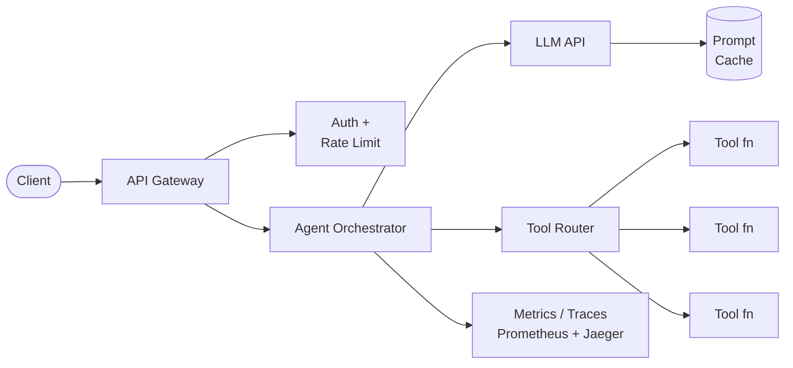
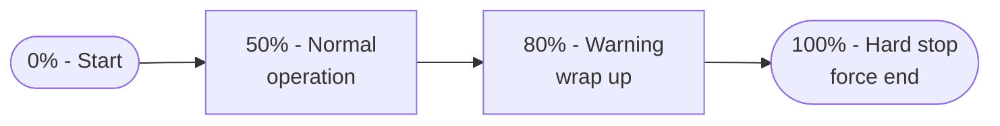

# Building Production Agents

## Overview

Building an AI agent that works in a notebook is one thing. Running it reliably in production -- handling thousands of
requests, staying within budget, and diagnosing failures at 3 AM -- is an entirely different challenge. This lesson
covers the engineering practices that separate a prototype agent from a production-grade system.

### Deployment Architecture: Serverless vs Long-Running

The first decision is how your agent process runs. Each approach has distinct trade-offs.

**Serverless** (AWS Lambda, Google Cloud Functions, Cloudflare Workers): The platform spins up a container per request and tears it down when done. You pay only for compute time. This works well for agents that handle short, independent tasks -- a customer support bot that answers one question at a time, for example. The downside is **cold start latency**: the first invocation after idle may take 1-5 seconds as the runtime initializes. For agents that need to maintain conversation state across many turns, serverless adds complexity because you must externalize all state to a database or cache.

**Long-running processes** (Kubernetes pods, EC2 instances, Railway): Your agent runs continuously, accepting requests via an API or message queue. This eliminates cold starts, supports persistent in-memory state, and allows long-running agentic loops (e.g., a coding agent that works for 10 minutes on a task). The trade-off is cost: you pay for the instance whether it is busy or idle. Autoscaling helps, but you need to configure it carefully.

A common hybrid pattern: use a long-running orchestrator service that dispatches individual tool calls to serverless
functions. The orchestrator holds conversation state; the tools scale independently.

### Cost Optimization

LLM API costs can spiral quickly in agentic systems because each reasoning step consumes tokens, and agents often take
many steps. Three strategies matter most:

**Token budgeting** sets a hard ceiling on how many tokens an agent can consume per task. Track cumulative input and output tokens across all LLM calls in a session. When the budget is 80% exhausted, instruct the agent to wrap up. When it hits 100%, force-stop the loop. Without budgets, a confused agent can loop indefinitely, burning hundreds of dollars on a single task.

**Prompt caching** exploits the fact that the system prompt and tool definitions are identical across requests. Services like Anthropic's prompt caching store the prefix KV cache server-side, reducing both latency and cost for subsequent calls. For a 4,000-token system prompt, caching can cut input costs by up to 90% on cache hits.

**Model routing** sends simple tasks to smaller, cheaper models and reserves expensive models for hard problems. A classifier (or even a heuristic based on task type) decides which model handles each step. Routing 70% of tool-selection calls to a smaller model while using a frontier model only for complex reasoning can cut costs by 50% or more.

### Monitoring and Observability

An agent that silently fails is worse than one that crashes loudly. Production agents need three layers of visibility:

**Metrics** track aggregate health: request latency (p50, p95, p99), error rates, tokens consumed per request, tool call counts, and task success rates. Export these to a time-series database (Prometheus, Datadog) and set alerts on anomalies. A sudden spike in tool calls per task often signals a prompt regression or an upstream API failure causing retries.

**Structured logging** records every decision the agent makes in machine-parseable format (JSON). Each log entry should include a trace ID, the agent step number, the tool called, input/output token counts, latency, and any errors. Structured logs let you reconstruct exactly what happened for any request without guessing.

**Distributed tracing** connects the dots across services. A single agent request may call an LLM API, a vector database, two external tools, and a database. Tracing (via OpenTelemetry) gives you a waterfall view of the entire request lifecycle, making it easy to spot which component is slow or failing.

### Reliability Patterns

Production agents need defensive coding. **Retry with exponential backoff** handles transient LLM API failures.
**Circuit breakers** stop calling a tool that has failed repeatedly, preventing cascade failures. **Timeouts** on every
external call prevent the agent from hanging indefinitely. **Graceful degradation** means the agent can still provide a
partial answer if one tool is unavailable.

---

## Key Concepts

- **Cold start latency**: Delay when a serverless function initializes; typically 1-5 seconds for LLM-based agents
- **Token budgeting**: Hard limit on cumulative tokens per agent session to prevent runaway costs
- **Prompt caching**: Reusing pre-computed KV cache for repeated prompt prefixes to reduce latency and cost
- **Model routing**: Directing tasks to appropriately-sized models based on complexity
- **Structured logging**: JSON-formatted logs with trace IDs, step numbers, and tool metadata for debugging
- **Circuit breaker**: Pattern that stops calling a failing service after repeated errors, allowing recovery

---

## Code Examples

```python
import time
import json
import logging
from dataclasses import dataclass, field
from typing import Optional

# --- Structured Logger ---
# Emits JSON lines with trace context for every agent action.

logger = logging.getLogger("agent")
handler = logging.StreamHandler()
handler.setFormatter(logging.Formatter("%(message)s"))
logger.addHandler(handler)
logger.setLevel(logging.INFO)

@dataclass
class AgentMetrics:
    """Tracks per-request metrics for a production agent."""
    trace_id: str
    total_input_tokens: int = 0
    total_output_tokens: int = 0
    tool_calls: int = 0
    steps: int = 0
    latencies: list = field(default_factory=list)
    token_budget: int = 50000  # max tokens per session

    def record_llm_call(self, input_tokens: int, output_tokens: int,
                        latency_ms: float, step: int, tool: Optional[str] = None):
        """Record one LLM call and emit a structured log entry."""
        self.total_input_tokens += input_tokens
        self.total_output_tokens += output_tokens
        self.latencies.append(latency_ms)
        self.steps = step
        if tool:
            self.tool_calls += 1

        # Structured log line -- every field is queryable
        log_entry = {
            "trace_id": self.trace_id,
            "step": step,
            "tool": tool,
            "input_tokens": input_tokens,
            "output_tokens": output_tokens,
            "latency_ms": round(latency_ms, 1),
            "cumulative_tokens": self.total_input_tokens + self.total_output_tokens,
            "budget_remaining": self.token_budget - (self.total_input_tokens + self.total_output_tokens),
        }
        logger.info(json.dumps(log_entry))

    @property
    def budget_exhausted(self) -> bool:
        return (self.total_input_tokens + self.total_output_tokens) >= self.token_budget

    @property
    def budget_warning(self) -> bool:
        used = self.total_input_tokens + self.total_output_tokens
        return used >= 0.8 * self.token_budget

    def summary(self) -> dict:
        lats = self.latencies or [0]
        sorted_lats = sorted(lats)
        p50 = sorted_lats[len(sorted_lats) // 2]
        p95 = sorted_lats[int(len(sorted_lats) * 0.95)]
        return {
            "trace_id": self.trace_id,
            "total_tokens": self.total_input_tokens + self.total_output_tokens,
            "tool_calls": self.tool_calls,
            "steps": self.steps,
            "p50_latency_ms": round(p50, 1),
            "p95_latency_ms": round(p95, 1),
        }

# --- Latency-tracked agent loop ---

def run_agent_with_tracking(task: str, trace_id: str):
    """Minimal agent loop with latency tracking and token budgeting."""
    metrics = AgentMetrics(trace_id=trace_id, token_budget=50000)
    step = 0

    while not metrics.budget_exhausted:
        step += 1
        start = time.perf_counter()

        # -- Simulate LLM call (replace with real API call) --
        # response = client.messages.create(...)
        input_tokens = 1200   # from response.usage.input_tokens
        output_tokens = 350   # from response.usage.output_tokens
        tool_used = "search" if step % 2 == 0 else None

        elapsed_ms = (time.perf_counter() - start) * 1000
        metrics.record_llm_call(input_tokens, output_tokens, elapsed_ms, step, tool_used)

        if metrics.budget_warning:
            print(f"[WARN] Budget 80% used at step {step}. Wrapping up.")
            break

        # Check for task completion (placeholder)
        if step >= 5:
            break

    print(json.dumps(metrics.summary(), indent=2))
```

**Line-by-line highlights:**
- `AgentMetrics` is a dataclass accumulating tokens, latencies, and tool call counts across an entire session.
- `record_llm_call` emits a JSON log line after every LLM interaction, including the trace ID for correlation.
- `budget_warning` and `budget_exhausted` implement two-phase token budgeting: warn at 80%, hard-stop at 100%.
- `summary()` computes percentile latencies (p50, p95) from the collected measurements.
- The agent loop checks the budget on every iteration, preventing runaway cost.

---

## Math/Formulas (KaTeX)

**Cost per agent task** combines input and output token pricing:

$$C_{\text{task}} = \sum_{i=1}^{N} \left( t_{\text{in},i} \cdot p_{\text{in}} + t_{\text{out},i} \cdot p_{\text{out}} \right)$$

where $N$ is the number of LLM calls, $t_{\text{in},i}$ and $t_{\text{out},i}$ are input/output tokens for call $i$, and
$p_{\text{in}}$, $p_{\text{out}}$ are the per-token prices.

**Cache savings** for a prefix of length $L$ tokens cached across $R$ requests:

$$S = (R - 1) \cdot L \cdot (p_{\text{in}} - p_{\text{cache}})$$

where $p_{\text{cache}}$ is the reduced price for cached tokens (typically $0.1 \times p_{\text{in}}$).

**Percentile latency** (p95) from $n$ sorted observations $l_1 \leq l_2 \leq \ldots \leq l_n$:

$$p_{95} = l_{\lceil 0.95 \cdot n \rceil}$$

---

## Diagrams

**Production Agent Architecture**



**Token Budget Lifecycle**



---

## Exercises

1. **Token budget calculator**: Given an agent that averages 8 LLM calls per task, with 2,000 input tokens and 500 output tokens per call, at $3/M input and $15/M output, calculate the average cost per task. Then calculate savings if prompt caching reduces input cost by 90% for a 1,500-token cached prefix.

2. **Add retry logic**: Extend the code example to include exponential backoff retries (max 3 attempts, base delay 1 second, multiplied by 2 each retry) when the simulated LLM call raises a `RateLimitError`.

3. **Deployment decision**: You are building an agent that (a) responds to Slack messages within 2 seconds, (b) processes documents in batch overnight, (c) runs multi-step research tasks lasting 5-10 minutes. For each, recommend serverless or long-running and justify your choice.

4. **Structured logging query**: Write a `jq` command to extract all log entries from the agent where `latency_ms > 1000` and `tool` is not null, sorted by latency descending. This simulates real incident investigation.

---

## Further Reading

- OpenTelemetry documentation: https://opentelemetry.io/docs/
- Anthropic prompt caching guide: https://docs.anthropic.com/en/docs/build-with-claude/prompt-caching
- AWS Well-Architected Framework -- Serverless Applications Lens
- Langfuse (open-source LLM observability): https://langfuse.com/
- "Designing Data-Intensive Applications" by Martin Kleppmann -- Chapter 1 on reliability, scalability, maintainability
