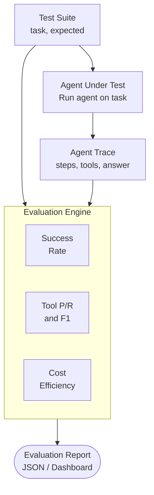
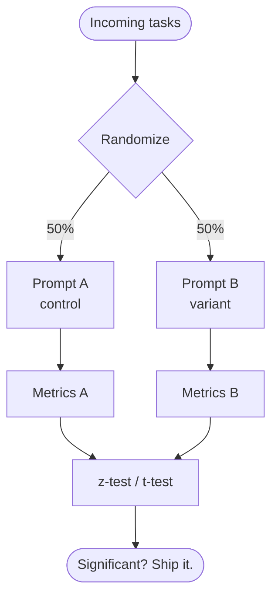

# Agent Evaluation & Testing

## Overview

Evaluating an AI agent is fundamentally harder than evaluating a classifier or a language model. A classifier produces a
single output you can compare to a label. An agent produces a sequence of actions -- tool calls, reasoning steps,
intermediate outputs -- and the final result depends on the entire trajectory. A correct answer reached through
wasteful, dangerous, or unreliable steps is not a good agent. This lesson covers the metrics, methods, and tooling
needed to rigorously evaluate agentic systems.

### What Makes Agent Evaluation Different

Traditional ML evaluation asks: "Is the output correct?" Agent evaluation must ask three additional questions: (1) Did
the agent take the right steps? (2) Did it use tools appropriately? (3) Did it stay within resource constraints? An
agent that answers a question correctly but makes 47 unnecessary API calls, leaks user data to an external tool, or
takes 12 minutes when 30 seconds would suffice has failed in important ways that output-only metrics miss.

### Core Metrics

**Task success rate** is the most basic metric: what fraction of tasks did the agent complete correctly? This requires a clear definition of "correct," which is harder than it sounds. For factual questions, you can compare against ground truth. For open-ended tasks like "write a marketing email," you need human evaluation or an LLM-as-judge approach.

$$\text{Task Success Rate} = \frac{\text{Tasks completed correctly}}{\text{Total tasks attempted}}$$

**Step accuracy** measures whether each intermediate step in the agent's trajectory was appropriate. Given a reference trajectory (the "gold" path), you compare the agent's actions step by step. This catches agents that reach the right answer by luck or brute force.

$$\text{Step Accuracy} = \frac{1}{N}\sum_{i=1}^{N} \frac{|\text{correct steps}_i|}{|\text{total steps}_i|}$$

**Tool precision and recall** evaluate tool usage specifically. Tool precision asks: "Of all tool calls the agent made, how many were necessary?" Tool recall asks: "Of all tool calls that were needed, how many did the agent make?"

$$\text{Tool Precision} = \frac{\text{Necessary tool calls made}}{\text{Total tool calls made}}$$

$$\text{Tool Recall} = \frac{\text{Necessary tool calls made}}{\text{Total necessary tool calls}}$$

High tool precision with low recall means the agent is cautious but misses information. Low precision with high recall
means the agent calls everything and wastes resources. You want both to be high.

**Cost efficiency** tracks tokens consumed and wall-clock time per task, normalized by task complexity. Two agents with the same success rate but 10x different costs are not equivalent.

### Synthetic Test Data Generation

You cannot evaluate agents on 5 examples. You need hundreds or thousands of test cases covering diverse scenarios, edge
cases, and failure modes. Manually creating these is impractical, so synthetic generation is essential.

The approach: use a strong LLM to generate (task, expected_tool_calls, expected_answer) triples. Provide the generator
with your agent's tool definitions and ask it to create tasks of varying difficulty that exercise different tools and
tool combinations. Then have a human review a sample (10-20%) to catch hallucinated or impossible tasks.

For tool-using agents, you can also **record production traffic** (with user consent), strip PII, and convert real
interactions into test cases. These are invaluable because they capture the distribution of actual user requests,
including the weird edge cases you would never think to synthesize.

### Agentic Benchmarks

Several benchmarks exist for evaluating agentic capabilities:

**GAIA** (General AI Assistants) tests multi-step reasoning with real-world tools. Tasks require web browsing, file manipulation, and calculation. It has three difficulty levels, and even frontier models score below 50% on the hardest tier. GAIA is valuable because its tasks are unambiguous -- each has a single correct final answer -- yet require genuine multi-step planning.

**MINT-Bench** evaluates multi-turn interaction with tools. It focuses on whether agents can use tools effectively across a conversation, handling tool errors, combining results from multiple tools, and adapting when initial approaches fail.

**SWE-bench** tests software engineering agents on real GitHub issues. The agent must read the issue, navigate a codebase, and produce a correct patch. This is one of the most demanding agentic benchmarks because it requires reading comprehension, code understanding, planning, and precise execution.

### A/B Testing Agent Prompts

Prompt changes can have unpredictable effects on agent behavior. A small wording change might improve performance on one
task type while degrading another. A/B testing is the disciplined way to evaluate prompt changes.

Split incoming tasks randomly between the current prompt (control) and the new prompt (variant). Track task success
rate, step count, tool usage, cost, and latency for both groups. Run the test until you have statistical significance.
Use a two-proportion z-test for binary outcomes (success/failure) and a t-test or Mann-Whitney U test for continuous
metrics (latency, cost).

The key pitfall: agent behavior is high-variance. A single task might take 3 steps or 30 depending on stochastic LLM
sampling. You need more samples than you think -- typically 200-500 per variant -- to detect meaningful differences.

---

## Key Concepts

- **Task success rate**: Fraction of tasks the agent completes correctly, the most fundamental metric
- **Step accuracy**: Whether each intermediate action in the agent trajectory was appropriate
- **Tool precision/recall**: Measures whether the agent calls the right tools without unnecessary calls
- **Synthetic test generation**: Using LLMs to create large, diverse evaluation datasets automatically
- **GAIA benchmark**: Multi-step reasoning benchmark with unambiguous answers requiring real tool use
- **A/B testing**: Randomized comparison of agent prompt variants with statistical significance testing

---

## Code Examples

```python
import json
from dataclasses import dataclass, field
from typing import Optional

@dataclass
class AgentTrace:
    """Records one agent execution for evaluation."""
    task_id: str
    task: str
    expected_answer: str
    expected_tools: list[str]       # tools that should be called
    actual_answer: Optional[str] = None
    actual_tools: list[str] = field(default_factory=list)
    actual_steps: list[dict] = field(default_factory=list)
    total_tokens: int = 0
    latency_ms: float = 0.0

def evaluate_trace(trace: AgentTrace) -> dict:
    """Compute all evaluation metrics for a single agent trace."""

    # --- Task success (exact match; extend with fuzzy/LLM judge) ---
    success = (
        trace.actual_answer is not None
        and trace.actual_answer.strip().lower()
        == trace.expected_answer.strip().lower()
    )

    # --- Tool precision and recall ---
    expected_set = set(trace.expected_tools)
    actual_set = set(trace.actual_tools)
    necessary_calls = expected_set & actual_set

    tool_precision = (
        len(necessary_calls) / len(actual_set) if actual_set else 0.0
    )
    tool_recall = (
        len(necessary_calls) / len(expected_set) if expected_set else 0.0
    )
    tool_f1 = (
        2 * tool_precision * tool_recall / (tool_precision + tool_recall)
        if (tool_precision + tool_recall) > 0 else 0.0
    )

    return {
        "task_id": trace.task_id,
        "success": success,
        "tool_precision": round(tool_precision, 3),
        "tool_recall": round(tool_recall, 3),
        "tool_f1": round(tool_f1, 3),
        "num_steps": len(trace.actual_steps),
        "total_tokens": trace.total_tokens,
        "latency_ms": trace.latency_ms,
    }

def evaluate_suite(traces: list[AgentTrace]) -> dict:
    """Aggregate metrics across a full evaluation suite."""
    results = [evaluate_trace(t) for t in traces]
    n = len(results)
    if n == 0:
        return {}

    success_rate = sum(r["success"] for r in results) / n
    avg_precision = sum(r["tool_precision"] for r in results) / n
    avg_recall = sum(r["tool_recall"] for r in results) / n
    avg_tokens = sum(r["total_tokens"] for r in results) / n
    avg_steps = sum(r["num_steps"] for r in results) / n

    return {
        "num_tasks": n,
        "task_success_rate": round(success_rate, 3),
        "avg_tool_precision": round(avg_precision, 3),
        "avg_tool_recall": round(avg_recall, 3),
        "avg_tokens_per_task": round(avg_tokens, 1),
        "avg_steps_per_task": round(avg_steps, 1),
        "per_task": results,
    }

# --- Example usage ---
traces = [
    AgentTrace(
        task_id="t1",
        task="What is the population of France?",
        expected_answer="67 million",
        expected_tools=["web_search"],
        actual_answer="67 million",
        actual_tools=["web_search", "calculator"],  # extra tool call
        actual_steps=[{"action": "search"}, {"action": "calculate"}, {"action": "answer"}],
        total_tokens=3200,
        latency_ms=2100,
    ),
    AgentTrace(
        task_id="t2",
        task="Summarize this PDF.",
        expected_answer="The document discusses climate policy.",
        expected_tools=["read_file", "summarize"],
        actual_answer="The document discusses climate policy.",
        actual_tools=["read_file", "summarize"],
        actual_steps=[{"action": "read"}, {"action": "summarize"}],
        total_tokens=5400,
        latency_ms=3800,
    ),
]

report = evaluate_suite(traces)
print(json.dumps(report, indent=2))
```

**Line-by-line highlights:**
- `AgentTrace` captures everything about one agent run: the task, expected outputs, actual outputs, tool usage, and resource consumption.
- `evaluate_trace` computes success, tool precision, tool recall, and tool F1 for a single trace. Precision penalizes unnecessary tool calls; recall penalizes missed tools.
- `evaluate_suite` aggregates across all traces to produce the final report with averages.
- In trace `t1`, the agent called `calculator` unnecessarily, so tool precision is $\frac{1}{2} = 0.5$ while recall is $\frac{1}{1} = 1.0$.

---

## Math/Formulas (KaTeX)

**Tool F1 Score** balances precision and recall of tool usage:

$$F1_{\text{tool}} = 2 \cdot \frac{\text{Tool Precision} \cdot \text{Tool Recall}}{\text{Tool Precision} + \text{Tool Recall}}$$

**Statistical significance for A/B tests** using a two-proportion z-test. Given success rates $\hat{p}_A$ and $\hat{p}_B$ from $n_A$ and $n_B$ trials:

$$\hat{p} = \frac{n_A \hat{p}_A + n_B \hat{p}_B}{n_A + n_B}$$

$$z = \frac{\hat{p}_A - \hat{p}_B}{\sqrt{\hat{p}(1-\hat{p})\left(\frac{1}{n_A} + \frac{1}{n_B}\right)}}$$

Reject the null hypothesis (no difference) if $|z| > 1.96$ at the 95% confidence level.

**Cost-adjusted success rate** accounts for efficiency:

$$\text{CASR} = \frac{\text{Task Success Rate}}{\log_2(1 + \text{avg tokens per task})}$$

This penalizes agents that achieve high success but consume disproportionate resources.

---

## Diagrams

**Agent Evaluation Pipeline**



**A/B Test Flow**



---

## Exercises

1. **Compute tool metrics**: An agent was expected to call `[search, read_file, calculate]`. It actually called `[search, search, calculate, summarize]`. Compute tool precision, tool recall, and tool F1 by hand.

2. **Sample size estimation**: You want to detect a 5% improvement in task success rate (from 60% to 65%) with 95% confidence and 80% power. Using the formula $n = \frac{(z_\alpha + z_\beta)^2 \cdot (p_1(1-p_1) + p_2(1-p_2))}{(p_1 - p_2)^2}$, calculate the required sample size per variant.

3. **Build a test generator**: Write a Python function that takes a list of tool definitions (name + description) and uses string templates to generate 20 synthetic (task, expected_tools, expected_answer) triples. No LLM required -- use rule-based generation to cover each tool individually and in pairs.

4. **Evaluate trajectory quality**: Extend `evaluate_trace` to compute step accuracy by comparing `actual_steps` against an `expected_steps` field, using edit distance (Levenshtein) normalized by the length of the expected trajectory.

---

## Further Reading

- GAIA benchmark paper: Mialon et al. (2023), "GAIA: A Benchmark for General AI Assistants"
- MINT-Bench: Wang et al. (2024), "MINT: Evaluating LLMs in Multi-Turn Interaction with Tools and Language Feedback"
- SWE-bench: Jimenez et al. (2024), "SWE-bench: Can Language Models Resolve Real-World GitHub Issues?"
- Braintrust AI evaluation platform: https://www.braintrust.dev/
- "How to Evaluate LLM Applications" by Hamel Husain: https://hamel.dev/blog/posts/evals/
