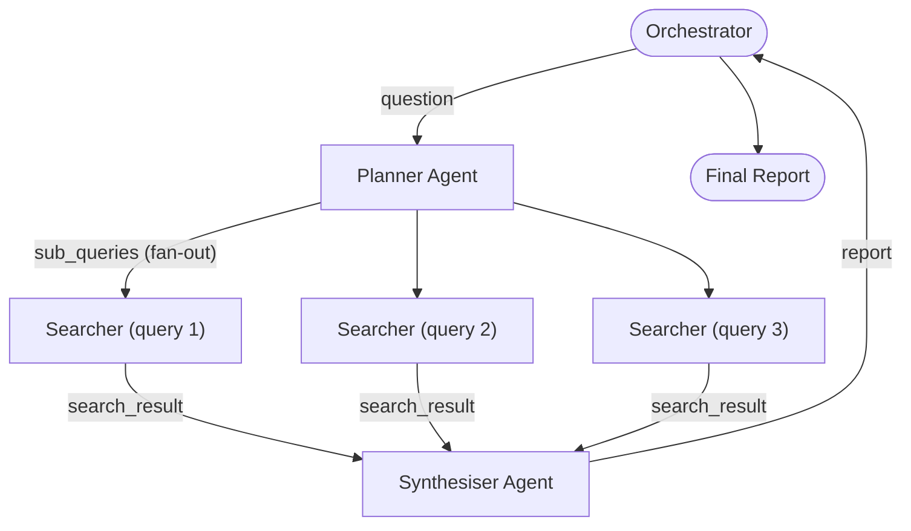

# Project: Multi-Agent Research System

## Overview

This project builds a **multi-agent research system** consisting of three specialised agents -- a Planner, a Searcher,
and a Synthesiser -- that collaborate to answer complex research questions. Instead of one monolithic prompt, each agent
owns a narrow responsibility and communicates through a shared message bus. The result is a system that can decompose a
broad question into sub-queries, gather evidence from the web, and produce a cited summary report.

Multi-agent architectures shine when tasks are too complex for a single context window. By splitting work across agents
you gain modularity (swap one agent without rewriting others), parallelism (multiple searchers can run concurrently),
and improved reliability (each agent's prompt is simpler so it hallucinates less).

---

## Key Concepts

| Concept | Description |
|---|---|
| Agent specialisation | Each agent has a single system prompt and tool set |
| Message bus | A shared data structure that routes messages between agents |
| DAG execution | The Planner produces a directed acyclic graph of sub-tasks |
| Citation tracking | Every claim links back to a source URL |

When the Planner decomposes a question into $n$ independent sub-queries, the total latency drops from $n \cdot t$
(serial) to roughly $t$ (parallel) plus coordination overhead. The expected wall-clock time with $p$ parallel workers
is:

$$T_{\text{parallel}} = \frac{n}{p} \cdot t + t_{\text{overhead}}$$

---

## Code Examples

### 1. Inter-agent communication protocol

We define a simple message dataclass and an in-memory bus.

```python
from dataclasses import dataclass, field
from typing import Literal
import uuid
import asyncio

@dataclass
class Message:
    sender: str
    receiver: str
    kind: Literal["plan", "search_request", "search_result", "synthesise", "report"]
    payload: dict
    msg_id: str = field(default_factory=lambda: uuid.uuid4().hex[:8])

class MessageBus:
    """Simple async message bus backed by per-agent queues."""

    def __init__(self):
        self._queues: dict[str, asyncio.Queue] = {}

    def register(self, agent_name: str):
        self._queues[agent_name] = asyncio.Queue()

    async def send(self, msg: Message):
        q = self._queues.get(msg.receiver)
        if q is None:
            raise ValueError(f"Unknown receiver: {msg.receiver}")
        await q.put(msg)

    async def receive(self, agent_name: str) -> Message:
        return await self._queues[agent_name].get()
```

### 2. The three agents

```python
import openai, json, requests

client = openai.AsyncOpenAI()

# ---------- Planner Agent ----------

async def planner_agent(bus: MessageBus):
    """Decomposes a research question into sub-queries."""
    msg = await bus.receive("planner")
    question = msg.payload["question"]

    resp = await client.chat.completions.create(
        model="gpt-4o",
        temperature=0,
        messages=[
            {"role": "system", "content": (
                "You are a research planner. Given a question, output a JSON "
                "list of 2-5 independent sub-queries that together answer the "
                "question. Format: {\"sub_queries\": [\"...\", ...]}"
            )},
            {"role": "user", "content": question},
        ],
    )
    plan = json.loads(resp.choices[0].message.content)

    for sq in plan["sub_queries"]:
        await bus.send(Message(
            sender="planner",
            receiver="searcher",
            kind="search_request",
            payload={"sub_query": sq},
        ))

    # Tell synthesiser how many results to expect
    await bus.send(Message(
        sender="planner",
        receiver="synthesiser",
        kind="plan",
        payload={"expected": len(plan["sub_queries"]), "question": question},
    ))

# ---------- Searcher Agent ----------

async def searcher_agent(bus: MessageBus):
    """Searches the web for each sub-query and returns snippets."""
    while True:
        msg = await bus.receive("searcher")
        if msg.kind == "shutdown":
            break
        query = msg.payload["sub_query"]

        # Call a search API (Tavily shown here)
        resp = requests.get(
            "https://api.tavily.com/search",
            params={"query": query, "max_results": 3},
            headers={"Authorization": "Bearer YOUR_KEY"},
        )
        results = resp.json().get("results", [])
        snippets = [
            {"text": r["content"], "url": r["url"]} for r in results
        ]

        await bus.send(Message(
            sender="searcher",
            receiver="synthesiser",
            kind="search_result",
            payload={"sub_query": query, "snippets": snippets},
        ))

# ---------- Synthesiser Agent ----------

async def synthesiser_agent(bus: MessageBus):
    """Collects search results and produces a cited report."""
    plan_msg = await bus.receive("synthesiser")
    expected = plan_msg.payload["expected"]
    question = plan_msg.payload["question"]

    evidence = []
    for _ in range(expected):
        result_msg = await bus.receive("synthesiser")
        evidence.append(result_msg.payload)

    evidence_text = "\n\n".join(
        f"Sub-query: {e['sub_query']}\n" +
        "\n".join(f"  - {s['text']} [source]({s['url']})" for s in e["snippets"])
        for e in evidence
    )

    resp = await client.chat.completions.create(
        model="gpt-4o",
        temperature=0.2,
        messages=[
            {"role": "system", "content": (
                "You are a research synthesiser. Given evidence snippets "
                "with source URLs, write a concise report that answers the "
                "question. Cite every claim with [source](url)."
            )},
            {"role": "user", "content": (
                f"Question: {question}\n\nEvidence:\n{evidence_text}"
            )},
        ],
    )
    report = resp.choices[0].message.content
    await bus.send(Message(
        sender="synthesiser",
        receiver="orchestrator",
        kind="report",
        payload={"report": report},
    ))
```

### 3. Orchestrator

```python
async def run_research(question: str) -> str:
    bus = MessageBus()
    for name in ["planner", "searcher", "synthesiser", "orchestrator"]:
        bus.register(name)

    # Kick off
    await bus.send(Message(
        sender="user",
        receiver="planner",
        kind="plan",
        payload={"question": question},
    ))

    # Run agents concurrently
    tasks = [
        asyncio.create_task(planner_agent(bus)),
        asyncio.create_task(searcher_agent(bus)),
        asyncio.create_task(synthesiser_agent(bus)),
    ]

    report_msg = await bus.receive("orchestrator")
    # Clean up
    await bus.send(Message(sender="orchestrator", receiver="searcher",
                           kind="shutdown", payload={}))
    for t in tasks:
        t.cancel()

    return report_msg.payload["report"]

# Usage
# asyncio.run(run_research("What are the economic effects of AI adoption in healthcare?"))
```

---

## Diagrams

**Multi-agent research system with fan-out / fan-in**



---

## Exercises

1. **Parallel searchers** -- Spawn $p$ searcher workers that pull from the same queue. Measure wall-clock time as $p$ varies from 1 to 5.
2. **Conflict resolution** -- If two snippets contradict each other, add a Critic agent that flags disagreements before synthesis.
3. **Persistent bus** -- Replace the in-memory `MessageBus` with Redis Streams so agents can run in separate processes.
4. **Token budget** -- The total cost is $C = \sum_{i=1}^{k} (n_{\text{in},i} \cdot c_{\text{in}} + n_{\text{out},i} \cdot c_{\text{out}})$ across $k$ LLM calls. Add a budget tracker that halts the system when $C$ exceeds a threshold.
5. **Human-in-the-loop** -- Add an approval step after the Planner: print the sub-queries and wait for the user to confirm before dispatching to searchers.

---

## Further Reading

- [AutoGen: Enabling Next-Gen LLM Applications via Multi-Agent Conversation](https://arxiv.org/abs/2308.08155)
- [CrewAI Documentation](https://docs.crewai.com/)
- [LangGraph Multi-Agent Workflows](https://langchain-ai.github.io/langgraph/)
- [The Landscape of Emerging AI Agent Architectures (Weng, 2023)](https://lilianweng.github.io/posts/2023-06-23-agent/)
