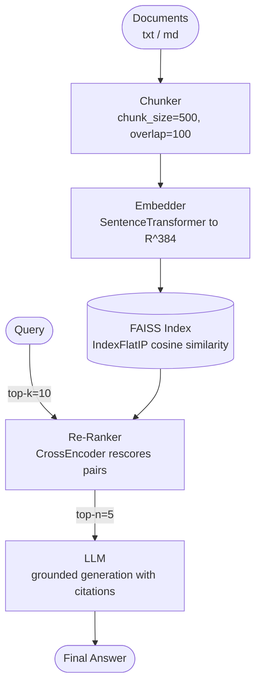

# Project: Implement a RAG Agent

## Overview

Retrieval-Augmented Generation (RAG) grounds a language model's answers in a corpus of documents so it can respond accurately to questions about private or up-to-date information. In this project you will build an end-to-end RAG agent that ingests documents, embeds them into a FAISS vector store, retrieves the most relevant chunks at query time, optionally re-ranks them, and feeds them to an LLM to produce a cited answer.

The pipeline follows four stages: **Ingest -> Embed -> Retrieve -> Generate**. By the end you will have a self-contained Python script that can answer questions over any document collection.

---

## Key Concepts

| Concept | Role in the Pipeline |
|---|---|
| Chunking | Splits documents into overlapping segments so each fits in the embedding model's context |
| Embedding | Maps text to a dense vector in $\mathbb{R}^d$; similar texts have high cosine similarity |
| FAISS index | Stores vectors and supports fast approximate nearest-neighbour search |
| Re-ranking | A cross-encoder rescores the top-$k$ results for higher precision |
| Grounded generation | The LLM sees only retrieved context, reducing hallucination |

Cosine similarity between a query vector $\mathbf{q}$ and a document vector $\mathbf{d}$ is:

$$\text{sim}(\mathbf{q}, \mathbf{d}) = \frac{\mathbf{q} \cdot \mathbf{d}}{\|\mathbf{q}\| \; \|\mathbf{d}\|}$$

We retrieve the top-$k$ chunks with the highest similarity, then optionally re-rank with a cross-encoder whose relevance score is:

$$s(q, d) = \sigma(\mathbf{w}^T \, \text{BERT}([q; d]) + b)$$

where $\sigma$ is the sigmoid function.

---

## Code Examples

### 1. Document ingestion and chunking

```python
from pathlib import Path

def load_documents(directory: str) -> list[dict]:
    """Load all .txt and .md files from a directory."""
    docs = []
    for p in Path(directory).glob("**/*"):
        if p.suffix in (".txt", ".md"):
            text = p.read_text(encoding="utf-8")
            docs.append({"source": str(p), "text": text})
    return docs


def chunk_text(text: str, chunk_size: int = 500, overlap: int = 100) -> list[str]:
    """Split text into overlapping chunks by character count."""
    chunks = []
    start = 0
    while start < len(text):
        end = start + chunk_size
        chunks.append(text[start:end])
        start += chunk_size - overlap
    return chunks


def build_corpus(directory: str) -> list[dict]:
    """Return a list of {source, chunk_index, text} dicts."""
    corpus = []
    for doc in load_documents(directory):
        for i, chunk in enumerate(chunk_text(doc["text"])):
            corpus.append({
                "source": doc["source"],
                "chunk_index": i,
                "text": chunk,
            })
    return corpus
```

### 2. Embedding and FAISS index

```python
import numpy as np
import faiss
from sentence_transformers import SentenceTransformer

EMBED_MODEL = SentenceTransformer("all-MiniLM-L6-v2")  # dimension = 384


def create_index(corpus: list[dict]) -> tuple[faiss.IndexFlatIP, np.ndarray]:
    """Embed all chunks and build a FAISS inner-product index."""
    texts = [c["text"] for c in corpus]
    embeddings = EMBED_MODEL.encode(texts, normalize_embeddings=True)
    embeddings = np.array(embeddings, dtype="float32")

    dim = embeddings.shape[1]
    index = faiss.IndexFlatIP(dim)  # inner product on normalised vecs = cosine sim
    index.add(embeddings)
    return index, embeddings


def retrieve(query: str, index: faiss.IndexFlatIP,
             corpus: list[dict], top_k: int = 10) -> list[dict]:
    """Return the top-k most similar chunks for a query."""
    q_vec = EMBED_MODEL.encode([query], normalize_embeddings=True).astype("float32")
    scores, ids = index.search(q_vec, top_k)
    results = []
    for score, idx in zip(scores[0], ids[0]):
        entry = corpus[idx].copy()
        entry["score"] = float(score)
        results.append(entry)
    return results
```

### 3. Cross-encoder re-ranking

```python
from sentence_transformers import CrossEncoder

RERANKER = CrossEncoder("cross-encoder/ms-marco-MiniLM-L-6-v2")


def rerank(query: str, results: list[dict], top_n: int = 5) -> list[dict]:
    """Re-rank retrieved chunks with a cross-encoder."""
    pairs = [(query, r["text"]) for r in results]
    scores = RERANKER.predict(pairs)
    for r, s in zip(results, scores):
        r["rerank_score"] = float(s)
    results.sort(key=lambda r: r["rerank_score"], reverse=True)
    return results[:top_n]
```

### 4. Grounded generation

```python
import openai

client = openai.OpenAI()


def generate_answer(query: str, context_chunks: list[dict]) -> str:
    """Generate an answer grounded in retrieved context."""
    context = "\n\n---\n\n".join(
        f"[Source: {c['source']}, chunk {c['chunk_index']}]\n{c['text']}"
        for c in context_chunks
    )
    resp = client.chat.completions.create(
        model="gpt-4o-mini",
        temperature=0,
        messages=[
            {"role": "system", "content": (
                "You are a helpful assistant. Answer the question using ONLY "
                "the provided context. Cite sources as [Source: filename, chunk N]. "
                "If the context does not contain the answer, say so."
            )},
            {"role": "user", "content": (
                f"Context:\n{context}\n\nQuestion: {query}"
            )},
        ],
    )
    return resp.choices[0].message.content
```

### 5. Full pipeline

```python
def rag_pipeline(query: str, docs_dir: str = "./docs") -> str:
    corpus = build_corpus(docs_dir)
    index, _ = create_index(corpus)

    # Retrieve
    candidates = retrieve(query, index, corpus, top_k=10)

    # Re-rank
    top_chunks = rerank(query, candidates, top_n=5)

    # Generate
    answer = generate_answer(query, top_chunks)
    return answer

if __name__ == "__main__":
    q = "How does the transformer attention mechanism work?"
    print(rag_pipeline(q))
```

---

## Diagrams

**RAG pipeline: ingest, embed, retrieve, generate**



---

## Exercises

1. **Hybrid search** -- Combine FAISS vector search with BM25 keyword search. Merge results using Reciprocal Rank Fusion: $\text{RRF}(d) = \sum_{r \in R} \frac{1}{k + \text{rank}_r(d)}$ with $k=60$.
2. **Chunk size experiment** -- Vary `chunk_size` in $\{200, 500, 1000\}$ and measure answer quality on 10 test questions. Report recall@5.
3. **Metadata filtering** -- Add a `date` field to each chunk and let the user filter to documents from the last 30 days before retrieval.
4. **Streaming answers** -- Use the OpenAI streaming API to print tokens as they arrive while still citing sources.
5. **Evaluation** -- Implement a simple evaluation: for each test question with a known answer, compute the ROUGE-L score between the generated answer and the reference.

---

## Further Reading

- [Retrieval-Augmented Generation for Knowledge-Intensive NLP Tasks (Lewis et al., 2020)](https://arxiv.org/abs/2005.11401)
- [FAISS: A Library for Efficient Similarity Search](https://github.com/facebookresearch/faiss)
- [Sentence Transformers Documentation](https://www.sbert.net/)
- [LlamaIndex RAG Tutorial](https://docs.llamaindex.ai/en/stable/)
