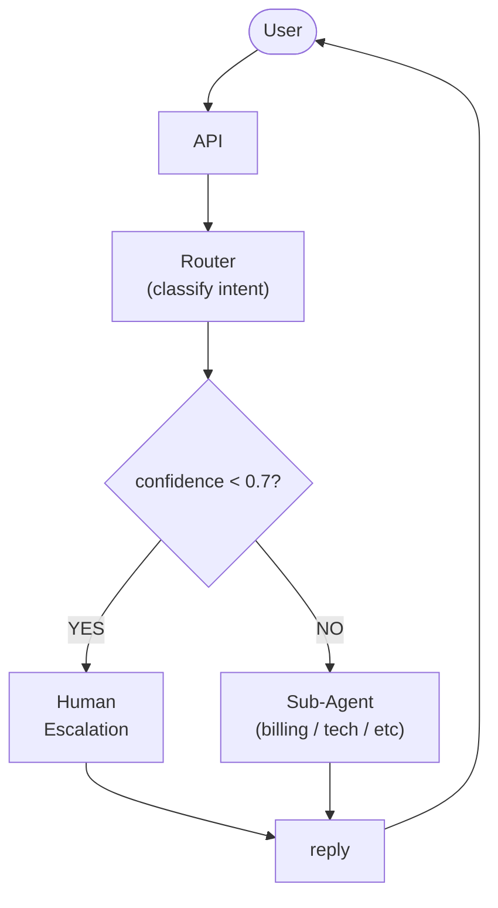
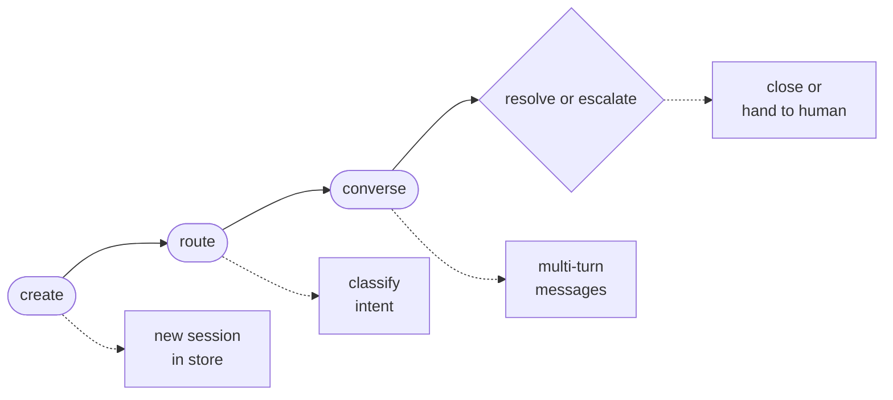

# Project: Production Customer Service Agent

## Overview

This project walks through building a **production-grade customer service agent** that handles user inquiries, performs
actions on their account, and escalates to human operators when confidence is low. The system covers session management
(multi-turn memory), hand-off logic (transferring between specialised sub-agents), escalation rules, and deployment
behind a FastAPI server. By the end you will have a deployable service that handles realistic support conversations.

Production agents differ from prototypes in several ways: they must be stateful across turns, respect rate limits, log
every interaction for auditing, handle errors gracefully, and know when to stop and call a human.

---

## Key Concepts

| Concept | Why It Matters |
|---|---|
| Session management | Maintains conversation history per user across HTTP requests |
| Intent classification | Routes the user to the right sub-agent (billing, technical, general) |
| Confidence gating | Escalates when $P(\text{intent}) < \theta$ to avoid bad answers |
| Hand-off protocol | Transfers context from one sub-agent to another or to a human |
| Guardrails | Prevents the agent from executing dangerous actions without confirmation |

The escalation decision uses a confidence threshold $\theta$. Given the model's softmax output over intents, if the
maximum probability falls below $\theta$ we escalate:

$$\text{escalate} = \begin{cases} \text{true} & \text{if } \max_i P(\text{intent}_i) < \theta \\ \text{false} & \text{otherwise} \end{cases}$$

A typical production value is $\theta = 0.70$.

---

## Code Examples

### 1. Session store

```python
import time
from dataclasses import dataclass, field

@dataclass
class Session:
    session_id: str
    user_id: str
    messages: list[dict] = field(default_factory=list)
    current_agent: str = "router"
    created_at: float = field(default_factory=time.time)
    escalated: bool = False

class SessionStore:
    """In-memory session store. Replace with Redis for production."""

    def __init__(self, ttl: int = 3600):
        self._store: dict[str, Session] = {}
        self._ttl = ttl

    def get_or_create(self, session_id: str, user_id: str) -> Session:
        if session_id in self._store:
            s = self._store[session_id]
            if time.time() - s.created_at > self._ttl:
                del self._store[session_id]
            else:
                return s
        s = Session(session_id=session_id, user_id=user_id)
        self._store[session_id] = s
        return s

    def save(self, session: Session):
        self._store[session.session_id] = session
```

### 2. Intent router and confidence gating

```python
import openai, json

client = openai.OpenAI()

INTENTS = ["billing", "technical_support", "general_inquiry", "account_action"]
CONFIDENCE_THRESHOLD = 0.70

def classify_intent(user_message: str) -> tuple[str, float]:
    """Classify user intent and return (intent, confidence)."""
    resp = client.chat.completions.create(
        model="gpt-4o-mini",
        temperature=0,
        messages=[
            {"role": "system", "content": (
                f"Classify the user message into one of: {INTENTS}. "
                "Respond with JSON: {\"intent\": \"...\", \"confidence\": 0.0-1.0}"
            )},
            {"role": "user", "content": user_message},
        ],
    )
    parsed = json.loads(resp.choices[0].message.content)
    return parsed["intent"], parsed["confidence"]
```

### 3. Sub-agents

```python
AGENT_PROMPTS = {
    "billing": (
        "You are a billing support agent. You can look up invoices, "
        "explain charges, and process refunds. Always confirm before "
        "taking any action that modifies the account."
    ),
    "technical_support": (
        "You are a technical support agent. Help users troubleshoot "
        "product issues step by step. If the issue requires engineering "
        "escalation, say ESCALATE."
    ),
    "general_inquiry": (
        "You are a friendly support agent who answers general questions "
        "about the company, products, and policies."
    ),
    "account_action": (
        "You are an account management agent. You can update profile "
        "information, reset passwords, and manage subscriptions. "
        "ALWAYS ask for confirmation before making changes."
    ),
}

MOCK_TOOLS = {
    "lookup_invoice": lambda uid, inv_id: {"amount": 49.99, "status": "paid"},
    "process_refund": lambda uid, inv_id: {"status": "refunded", "amount": 49.99},
    "reset_password": lambda uid: {"status": "reset_email_sent"},
}

async def run_sub_agent(session: Session, user_message: str) -> str:
    """Run the sub-agent assigned to this session."""
    agent_name = session.current_agent
    system_prompt = AGENT_PROMPTS.get(agent_name, AGENT_PROMPTS["general_inquiry"])

    session.messages.append({"role": "user", "content": user_message})

    resp = client.chat.completions.create(
        model="gpt-4o-mini",
        temperature=0.3,
        messages=[
            {"role": "system", "content": system_prompt},
            *session.messages,
        ],
    )
    reply = resp.choices[0].message.content
    session.messages.append({"role": "assistant", "content": reply})

    # Check for escalation signal
    if "ESCALATE" in reply.upper():
        session.escalated = True
        return (
            "I'm connecting you with a human agent who can help further. "
            "Please hold on -- your conversation history has been forwarded."
        )

    return reply
```

### 4. FastAPI deployment

```python
from fastapi import FastAPI, HTTPException
from pydantic import BaseModel
import uuid

app = FastAPI(title="Customer Service Agent")
store = SessionStore()

class ChatRequest(BaseModel):
    session_id: str | None = None
    user_id: str
    message: str

class ChatResponse(BaseModel):
    session_id: str
    reply: str
    escalated: bool

@app.post("/chat", response_model=ChatResponse)
async def chat(req: ChatRequest):
    sid = req.session_id or uuid.uuid4().hex
    session = store.get_or_create(sid, req.user_id)

    if session.escalated:
        raise HTTPException(400, "Session already escalated to a human agent.")

    # Route on first message or if agent is still the router
    if session.current_agent == "router":
        intent, confidence = classify_intent(req.message)
        if confidence < CONFIDENCE_THRESHOLD:
            session.escalated = True
            store.save(session)
            return ChatResponse(
                session_id=sid,
                reply="Let me connect you to a human agent for the best help.",
                escalated=True,
            )
        session.current_agent = intent

    reply = await run_sub_agent(session, req.message)
    store.save(session)
    return ChatResponse(session_id=sid, reply=reply, escalated=session.escalated)

@app.get("/session/{session_id}")
async def get_session(session_id: str):
    if session_id not in store._store:
        raise HTTPException(404, "Session not found.")
    s = store._store[session_id]
    return {"session_id": s.session_id, "messages": s.messages,
            "agent": s.current_agent, "escalated": s.escalated}
```

### 5. Running the server

```bash
# Install dependencies
pip install fastapi uvicorn openai

# Start the server
uvicorn service:app --host 0.0.0.0 --port 8000 --reload

# Test with curl
curl -X POST http://localhost:8000/chat \
  -H "Content-Type: application/json" \
  -d '{"user_id": "u123", "message": "I was charged twice for my subscription"}'
```

---

## Diagrams

**Request flow with confidence-gated escalation**



**Session Lifecycle**



---

## Exercises

1. **Redis sessions** -- Replace `SessionStore` with a Redis-backed store using `redis-py`. Set a TTL of 1 hour on each key.
2. **Rate limiting** -- Add a middleware that limits each `user_id` to 20 messages per minute. Return HTTP 429 when exceeded.
3. **Audit logging** -- Write every request and response to a structured JSON log file. Include timestamps, session ID, intent, and token counts.
4. **Hand-off between sub-agents** -- Allow the billing agent to transfer the session to technical support mid-conversation if the user's issue changes.
5. **Sentiment monitoring** -- After each user message, compute a sentiment score $s \in [-1, 1]$. If $s < -0.6$ for two consecutive turns, auto-escalate.

---

## Further Reading

- [FastAPI Documentation](https://fastapi.tiangolo.com/)
- [Building LLM-Powered Customer Support (Anthropic Cookbook)](https://github.com/anthropics/anthropic-cookbook)
- [Designing Robust AI Agents for Customer Service (Google Cloud Blog)](https://cloud.google.com/blog/products/ai-machine-learning)
- [Guardrails AI](https://www.guardrailsai.com/)
