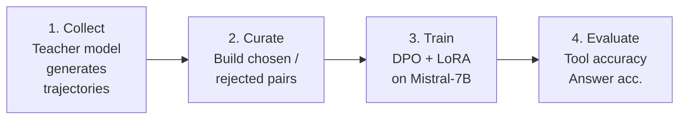
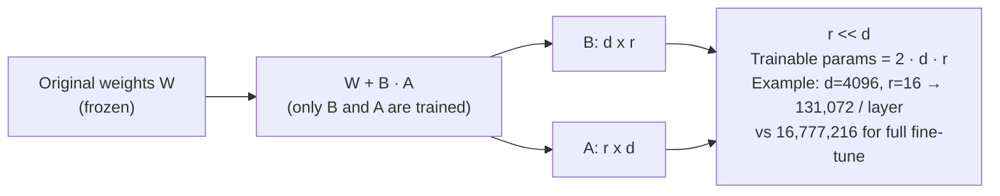

# Project: Fine-Tune an LLM for Agent Tasks

## Overview

General-purpose LLMs can follow tool-use instructions, but a fine-tuned model that has seen thousands of agent
trajectories will be faster, cheaper, and more reliable at selecting the right tool and formatting the right arguments.
In this project you will collect agent trajectories from a teacher model, convert them into training data, fine-tune a
smaller student model using **Direct Preference Optimisation (DPO)**, and evaluate the result on a held-out benchmark.

The workflow has four stages: **Collect -> Curate -> Train -> Evaluate**. By the end you will have a reproducible
pipeline that turns a 7B-parameter open-weight model into a capable agent backbone.

## Key Concepts

| Concept | Description |
|---|---|
| Agent trajectories | Sequences of (thought, action, observation) tuples recorded from a teacher model |
| Preference pairs | For each prompt, a *chosen* (correct) trajectory and a *rejected* (incorrect) one |
| DPO | Trains the policy directly from preferences without a separate reward model |
| LoRA | Low-Rank Adaptation -- fine-tunes only small adapter matrices, keeping most weights frozen |

### DPO loss

Given a prompt $x$, a preferred completion $y_w$ and a dispreferred completion $y_l$, the DPO loss is:

$$\mathcal{L}_{\text{DPO}}(\pi_\theta; \pi_{\text{ref}}) = -\mathbb{E}_{(x, y_w, y_l)} \left[ \log \sigma \left( \beta \log \frac{\pi_\theta(y_w | x)}{\pi_{\text{ref}}(y_w | x)} - \beta \log \frac{\pi_\theta(y_l | x)}{\pi_{\text{ref}}(y_l | x)} \right) \right]$$

where $\pi_\theta$ is the model being trained, $\pi_{\text{ref}}$ is the frozen reference model, $\sigma$ is the
sigmoid, and $\beta$ controls the strength of the KL constraint (typically $\beta = 0.1$).

### LoRA parameterisation

Instead of updating the full weight matrix $W \in \mathbb{R}^{d \times d}$, LoRA decomposes the update as:

$$W' = W + \Delta W = W + BA, \quad B \in \mathbb{R}^{d \times r}, \; A \in \mathbb{R}^{r \times d}$$

with rank $r \ll d$. This reduces trainable parameters from $d^2$ to $2dr$.

## Code Examples

### 1. Collect trajectories from a teacher model

```python
import json, openai

client = openai.OpenAI()

TOOLS_SPEC = [
    {"name": "search", "description": "Web search", "parameters": {"query": "string"}},
    {"name": "calculator", "description": "Math eval", "parameters": {"expr": "string"}},
    {"name": "lookup", "description": "KB lookup", "parameters": {"topic": "string"}},
]

SYSTEM = (
    "You are an agent. On each turn output JSON: "
    "{\"thought\": ..., \"action\": ..., \"input\": ...} or {\"thought\": ..., \"answer\": ...}."
)


def collect_trajectory(question: str, max_steps: int = 6) -> list[dict]:
    """Run the teacher and record every step."""
    messages = [
        {"role": "system", "content": SYSTEM},
        {"role": "user", "content": question},
    ]
    trajectory = []

    for _ in range(max_steps):
        resp = client.chat.completions.create(
            model="gpt-4o", messages=messages, temperature=0
        )
        text = resp.choices[0].message.content
        messages.append({"role": "assistant", "content": text})
        step = json.loads(text)
        trajectory.append(step)

        if "answer" in step:
            break

        # Simulate tool execution (replace with real tools)
        observation = f"Mock result for {step.get('action')}({step.get('input')})"
        messages.append({"role": "user", "content": f"Observation: {observation}"})
        trajectory.append({"observation": observation})

    return trajectory


def collect_dataset(questions: list[str], output_path: str = "trajectories.jsonl"):
    """Collect trajectories for a list of questions."""
    with open(output_path, "w") as f:
        for q in questions:
            traj = collect_trajectory(q)
            f.write(json.dumps({"question": q, "trajectory": traj}) + "\n")
    print(f"Saved {len(questions)} trajectories to {output_path}")
```

### 2. Build DPO preference pairs

```python
def build_preference_pairs(trajectory_path: str, output_path: str):
    """
    For each trajectory, the teacher's trajectory is 'chosen'.
    We create a 'rejected' version by corrupting one tool call.
    """
    import random

    pairs = []
    with open(trajectory_path) as f:
        for line in f:
            entry = json.loads(line)
            q = entry["question"]
            traj = entry["trajectory"]

            chosen = json.dumps(traj)

            # Create rejected: swap one action to a wrong tool
            rejected_traj = []
            for step in traj:
                step_copy = dict(step)
                if "action" in step_copy and random.random() < 0.5:
                    wrong = random.choice(["search", "calculator", "lookup"])
                    step_copy["action"] = wrong
                rejected_traj.append(step_copy)
            rejected = json.dumps(rejected_traj)

            pairs.append({
                "prompt": f"Question: {q}",
                "chosen": chosen,
                "rejected": rejected,
            })

    with open(output_path, "w") as f:
        for p in pairs:
            f.write(json.dumps(p) + "\n")
    print(f"Created {len(pairs)} preference pairs in {output_path}")
```

### 3. Fine-tune with DPO using TRL

```python
# train_dpo.py
from datasets import load_dataset
from transformers import AutoModelForCausalLM, AutoTokenizer
from peft import LoraConfig
from trl import DPOConfig, DPOTrainer

MODEL_NAME = "mistralai/Mistral-7B-Instruct-v0.2"
DATA_PATH = "preference_pairs.jsonl"

# Load model and tokenizer
tokenizer = AutoTokenizer.from_pretrained(MODEL_NAME)
tokenizer.pad_token = tokenizer.eos_token

model = AutoModelForCausalLM.from_pretrained(
    MODEL_NAME,
    torch_dtype="auto",
    device_map="auto",
)

# LoRA config -- rank 16 keeps memory under 24 GB on a single GPU
peft_config = LoraConfig(
    r=16,
    lora_alpha=32,
    lora_dropout=0.05,
    target_modules=["q_proj", "v_proj", "k_proj", "o_proj"],
    task_type="CAUSAL_LM",
)

# Load dataset
dataset = load_dataset("json", data_files=DATA_PATH, split="train")

# DPO training config
training_args = DPOConfig(
    output_dir="./dpo_agent_model",
    num_train_epochs=3,
    per_device_train_batch_size=2,
    gradient_accumulation_steps=8,
    learning_rate=5e-6,
    beta=0.1,                # KL penalty strength
    logging_steps=10,
    save_strategy="epoch",
    bf16=True,
    remove_unused_columns=False,
)

# Train
trainer = DPOTrainer(
    model=model,
    ref_model=None,          # TRL creates an implicit ref from the base model
    args=training_args,
    train_dataset=dataset,
    processing_class=tokenizer,
    peft_config=peft_config,
)

trainer.train()
trainer.save_model("./dpo_agent_model/final")
print("Training complete.")
```

### 4. Evaluation pipeline

```python
from transformers import pipeline

agent_pipe = pipeline(
    "text-generation",
    model="./dpo_agent_model/final",
    tokenizer=MODEL_NAME,
    device_map="auto",
)


def evaluate(test_questions: list[dict]) -> dict:
    """
    Each test item: {"question": ..., "expected_tool": ..., "expected_answer": ...}
    Returns accuracy metrics.
    """
    correct_tool = 0
    correct_answer = 0
    total = len(test_questions)

    for item in test_questions:
        prompt = f"Question: {item['question']}"
        output = agent_pipe(prompt, max_new_tokens=512, temperature=0)[0]["generated_text"]

        try:
            parsed = json.loads(output.split("Question:")[-1].strip())
        except json.JSONDecodeError:
            continue

        # Check first tool call
        if parsed.get("action") == item["expected_tool"]:
            correct_tool += 1
        if parsed.get("answer", "").strip() == item["expected_answer"].strip():
            correct_answer += 1

    return {
        "tool_accuracy": correct_tool / total,
        "answer_accuracy": correct_answer / total,
        "total": total,
    }
```

## Diagrams

**Pipeline Overview**



**LoRA Weight Update**



## Exercises

1. **Scaling the dataset** -- Collect 1,000 trajectories across diverse question types. Measure how tool accuracy improves with dataset size by training on 100, 500, and 1,000 examples. Plot the learning curve.
2. **Reward model comparison** -- Instead of DPO, train a separate reward model using the Bradley-Terry objective: $P(y_w \succ y_l) = \sigma(r(x, y_w) - r(x, y_l))$. Compare final agent quality against DPO.
3. **Multi-step evaluation** -- Extend the evaluation to measure whether the full trajectory (not just the first tool call) is correct. Define trajectory accuracy as $\text{acc}_{\text{traj}} = \frac{\text{correct trajectories}}{\text{total}}$.
4. **Rank ablation** -- Train with LoRA ranks $r \in \{4, 8, 16, 32\}$. Report tool accuracy and training time for each. Find the best trade-off.
5. **Deployment** -- Serve the fine-tuned model with vLLM behind a FastAPI endpoint. Benchmark latency (tokens per second) versus the teacher model.

## Further Reading

- [DPO: Direct Preference Optimization (Rafailov et al., 2023)](https://arxiv.org/abs/2305.18290)
- [LoRA: Low-Rank Adaptation of Large Language Models (Hu et al., 2021)](https://arxiv.org/abs/2106.09685)
- [TRL: Transformer Reinforcement Learning Library](https://huggingface.co/docs/trl/)
- [FireAct: Toward Language Agent Fine-Tuning (Chen et al., 2023)](https://arxiv.org/abs/2310.05915)
- [AgentTuning: Enabling Generalized Agent Abilities (Zeng et al., 2023)](https://arxiv.org/abs/2310.12823)
