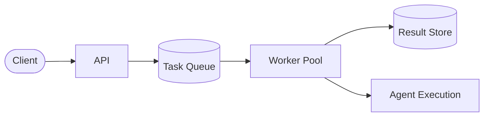

# Project: Deploy an Agent to Production

## Overview

Building an AI agent is only half the challenge -- deploying it reliably is the other half. This project walks through
the full production deployment pipeline: wrapping your agent in an API, containerizing it with Docker, adding rate
limiting and monitoring, implementing health checks, and preparing for scale. By the end, you will have a
production-ready deployment configuration.

## Step 1: API Wrapper with FastAPI

First, wrap your agent in a REST API. FastAPI provides async support, automatic OpenAPI docs, and excellent performance.

```python
# app/main.py
from fastapi import FastAPI, HTTPException, Request
from fastapi.middleware.cors import CORSMiddleware
from pydantic import BaseModel
from contextlib import asynccontextmanager
import logging
import time
import uuid

from app.agent import Agent

logger = logging.getLogger(__name__)

# Global agent instance
agent: Agent | None = None

@asynccontextmanager
async def lifespan(app: FastAPI):
    """Initialize agent on startup, cleanup on shutdown."""
    global agent
    logger.info("Initializing agent...")
    agent = Agent()
    await agent.initialize()
    logger.info("Agent ready.")
    yield
    # Graceful shutdown
    logger.info("Shutting down agent...")
    await agent.shutdown()
    logger.info("Agent shutdown complete.")

app = FastAPI(
    title="AI Agent API",
    version="1.0.0",
    lifespan=lifespan,
)

app.add_middleware(
    CORSMiddleware,
    allow_origins=["*"],
    allow_methods=["POST", "GET"],
    allow_headers=["*"],
)

class QueryRequest(BaseModel):
    message: str
    session_id: str | None = None
    max_steps: int = 10

class QueryResponse(BaseModel):
    response: str
    request_id: str
    steps_taken: int
    latency_ms: float

@app.post("/agent/query", response_model=QueryResponse)
async def query_agent(request: QueryRequest):
    request_id = str(uuid.uuid4())
    start = time.perf_counter()

    try:
        result = await agent.run(
            message=request.message,
            session_id=request.session_id,
            max_steps=request.max_steps,
        )
    except Exception as e:
        logger.error(f"Agent error [{request_id}]: {e}")
        raise HTTPException(status_code=500, detail="Agent execution failed")

    latency_ms = (time.perf_counter() - start) * 1000
    logger.info(f"[{request_id}] completed in {latency_ms:.1f}ms")

    return QueryResponse(
        response=result.text,
        request_id=request_id,
        steps_taken=result.steps,
        latency_ms=latency_ms,
    )
```

## Step 2: Health Checks

Production services need health endpoints for load balancers and orchestrators:

```python
# app/health.py
from fastapi import APIRouter
from datetime import datetime

router = APIRouter()

startup_time = datetime.utcnow()

@router.get("/health")
async def health_check():
    """Liveness probe -- is the process running?"""
    return {"status": "healthy", "uptime_seconds": (datetime.utcnow() - startup_time).total_seconds()}

@router.get("/ready")
async def readiness_check():
    """Readiness probe -- is the agent ready to serve requests?"""
    from app.main import agent
    if agent is None or not agent.is_ready:
        return {"status": "not_ready"}, 503
    return {"status": "ready"}
```

Register the router in `main.py`:

```python
from app.health import router as health_router
app.include_router(health_router)
```

## Step 3: Rate Limiting

Protect your service from abuse and manage costs with token-bucket rate limiting:

```python
# app/rate_limit.py
from fastapi import Request, HTTPException
from collections import defaultdict
import time

class RateLimiter:
    """Token bucket rate limiter per client IP."""

    def __init__(self, requests_per_minute: int = 20):
        self.rpm = requests_per_minute
        self.buckets: dict[str, dict] = defaultdict(
            lambda: {"tokens": requests_per_minute, "last_refill": time.time()}
        )

    def check(self, client_ip: str) -> bool:
        bucket = self.buckets[client_ip]
        now = time.time()
        # Refill tokens based on elapsed time
        elapsed = now - bucket["last_refill"]
        bucket["tokens"] = min(
            self.rpm,
            bucket["tokens"] + elapsed * (self.rpm / 60.0)
        )
        bucket["last_refill"] = now

        if bucket["tokens"] >= 1:
            bucket["tokens"] -= 1
            return True
        return False

rate_limiter = RateLimiter(requests_per_minute=20)

async def rate_limit_middleware(request: Request, call_next):
    client_ip = request.client.host
    if not rate_limiter.check(client_ip):
        raise HTTPException(status_code=429, detail="Rate limit exceeded")
    return await call_next(request)
```

The token bucket algorithm refills at rate $r$ tokens per second. A request is allowed if tokens $\geq 1$:

$$\text{tokens}(t) = \min\left(B,\ \text{tokens}(t_{\text{last}}) + r \cdot (t - t_{\text{last}})\right)$$

where $B$ is the bucket capacity (burst limit).

## Step 4: Monitoring and Logging

Structured logging and metrics are essential for debugging production issues:

```python
# app/monitoring.py
import logging
import json
from datetime import datetime

class JSONFormatter(logging.Formatter):
    def format(self, record):
        log_entry = {
            "timestamp": datetime.utcnow().isoformat(),
            "level": record.levelname,
            "message": record.getMessage(),
            "module": record.module,
        }
        if hasattr(record, "request_id"):
            log_entry["request_id"] = record.request_id
        return json.dumps(log_entry)

def setup_logging():
    handler = logging.StreamHandler()
    handler.setFormatter(JSONFormatter())
    logging.root.handlers = [handler]
    logging.root.setLevel(logging.INFO)
```

For metrics, export Prometheus-compatible counters:

```python
# Track key metrics
from prometheus_client import Counter, Histogram

REQUEST_COUNT = Counter("agent_requests_total", "Total requests", ["status"])
REQUEST_LATENCY = Histogram("agent_request_duration_seconds", "Request latency")
AGENT_STEPS = Histogram("agent_steps_per_request", "Steps taken per request")
```

## Step 5: Containerization with Docker

```dockerfile
# Dockerfile
FROM python:3.11-slim AS base

WORKDIR /app

# Install dependencies
COPY requirements.txt .
RUN pip install --no-cache-dir -r requirements.txt

# Copy application code
COPY app/ ./app/

# Create non-root user
RUN useradd --create-home appuser
USER appuser

# Health check
HEALTHCHECK --interval=30s --timeout=5s --retries=3 \
    CMD curl -f http://localhost:8000/health || exit 1

EXPOSE 8000

CMD ["uvicorn", "app.main:app", "--host", "0.0.0.0", "--port", "8000", "--workers", "2"]
```

Build and run:

```bash
docker build -t ai-agent:latest .
docker run -p 8000:8000 --env-file .env ai-agent:latest
```

## Step 6: Graceful Shutdown

Agents may be mid-execution when a shutdown signal arrives. Handle it gracefully:

```python
# In the Agent class
import asyncio
import signal

class Agent:
    def __init__(self):
        self.active_tasks: set[asyncio.Task] = set()
        self.shutting_down = False

    async def shutdown(self, timeout: float = 30.0):
        """Wait for active tasks to complete before shutting down."""
        self.shutting_down = True
        if self.active_tasks:
            logger.info(f"Waiting for {len(self.active_tasks)} active tasks...")
            done, pending = await asyncio.wait(
                self.active_tasks, timeout=timeout
            )
            if pending:
                logger.warning(f"Force-cancelling {len(pending)} tasks")
                for task in pending:
                    task.cancel()
```

## Step 7: Deployment Configuration

Use Docker Compose for local development and testing:

```yaml
# docker-compose.yml
version: "3.8"

services:
  agent:
    build: .
    ports:
      - "8000:8000"
    environment:
      - OPENAI_API_KEY=${OPENAI_API_KEY}
      - LOG_LEVEL=INFO
      - MAX_CONCURRENT_REQUESTS=10
    deploy:
      resources:
        limits:
          memory: 2G
          cpus: "2.0"
    restart: unless-stopped

  redis:
    image: redis:7-alpine
    ports:
      - "6379:6379"

  prometheus:
    image: prom/prometheus
    volumes:
      - ./prometheus.yml:/etc/prometheus/prometheus.yml
    ports:
      - "9090:9090"
```

## Step 8: Scaling Strategies

For production scale, consider:

**Horizontal scaling**: Run multiple container replicas behind a load balancer. Agent requests are stateless (session state in Redis), so any replica can handle any request.

**Queue-based architecture**: For long-running agent tasks, use a task queue (Celery, Bull) so requests do not time out:



**Auto-scaling rules**: Scale based on queue depth or latency percentiles:

$$\text{desired\_replicas} = \left\lceil \frac{\text{queue\_depth}}{\text{target\_per\_worker}} \right\rceil$$

## Deployment Checklist

- [ ] API endpoints tested with integration tests
- [ ] Health and readiness probes configured
- [ ] Rate limiting active (per-IP and global)
- [ ] Structured JSON logging enabled
- [ ] Metrics exported (latency, error rate, step count)
- [ ] Docker image builds and runs locally
- [ ] Secrets managed via environment variables (never in image)
- [ ] Graceful shutdown handles in-flight requests
- [ ] Resource limits set (memory, CPU)
- [ ] Auto-scaling rules defined

---

## Key Takeaways

- Wrap agents in async APIs (FastAPI) for concurrent request handling
- Health checks enable orchestrators to manage service lifecycle
- Rate limiting protects both your infrastructure and your LLM budget
- Structured logging and metrics are non-negotiable for debugging production issues
- Graceful shutdown prevents data loss during deployments
- Scale horizontally with stateless design and external session storage

## Exercises

1. **Containerize an Existing Agent**: Take any agent you've built in previous projects and wrap it in a FastAPI app with health checks and rate limiting. Verify it runs inside a Docker container.

2. **Add Structured Logging**: Add request correlation IDs (pass a `X-Request-ID` header through all log entries). Add a log aggregation pipeline: ship logs to a local file, then use `docker-compose` with a Logstash or Loki sidecar to visualize them.

3. **Implement Readiness Probe**: Extend the readiness probe to check external dependencies (Redis connection, LLM API availability). Simulate a dependency failure and verify the probe returns 503.

4. **Load Test**: Use `locust` or `wrk` to load test your deployed agent. Measure latency at 10, 50, and 100 concurrent requests. Identify the bottleneck (CPU, memory, LLM API rate limits, or network I/O).

5. **Build Auto-Scaling Config**: Write a Kubernetes `HorizontalPodAutoscaler` manifest that scales based on queue depth or request latency. Deploy to minikube or kind for local testing.

## Further Reading

- FastAPI deployment docs: [https://fastapi.tiangolo.com/deployment/](https://fastapi.tiangolo.com/deployment/) — official production deployment guide.
- Docker best practices: [https://docs.docker.com/develop/develop-images/dockerfile_best-practices/](https://docs.docker.com/develop/develop-images/dockerfile_best-practices/) — secure and efficient image builds.
- Prometheus metrics: [https://prometheus.io/docs/concepts/data_model/](https://prometheus.io/docs/concepts/data_model/) — metric types and naming conventions.
- Kubernetes production guide: [https://kubernetes.io/docs/concepts/workloads/controllers/deployment/](https://kubernetes.io/docs/concepts/workloads/controllers/deployment/) — deployment strategies and rolling updates.
- OpenTelemetry for distributed tracing: [https://opentelemetry.io/](https://opentelemetry.io/) — observability beyond metrics and logs.

