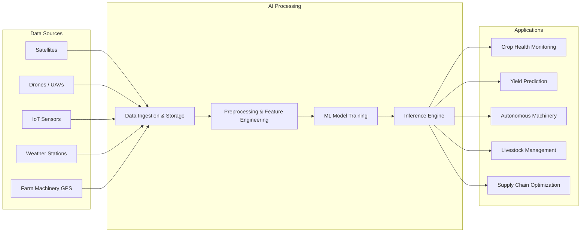

# Introduction to AI for Agriculture

## Overview

Agriculture is the foundation of human civilization, and today it faces unprecedented challenges. The global population is projected to reach nearly 10 billion by 2050, demanding a roughly 70% increase in food production according to the Food and Agriculture Organization (FAO). Meanwhile, climate change is intensifying droughts, floods, and pest outbreaks, while arable land is shrinking due to urbanization and soil degradation. Artificial intelligence (AI) has emerged as one of the most promising tools to address these intersecting crises.

The intersection of AI and agriculture is not entirely new. Early computer-aided farming dates back to the 1980s, when expert systems were first used to advise farmers on crop management decisions. These rule-based systems encoded agronomic knowledge into software that could recommend fertilizer rates or pest treatments. However, they were brittle, expensive, and limited to narrow domains. The modern era of AI in agriculture began in the 2010s, fueled by three converging trends: the explosion of farm-generated data (from sensors, satellites, and machinery), dramatic improvements in machine learning algorithms (especially deep learning), and the falling cost of computing hardware including GPUs and edge devices.

At its core, **precision agriculture** is the practice of managing field variability to optimize crop production while minimizing waste and environmental impact. AI supercharges precision agriculture by enabling machines to perceive, reason, and act on complex agricultural data at scales no human could match. Rather than treating an entire field uniformly, AI-driven systems can make decisions at the level of individual plants or even individual leaves.

The key application areas of AI in agriculture span the entire farming value chain:

**Crop Monitoring and Disease Detection.** Computer vision models trained on drone and satellite imagery can detect nutrient deficiencies, water stress, and disease symptoms days or weeks before they become visible to the human eye. Convolutional neural networks (CNNs) have achieved over 99% accuracy on benchmark plant disease datasets such as PlantVillage, enabling smartphone-based diagnosis accessible even to smallholder farmers in developing nations.

**Yield Prediction and Forecasting.** Machine learning models that fuse weather data, soil measurements, satellite vegetation indices, and historical yield records can predict crop yields at field, regional, and national scales. These predictions help farmers plan harvest logistics, help commodity traders manage risk, and help governments anticipate food shortages.

**Autonomous Machinery and Robotics.** Self-driving tractors equipped with GPS-RTK guidance systems can plant, spray, and harvest with centimeter-level precision. Smaller robots are being developed for targeted weeding (using real-time image classification to distinguish crops from weeds), fruit picking, and phenotyping in plant breeding programs.

**Livestock Management.** AI-powered systems monitor animal health and behavior through wearable sensors, camera-based activity recognition, and acoustic analysis. These tools can detect lameness, estrus, and illness early, improving animal welfare and farm productivity simultaneously.

**Supply Chain and Market Optimization.** Beyond the farm gate, AI helps optimize post-harvest logistics, predict market prices, reduce food waste through demand forecasting, and match smallholder producers with buyers through digital marketplace platforms.

The economic impact is substantial. McKinsey estimates that AI-driven agriculture could generate $100 billion or more in additional value annually across the global food system by 2030. Environmental benefits are equally significant: precision application of fertilizers and pesticides reduces chemical runoff into waterways, optimized irrigation conserves water in drought-prone regions, and better land-use planning can help preserve biodiversity.

Despite this promise, significant challenges remain. Data availability and quality vary enormously across regions and crop types. Many AI models trained on data from large-scale mechanized farms in North America or Europe do not transfer well to the diverse cropping systems of sub-Saharan Africa or South Asia. Connectivity is another barrier -- many rural areas lack the internet bandwidth needed for cloud-based AI services, motivating research into edge AI that can run models directly on low-power devices in the field. Finally, questions of data ownership, algorithmic transparency, and equitable access must be addressed to ensure that AI benefits all farmers, not just the largest and wealthiest.

This lesson series will guide you from these foundational concepts through the data, algorithms, and practical tools that make AI for agriculture possible.

## Key Concepts

- **Precision Agriculture**: A farm management strategy that uses information technology and data analytics to observe, measure, and respond to variability within and between fields, optimizing inputs such as water, fertilizer, and pesticides on a site-specific basis.
- **Remote Sensing**: The acquisition of information about crops, soil, and terrain using sensors mounted on satellites, aircraft, or drones, without making physical contact with the surface. Common data products include multispectral and hyperspectral imagery.
- **Computer Vision**: A subfield of AI that trains machines to interpret visual data such as images and video. In agriculture, it is used for plant disease classification, weed detection, fruit counting, and crop row guidance.
- **Yield Prediction**: The use of statistical or machine learning models to estimate the quantity of crop that will be harvested from a given area, typically combining weather, soil, genetic, and management variables.
- **Edge AI**: Running AI inference on local hardware (e.g., embedded processors on a tractor or drone) rather than sending data to the cloud, enabling real-time decision-making in areas with limited connectivity.
- **Vegetation Index**: A mathematical combination of spectral reflectance bands that highlights plant health. The most common is the Normalized Difference Vegetation Index (NDVI), defined as $NDVI = \frac{NIR - Red}{NIR + Red}$.

## Technical Details

At a beginner level, the most important technical concept is understanding how data flows from the field to a decision. Agricultural AI systems generally follow a pipeline:

1. **Data Collection** -- sensors capture raw measurements (images, soil moisture, temperature, GPS coordinates).
2. **Preprocessing** -- raw data is cleaned, georeferenced, and transformed into analysis-ready formats (e.g., ortho-mosaics from drone images, time-series from IoT sensors).
3. **Feature Engineering / Extraction** -- meaningful variables are derived, such as vegetation indices from multispectral bands or texture features from RGB images.
4. **Model Training** -- a machine learning model learns the relationship between input features and a target variable (e.g., disease class, expected yield).
5. **Inference and Decision Support** -- the trained model is deployed to make predictions on new data, and results are presented to the farmer or fed into an automated control system.

A simple vegetation index calculation in Python:

```python
import numpy as np

# Simulated reflectance values from a multispectral sensor
nir_band = np.array([[0.45, 0.50], [0.42, 0.48]])  # Near-infrared reflectance
red_band = np.array([[0.10, 0.12], [0.15, 0.11]])   # Red reflectance

# Compute NDVI
ndvi = (nir_band - red_band) / (nir_band + red_band)
print("NDVI:\n", ndvi)
# Healthy vegetation typically has NDVI > 0.3
```

## Diagrams

**AI Agriculture Ecosystem**



## Exercises/Projects

1. **Research Exercise**: Pick a crop grown in your region. List three specific challenges that farmers face with that crop (e.g., a common disease, water scarcity, labor shortages) and describe how AI could address each one.
2. **NDVI Calculation**: Using the Python snippet above, modify the reflectance arrays to simulate a field with one healthy quadrant and one stressed quadrant. Visualize the NDVI map using `matplotlib.pyplot.imshow()`.
3. **News Analysis**: Find a recent news article (published in the last 12 months) about an AI-agriculture startup or research project. Summarize the problem being solved, the AI technique used, and the reported results.
4. **Concept Map**: Draw your own diagram (on paper or digitally) showing how data flows from a sensor on a farm to an actionable recommendation for the farmer. Include at least five steps.

## Further Reading

- Liakos, K. G., et al. (2018). "Machine Learning in Agriculture: A Review." *Sensors*, 18(8), 2674. [DOI: 10.3390/s18082674](https://doi.org/10.3390/s18082674)
- Kamilaris, A., & Prenafeta-Boldu, F. X. (2018). "Deep Learning in Agriculture: A Survey." *Computers and Electronics in Agriculture*, 147, 70-90.
- FAO (2022). "The State of Food and Agriculture 2022: Leveraging Automation in Agriculture for Transforming Agrifood Systems." [fao.org](https://www.fao.org/)
- Wolfert, S., et al. (2017). "Big Data in Smart Farming -- A Review." *Agricultural Systems*, 153, 69-80.
