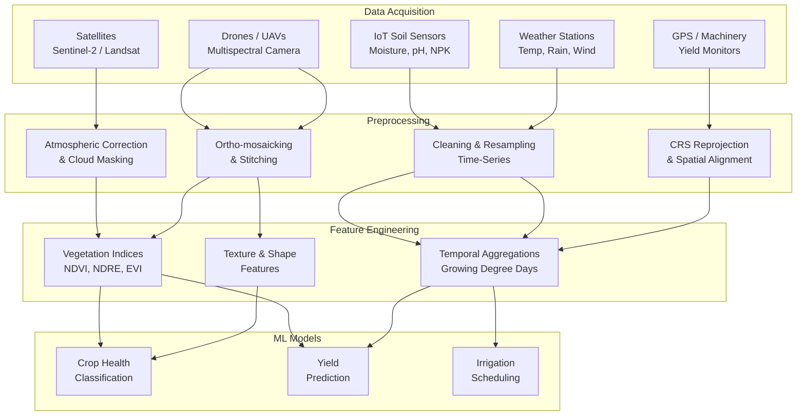

# Agricultural Data and Remote Sensing

## Overview

Modern agricultural AI is only as good as the data it consumes. Understanding where agricultural data comes from, how it is captured, and how to preprocess it for machine learning pipelines is a foundational skill for anyone working in this domain. This lesson surveys the major data sources used in agricultural AI and introduces the practical tools for working with them.

**Satellite Imagery** is the most widely available source of agricultural remote sensing data. The European Space Agency's Sentinel-2 constellation provides free, global, multispectral imagery at 10-meter resolution every five days. NASA's Landsat program offers a continuous archive stretching back to 1972 at 30-meter resolution, making it invaluable for long-term change detection. Commercial providers such as Planet Labs operate fleets of small satellites that capture daily imagery at 3-5 meter resolution, enabling near-real-time field monitoring. Satellite data is typically delivered as georeferenced raster files (GeoTIFFs) with multiple spectral bands spanning visible, near-infrared (NIR), and shortwave infrared (SWIR) wavelengths.

**UAV and Drone Imagery** provides much higher spatial resolution than satellites -- often below one centimeter per pixel. Farmers and agronomists fly drones equipped with RGB, multispectral, or thermal cameras over their fields to create detailed orthomosaic maps. These maps reveal within-field variability in plant health, canopy cover, and water stress that satellite imagery may miss. Multispectral drone sensors typically capture four to six discrete bands (blue, green, red, red-edge, NIR), while hyperspectral sensors can capture hundreds of contiguous narrow bands, enabling fine-grained spectral analysis for tasks like species identification and nutrient estimation.

**IoT Soil and Environmental Sensors** form the ground-truth backbone of precision agriculture. In-field sensor networks measure soil moisture, temperature, electrical conductivity (EC), pH, and nutrient levels (nitrogen, phosphorus, potassium) at multiple depths. These time-series measurements feed models that predict irrigation needs, fertilizer requirements, and disease risk. Weather stations -- both public networks and on-farm installations -- provide temperature, humidity, rainfall, wind speed, and solar radiation data that are critical covariates in virtually every agricultural model.

**GPS and Guidance Systems** generate high-resolution spatial data about farm operations. Modern tractors and combines equipped with GPS-RTK receivers record their paths, planting density, application rates, and harvest yields with centimeter-level accuracy. This operational data, often stored in standard formats like ISOBUS or Shapefile, creates detailed maps of what was done where and when, enabling retrospective analysis and variable-rate prescriptions.

**Representing and Preprocessing Agricultural Data** is a critical step before any modeling. Satellite and drone images are stored as multi-band rasters in GeoTIFF format, which embeds coordinate reference system (CRS) information directly in the file. Preprocessing typically involves atmospheric correction (removing the effects of haze and aerosols to obtain true surface reflectance), cloud masking (identifying and excluding cloud-covered pixels), radiometric calibration, and geometric correction. For time-series analysis, images must be co-registered so that the same pixel corresponds to the same ground location across dates. Vegetation indices such as NDVI, EVI, and NDRE are then computed from the corrected bands.

Tabular sensor data (soil, weather, yield) requires its own preprocessing: handling missing values caused by sensor failures, resampling to uniform time intervals, removing outlier spikes, and aligning timestamps across different sensor networks. Spatial data must be reprojected to a common CRS before layers from different sources can be overlaid and jointly analyzed.

The fusion of these heterogeneous data sources -- raster imagery, vector field boundaries, point-based sensor readings, and tabular weather records -- into a unified, analysis-ready dataset is one of the central engineering challenges in agricultural AI.

## Key Concepts

- **Multispectral Imaging**: Capturing reflected light in a small number of broad spectral bands (typically 4-12), including visible and near-infrared wavelengths. Commonly used for computing vegetation indices and monitoring crop health.
- **Hyperspectral Imaging**: Capturing reflected light in hundreds of contiguous narrow spectral bands, producing a near-continuous spectrum for each pixel. Enables detailed material identification but generates very large datasets.
- **GeoTIFF**: A standard file format for georeferenced raster data that embeds spatial metadata (coordinate reference system, affine transform) within a TIFF image file. The de facto format for satellite and drone imagery.
- **Atmospheric Correction**: The process of removing atmospheric effects (scattering and absorption by gases and aerosols) from satellite imagery to recover true surface reflectance values, enabling consistent comparison across dates and sensors.
- **NDVI (Normalized Difference Vegetation Index)**: The most widely used vegetation index, calculated as $NDVI = \frac{NIR - Red}{NIR + Red}$. Values range from -1 to 1, with healthy green vegetation typically between 0.3 and 0.8.
- **NDRE (Normalized Difference Red-Edge Index)**: An index using the red-edge band instead of red, calculated as $NDRE = \frac{NIR - RedEdge}{NIR + RedEdge}$. More sensitive to chlorophyll variation in dense canopies than NDVI.
- **IoT (Internet of Things)**: A network of physical devices embedded with sensors, software, and connectivity that collect and exchange data. In agriculture, IoT sensors monitor soil conditions, microclimate, and equipment status.
- **Coordinate Reference System (CRS)**: A framework that defines how geographic coordinates map to locations on Earth's surface. Common CRS choices in agriculture include WGS 84 (EPSG:4326) and UTM zones.

## Technical Details

Below is a practical Python workflow for loading and preprocessing a Sentinel-2 satellite image using the `rasterio` and `numpy` libraries.

### Loading a GeoTIFF and Computing NDVI

```python
import rasterio
import numpy as np
import matplotlib.pyplot as plt

# Open a Sentinel-2 GeoTIFF with bands: B4 (Red) and B8 (NIR)
with rasterio.open("sentinel2_red_B04.tif") as red_src:
    red = red_src.read(1).astype(np.float32)
    profile = red_src.profile  # Save metadata for writing output

with rasterio.open("sentinel2_nir_B08.tif") as nir_src:
    nir = nir_src.read(1).astype(np.float32)

# Avoid division by zero
denominator = nir + red
denominator[denominator == 0] = np.nan

# Compute NDVI
ndvi = (nir - red) / denominator

# Visualize
plt.figure(figsize=(10, 8))
plt.imshow(ndvi, cmap="RdYlGn", vmin=-0.2, vmax=0.9)
plt.colorbar(label="NDVI")
plt.title("NDVI Map from Sentinel-2")
plt.axis("off")
plt.tight_layout()
plt.savefig("ndvi_map.png", dpi=150)
plt.show()
```

### Saving a Processed Raster

```python
# Write NDVI result back to a GeoTIFF
profile.update(dtype=rasterio.float32, count=1, nodata=np.nan)

with rasterio.open("ndvi_output.tif", "w", **profile) as dst:
    dst.write(ndvi.astype(np.float32), 1)

print("NDVI GeoTIFF saved successfully.")
```

### Loading Soil Sensor Time-Series Data

```python
import pandas as pd

# Load CSV from an IoT soil moisture sensor
df = pd.read_csv("soil_moisture_log.csv", parse_dates=["timestamp"])

# Basic preprocessing
df = df.dropna(subset=["moisture_pct"])          # Remove missing readings
df = df[(df["moisture_pct"] > 0) & (df["moisture_pct"] < 100)]  # Remove outliers
df = df.set_index("timestamp").resample("1H").mean()  # Resample to hourly

print(df.head())
```

## Diagrams

**Agricultural Data Pipeline: From Sensors to ML Models**



## Exercises/Projects

1. **Explore Sentinel-2 Data**: Visit the [Copernicus Open Access Hub](https://scihub.copernicus.eu/) and download a Sentinel-2 tile covering an agricultural region near you. Load the Red (B04) and NIR (B08) bands in Python and compute an NDVI map.
2. **Vegetation Index Comparison**: Using the same Sentinel-2 scene, compute both NDVI and EVI (Enhanced Vegetation Index: $EVI = 2.5 \times \frac{NIR - Red}{NIR + 6 \times Red - 7.5 \times Blue + 1}$). Compare the two indices visually and note where they differ.
3. **Sensor Data Cleaning**: Generate (or find online) a CSV file simulating one month of hourly soil moisture readings with deliberate gaps and outliers. Write a Python script to clean, interpolate, and resample the data to daily averages, then plot the result.
4. **Data Fusion Sketch**: On paper, design a data schema (table or database diagram) that could store satellite imagery metadata, soil sensor readings, and weather data for a single farm. Consider how you would join these sources by location and time.

## Further Reading

- Weiss, M., Jacob, F., & Duveiller, G. (2020). "Remote Sensing for Agricultural Applications: A Meta-Review." *Remote Sensing of Environment*, 236, 111402.
- Sentinel-2 User Handbook, European Space Agency. [sentinel.esa.int](https://sentinel.esa.int/web/sentinel/user-guides/sentinel-2-msi)
- Rasterio Documentation: [rasterio.readthedocs.io](https://rasterio.readthedocs.io/)
- Mulla, D. J. (2013). "Twenty-Five Years of Remote Sensing in Precision Agriculture." *Photogrammetric Engineering & Remote Sensing*, 79(5), 413-427.
- Google Earth Engine: [earthengine.google.com](https://earthengine.google.com/) -- a cloud platform for planetary-scale geospatial analysis.
