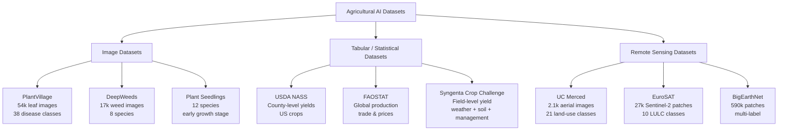

# Key Datasets and Benchmarks in Agricultural AI

## Overview

Progress in agricultural AI, as in any machine learning domain, depends critically on the availability of well-curated datasets and standardized benchmarks. Datasets provide the raw material for training models, while benchmarks establish common evaluation protocols that allow researchers to compare methods fairly and track progress over time. This lesson surveys the most important open datasets and benchmarks in agricultural AI, covering plant disease classification, weed detection, land cover mapping, and yield prediction.

**PlantVillage** is arguably the most widely used dataset in agricultural AI research. Created by researchers at Penn State University, it contains over 54,000 images of healthy and diseased plant leaves spanning 14 crop species and 38 disease classes. The images were captured under controlled laboratory conditions with uniform backgrounds, which makes the classification task relatively straightforward for modern CNNs (accuracies above 99% have been reported). However, this controlled setting is also the dataset's main limitation: models trained on PlantVillage often struggle to generalize to images taken in real field conditions with variable lighting, complex backgrounds, and overlapping leaves. Several follow-up datasets, including PlantDoc and the Plant Pathology Challenge datasets from Kaggle, address this gap by providing images captured in the field.

**Weed Detection Datasets** are essential for developing AI-driven precision spraying and robotic weeding systems. The DeepWeeds dataset, published by researchers at the Queensland University of Technology, contains over 17,000 labeled images of eight weed species native to northern Australia, captured by a robot moving through pastoral environments. The CottonWeedID15 dataset focuses on 15 weed species commonly found in cotton fields in the southern United States. For broader crop-weed discrimination, the Plant Seedlings Dataset from Aarhus University provides top-down images of 12 species (both crops and weeds) at early growth stages, posing the challenge of distinguishing very similar-looking seedlings.

**Land Use and Land Cover (LULC) Classification** datasets support models that map agricultural areas from satellite imagery. The UC Merced Land Use Dataset consists of 2,100 aerial images across 21 land-use classes (including agricultural, forest, and urban), each measuring 256 by 256 pixels at one-foot spatial resolution. EuroSAT provides 27,000 labeled Sentinel-2 image patches across 10 LULC classes, including several agricultural categories such as annual crop, permanent crop, and pasture. At a larger scale, the BigEarthNet archive contains over 590,000 Sentinel-2 patches with multi-label annotations, making it one of the largest remote sensing benchmarks available.

**Yield Prediction Benchmarks** are less standardized than image classification datasets, partly because yield data is inherently tied to specific geographies, crops, and time periods. The USDA National Agricultural Statistics Service (NASS) publishes county-level yield estimates for major US crops annually, and these records form the backbone of many yield modeling studies. The Global Yield Gap Atlas provides field-level yield potential estimates for major crops worldwide. For competition-style benchmarking, the Syngenta Crop Challenge has released anonymized field-level datasets combining weather, soil, and management variables with corresponding yield outcomes.

**Global Food and Agriculture Statistics** from organizations such as FAO (FAOSTAT), the World Bank, and IFPRI provide country-level data on production, trade, prices, and food security indicators. While not directly used for training image classifiers, these datasets are indispensable for contextualizing AI research within real-world food systems and for training macro-level forecasting models.

When working with agricultural datasets, several practical considerations arise. Class imbalance is common -- some diseases or weed species are far more prevalent than others. Geographic and climatic bias means that a model trained on data from temperate regions may fail in tropical environments. Annotation quality varies widely, from expert phytopathologist labels to crowdsourced annotations of uncertain reliability. Understanding these limitations is essential for building models that work in practice, not just on leaderboards.

## Key Concepts

- **PlantVillage Dataset**: An open dataset of 54,000+ leaf images across 38 disease classes and 14 crop species, widely used as a benchmark for plant disease classification models.
- **DeepWeeds**: A dataset of 17,000+ images covering eight weed species in Australian pastoral settings, designed for training real-world weed detection systems.
- **UC Merced Land Use Dataset**: A benchmark of 2,100 high-resolution aerial images in 21 land-use categories, commonly used for evaluating land cover classification from overhead imagery.
- **EuroSAT**: A dataset of 27,000 Sentinel-2 satellite image patches labeled across 10 land-use and land-cover classes, including multiple agricultural categories.
- **BigEarthNet**: One of the largest remote sensing benchmarks, with 590,000+ Sentinel-2 patches and multi-label LULC annotations.
- **Class Imbalance**: A situation where some categories in a dataset have far more examples than others, which can bias a model toward predicting the majority class and performing poorly on rare but important classes.
- **Domain Shift**: The degradation in model performance that occurs when the distribution of test data differs from the training data -- for example, a model trained on lab images applied to field images.
- **Benchmark**: A standardized dataset and evaluation protocol that enables fair comparison of different methods on the same task, typically reporting metrics such as accuracy, precision, recall, and F1-score.

## Technical Details

### Loading the PlantVillage Dataset with PyTorch

The PlantVillage dataset is available through several channels, including TensorFlow Datasets, Kaggle, and direct download. Below is a workflow for loading it using PyTorch and `torchvision`.

```python
import torch
from torchvision import datasets, transforms
from torch.utils.data import DataLoader

# Define preprocessing transforms
transform = transforms.Compose([
    transforms.Resize((224, 224)),        # Resize to standard input size
    transforms.RandomHorizontalFlip(),    # Data augmentation
    transforms.RandomRotation(15),        # Data augmentation
    transforms.ToTensor(),                # Convert to tensor [0, 1]
    transforms.Normalize(                 # ImageNet normalization
        mean=[0.485, 0.456, 0.406],
        std=[0.229, 0.224, 0.225]
    ),
])

# Load dataset from a local directory organized as:
#   plantvillage/
#       Tomato___Early_blight/
#           img001.jpg
#           img002.jpg
#       Tomato___healthy/
#           img001.jpg
#       ...
dataset = datasets.ImageFolder(
    root="data/plantvillage",
    transform=transform
)

# Print dataset summary
print(f"Total images: {len(dataset)}")
print(f"Number of classes: {len(dataset.classes)}")
print(f"Classes: {dataset.classes[:5]}...")  # Show first 5

# Split into train and validation sets (80/20)
train_size = int(0.8 * len(dataset))
val_size = len(dataset) - train_size
train_set, val_set = torch.utils.data.random_split(dataset, [train_size, val_size])

# Create data loaders
train_loader = DataLoader(train_set, batch_size=32, shuffle=True, num_workers=4)
val_loader = DataLoader(val_set, batch_size=32, shuffle=False, num_workers=4)

# Inspect a batch
images, labels = next(iter(train_loader))
print(f"Batch shape: {images.shape}")   # [32, 3, 224, 224]
print(f"Label shape: {labels.shape}")   # [32]
```

### Exploring Class Distribution

```python
import matplotlib.pyplot as plt
from collections import Counter

# Count samples per class
class_counts = Counter(dataset.targets)
class_names = [dataset.classes[i] for i in range(len(dataset.classes))]
counts = [class_counts[i] for i in range(len(dataset.classes))]

# Plot distribution
plt.figure(figsize=(14, 6))
plt.bar(range(len(counts)), counts, color="forestgreen")
plt.xticks(range(len(counts)), class_names, rotation=90, fontsize=7)
plt.ylabel("Number of Images")
plt.title("PlantVillage Class Distribution")
plt.tight_layout()
plt.savefig("class_distribution.png", dpi=150)
plt.show()
```

### Handling Class Imbalance with Weighted Sampling

```python
# Compute sample weights for balanced sampling
class_weights = 1.0 / torch.tensor(counts, dtype=torch.float)
sample_weights = [class_weights[label] for label in dataset.targets]

sampler = torch.utils.data.WeightedRandomSampler(
    weights=sample_weights,
    num_samples=len(sample_weights),
    replacement=True
)

balanced_loader = DataLoader(dataset, batch_size=32, sampler=sampler, num_workers=4)
print("Balanced loader created with weighted sampling.")
```

## Diagrams

**Agricultural AI Dataset Categories**



## Exercises/Projects

1. **Download and Explore PlantVillage**: Download the PlantVillage dataset from [Kaggle](https://www.kaggle.com/datasets/abdallahalidev/plantvillage-dataset). Load it using the code above and plot the class distribution. Identify which classes are underrepresented.
2. **Baseline Classifier**: Using the PlantVillage dataset, train a simple CNN (or fine-tune a pretrained ResNet-18) to classify plant diseases. Report accuracy, precision, and recall on a held-out test set. Observe how performance differs between common and rare classes.
3. **Domain Shift Experiment**: If you have access to a garden or farm, photograph 20-30 leaves (healthy and diseased) with your smartphone. Run your PlantVillage-trained model on these images and measure the accuracy drop compared to the original test set. Reflect on why performance changes.
4. **Dataset Survey Report**: Choose a specific agricultural task (e.g., fruit detection, soil type classification, livestock counting). Search the literature and dataset repositories (Papers With Code, Kaggle, UCI ML Repository) for at least three relevant datasets. Summarize their size, annotation type, and known limitations in a short written report.
5. **Class Imbalance Mitigation**: Implement two strategies for handling class imbalance on PlantVillage -- weighted random sampling (shown above) and data augmentation for minority classes. Compare the resulting F1-scores.

## Further Reading

- Hughes, D. P., & Salath, M. (2015). "An Open Access Repository of Images on Plant Health to Enable the Development of Mobile Disease Diagnostics." *arXiv:1511.08060*. [arxiv.org](https://arxiv.org/abs/1511.08060)
- Olsen, A., et al. (2019). "DeepWeeds: A Multiclass Weed Species Image Dataset for Deep Learning." *Scientific Reports*, 9, 2058. [DOI: 10.1038/s41598-018-38343-3](https://doi.org/10.1038/s41598-018-38343-3)
- Helber, P., et al. (2019). "EuroSAT: A Novel Dataset and Deep Learning Benchmark for Land Use and Land Cover Classification." *IEEE JSTARS*, 12(7), 2217-2226.
- Sumbul, G., et al. (2019). "BigEarthNet: A Large-Scale Benchmark Archive for Remote Sensing Image Understanding." *IEEE IGARSS 2019*.
- Papers With Code -- Agriculture: [paperswithcode.com/area/agriculture](https://paperswithcode.com/area/agriculture)
