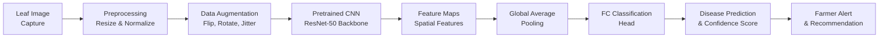
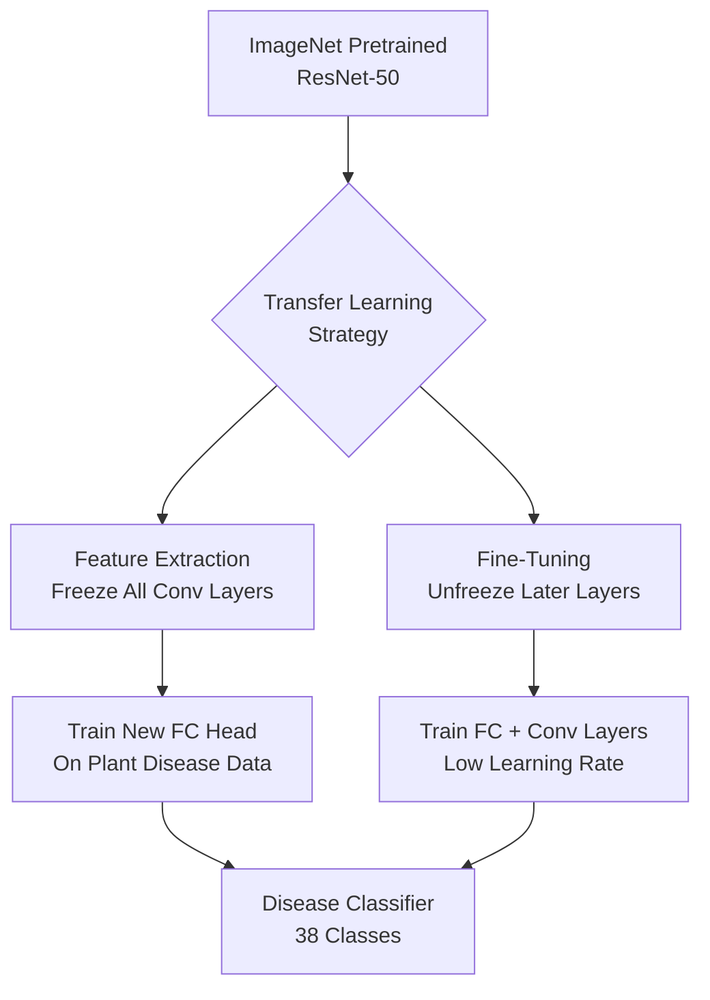

# Crop Health Monitoring with Deep Learning

## Overview

Crop health monitoring is one of the most impactful applications of deep learning in agriculture. Traditional crop scouting requires trained agronomists to walk through fields, visually inspecting plants for signs of disease, nutrient deficiency, pest damage, or water stress. This process is slow, subjective, and limited in scale. Deep learning offers a transformative alternative: automated, consistent, and scalable analysis of plant health from images captured by smartphones, drones, or fixed cameras.

At the core of modern image-based crop health monitoring are **Convolutional Neural Networks (CNNs)**. CNNs learn hierarchical feature representations directly from raw pixel data. Early layers detect low-level features such as edges, textures, and color gradients, while deeper layers combine these into high-level patterns that correspond to disease symptoms -- lesion shapes, discoloration patterns, wilting signatures, and fungal structures. Architectures like ResNet, EfficientNet, and VGG have demonstrated remarkable accuracy on plant disease classification benchmarks, often exceeding 95% on curated datasets like PlantVillage.

More recently, **Vision Transformers (ViTs)** have emerged as a powerful alternative to CNNs. Instead of convolving filters across an image, ViTs divide the image into fixed-size patches, embed each patch as a token, and process the sequence with a standard Transformer encoder. The self-attention mechanism allows ViTs to capture long-range spatial dependencies that CNNs may miss. For crop health monitoring, this means a ViT can simultaneously consider a lesion on one part of a leaf and discoloration on another, relating distant symptoms that might indicate a specific pathogen.

A critical enabler for agricultural deep learning is **transfer learning**. Training a deep neural network from scratch requires millions of labeled images -- a resource rarely available for specific crop-disease combinations. Transfer learning solves this by starting with a model pretrained on ImageNet (a dataset of 14 million general images spanning 1,000 categories). The pretrained model has already learned rich visual features: edges, textures, shapes, and even complex patterns. By replacing the final classification layer and fine-tuning on a smaller agricultural dataset, we can achieve high accuracy with as few as a few hundred labeled images per class. This dramatically lowers the barrier to deploying disease detection systems for new crops and regions.

Deep learning models for crop health monitoring typically address several categories of plant stress. **Disease identification** covers fungal infections (rust, blight, powdery mildew), bacterial diseases (bacterial spot, canker), and viral infections (mosaic virus, leaf curl). Each disease produces characteristic visual symptoms -- yellow halos, necrotic lesions, mosaic patterns -- that CNNs learn to distinguish. **Nutrient deficiency detection** identifies symptoms of nitrogen deficiency (yellowing of older leaves), phosphorus deficiency (purpling), potassium deficiency (leaf edge browning), and micronutrient deficiencies. **Pest damage assessment** recognizes feeding patterns from insects such as aphids, caterpillars, and mites, each of which leaves distinctive marks. **Water stress detection** identifies wilting, curling, and color changes associated with drought or overwatering.

The practical deployment pipeline involves several stages. Images are first preprocessed -- resized, normalized, and augmented with random rotations, flips, and color jitter to improve model robustness. The model then produces a classification or severity score. Post-processing may include confidence calibration, uncertainty estimation, and integration with geographic information systems (GIS) for field-level health maps. Edge deployment on mobile devices or drone processors enables real-time, in-field diagnosis without internet connectivity.

Challenges remain significant. Real-world images differ substantially from controlled laboratory photos: lighting varies, backgrounds are cluttered, multiple diseases may co-occur on a single plant, and early-stage symptoms can be subtle. Domain shift between training data (often from one region or season) and deployment conditions degrades performance. Active research addresses these challenges through domain adaptation, few-shot learning, and self-supervised pretraining on unlabeled agricultural imagery. Despite these hurdles, deep learning for crop health monitoring is already delivering value to farmers worldwide, enabling earlier intervention, reduced crop losses, and more targeted use of pesticides and fungicides.

## Key Concepts

- **Convolutional Neural Network (CNN)**: A neural network architecture that uses learnable convolutional filters to extract spatial features from images, forming hierarchical representations from edges to complex patterns like disease symptoms.

- **Vision Transformer (ViT)**: A Transformer-based architecture that treats image patches as tokens and uses self-attention to capture global spatial relationships, offering an alternative to CNNs for image classification tasks.

- **Transfer Learning**: The practice of initializing a model with weights pretrained on a large dataset (e.g., ImageNet) and fine-tuning on a smaller, task-specific dataset to achieve high accuracy with limited labeled data.

- **Data Augmentation**: Applying random transformations (rotations, flips, color jitter, cropping) to training images to artificially increase dataset size and improve model generalization to unseen conditions.

- **Fine-Tuning**: Unfreezing some or all layers of a pretrained model and training them on the target dataset with a small learning rate, allowing the model to adapt its learned features to the new domain.

- **Feature Extraction**: Using a pretrained model as a fixed feature extractor by freezing all convolutional layers and only training a new classification head on top.

- **Domain Shift**: The degradation in model performance when training and deployment data come from different distributions (e.g., different regions, cameras, lighting conditions, or seasons).

- **Confidence Calibration**: Adjusting model output probabilities so that a predicted 90% confidence truly corresponds to 90% accuracy, which is critical for trustworthy agricultural recommendations.

## Technical Details

### Transfer Learning with ResNet for Plant Disease Classification

The following example demonstrates fine-tuning a pretrained ResNet-50 model on the PlantVillage dataset for crop disease classification.

```python
import torch
import torch.nn as nn
import torch.optim as optim
from torchvision import datasets, transforms, models
from torch.utils.data import DataLoader

# Data preprocessing and augmentation
train_transform = transforms.Compose([
    transforms.RandomResizedCrop(224),
    transforms.RandomHorizontalFlip(),
    transforms.RandomRotation(15),
    transforms.ColorJitter(brightness=0.2, contrast=0.2, saturation=0.2),
    transforms.ToTensor(),
    transforms.Normalize(mean=[0.485, 0.456, 0.406],
                         std=[0.229, 0.224, 0.225]),
])

val_transform = transforms.Compose([
    transforms.Resize(256),
    transforms.CenterCrop(224),
    transforms.ToTensor(),
    transforms.Normalize(mean=[0.485, 0.456, 0.406],
                         std=[0.229, 0.224, 0.225]),
])

# Load dataset (PlantVillage organized in class folders)
train_dataset = datasets.ImageFolder("data/plantvillage/train", transform=train_transform)
val_dataset = datasets.ImageFolder("data/plantvillage/val", transform=val_transform)

train_loader = DataLoader(train_dataset, batch_size=32, shuffle=True, num_workers=4)
val_loader = DataLoader(val_dataset, batch_size=32, shuffle=False, num_workers=4)

num_classes = len(train_dataset.classes)

# Load pretrained ResNet-50 and replace the classification head
model = models.resnet50(weights=models.ResNet50_Weights.IMAGENET1K_V2)

# Freeze early layers for feature extraction
for param in model.parameters():
    param.requires_grad = False

# Replace final fully connected layer
model.fc = nn.Sequential(
    nn.Dropout(0.3),
    nn.Linear(model.fc.in_features, num_classes),
)

device = torch.device("cuda" if torch.cuda.is_available() else "cpu")
model = model.to(device)

# Use cross-entropy loss and Adam optimizer
criterion = nn.CrossEntropyLoss()
optimizer = optim.Adam(model.fc.parameters(), lr=1e-3)
scheduler = optim.lr_scheduler.StepLR(optimizer, step_size=5, gamma=0.1)

# Training loop
num_epochs = 15
for epoch in range(num_epochs):
    model.train()
    running_loss = 0.0
    correct = 0
    total = 0

    for images, labels in train_loader:
        images, labels = images.to(device), labels.to(device)
        optimizer.zero_grad()
        outputs = model(images)
        loss = criterion(outputs, labels)
        loss.backward()
        optimizer.step()

        running_loss += loss.item()
        _, predicted = outputs.max(1)
        total += labels.size(0)
        correct += predicted.eq(labels).sum().item()

    scheduler.step()
    train_acc = 100.0 * correct / total

    # Validation
    model.eval()
    val_correct = 0
    val_total = 0
    with torch.no_grad():
        for images, labels in val_loader:
            images, labels = images.to(device), labels.to(device)
            outputs = model(images)
            _, predicted = outputs.max(1)
            val_total += labels.size(0)
            val_correct += predicted.eq(labels).sum().item()

    val_acc = 100.0 * val_correct / val_total
    print(f"Epoch {epoch+1}/{num_epochs} | "
          f"Loss: {running_loss/len(train_loader):.4f} | "
          f"Train Acc: {train_acc:.2f}% | Val Acc: {val_acc:.2f}%")
```

### Key Mathematical Foundations

The cross-entropy loss used for multi-class disease classification is:

$$\mathcal{L} = -\sum_{i=1}^{C} y_i \log(\hat{y}_i)$$

where $C$ is the number of disease classes, $y_i$ is the ground truth (one-hot encoded), and $\hat{y}_i$ is the predicted probability for class $i$.

The softmax function converts raw logits $z_i$ into probabilities:

$$\hat{y}_i = \frac{e^{z_i}}{\sum_{j=1}^{C} e^{z_j}}$$

For a convolutional layer, the output feature map at position $(x, y)$ for filter $k$ is:

$$h_k(x, y) = \sigma\left(\sum_{c}\sum_{i}\sum_{j} W_k(c, i, j) \cdot X(c, x+i, y+j) + b_k\right)$$

where $W_k$ are the learnable filter weights, $X$ is the input, $b_k$ is the bias, and $\sigma$ is a nonlinear activation (e.g., ReLU).

## Diagrams

**CNN Pipeline for Crop Disease Detection**



**Transfer Learning Strategy**



## Exercises/Projects

1. **PlantVillage Classification**: Download the PlantVillage dataset and train a ResNet-50 model using the code above. Compare accuracy when using feature extraction (frozen backbone) versus full fine-tuning. Report the per-class precision and recall.

2. **Data Augmentation Ablation**: Systematically remove augmentation techniques one at a time (rotation, flip, color jitter) and measure the impact on validation accuracy. Which augmentation matters most for plant disease images?

3. **CNN vs. Vision Transformer**: Replace the ResNet-50 backbone with a ViT-B/16 model (available in torchvision). Compare training speed, accuracy, and the number of training samples needed to reach 90% accuracy for both architectures.

4. **Severity Grading**: Extend the classification model to predict disease severity on a 0--4 scale (healthy, early, moderate, severe, dead). Experiment with treating this as an ordinal regression problem versus standard classification.

5. **Mobile Deployment**: Export your trained model to ONNX or TorchScript format and build a simple mobile inference pipeline. Measure inference latency on a CPU to assess feasibility for in-field smartphone deployment.

6. **Grad-CAM Visualization**: Implement Gradient-weighted Class Activation Mapping (Grad-CAM) to visualize which regions of the leaf image the model focuses on when making predictions. Verify that the model attends to actual disease symptoms rather than background artifacts.

## Further Reading

- Hughes, D. P. & Salathe, M. (2015). "An open access repository of images on plant health to enable the development of mobile disease diagnostics." arXiv:1511.08060.
- Mohanty, S. P., Hughes, D. P., & Salathe, M. (2016). "Using Deep Learning for Image-Based Plant Disease Detection." Frontiers in Plant Science, 7, 1419.
- Dosovitskiy, A. et al. (2020). "An Image is Worth 16x16 Words: Transformers for Image Recognition at Scale." arXiv:2010.11929.
- He, K. et al. (2016). "Deep Residual Learning for Image Recognition." CVPR 2016.
- PlantVillage Dataset: https://plantvillage.psu.edu/
- PyTorch Transfer Learning Tutorial: https://pytorch.org/tutorials/beginner/transfer_learning_tutorial.html
