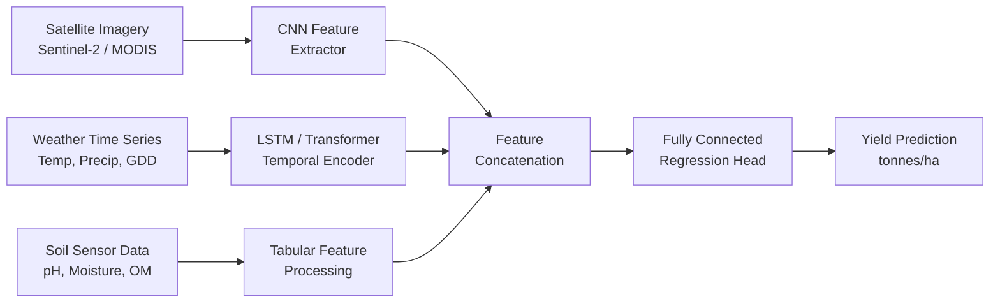
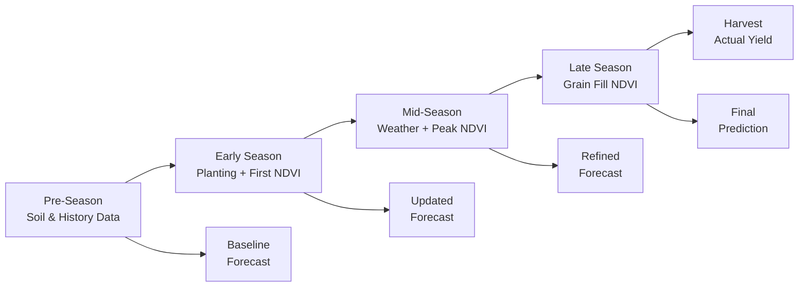

# Yield Prediction and Crop Forecasting

## Overview

Accurate crop yield prediction is essential for food security planning, commodity markets, insurance assessment, and farm-level decision-making. Traditionally, yield forecasting relied on simple statistical models, expert judgment, and government survey data collected late in the growing season. Modern AI-driven approaches integrate diverse data streams -- satellite imagery, weather records, soil sensor readings, and historical yield data -- to produce predictions that are earlier, more granular, and more accurate than ever before.

The simplest approach to yield prediction uses **regression models**. A linear regression might predict yield as a function of cumulative rainfall, growing degree days, and soil organic matter content. While interpretable, linear models cannot capture the complex nonlinear interactions between environmental factors. For example, the effect of temperature on yield is not linear: moderate warmth accelerates growth, but extreme heat during flowering causes irreversible damage. **Polynomial regression** and **generalized additive models (GAMs)** offer more flexibility but still struggle with high-dimensional feature spaces.

**Random forests** and **gradient boosted trees** (XGBoost, LightGBM) represent a significant step up. These ensemble methods handle nonlinearities, feature interactions, and missing data naturally. A random forest for yield prediction might ingest hundreds of features: monthly temperature statistics, precipitation totals, vegetation indices (NDVI, EVI) extracted from satellite imagery at multiple growth stages, soil type indicators, and management practices. Feature importance analysis from tree-based models also provides agronomic insights -- revealing, for instance, that NDVI during the grain-filling stage is the strongest predictor of wheat yield in a given region.

**Neural networks** push accuracy further by learning representations directly from raw or minimally processed data. Convolutional Neural Networks (CNNs) can process satellite imagery tiles to extract spatial patterns -- identifying field-level variability in crop vigor, detecting stressed zones, and estimating biomass from spectral signatures. Long Short-Term Memory networks (LSTMs) and Transformer architectures model the temporal dimension, capturing how weather sequences throughout the growing season influence final yield. An LSTM can learn that a drought during vegetative growth is partially recoverable if followed by adequate rainfall, while the same drought during reproductive stages causes permanent yield loss.

The most powerful modern systems use **multi-modal data fusion**, combining spatial features from CNNs with temporal features from LSTMs or Transformers. A typical architecture processes satellite image time series through a CNN to extract per-timestep spatial features, then feeds this feature sequence into an LSTM or Transformer encoder to capture temporal dynamics. Auxiliary tabular data (soil properties, management practices, cultivar information) is concatenated with the learned representations before a final regression head predicts yield.

Real-world case studies demonstrate the value of these approaches. For **corn yield prediction** in the U.S. Corn Belt, models combining MODIS satellite imagery with county-level weather data have achieved $R^2$ values above 0.75 at the county level, with predictions available weeks before harvest. **Wheat yield forecasting** in India and Australia has benefited from Sentinel-2 imagery at 10-meter resolution, enabling field-level predictions that help smallholder farmers plan harvest logistics and negotiate fair prices. **Rice yield estimation** in Southeast Asia integrates synthetic aperture radar (SAR) data, which penetrates cloud cover common in tropical monsoon regions, with optical imagery and weather station records.

Scale matters in yield prediction. Field-level models require high-resolution imagery and detailed management records but provide actionable insights for individual farmers. Regional and national models aggregate predictions for policy planning and commodity trading, using coarser data but covering vast areas. Transfer learning and domain adaptation techniques help models trained in data-rich regions (e.g., the U.S. Midwest) generalize to data-scarce regions (e.g., sub-Saharan Africa), though significant challenges remain due to differences in crop varieties, farming practices, and climate regimes.

Key challenges include the limited availability of ground-truth yield data (often only available annually at the county level), the high dimensionality and heterogeneity of input features, and the need for models that perform well under novel climate conditions not represented in historical training data. Despite these challenges, AI-driven yield prediction is rapidly becoming an indispensable tool in the agricultural data science toolkit.

## Key Concepts

- **Vegetation Index (NDVI/EVI)**: Spectral indices derived from satellite imagery that quantify vegetation greenness and health. NDVI is computed as $(NIR - Red) / (NIR + Red)$ and correlates with biomass and photosynthetic activity.

- **Growing Degree Days (GDD)**: A measure of accumulated heat during the growing season, calculated as $GDD = \sum \max\left(\frac{T_{max} + T_{min}}{2} - T_{base}, 0\right)$, which drives crop phenological development.

- **Multi-Modal Data Fusion**: Combining data from different sources and modalities (imagery, weather, soil sensors) into a unified model to capture complementary information that no single source provides.

- **Random Forest Regression**: An ensemble method that averages predictions from many decision trees, each trained on a bootstrap sample with a random feature subset, providing robust predictions and feature importance rankings.

- **LSTM (Long Short-Term Memory)**: A recurrent neural network variant with gating mechanisms that can learn long-range temporal dependencies in sequential data such as weather and satellite image time series.

- **Temporal Feature Extraction**: The process of learning representations from time-ordered data sequences, capturing patterns like growth trajectories, stress events, and recovery dynamics across the growing season.

- **Spatial Feature Extraction**: Using CNNs to extract location-dependent patterns from imagery, such as within-field variability, canopy structure, and spectral signatures indicative of crop condition.

- **Coefficient of Determination ($R^2$)**: A metric measuring the proportion of variance in actual yields explained by the model, where $R^2 = 1$ indicates perfect prediction and $R^2 = 0$ indicates no explanatory power.

## Technical Details

### Yield Prediction with Scikit-Learn (Tabular Features)

```python
import numpy as np
import pandas as pd
from sklearn.ensemble import RandomForestRegressor, GradientBoostingRegressor
from sklearn.model_selection import train_test_split, cross_val_score
from sklearn.metrics import mean_squared_error, r2_score
from sklearn.preprocessing import StandardScaler

# Load dataset: rows = field-year observations
# Features: monthly weather stats, NDVI at key growth stages, soil properties
data = pd.read_csv("yield_dataset.csv")

feature_cols = [
    "precip_apr", "precip_may", "precip_jun", "precip_jul", "precip_aug",
    "temp_avg_apr", "temp_avg_may", "temp_avg_jun", "temp_avg_jul",
    "gdd_total", "frost_days",
    "ndvi_vegetative", "ndvi_flowering", "ndvi_grain_fill",
    "soil_organic_matter", "soil_ph", "soil_clay_pct",
]
target_col = "yield_tonnes_per_ha"

X = data[feature_cols].values
y = data[target_col].values

X_train, X_test, y_train, y_test = train_test_split(
    X, y, test_size=0.2, random_state=42
)

scaler = StandardScaler()
X_train_scaled = scaler.fit_transform(X_train)
X_test_scaled = scaler.transform(X_test)

# Random Forest model
rf_model = RandomForestRegressor(
    n_estimators=500, max_depth=15, min_samples_leaf=5, random_state=42
)
rf_model.fit(X_train_scaled, y_train)

y_pred_rf = rf_model.predict(X_test_scaled)
print(f"Random Forest - RMSE: {np.sqrt(mean_squared_error(y_test, y_pred_rf)):.3f}")
print(f"Random Forest - R^2:  {r2_score(y_test, y_pred_rf):.3f}")

# Feature importance analysis
importances = rf_model.feature_importances_
for name, imp in sorted(zip(feature_cols, importances), key=lambda x: -x[1]):
    print(f"  {name:30s} {imp:.4f}")
```

### Temporal Yield Model with PyTorch LSTM

```python
import torch
import torch.nn as nn

class YieldLSTM(nn.Module):
    """LSTM model that processes a time series of satellite and weather features
    to predict end-of-season crop yield."""

    def __init__(self, input_dim, hidden_dim=128, num_layers=2, dropout=0.2):
        super().__init__()
        self.lstm = nn.LSTM(
            input_size=input_dim,
            hidden_size=hidden_dim,
            num_layers=num_layers,
            batch_first=True,
            dropout=dropout,
        )
        self.regressor = nn.Sequential(
            nn.Linear(hidden_dim, 64),
            nn.ReLU(),
            nn.Dropout(dropout),
            nn.Linear(64, 1),
        )

    def forward(self, x):
        # x shape: (batch, time_steps, input_dim)
        lstm_out, (h_n, _) = self.lstm(x)
        # Use the final hidden state for prediction
        final_hidden = h_n[-1]  # (batch, hidden_dim)
        yield_pred = self.regressor(final_hidden)
        return yield_pred.squeeze(-1)

# Example usage
input_dim = 12   # e.g., NDVI, EVI, temperature, precipitation per timestep
model = YieldLSTM(input_dim=input_dim, hidden_dim=128, num_layers=2)
criterion = nn.MSELoss()
optimizer = torch.optim.Adam(model.parameters(), lr=1e-3, weight_decay=1e-5)

# Training loop (simplified)
for epoch in range(50):
    model.train()
    for X_batch, y_batch in train_loader:
        optimizer.zero_grad()
        predictions = model(X_batch)
        loss = criterion(predictions, y_batch)
        loss.backward()
        optimizer.step()
```

### Key Mathematical Formulations

Linear regression for yield prediction:

$$\hat{y} = \beta_0 + \beta_1 x_1 + \beta_2 x_2 + \cdots + \beta_p x_p$$

The ordinary least squares objective minimizes:

$$\min_{\boldsymbol{\beta}} \sum_{i=1}^{n} \left(y_i - \mathbf{x}_i^\top \boldsymbol{\beta}\right)^2$$

Root Mean Squared Error (RMSE) for evaluating predictions:

$$RMSE = \sqrt{\frac{1}{n}\sum_{i=1}^{n}(y_i - \hat{y}_i)^2}$$

The coefficient of determination:

$$R^2 = 1 - \frac{\sum_{i=1}^{n}(y_i - \hat{y}_i)^2}{\sum_{i=1}^{n}(y_i - \bar{y})^2}$$

NDVI calculation from spectral bands:

$$NDVI = \frac{\rho_{NIR} - \rho_{Red}}{\rho_{NIR} + \rho_{Red}}$$

## Diagrams

**Multi-Modal Data Fusion Pipeline for Yield Prediction**



**Seasonal Prediction Timeline**



## Exercises/Projects

1. **County-Level Corn Yield Prediction**: Using USDA NASS yield data and publicly available weather records, build a random forest model to predict county-level corn yields in Iowa. Evaluate using leave-one-year-out cross-validation to simulate real forecasting conditions.

2. **NDVI Time Series Analysis**: Download Sentinel-2 NDVI time series for agricultural fields and use an LSTM to predict yield from the full growing-season trajectory. Compare against using only the peak NDVI value as a single feature.

3. **Feature Importance Study**: Train gradient boosted tree models with progressively more feature groups (weather only, weather + soil, weather + soil + satellite). Quantify the marginal contribution of each data source to prediction accuracy.

4. **Early-Season Forecasting**: Evaluate how prediction accuracy changes as more of the growing season elapses. Plot $R^2$ as a function of prediction lead time (weeks before harvest) and identify the earliest date at which useful forecasts are possible.

5. **Transfer Learning Across Regions**: Train a yield prediction model on U.S. corn data and evaluate its performance on corn fields in Brazil or Argentina. Explore domain adaptation techniques to improve cross-region transfer.

## Further Reading

- You, J., Li, X., Low, M., Lobell, D., & Ermon, S. (2017). "Deep Gaussian Process for Crop Yield Prediction Based on Remote Sensing Data." AAAI Conference on Artificial Intelligence.
- Khaki, S. & Wang, L. (2019). "Crop Yield Prediction Using Deep Neural Networks." Frontiers in Plant Science, 10, 621.
- Lobell, D. B. et al. (2011). "Climate Trends and Global Crop Production Since 1980." Science, 333(6042), 616-620.
- Sentinel-2 Data Access: https://scihub.copernicus.eu/
- USDA NASS QuickStats: https://quickstats.nass.usda.gov/
- Google Earth Engine for Agricultural Analysis: https://earthengine.google.com/
