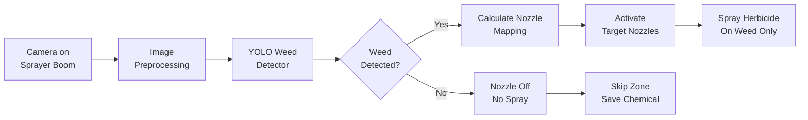
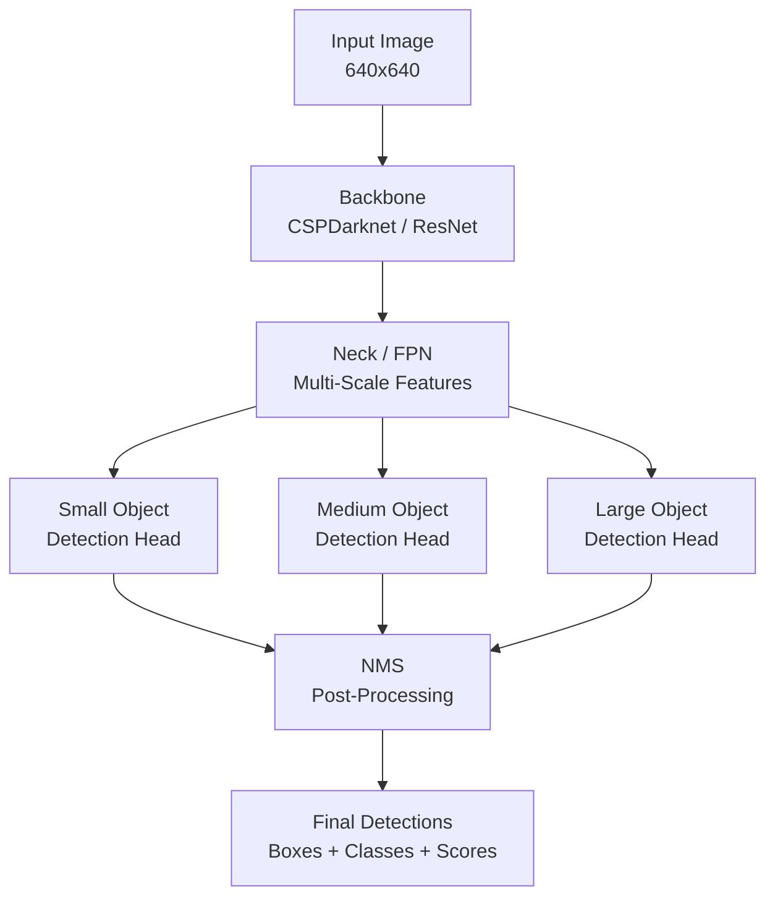

# Weed Detection and Integrated Pest Management

## Overview

Weed management is one of the largest costs in crop production, both financially and environmentally. Conventional broadcast spraying applies herbicides uniformly across entire fields, even though weeds typically cover only 5--40% of the field area. This wastes chemicals, increases production costs, harms beneficial organisms, contaminates water supplies, and accelerates the evolution of herbicide-resistant weed populations. **AI-powered weed detection** combined with **precision spraying** systems offers a transformative solution: identify individual weeds in real time and apply herbicide only where needed, reducing chemical use by 70--90%.

At the heart of modern weed detection systems are **object detection models**. Unlike image classification (which assigns a single label to an entire image), object detection localizes and classifies multiple objects within an image simultaneously. The model outputs bounding boxes around each detected weed along with a class label and confidence score. Two families of architectures dominate this space.

**YOLO (You Only Look Once)** models process the entire image in a single forward pass through the network, dividing it into a grid and predicting bounding boxes and class probabilities for each grid cell. YOLOv5 through YOLOv8 and beyond offer an excellent speed-accuracy tradeoff, making them ideal for real-time applications on moving agricultural equipment. A YOLO model running on a GPU-equipped sprayer can process 30--60 frames per second at field resolution, enabling spot-spraying at tractor speeds up to 12 km/h.

**Faster R-CNN** and related two-stage detectors first generate region proposals (candidate bounding boxes) using a Region Proposal Network (RPN), then classify and refine each proposal. While slower than YOLO, two-stage detectors often achieve higher accuracy on small or overlapping objects -- a relevant advantage when detecting small weed seedlings among dense crop canopies. Recent anchor-free detectors like FCOS and CenterNet offer a middle ground, eliminating the need for predefined anchor boxes while maintaining competitive speed.

The core technical challenge in agricultural weed detection is **distinguishing weeds from crops**. Unlike general object detection where categories are visually distinct (cars vs. pedestrians), weeds and crops are both green plants with similar textures, shapes, and spectral properties. Success depends on learning subtle discriminative features: leaf shape differences, branching patterns, growth point locations, and spatial context (weeds growing between crop rows vs. within rows). Multi-spectral imaging beyond the visible range (near-infrared, red-edge bands) can provide additional discriminative power, as different plant species have distinct spectral reflectance signatures.

**Integrated Pest Management (IPM)** extends beyond weeds to encompass insects, pathogens, and other threats. AI systems for IPM use similar detection architectures to identify pest insects on plants, count pest populations from trap images, and monitor disease progression over time. The key principle of IPM is to use the least environmentally disruptive control method: biological control agents, cultural practices, and targeted chemical intervention only when pest populations exceed economic thresholds. AI enables this by providing accurate, real-time pest population estimates that inform threshold-based decision-making.

Practical deployment of weed detection systems involves several engineering challenges. **Latency** must be low enough for real-time nozzle control -- the system must detect a weed, decide to spray, and actuate the nozzle before the tractor passes the weed's location. This requires end-to-end latency under 100 milliseconds. **Robustness** to variable field conditions is essential: lighting changes from dawn to dusk, dust on camera lenses, shadows from equipment, wet or muddy leaves, and weeds at different growth stages all affect performance. **Training data** must represent the full diversity of conditions, which requires extensive data collection campaigns across seasons, regions, and crop types. Active learning strategies help prioritize which unlabeled images to annotate, maximizing model improvement per labeling dollar.

Commercial systems like Blue River Technology's See & Spray (acquired by John Deere) have demonstrated the viability of this approach at scale, achieving herbicide reductions of over 77% in real field trials. Open-source research continues to advance the state of the art, with datasets like DeepWeeds, CottonWeedDet12, and WeedMap enabling reproducible benchmarking and model development.

## Key Concepts

- **Object Detection**: A computer vision task that identifies and localizes multiple objects in an image by predicting bounding boxes and class labels, as opposed to classification which labels the entire image.

- **YOLO (You Only Look Once)**: A single-stage object detection architecture that predicts bounding boxes and class probabilities in one forward pass, offering real-time inference speeds suitable for agricultural robotics.

- **Faster R-CNN**: A two-stage detector that first generates region proposals then classifies them, typically achieving higher accuracy than single-stage detectors at the cost of slower inference.

- **Intersection over Union (IoU)**: A metric measuring the overlap between a predicted bounding box and the ground truth, computed as the area of intersection divided by the area of union. Used as a threshold for determining correct detections.

- **Mean Average Precision (mAP)**: The primary evaluation metric for object detection, computed by averaging the precision-recall area under the curve across all classes and IoU thresholds.

- **Non-Maximum Suppression (NMS)**: A post-processing step that eliminates redundant overlapping detections by keeping only the highest-confidence bounding box among overlapping predictions.

- **Precision Spraying**: The targeted application of herbicides to individual weeds rather than broadcasting across the entire field, enabled by real-time weed detection and nozzle control systems.

- **Economic Threshold**: The pest population density at which the cost of control action equals the economic damage the pest would cause, forming the decision boundary for intervention in IPM.

## Technical Details

### YOLO-Based Weed Detection with Ultralytics

```python
from ultralytics import YOLO
import cv2
import numpy as np

# Load a pretrained YOLOv8 model and fine-tune on weed dataset
model = YOLO("yolov8m.pt")  # Medium model balances speed and accuracy

# Fine-tune on custom weed detection dataset
# Dataset format: images/ and labels/ directories with YOLO-format annotations
results = model.train(
    data="weed_dataset.yaml",   # Dataset configuration file
    epochs=100,
    imgsz=640,
    batch=16,
    lr0=0.01,
    lrf=0.001,                  # Final learning rate factor
    augment=True,
    mosaic=1.0,                 # Mosaic augmentation probability
    mixup=0.1,                  # Mixup augmentation probability
    degrees=15.0,               # Random rotation range
    flipud=0.5,                 # Vertical flip probability
    device="0",                 # GPU device
    project="weed_detection",
    name="yolov8m_weeds",
)

# Example dataset YAML configuration:
# weed_dataset.yaml
# ---
# path: /data/weed_detection
# train: images/train
# val: images/val
# test: images/test
# names:
#   0: crop
#   1: broadleaf_weed
#   2: grass_weed
#   3: sedge
```

### Real-Time Inference for Precision Spraying

```python
from ultralytics import YOLO
import cv2

model = YOLO("weed_detection/yolov8m_weeds/weights/best.pt")

# Simulate real-time inference on video stream from sprayer camera
cap = cv2.VideoCapture(0)  # Camera index or RTSP stream URL

CONFIDENCE_THRESHOLD = 0.5
WEED_CLASSES = {1: "broadleaf_weed", 2: "grass_weed", 3: "sedge"}

while cap.isOpened():
    ret, frame = cap.read()
    if not ret:
        break

    # Run detection
    results = model(frame, conf=CONFIDENCE_THRESHOLD, verbose=False)

    # Process detections for nozzle control
    spray_zones = []
    for detection in results[0].boxes:
        cls_id = int(detection.cls[0])
        confidence = float(detection.conf[0])

        if cls_id in WEED_CLASSES:
            x1, y1, x2, y2 = detection.xyxy[0].tolist()
            center_x = (x1 + x2) / 2
            center_y = (y1 + y2) / 2

            spray_zones.append({
                "class": WEED_CLASSES[cls_id],
                "confidence": confidence,
                "bbox": [x1, y1, x2, y2],
                "center": [center_x, center_y],
            })

    # Send spray commands to nozzle controller
    if spray_zones:
        activate_nozzles(spray_zones)  # Hardware interface function

cap.release()
```

### Key Mathematical Formulations

**Intersection over Union (IoU)** measures bounding box overlap:

$$IoU = \frac{|B_{pred} \cap B_{gt}|}{|B_{pred} \cup B_{gt}|} = \frac{\text{Area of Intersection}}{\text{Area of Union}}$$

A detection is considered a **true positive** if $IoU \geq \tau$ (typically $\tau = 0.5$).

**Precision and Recall** for a single class:

$$\text{Precision} = \frac{TP}{TP + FP}, \quad \text{Recall} = \frac{TP}{TP + FN}$$

**Average Precision (AP)** is the area under the precision-recall curve:

$$AP = \int_0^1 P(r) \, dr$$

**Mean Average Precision (mAP)** averages over all $C$ classes:

$$mAP = \frac{1}{C}\sum_{c=1}^{C} AP_c$$

The standard **mAP@0.5:0.95** used in COCO evaluation averages AP across IoU thresholds from 0.5 to 0.95 in steps of 0.05:

$$mAP_{COCO} = \frac{1}{10}\sum_{t \in \{0.5, 0.55, \ldots, 0.95\}} mAP_t$$

**YOLO loss function** combines three components:

$$\mathcal{L} = \lambda_{box}\mathcal{L}_{box} + \lambda_{cls}\mathcal{L}_{cls} + \lambda_{obj}\mathcal{L}_{obj}$$

where $\mathcal{L}_{box}$ is the bounding box regression loss (CIoU), $\mathcal{L}_{cls}$ is the classification loss (binary cross-entropy), and $\mathcal{L}_{obj}$ is the objectness loss.

## Diagrams

**Precision Spraying Pipeline**



**Object Detection Model Architecture**



## Exercises/Projects

1. **Train YOLOv8 on DeepWeeds**: Download the DeepWeeds dataset (8 weed species from Australian rangelands) and train a YOLOv8 model. Report mAP@0.5 and mAP@0.5:0.95 on the test set. Analyze which weed species are hardest to detect and hypothesize why.

2. **Speed-Accuracy Tradeoff**: Train YOLOv8 nano, small, medium, and large variants on the same weed dataset. Plot mAP versus inference time (ms per frame) and determine which variant is most suitable for real-time spraying at 30 FPS.

3. **Data Augmentation for Field Robustness**: Implement custom augmentations that simulate real field conditions: varying sun angles (shadow augmentation), dust or water droplets on the lens (occlusion augmentation), and motion blur from tractor movement. Measure the impact on test set performance.

4. **Crop-Weed Segmentation**: Extend the object detection approach to instance segmentation using YOLOv8-seg. Compare bounding-box-level detection with pixel-level segmentation for estimating weed coverage percentage and guiding variable-rate spraying.

5. **Economic Impact Analysis**: Given a field map with known weed distribution, simulate herbicide usage under broadcast spraying versus precision spot-spraying. Calculate the chemical savings, cost of the detection system, and break-even field size.

6. **Multi-Spectral Detection**: If access to a multi-spectral camera is available, compare weed detection accuracy using RGB-only images versus RGB + near-infrared. Quantify the improvement from additional spectral bands, particularly for distinguishing grass weeds from grass crops.

## Further Reading

- Redmon, J. et al. (2016). "You Only Look Once: Unified, Real-Time Object Detection." CVPR 2016.
- Ren, S. et al. (2015). "Faster R-CNN: Towards Real-Time Object Detection with Region Proposal Networks." NeurIPS 2015.
- Olsen, A. et al. (2019). "DeepWeeds: A Multiclass Weed Species Image Dataset for Deep Learning." Scientific Reports, 9, 2058.
- Ultralytics YOLOv8 Documentation: https://docs.ultralytics.com/
- Blue River Technology / See & Spray: https://www.deere.com/en/sprayers/see-spray/
- Partel, V., Charan Kakarla, S., & Ampatzidis, Y. (2019). "Development and evaluation of a low-cost and smart technology for precision weed management." Computers and Electronics in Agriculture, 157, 339-350.
