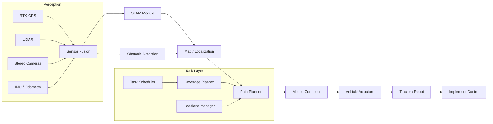

# Autonomous Farm Machinery and Robotics

## Overview

Agriculture faces a deepening labor shortage worldwide. In the United States alone, the Department of Agriculture estimates that the farm workforce has shrunk by more than 20% over the past two decades, while global food demand continues to climb. Autonomous farm machinery and agricultural robotics offer a compelling answer: machines that can plant, tend, and harvest crops with minimal human intervention, operating around the clock regardless of labor availability.

The foundation of autonomous agricultural vehicles is **path planning**. Unlike highway self-driving, farm environments are semi-structured: rows of crops provide loose guidance, but mud, rocks, varying terrain slopes, and moving obstacles (wildlife, workers, other machines) demand robust algorithms. Modern autonomous tractors from John Deere and Case IH use RTK-GPS (Real-Time Kinematic GPS) for centimeter-level positioning, fused with LiDAR and stereo cameras to detect obstacles and terrain features in real time. Path planners must account for implement width, turning radius, headland management (the turnaround zone at the end of rows), and field boundary constraints. The result is an optimized coverage path that minimizes overlap, fuel consumption, and soil compaction.

**Simultaneous Localization and Mapping (SLAM)** becomes especially important in GPS-denied or GPS-degraded environments such as greenhouses, orchards, and dense canopy plantations. In a greenhouse, satellite signals are blocked by glass or polycarbonate panels, so robots must rely on onboard sensors -- typically 2D/3D LiDAR, depth cameras, and wheel odometry -- to build a map of their surroundings while simultaneously tracking their own position within it. Graph-based SLAM and particle-filter SLAM are the two dominant paradigms. In orchards, 3D LiDAR SLAM enables robots to navigate between tree rows, avoid low-hanging branches, and revisit the same trees across seasons for yield monitoring.

**Robotic picking** is one of the most challenging tasks in agricultural robotics. Harvesting strawberries, apples, or tomatoes requires perception (detecting ripe fruit against complex foliage backgrounds), planning (reaching the fruit without damaging the plant), and manipulation (grasping soft produce without bruising). Companies like Tortuga AgTech (strawberries), Abundant Robotics (apples, now acquired by Ripe Robotics' ecosystem), and Root AI (now AppHarvest) have demonstrated commercial or near-commercial robotic harvesters. These systems typically combine deep-learning-based object detection (e.g., YOLO or Mask R-CNN fine-tuned on fruit datasets) with compliant grippers or vacuum-based end effectors.

**Real-world deployments** are accelerating. John Deere's fully autonomous 8R tractor, unveiled at CES 2022 and commercially available from 2024, uses six stereo camera pairs and a deep neural network to detect obstacles, allowing it to till fields without a human in the cab. Case IH demonstrated its Magnum autonomous concept vehicle and has integrated autonomous steering across its lineup. Startups such as Monarch Tractor (electric autonomous tractors), Carbon Robotics (laser-weeding robots), and FarmWise (now part of Metateks) are tackling specific tasks -- weeding, mowing, and inter-row cultivation -- with purpose-built autonomous platforms. In viticulture, Naio Technologies' TED robot autonomously weeds vineyard rows across hundreds of farms in France.

The economic case is strong: autonomous machines can operate 24/7, reduce labor costs by 40-60% for specific tasks, and improve precision (less chemical use, less soil compaction from optimized paths). However, challenges remain -- regulatory frameworks for autonomous vehicles on public roads between fields, liability in case of accidents, cybersecurity of connected fleets, and the high capital cost of retrofitting or replacing existing machinery.

## Key Concepts

- **Coverage Path Planning (CPP)**: Algorithms that generate a path covering every point in a field while minimizing overlap and total distance. Common approaches include boustrophedon (back-and-forth) decomposition and spiral patterns.
- **RTK-GPS**: A satellite navigation technique providing centimeter-level accuracy by using a fixed base station to correct GPS signals in real time.
- **SLAM (Simultaneous Localization and Mapping)**: The process by which a robot builds a map of an unknown environment while tracking its own location within that map.
- **Headland Management**: Planning the turning zones at field edges so the vehicle can transition between adjacent rows efficiently without damaging crops.
- **Compliant Grasping**: Robotic grippers designed to deform around delicate objects (like fruit) to avoid damage, often using soft materials or pneumatic actuation.
- **Sensor Fusion**: Combining data from multiple sensors (GPS, LiDAR, cameras, IMU) to produce a more accurate and robust perception of the environment.
- **Occupancy Grid**: A probabilistic map representation where each cell stores the likelihood of being occupied, used extensively in SLAM and obstacle avoidance.

## Technical Details

### A* Path Planning for Field Coverage

```python
import heapq
import numpy as np

def a_star_field(grid: np.ndarray, start: tuple, goal: tuple):
    """
    A* pathfinding on a 2D occupancy grid representing a farm field.
    grid: 0 = free, 1 = obstacle
    start, goal: (row, col) tuples
    """
    rows, cols = grid.shape
    open_set = []
    heapq.heappush(open_set, (0, start))
    came_from = {}
    g_score = {start: 0}

    def heuristic(a, b):
        # Euclidean distance
        return ((a[0] - b[0])**2 + (a[1] - b[1])**2) ** 0.5

    while open_set:
        _, current = heapq.heappop(open_set)

        if current == goal:
            # Reconstruct path
            path = [current]
            while current in came_from:
                current = came_from[current]
                path.append(current)
            return path[::-1]

        for dr, dc in [(-1,0),(1,0),(0,-1),(0,1),(-1,-1),(-1,1),(1,-1),(1,1)]:
            neighbor = (current[0] + dr, current[1] + dc)
            if 0 <= neighbor[0] < rows and 0 <= neighbor[1] < cols:
                if grid[neighbor[0], neighbor[1]] == 1:
                    continue
                move_cost = 1.414 if dr != 0 and dc != 0 else 1.0
                tentative_g = g_score[current] + move_cost
                if tentative_g < g_score.get(neighbor, float('inf')):
                    came_from[neighbor] = current
                    g_score[neighbor] = tentative_g
                    f_score = tentative_g + heuristic(neighbor, goal)
                    heapq.heappush(open_set, (f_score, neighbor))

    return []  # No path found
```

### SLAM Pose Update (Extended Kalman Filter)

The state vector contains the robot pose and landmark positions:

$$\mathbf{x}_t = \begin{bmatrix} x_r & y_r & \theta_r & x_1 & y_1 & \cdots & x_n & y_n \end{bmatrix}^T$$

**Prediction step** using the motion model:

$$\hat{\mathbf{x}}_{t|t-1} = f(\mathbf{x}_{t-1}, \mathbf{u}_t)$$

$$\hat{\mathbf{P}}_{t|t-1} = \mathbf{F}_t \mathbf{P}_{t-1} \mathbf{F}_t^T + \mathbf{Q}_t$$

where $\mathbf{F}_t$ is the Jacobian of the motion model and $\mathbf{Q}_t$ is the process noise covariance.

**Update step** upon observing landmark $i$:

$$\mathbf{K}_t = \hat{\mathbf{P}}_{t|t-1} \mathbf{H}_t^T \left( \mathbf{H}_t \hat{\mathbf{P}}_{t|t-1} \mathbf{H}_t^T + \mathbf{R}_t \right)^{-1}$$

$$\mathbf{x}_t = \hat{\mathbf{x}}_{t|t-1} + \mathbf{K}_t \left( \mathbf{z}_t - h(\hat{\mathbf{x}}_{t|t-1}) \right)$$

where $\mathbf{H}_t$ is the Jacobian of the observation model $h$, $\mathbf{R}_t$ is the measurement noise covariance, and $\mathbf{K}_t$ is the Kalman gain.

## Diagrams

**Autonomous Farming System Architecture**



## Exercises/Projects

1. **Grid-Based Coverage Planner**: Implement a boustrophedon decomposition algorithm that divides an irregularly shaped field (given as a polygon) into rows and generates a back-and-forth coverage path. Measure total distance and overlap percentage.

2. **Obstacle Avoidance Simulation**: Using the A* implementation above, generate random obstacle fields (simulating rocks and ditches) and visualize the planned path. Extend the algorithm to account for vehicle turning radius.

3. **EKF-SLAM on Simulated Orchard Data**: Implement EKF-SLAM with synthetic range-bearing observations of tree trunks. Plot the estimated robot trajectory and landmark positions against ground truth. Experiment with different noise levels.

4. **Fruit Detection with YOLO**: Fine-tune a YOLOv8 model on a public fruit detection dataset (e.g., MinneApple for apples or StrawDI for strawberries). Report mAP and inference speed, and discuss suitability for real-time robotic picking.

5. **Fleet Coordination**: Design a multi-robot task allocation system where three autonomous tractors must cover a large field. Implement a simple auction-based algorithm to divide the field and minimize total completion time.

## Further Reading

- Bochtis, D. D., & Vougioukas, S. G. (2008). "Minimising the non-working distance travelled by machines operating in a headland field pattern." *Biosystems Engineering*, 101(1), 1-12.
- Cadena, C., et al. (2016). "Past, Present, and Future of Simultaneous Localization and Mapping: Toward the Robust-Perception Age." *IEEE Transactions on Robotics*, 32(6), 1309-1332.
- John Deere Autonomous Tractor Technology: [https://www.deere.com/en/technology/autonomy/](https://www.deere.com/en/technology/autonomy/)
- Bac, C. W., et al. (2014). "Harvesting Robots for High-value Crops: State-of-the-art Review and Challenges Ahead." *Journal of Field Robotics*, 31(6), 888-911.
- Naio Technologies -- Agricultural Robotics: [https://www.naio-technologies.com/](https://www.naio-technologies.com/)
