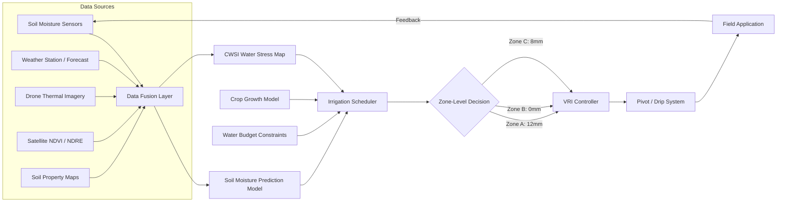

# Soil Health, Water Management, and Precision Irrigation

## Overview

Water is the single most constrained resource in modern agriculture. Irrigation accounts for roughly 70% of global freshwater withdrawals, yet a significant fraction of that water is wasted through imprecise timing, over-application, and uniform treatment of spatially variable fields. At the same time, soil health -- the biological, chemical, and physical condition of soil -- underpins long-term farm productivity. Machine learning is transforming both domains by enabling data-driven, spatially explicit, and temporally adaptive management of soil and water resources.

**Soil moisture prediction** is a foundational task. Soil moisture governs plant water uptake, nutrient transport, and microbial activity. Traditional measurement relies on point sensors (capacitance probes, tensiometers) that capture conditions at a single location and depth. ML models trained on sensor time series, weather forecasts, and soil property data can predict moisture levels hours to days ahead across entire fields. Recurrent neural networks (LSTMs) and temporal convolutional networks are popular architectures because soil moisture exhibits strong temporal autocorrelation. Input features typically include recent precipitation, evapotranspiration estimates, air temperature, humidity, wind speed, and soil texture class.

**Nutrient level estimation** extends the data-driven approach to nitrogen, phosphorus, potassium, and micronutrients. Hyperspectral imaging from drones or satellites can estimate chlorophyll content and leaf nitrogen non-destructively. Models correlating spectral reflectance indices (such as NDRE -- Normalized Difference Red Edge) with ground-truth lab analyses allow farmers to create nutrient maps and apply fertilizers variably rather than uniformly, reducing both cost and environmental runoff.

**Water stress detection** from thermal imagery is a powerful remote sensing application. When plants close their stomata due to water deficit, leaf temperature rises relative to well-watered canopy. Thermal cameras on drones capture canopy temperature maps with sub-meter resolution, and ML classifiers or regression models convert these maps into water stress indices. The Crop Water Stress Index (CWSI) is a widely used metric:

$$\text{CWSI} = \frac{T_c - T_{wet}}{T_{dry} - T_{wet}}$$

where $T_c$ is the observed canopy temperature, $T_{wet}$ is the temperature of a fully transpiring (well-watered) reference, and $T_{dry}$ is the temperature of a non-transpiring reference. Values near 0 indicate no stress; values near 1 indicate severe stress.

**Precision irrigation scheduling** combines soil moisture predictions, weather forecasts, crop growth models, and economic optimization to decide when, where, and how much to irrigate. Variable-rate irrigation (VRI) systems on center pivots can apply different amounts of water to different zones of a field. The optimization problem balances crop yield response to water (often modeled by a water production function) against water cost, energy cost, and environmental constraints. Reinforcement learning approaches have shown promise here, treating each irrigation zone as an environment and learning policies that maximize yield while minimizing water use.

**Causal inference** adds rigor to irrigation decisions. Observational data from farms is confounded: fields that receive more water may differ systematically from those that receive less (e.g., sandier soils drain faster and are irrigated more frequently, but also yield differently). Techniques such as propensity score matching, instrumental variables, and double machine learning help estimate the true causal effect of an additional unit of water on yield, avoiding spurious correlations that could lead to over- or under-irrigation.

**Sustainable water use** is the ultimate goal. AI-driven irrigation management has demonstrated 15-30% water savings in field trials across California almonds, Midwest corn, and Mediterranean vineyards, with no yield penalty or even slight yield gains. These savings compound: less pumping means lower energy costs and reduced aquifer depletion; less runoff means fewer nutrients entering waterways. As climate change intensifies droughts and makes precipitation patterns less predictable, the value of intelligent water management will only grow.

## Key Concepts

- **Soil Moisture Tension (Matric Potential)**: The force with which water is held in soil pores. Measured in kilopascals (kPa); more negative values mean drier soil and harder water extraction for plants.
- **Evapotranspiration (ET)**: The combined water loss from soil evaporation and plant transpiration. Reference ET ($ET_0$) is computed from weather data using the Penman-Monteith equation.
- **Water Balance Equation**: The fundamental accounting of water inputs and outputs for a soil volume: precipitation + irrigation = ET + drainage + runoff + change in storage.
- **Variable-Rate Irrigation (VRI)**: Technology that allows different sprinkler zones on a pivot or drip system to deliver different water amounts based on spatial prescriptions.
- **CWSI (Crop Water Stress Index)**: A normalized thermal index ranging from 0 (no stress) to 1 (maximum stress), derived from canopy temperature measurements.
- **Causal Inference**: Statistical methods that estimate cause-and-effect relationships rather than mere correlations, critical for making actionable irrigation recommendations.
- **Soil Texture Triangle**: Classification of soil into types (sand, silt, clay, loam, etc.) based on particle size distribution, which strongly affects water retention and drainage.

## Technical Details

### Soil Moisture Prediction with LSTM

```python
import numpy as np
import torch
import torch.nn as nn
from torch.utils.data import DataLoader, TensorDataset

class SoilMoistureLSTM(nn.Module):
    """
    LSTM model for predicting soil moisture from weather
    and sensor time series.
    """
    def __init__(self, input_size: int, hidden_size: int = 64,
                 num_layers: int = 2, forecast_horizon: int = 24):
        super().__init__()
        self.lstm = nn.LSTM(
            input_size=input_size,
            hidden_size=hidden_size,
            num_layers=num_layers,
            batch_first=True,
            dropout=0.2
        )
        self.fc = nn.Sequential(
            nn.Linear(hidden_size, 32),
            nn.ReLU(),
            nn.Linear(32, forecast_horizon)
        )

    def forward(self, x):
        # x: (batch, seq_len, input_size)
        lstm_out, _ = self.lstm(x)
        last_hidden = lstm_out[:, -1, :]  # Use final time step
        return self.fc(last_hidden)

def prepare_sequences(data: np.ndarray, targets: np.ndarray,
                      lookback: int = 48):
    """
    Create sliding window sequences for training.
    data: (time_steps, features) -- weather + sensor readings
    targets: (time_steps, forecast_horizon) -- future soil moisture
    """
    X, y = [], []
    for i in range(lookback, len(data)):
        X.append(data[i - lookback:i])
        y.append(targets[i])
    return np.array(X), np.array(y)

# Example usage
# features: [precip, temp, humidity, wind, ET0, current_moisture]
# input_size = 6, forecast 24 hours ahead
model = SoilMoistureLSTM(input_size=6, forecast_horizon=24)
optimizer = torch.optim.Adam(model.parameters(), lr=1e-3)
loss_fn = nn.MSELoss()
```

### Water Balance Equation

The soil water balance for a control volume over time interval $\Delta t$:

$$\Delta S = P + I - ET - D - R$$

where:
- $\Delta S$ is the change in soil water storage (mm)
- $P$ is precipitation (mm)
- $I$ is irrigation applied (mm)
- $ET$ is evapotranspiration (mm)
- $D$ is deep drainage below the root zone (mm)
- $R$ is surface runoff (mm)

The **Penman-Monteith reference evapotranspiration**:

$$ET_0 = \frac{0.408 \, \Delta (R_n - G) + \gamma \frac{900}{T + 273} u_2 (e_s - e_a)}{\Delta + \gamma (1 + 0.34 \, u_2)}$$

where $\Delta$ is the slope of the saturation vapor pressure curve, $R_n$ is net radiation, $G$ is soil heat flux, $\gamma$ is the psychrometric constant, $T$ is mean air temperature, $u_2$ is wind speed at 2 m, and $(e_s - e_a)$ is the vapor pressure deficit.

### Irrigation Optimization Objective

$$\max_{I_1, \dots, I_T} \sum_{t=1}^{T} \left[ p_y \cdot Y(\theta_t) - c_w \cdot I_t - c_e \cdot E(I_t) \right]$$

subject to:

$$\theta_{fc} \geq \theta_t \geq \theta_{pwp}, \quad I_t \geq 0, \quad \sum_{t} I_t \leq W_{budget}$$

where $p_y$ is crop price, $Y(\theta_t)$ is yield as a function of soil moisture $\theta_t$, $c_w$ is water cost, $c_e$ is energy cost, $\theta_{fc}$ is field capacity, $\theta_{pwp}$ is permanent wilting point, and $W_{budget}$ is the seasonal water allocation.

## Diagrams

**Precision Irrigation Decision System**



## Exercises/Projects

1. **Soil Moisture Forecasting**: Download a public soil moisture dataset (e.g., ISMN -- International Soil Moisture Network). Train the LSTM model above to predict moisture 24 hours ahead. Compare against a simple persistence baseline (tomorrow = today). Report RMSE and $R^2$.

2. **CWSI Mapping from Thermal Images**: Using a public thermal drone dataset or simulated thermal raster, compute a per-pixel CWSI map. Threshold the map into three irrigation zones (no stress, moderate stress, high stress) and calculate the area of each zone.

3. **Water Balance Simulation**: Implement the water balance equation in Python. Given a 90-day weather record (daily precipitation and ET0), simulate soil moisture under three scenarios: (a) no irrigation, (b) fixed-schedule irrigation every 5 days, (c) threshold-based irrigation triggered when moisture drops below 50% of field capacity. Compare total water used and days in crop stress.

4. **Causal Effect Estimation**: Generate a synthetic dataset where irrigation amount affects yield but is confounded by soil type. Estimate the causal effect of irrigation using (a) naive regression, (b) propensity score matching, and (c) double ML. Compare the estimates and discuss bias.

5. **RL-Based Irrigation Policy**: Model a single irrigation zone as a Markov Decision Process with states (soil moisture, crop stage, weather forecast), actions (irrigation amounts), and rewards (yield minus costs). Train a simple Q-learning agent and compare its policy to the threshold-based heuristic from Exercise 3.

## Further Reading

- Allen, R. G., et al. (1998). "Crop Evapotranspiration: Guidelines for Computing Crop Water Requirements." *FAO Irrigation and Drainage Paper 56*.
- Goldstein, A., et al. (2018). "Applying machine learning on sensor data for irrigation recommendations: revealing the agronomist's tacit knowledge." *Precision Agriculture*, 19, 421-444.
- Chlingaryan, A., Sukkarieh, S., & Whelan, B. (2018). "Machine learning approaches for crop yield prediction and nitrogen status estimation in precision agriculture." *Computers and Electronics in Agriculture*, 151, 61-69.
- International Soil Moisture Network: [https://ismn.geo.tuwien.ac.at/](https://ismn.geo.tuwien.ac.at/)
- Athey, S., & Imbens, G. W. (2019). "Machine Learning Methods That Economists Should Know About." *Annual Review of Economics*, 11, 685-725.
