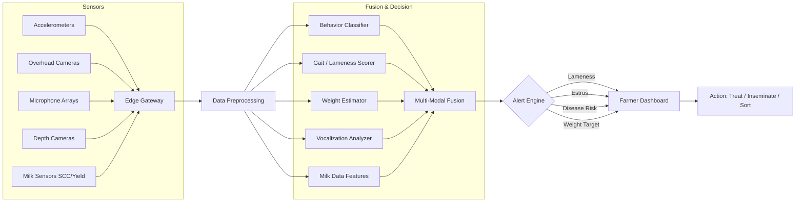

# Livestock Monitoring and Precision Animal Husbandry

## Overview

Precision livestock farming (PLF) applies sensors, computer vision, and machine learning to continuously monitor individual animals, detect health and welfare issues early, and optimize production. Traditional animal husbandry relies on periodic manual observation -- a skilled stockperson walking through a barn, visually checking animals for signs of distress, lameness, or disease. But as herd sizes grow (modern dairy farms may manage 1,000+ cows, poultry operations 50,000+ birds), the human eye cannot track every animal. AI-powered monitoring fills this gap, providing 24/7 automated surveillance that can alert farmers to problems hours or days before they would otherwise be noticed.

**Behavior recognition** is a cornerstone application. Every deviation from normal behavior -- reduced feeding, decreased rumination, increased lying time, abnormal gait -- can signal illness, injury, heat stress, or estrus (readiness to breed). Accelerometer-based activity sensors, already widely deployed in dairy (e.g., SCR Heatime, Allflex SenseHub), classify behaviors such as eating, ruminating, resting, and walking by analyzing tri-axial acceleration patterns. Machine learning classifiers -- random forests, gradient-boosted trees, and increasingly LSTMs and 1D-CNNs -- process windowed accelerometer data to produce per-minute behavior labels. Accuracy for major behavior classes (resting vs. active vs. ruminating) routinely exceeds 90%.

**Computer vision** enables non-contact monitoring at scale. Overhead cameras in barns can track individual animals using object detection (YOLO, Faster R-CNN) and multi-object tracking (SORT, DeepSORT). Once tracked, each animal's trajectory reveals spatial preferences, social interactions, and locomotion patterns. Lameness detection from video is an active research area: gait analysis algorithms score the symmetry of stride, head bob amplitude, and back arch curvature. Studies have shown that deep learning models analyzing top-down video can detect lame cows with sensitivity above 85%, often catching cases that human observers miss in early stages.

**Weight estimation** from images eliminates the stress and labor of physical weighing. Depth cameras (e.g., Intel RealSense, Azure Kinect) mounted above walkways capture 3D point clouds of animals as they pass underneath. Regression models -- from simple linear models on body dimensions to convolutional neural networks on depth images -- predict live weight with mean absolute errors of 3-5% relative to scale weight. This enables daily weight tracking, which is especially valuable in beef cattle and swine operations for optimizing market timing.

**Disease early warning** integrates multiple data streams. In dairy, a drop in milk yield, a rise in somatic cell count, a decrease in rumination time, and an increase in body temperature may individually be ambiguous but collectively form a strong signal for mastitis. Multi-input ML models that fuse milk sensor data, activity data, and environmental data can flag at-risk animals 1-3 days before clinical signs appear. In poultry, audio-based monitoring is gaining traction: microphone arrays in broiler houses detect abnormal vocalizations (respiratory distress sounds) associated with respiratory diseases like infectious bronchitis, enabling flock-level health assessment without handling individual birds.

**Sensor fusion** is the technical backbone of PLF. A single sensor modality is rarely sufficient for robust inference. Combining accelerometers (movement patterns), microphones (vocalizations, rumination sounds), cameras (posture, gait, body condition), temperature sensors (fever detection), and environmental sensors (barn temperature, humidity, ammonia levels) through early or late fusion architectures yields far more reliable classifications and predictions than any single source.

**Applications span species**. In **dairy**, the focus is on estrus detection, lameness, mastitis, and feed efficiency. In **swine**, tail-biting prediction, respiratory disease, and growth monitoring dominate. In **poultry**, flock-level metrics -- activity distribution, feed and water intake patterns, mortality rates -- are analyzed because individual bird tracking is impractical at commercial scale. In **aquaculture**, underwater cameras and hydroacoustic sensors monitor fish behavior (swimming patterns, feeding response), and ML models detect sea lice infestations, oxygen stress, and abnormal mortality events.

The welfare dimension matters. Consumers and regulators increasingly demand verifiable animal welfare standards. Automated monitoring provides objective, continuous, auditable data that supports welfare certification and helps farmers demonstrate compliance.

## Key Concepts

- **Precision Livestock Farming (PLF)**: The use of sensors, data analytics, and automation to manage individual animals or small groups, optimizing health, welfare, and production.
- **Tri-Axial Accelerometry**: Measuring acceleration along three orthogonal axes (x, y, z) to classify animal movement patterns. Typically sampled at 10-50 Hz and summarized into features over time windows.
- **Body Condition Score (BCS)**: A visual or image-based assessment of an animal's fat reserves, typically on a 1-5 scale for dairy cattle. Automated BCS from 3D cameras helps monitor nutritional status.
- **Locomotion Scoring**: Rating an animal's gait quality on a scale (e.g., 1-5 for cattle) to detect lameness. Automated scoring uses video-based pose estimation and gait symmetry metrics.
- **Somatic Cell Count (SCC)**: A measure of white blood cells in milk, used as an indicator of udder infection (mastitis). Inline sensors measure SCC at each milking.
- **Sensor Fusion**: Combining heterogeneous sensor data at the feature level (early fusion) or decision level (late fusion) to improve classification robustness.
- **DeepSORT**: A multi-object tracking algorithm that combines a deep appearance descriptor with the SORT (Simple Online and Realtime Tracking) framework for identity-preserving tracking.

## Technical Details

### Livestock Behavior Classification from Accelerometer Data

```python
import numpy as np
from sklearn.ensemble import GradientBoostingClassifier
from sklearn.model_selection import cross_val_score
from sklearn.metrics import classification_report

def extract_features(window: np.ndarray) -> np.ndarray:
    """
    Extract statistical features from a tri-axial accelerometer window.
    window: shape (n_samples, 3) for axes [x, y, z]
    Returns: 1D feature vector
    """
    features = []
    for axis in range(3):
        signal = window[:, axis]
        features.extend([
            np.mean(signal),
            np.std(signal),
            np.min(signal),
            np.max(signal),
            np.percentile(signal, 25),
            np.percentile(signal, 75),
            np.sqrt(np.mean(signal**2)),  # RMS
        ])
    # Cross-axis features
    magnitude = np.sqrt(np.sum(window**2, axis=1))
    features.extend([
        np.mean(magnitude),
        np.std(magnitude),
        np.max(magnitude) - np.min(magnitude),  # Dynamic range
    ])
    # Frequency domain: dominant frequency via FFT
    for axis in range(3):
        fft_vals = np.abs(np.fft.rfft(window[:, axis]))
        freqs = np.fft.rfftfreq(len(window[:, axis]))
        features.append(freqs[np.argmax(fft_vals[1:]) + 1])
    return np.array(features)

def classify_behaviors(X_windows: list, labels: np.ndarray):
    """
    Train a gradient boosted classifier on accelerometer features.
    X_windows: list of (n_samples, 3) arrays (one per time window)
    labels: behavior class per window (0=resting, 1=walking, 2=ruminating, 3=eating)
    """
    X_features = np.array([extract_features(w) for w in X_windows])

    clf = GradientBoostingClassifier(
        n_estimators=200,
        max_depth=5,
        learning_rate=0.1,
        random_state=42
    )
    scores = cross_val_score(clf, X_features, labels, cv=5, scoring='f1_macro')
    print(f"5-Fold Macro F1: {scores.mean():.3f} +/- {scores.std():.3f}")

    clf.fit(X_features, labels)
    return clf
```

### Sensor Fusion: Weighted Decision Fusion

For $K$ classifiers (one per sensor modality), each producing a probability distribution over $C$ classes, the fused prediction uses reliability-weighted averaging:

$$P_{\text{fused}}(c) = \frac{\sum_{k=1}^{K} w_k \cdot P_k(c)}{\sum_{k=1}^{K} w_k}, \quad c \in \{1, \dots, C\}$$

where $w_k$ is the reliability weight for sensor $k$, often set proportional to that modality's validation accuracy:

$$w_k = \frac{\text{Acc}_k}{\sum_{j=1}^{K} \text{Acc}_j}$$

The final predicted class is:

$$\hat{c} = \arg\max_c \; P_{\text{fused}}(c)$$

### Weight Estimation Regression

Given depth-image-derived body measurements $\mathbf{x} = [l, w, h, A]$ (length, width, height, dorsal area), a simple allometric model predicts live weight:

$$\hat{W} = \beta_0 + \beta_1 \cdot l \cdot w \cdot h + \beta_2 \cdot A + \epsilon$$

More accurate CNN-based approaches operate directly on the depth image:

$$\hat{W} = f_\theta(\mathbf{I}_{\text{depth}})$$

where $f_\theta$ is a regression CNN (e.g., ResNet-18 with the final layer outputting a single scalar) trained to minimize:

$$\mathcal{L} = \frac{1}{N} \sum_{i=1}^{N} \left( W_i - \hat{W}_i \right)^2$$

## Diagrams

**Precision Livestock Monitoring Pipeline**



## Exercises/Projects

1. **Accelerometer Behavior Classification**: Download a public cattle accelerometer dataset (e.g., from the UCI ML Repository or published PLF studies). Extract the features described above, train a gradient-boosted classifier, and report per-class precision, recall, and F1. Experiment with window sizes (5s, 10s, 30s).

2. **Video-Based Animal Tracking**: Use a pre-trained YOLOv8 model to detect pigs or cows in overhead video frames. Integrate detections with the SORT algorithm to produce identity-consistent tracks. Visualize trajectories and compute per-animal distance traveled per hour.

3. **Depth-Image Weight Estimation**: Using a synthetic or public depth-image dataset of livestock, train a ResNet-18 regression model to predict body weight from dorsal depth images. Report MAE and MAPE. Discuss how camera placement and animal posture affect accuracy.

4. **Anomaly Detection for Health Alerts**: Given a time series of daily rumination minutes per cow, implement an anomaly detection system using a rolling z-score and an isolation forest. Compare the two approaches on their ability to flag the onset of simulated illness (modeled as a 20% drop in rumination over 2 days).

5. **Sensor Fusion Experiment**: Simulate three sensor modalities producing class probabilities for a 4-class behavior classification problem. Implement the weighted decision fusion formula above. Show that fusion outperforms each individual modality, and explore how degrading one sensor's accuracy affects the fused result.

## Further Reading

- Neethirajan, S. (2020). "The role of sensors, big data and machine learning in modern animal farming." *Sensing and Bio-Sensing Research*, 29, 100367.
- Wurtz, K., et al. (2019). "Recording behaviour of indoor-housed farm animals automatically using machine vision technology: A systematic review." *PLoS ONE*, 14(12), e0226669.
- Kamilaris, A., & Prenafeta-Boldu, F. X. (2018). "Deep learning in agriculture: A survey." *Computers and Electronics in Agriculture*, 147, 70-90.
- Van Hertem, T., et al. (2014). "Lameness detection based on multivariate continuous sensing of milk yield, rumination, and neck activity." *Journal of Dairy Science*, 97(7), 4547-4555.
- Li, D., et al. (2021). "Review of Computer Vision Technologies for Fish Farming." *Reviews in Aquaculture*, 13(1), 1-26.
