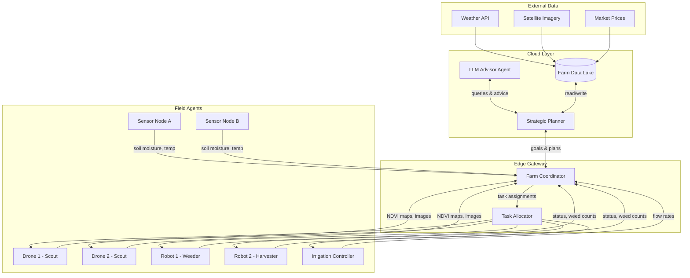

## Self-Driving Farms and Agricultural Agents

## Overview

The concept of a self-driving farm represents the convergence of decades of progress in robotics, sensor networks, machine learning, and autonomous systems. Just as self-driving cars coordinate perception, planning, and control to navigate roads, a self-driving farm coordinates dozens of heterogeneous agents -- ground robots, aerial drones, stationary sensors, irrigation controllers, and human operators -- to manage the full lifecycle of crop production. The challenge is not merely automating individual tasks but orchestrating an entire ecosystem of intelligent agents that must cooperate under uncertainty, resource constraints, and the relentless variability of weather, soil, and biology.

At the heart of this vision is the **multi-agent system (MAS)**: a framework in which each agent possesses local perception and decision-making capabilities while contributing to a shared global objective such as maximizing yield, minimizing water usage, or reducing chemical inputs. A fleet of weeding robots, for instance, must divide a field among themselves, avoid collisions, report weed density observations to a central planner, and request resupply when their herbicide tanks run low. Meanwhile, a drone conducting an aerial survey relays updated NDVI maps that cause the central planner to reassign robots to newly identified hotspots. The coordination problem grows combinatorially with the number of agents and tasks, making classical scheduling algorithms insufficient and motivating the use of reinforcement learning, auction-based task allocation, and consensus protocols.

**LLM-powered agricultural advisors** add a new dimension to farm autonomy. Large language models fine-tuned on agronomic literature, extension service bulletins, and regional growing guides can serve as conversational decision-support agents. A farmer might ask, "Given the 10-day forecast and my soil moisture readings, should I delay planting soybeans?" The LLM agent retrieves relevant sensor data via tool calls, queries a crop growth simulation, and synthesizes a recommendation grounded in both data and domain knowledge. These agents lower the barrier to precision agriculture by translating complex model outputs into actionable, natural-language advice. When integrated into a multi-agent architecture, the LLM advisor becomes the "executive layer" that interprets high-level goals and delegates tasks to specialized subsystems.

**Real-time decision making** is critical because agriculture operates on tight biological windows. Planting too early risks frost damage; irrigating too late during a heat wave causes irreversible yield loss; harvesting a day after optimal maturity degrades grain quality. A self-driving farm must fuse streaming data from soil moisture probes, weather APIs, satellite imagery, and on-board robot cameras into a coherent situational picture, then act within minutes. Edge computing on the robots themselves handles latency-sensitive control loops (obstacle avoidance, implement steering), while cloud-based planners handle strategic decisions (which field to harvest next, when to order inputs). This two-tier architecture balances responsiveness with computational depth.

The economic case is compelling. Labor shortages in agriculture are acute and worsening globally. Autonomous systems can operate around the clock, in darkness, and in conditions unsafe for human workers. Early adopters report 15-30% reductions in input costs through precision application and 10-20% yield gains from timelier operations. However, significant hurdles remain: reliable connectivity in rural areas, interoperability between equipment manufacturers, regulatory frameworks for autonomous machinery on public roads, and the cultural shift required for farmers to trust algorithmic decisions. Addressing these challenges demands not only better algorithms but also open standards, robust safety systems, and transparent explainability in agent decision making.

## Key Concepts

- **Multi-Agent System (MAS)**: A collection of autonomous agents that interact, share information, and coordinate actions to achieve individual or collective goals. In agriculture, agents include robots, drones, sensors, and software planners.
- **Task Allocation**: The process of assigning tasks (e.g., spray zone A, scout field B) to available agents. Common approaches include market-based auctions, contract nets, and centralized optimization.
- **Consensus Protocol**: An algorithm by which distributed agents agree on shared state (e.g., a merged field map) despite communication delays and partial observability.
- **LLM-Powered Advisor**: A large language model augmented with tool-use capabilities (sensor queries, simulation APIs) that provides natural-language agronomic recommendations.
- **Edge-Cloud Architecture**: A two-tier computing model where time-critical inference runs on edge devices (robots, gateways) and strategic planning runs in the cloud.
- **Operational Window**: The narrow time period during which an agricultural action (planting, spraying, harvesting) is agronomically optimal. Missing the window incurs yield or quality penalties.
- **Fleet Coordination**: Managing multiple robots working simultaneously in a field, including path planning, collision avoidance, and dynamic re-tasking.

## Technical Details

### Multi-Agent Optimization

In a fleet of $N$ agents, we assign $M$ tasks to minimize total cost. Let $c_{ij}$ represent the cost of agent $i$ completing task $j$, and $x_{ij} \in \{0, 1\}$ be the assignment variable:

$$\min \sum_{i=1}^{N} \sum_{j=1}^{M} c_{ij} \, x_{ij}$$

subject to:

$$\sum_{i=1}^{N} x_{ij} = 1 \quad \forall \, j \in \{1, \dots, M\}$$

$$\sum_{j=1}^{M} x_{ij} \leq K_i \quad \forall \, i \in \{1, \dots, N\}$$

where $K_i$ is the maximum number of tasks agent $i$ can handle concurrently. This is an instance of the **generalized assignment problem** and can be solved with integer linear programming or approximated via auction algorithms in real time.

The utility of an LLM advisor action $a$ given farm state $s$ can be modeled as:

$$U(a \mid s) = \alpha \, Y(a, s) - \beta \, C(a) - \gamma \, R(a, s)$$

where $Y$ is expected yield impact, $C$ is input cost, $R$ is risk (e.g., probability of frost damage), and $\alpha, \beta, \gamma$ are farmer-specified preference weights.

### Python: Multi-Agent Farm Coordination System

```python
import asyncio
from dataclasses import dataclass, field
from enum import Enum
from typing import Optional
import random

class AgentType(Enum):
    DRONE = "drone"
    GROUND_ROBOT = "ground_robot"
    SENSOR_NODE = "sensor_node"
    IRRIGATION_CTRL = "irrigation_controller"
    LLM_ADVISOR = "llm_advisor"

class TaskType(Enum):
    SCOUT = "scout"
    WEED = "weed"
    IRRIGATE = "irrigate"
    HARVEST = "harvest"
    ANALYZE = "analyze"

@dataclass
class Task:
    task_id: int
    task_type: TaskType
    field_zone: str
    priority: float  # 0-1, higher = more urgent
    assigned_to: Optional[int] = None

@dataclass
class FarmAgent:
    agent_id: int
    agent_type: AgentType
    capacity: int = 3
    current_tasks: list = field(default_factory=list)
    battery_level: float = 1.0
    position: tuple = (0.0, 0.0)

    def can_accept(self, task: Task) -> bool:
        if len(self.current_tasks) >= self.capacity:
            return False
        if self.battery_level < 0.2:
            return False
        compatibility = {
            AgentType.DRONE: [TaskType.SCOUT, TaskType.ANALYZE],
            AgentType.GROUND_ROBOT: [TaskType.WEED, TaskType.HARVEST],
            AgentType.IRRIGATION_CTRL: [TaskType.IRRIGATE],
            AgentType.SENSOR_NODE: [TaskType.ANALYZE],
            AgentType.LLM_ADVISOR: [TaskType.ANALYZE],
        }
        return task.task_type in compatibility.get(self.agent_type, [])

    def bid(self, task: Task) -> float:
        """Return a cost bid for the task (lower is better)."""
        distance = ((self.position[0] - hash(task.field_zone) % 10) ** 2) ** 0.5
        load_penalty = len(self.current_tasks) / self.capacity
        return distance + load_penalty * 5.0

class FarmCoordinator:
    """Central coordinator using auction-based task allocation."""

    def __init__(self):
        self.agents: dict[int, FarmAgent] = {}
        self.task_queue: list[Task] = []
        self.completed: list[Task] = []

    def register_agent(self, agent: FarmAgent):
        self.agents[agent.agent_id] = agent

    def submit_task(self, task: Task):
        self.task_queue.append(task)

    def allocate_tasks(self):
        """Auction-based allocation: each eligible agent bids, lowest wins."""
        unassigned = [t for t in self.task_queue if t.assigned_to is None]
        # Sort by priority descending so urgent tasks are allocated first
        unassigned.sort(key=lambda t: -t.priority)

        for task in unassigned:
            best_agent, best_bid = None, float("inf")
            for agent in self.agents.values():
                if agent.can_accept(task):
                    b = agent.bid(task)
                    if b < best_bid:
                        best_bid = b
                        best_agent = agent
            if best_agent is not None:
                task.assigned_to = best_agent.agent_id
                best_agent.current_tasks.append(task)

    async def run_cycle(self):
        """Simulate one coordination cycle."""
        self.allocate_tasks()
        for agent in self.agents.values():
            finished = []
            for task in agent.current_tasks:
                # Simulate task completion with some probability
                if random.random() < 0.4:
                    finished.append(task)
                    agent.battery_level -= 0.05
            for task in finished:
                agent.current_tasks.remove(task)
                self.task_queue.remove(task)
                self.completed.append(task)

    def status_report(self) -> str:
        lines = [f"Pending: {len(self.task_queue)}, Completed: {len(self.completed)}"]
        for a in self.agents.values():
            lines.append(
                f"  Agent {a.agent_id} ({a.agent_type.value}): "
                f"{len(a.current_tasks)} tasks, battery={a.battery_level:.0%}"
            )
        return "\n".join(lines)

# --- Example usage ---
async def main():
    coordinator = FarmCoordinator()

    # Register a heterogeneous fleet
    coordinator.register_agent(FarmAgent(1, AgentType.DRONE, position=(0, 0)))
    coordinator.register_agent(FarmAgent(2, AgentType.GROUND_ROBOT, position=(5, 3)))
    coordinator.register_agent(FarmAgent(3, AgentType.GROUND_ROBOT, position=(2, 8)))
    coordinator.register_agent(FarmAgent(4, AgentType.IRRIGATION_CTRL, position=(4, 4)))

    # Submit tasks
    zones = ["north", "south", "east", "west"]
    for i, (tt, zone) in enumerate(
        [(TaskType.SCOUT, "north"), (TaskType.WEED, "south"),
         (TaskType.IRRIGATE, "east"), (TaskType.HARVEST, "west"),
         (TaskType.SCOUT, "south"), (TaskType.WEED, "north")]
    ):
        coordinator.submit_task(Task(i, tt, zone, priority=random.random()))

    # Run coordination cycles
    for cycle in range(5):
        await coordinator.run_cycle()
        print(f"--- Cycle {cycle + 1} ---")
        print(coordinator.status_report())

if __name__ == "__main__":
    asyncio.run(main())
```

## Diagrams

**Multi-Agent Farm Architecture**



## Exercises/Projects

1. **Auction Simulator**: Extend the `FarmCoordinator` to support second-price (Vickrey) auctions. Compare allocation efficiency against the simple lowest-bid mechanism using randomly generated task sets.

2. **LLM Advisor Prototype**: Build a simple LLM-based farm advisor using an API of your choice. Give it tools to query a mock sensor database and a weather API. Test it with questions like "Should I irrigate field B today?"

3. **Fleet Path Planning**: Implement a collision-free path planner for three ground robots operating in the same field. Use a grid representation and the A* algorithm with reservation tables to avoid spatial-temporal conflicts.

4. **Edge vs. Cloud Latency Analysis**: Simulate a decision pipeline where sensor readings must be processed and acted upon. Measure how varying network latency (10ms to 500ms) affects irrigation response time and estimate the yield impact of delayed action during a heat event.

5. **Dashboard Design**: Create a web-based farm dashboard (using Streamlit or Dash) that visualizes agent positions, task assignments, battery levels, and field sensor readings in real time.

## Further Reading

- Fountas, S., et al. "Agricultural Robotics for Field Operations." *Sensors*, 2020.
- Albiero, D., et al. "Swarm Robotics in Agriculture: A Survey." *Computers and Electronics in Agriculture*, 2022.
- Wooldridge, M. *An Introduction to Multi-Agent Systems*. Wiley, 2009.
- Kamilaris, A. and Prenafeta-Boldu, F.X. "Deep Learning in Agriculture: A Survey." *Computers and Electronics in Agriculture*, 2018.
- OpenAI. "Function Calling and Tool Use in LLMs." OpenAI Documentation, 2024.
- ROS Agriculture Community: [ros-agriculture.github.io](https://ros-agriculture.github.io)
