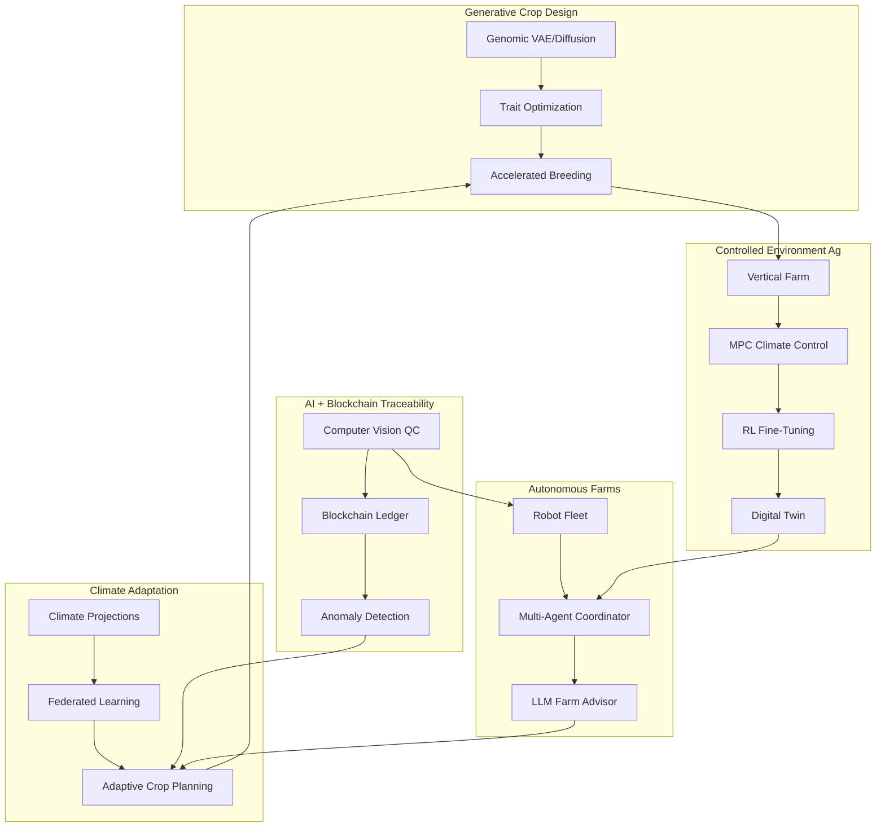

# Frontiers in AI for Agriculture

## Overview

Agriculture stands at the threshold of a transformation driven by rapidly maturing AI technologies that go far beyond the precision farming tools already in commercial use. The frontiers described in this lesson are not speculative science fiction; many are in active research or early pilot deployment. Understanding these emerging directions is essential for practitioners, researchers, and policymakers who will shape the next decade of food production.

**Generative AI for crop design** is perhaps the most ambitious frontier. Traditional plant breeding relies on crossing varieties and selecting desirable offspring over many growing seasons -- a process that can take 10 to 15 years to release a new cultivar. Generative models, including variational autoencoders (VAEs) and diffusion models trained on genomic sequences, protein structures, and phenotypic databases, can propose novel gene combinations that optimize for multiple traits simultaneously: drought tolerance, disease resistance, nutritional density, and yield. While the biological validation pipeline remains slow, generative AI dramatically narrows the search space, guiding breeders toward the most promising candidates and cutting development timelines in half.

**Vertical farming and controlled environment agriculture (CEA)** present an ideal testbed for AI because every variable -- light spectrum, temperature, humidity, CO2 concentration, nutrient solution composition -- is measurable and controllable. Reinforcement learning agents can learn optimal climate "recipes" for specific crops by running thousands of simulated growth cycles, then fine-tune in real greenhouses. Computer vision monitors plant morphology daily, detecting stress signals invisible to the human eye. The economics of vertical farming remain challenging due to energy costs, but AI-driven optimization of LED lighting schedules and HVAC systems is reducing energy consumption by 20-40% in state-of-the-art facilities.

**Blockchain combined with AI** addresses the growing consumer and regulatory demand for supply chain traceability. An AI system at each node of the supply chain -- farm, processor, distributor, retailer -- classifies and verifies product quality using computer vision and spectroscopy, then writes immutable records to a distributed ledger. Anomaly detection models flag inconsistencies (e.g., a shipment claiming high-grade produce that image analysis scores as below threshold), reducing fraud and improving food safety. The combination is more powerful than either technology alone: blockchain provides the trust infrastructure, while AI provides the perceptual intelligence.

**Climate change adaptation** is an existential priority. Shifting rainfall patterns, increased frequency of extreme weather events, and expanding pest ranges demand that farming systems become far more adaptive. AI models that fuse climate projections, soil data, and crop physiology can recommend dynamic planting calendars, suggest alternative crops suited to emerging climate envelopes, and optimize insurance products through more accurate risk modeling. Federated learning allows models to train across thousands of farms without centralizing sensitive data, enabling global-scale climate adaptation intelligence.

**Autonomous greenhouses** extend the self-driving farm concept into fully enclosed environments. Projects like the Autonomous Greenhouse Challenge have demonstrated that AI-controlled greenhouses can match or exceed human grower performance on net profit while reducing resource use. These systems combine model predictive control (MPC) for climate management, computer vision for growth monitoring, and reinforcement learning for long-horizon harvest scheduling. As the technology matures, autonomous greenhouses could enable year-round local food production in urban areas, deserts, and extreme climates.

Finally, **self-driving farm experiments** at scale are underway. Companies and research institutions are operating farms where every major operation -- tillage, planting, spraying, scouting, and harvesting -- is performed by autonomous machines coordinated by a central AI. These living laboratories generate massive datasets that feed continuous model improvement, creating a flywheel of automation and intelligence. The lessons learned here will define agricultural practice for generations to come.

## Key Concepts

- **Generative Crop Design**: Using generative models (VAEs, GANs, diffusion models) to propose novel genetic combinations that optimize multiple agronomic traits simultaneously.
- **Controlled Environment Agriculture (CEA)**: Growing crops in enclosed facilities (greenhouses, vertical farms) where environmental variables are precisely monitored and controlled.
- **Climate Recipe**: A time-varying profile of temperature, humidity, CO2, and light intensity optimized for a specific crop and growth stage in a CEA setting.
- **Blockchain Traceability**: Using distributed ledger technology to create tamper-proof records of agricultural products as they move through the supply chain.
- **Federated Learning**: A machine learning approach where models are trained across decentralized data sources (e.g., individual farms) without sharing raw data, preserving privacy while enabling collective learning.
- **Model Predictive Control (MPC)**: An advanced control strategy that uses a dynamic model of the system (e.g., greenhouse climate) to optimize control inputs over a receding time horizon.
- **Digital Twin**: A virtual replica of a physical farm or greenhouse that runs in parallel, enabling simulation-based testing of management strategies before real-world deployment.
- **Climate Envelope Shift**: The geographic displacement of conditions suitable for a given crop due to climate change, requiring adaptation in crop selection and management.

## Technical Details

### Generative Crop Design with a VAE

A variational autoencoder learns a latent representation $z$ of crop genotypes. Given an input genotype vector $x$, the encoder produces parameters of a posterior $q_\phi(z \mid x) = \mathcal{N}(\mu_\phi(x), \sigma^2_\phi(x))$. The decoder reconstructs $\hat{x}$ from $z$. The loss function combines reconstruction and a KL-divergence regularizer:

$$\mathcal{L}(\theta, \phi; x) = -\mathbb{E}_{q_\phi(z|x)}[\log p_\theta(x|z)] + \mathrm{KL}(q_\phi(z|x) \| p(z))$$

To generate crop designs optimized for a trait $y$ (e.g., drought tolerance score), we train a predictor $f(z) \approx y$ in latent space and perform gradient ascent:

$$z^* = \arg\max_z \; f(z) - \lambda \|z\|^2$$

The regularization term $\lambda \|z\|^2$ keeps proposals near the learned data manifold, ensuring biological plausibility.

### Vertical Farm Climate Optimization

For a greenhouse with state $s_t = (T_t, H_t, C_t, L_t)$ (temperature, humidity, CO2, light), control input $u_t$, and crop growth model $g$, the MPC objective over horizon $H$ is:

$$\min_{u_t, \dots, u_{t+H}} \sum_{k=0}^{H} \left[ -w_y \, g(s_{t+k}) + w_e \, E(u_{t+k}) + w_s \, \|s_{t+k} - s^*\|^2 \right]$$

where $g(s)$ is predicted biomass gain, $E(u)$ is energy cost, $s^*$ is the target climate setpoint, and $w_y, w_e, w_s$ are objective weights.

### Python: Vertical Farming Climate Optimization

```python
import numpy as np
from dataclasses import dataclass

@dataclass
class GreenhouseState:
    temperature: float    # Celsius
    humidity: float       # relative, 0-1
    co2: float            # ppm
    light: float          # mol/m2/day (DLI)
    biomass: float        # g/m2

    def as_vector(self) -> np.ndarray:
        return np.array([self.temperature, self.humidity, self.co2, self.light])


class CropGrowthModel:
    """Simplified crop growth model for lettuce in a vertical farm."""

    def __init__(self):
        # Optimal ranges for lettuce
        self.t_opt = 22.0    # optimal temperature
        self.h_opt = 0.70    # optimal humidity
        self.co2_opt = 1000  # optimal CO2 ppm
        self.dli_opt = 17.0  # optimal daily light integral

    def growth_rate(self, state: GreenhouseState) -> float:
        """Compute daily biomass gain (g/m2/day) based on deviation from optimum."""
        max_rate = 25.0  # g/m2/day under perfect conditions
        penalties = [
            -0.05 * (state.temperature - self.t_opt) ** 2,
            -50.0 * (state.humidity - self.h_opt) ** 2,
            -0.000005 * (state.co2 - self.co2_opt) ** 2,
            -0.1 * (state.light - self.dli_opt) ** 2,
        ]
        return max(0.0, max_rate + sum(penalties))


class MPCController:
    """Simple model predictive controller for greenhouse climate."""

    def __init__(self, growth_model: CropGrowthModel, horizon: int = 6):
        self.model = growth_model
        self.horizon = horizon
        # Weights: yield, energy cost, stability
        self.w_yield = 1.0
        self.w_energy = 0.3
        self.w_stability = 0.1
        # Target setpoint
        self.setpoint = np.array([22.0, 0.70, 1000.0, 17.0])

    def energy_cost(self, control: np.ndarray) -> float:
        """Estimate energy cost of a control action (heating, humidifier, CO2 injection, lighting)."""
        # Rough cost coefficients per unit change
        coeffs = np.array([0.5, 0.2, 0.001, 0.8])
        return float(np.sum(coeffs * np.abs(control)))

    def evaluate_sequence(self, initial_state: GreenhouseState,
                          control_sequence: np.ndarray) -> float:
        """Evaluate total objective over a control sequence.
        control_sequence: shape (horizon, 4) -- adjustments to [T, H, CO2, L]
        """
        state_vec = initial_state.as_vector().copy()
        total_obj = 0.0
        for k in range(self.horizon):
            state_vec = state_vec + control_sequence[k]
            # Clamp to physical bounds
            state_vec = np.clip(state_vec, [15, 0.3, 400, 0], [30, 0.95, 1500, 24])
            gs = GreenhouseState(*state_vec, biomass=0)
            growth = self.model.growth_rate(gs)
            energy = self.energy_cost(control_sequence[k])
            stability = float(np.sum((state_vec - self.setpoint) ** 2))
            total_obj += (
                self.w_yield * growth
                - self.w_energy * energy
                - self.w_stability * stability
            )
        return total_obj

    def optimize(self, state: GreenhouseState, n_samples: int = 2000) -> np.ndarray:
        """Random shooting optimizer: sample control sequences and pick the best."""
        best_obj = -np.inf
        best_seq = np.zeros((self.horizon, 4))
        for _ in range(n_samples):
            seq = np.random.randn(self.horizon, 4) * np.array([1.5, 0.05, 50, 2.0])
            obj = self.evaluate_sequence(state, seq)
            if obj > best_obj:
                best_obj = obj
                best_seq = seq
        return best_seq


# --- Example usage ---
def main():
    growth_model = CropGrowthModel()
    controller = MPCController(growth_model, horizon=6)

    state = GreenhouseState(
        temperature=20.0, humidity=0.60, co2=800, light=14.0, biomass=50.0
    )

    print(f"Initial state: T={state.temperature}, H={state.humidity}, "
          f"CO2={state.co2}, L={state.light}")
    print(f"Current growth rate: {growth_model.growth_rate(state):.2f} g/m2/day\n")

    best_controls = controller.optimize(state, n_samples=5000)
    first_action = best_controls[0]
    print(f"Optimal first action (deltas): dT={first_action[0]:+.2f}, "
          f"dH={first_action[1]:+.3f}, dCO2={first_action[2]:+.0f}, "
          f"dL={first_action[3]:+.2f}")

    # Apply first action
    new_vec = state.as_vector() + first_action
    new_vec = np.clip(new_vec, [15, 0.3, 400, 0], [30, 0.95, 1500, 24])
    new_state = GreenhouseState(*new_vec, biomass=state.biomass)
    print(f"\nNew state: T={new_state.temperature:.1f}, H={new_state.humidity:.2f}, "
          f"CO2={new_state.co2:.0f}, L={new_state.light:.1f}")
    print(f"New growth rate: {growth_model.growth_rate(new_state):.2f} g/m2/day")

if __name__ == "__main__":
    main()
```

### Python: Supply Chain Traceability Record

```python
import hashlib
import json
from datetime import datetime
from dataclasses import dataclass, asdict

@dataclass
class ProduceRecord:
    """A record representing one node in the supply chain."""
    product_id: str
    node_type: str           # farm, processor, distributor, retailer
    timestamp: str
    location: str
    quality_score: float     # AI vision-based quality grade 0-1
    temperature_log: list    # cold chain readings
    previous_hash: str

    def compute_hash(self) -> str:
        record_str = json.dumps(asdict(self), sort_keys=True)
        return hashlib.sha256(record_str.encode()).hexdigest()


def build_chain(records: list[dict]) -> list[ProduceRecord]:
    """Build a simple hash chain from supply chain events."""
    chain = []
    prev_hash = "0" * 64
    for r in records:
        record = ProduceRecord(**r, previous_hash=prev_hash)
        prev_hash = record.compute_hash()
        chain.append(record)
    return chain


def verify_chain(chain: list[ProduceRecord]) -> bool:
    """Verify integrity of the hash chain."""
    for i in range(1, len(chain)):
        expected = chain[i - 1].compute_hash()
        if chain[i].previous_hash != expected:
            return False
    return True
```

## Diagrams

**Future AI Agriculture Landscape**



## Exercises/Projects

1. **Latent Space Crop Explorer**: Train a simple VAE on a synthetic dataset of "genotype" vectors (random feature vectors with correlated trait scores). Visualize the 2D latent space colored by trait value, and use gradient ascent to find high-trait regions.

2. **Greenhouse MPC Tuning**: Using the `MPCController` above, experiment with the objective weights ($w_y$, $w_e$, $w_s$). Plot how each weight configuration affects cumulative biomass gain vs. total energy expenditure over a simulated 30-day growing cycle.

3. **Supply Chain Anomaly Detector**: Generate a synthetic supply chain dataset with normal and tampered records. Train a simple classifier to detect quality score inconsistencies between adjacent nodes. Measure precision and recall.

4. **Climate Adaptation Dashboard**: Use publicly available crop suitability maps and CMIP6 climate projections to build an interactive map showing how the viable growing region for a chosen crop (e.g., coffee, wheat) shifts over time under different emissions scenarios.

5. **Federated Learning Simulation**: Implement federated averaging across 5 simulated farms, each with a local dataset of (weather, soil, yield) records. Compare the federated model's performance against a model trained on pooled data and against individual farm models.

## Further Reading

- Eshed, Y. and Lippman, Z.B. "Revolutions in Agriculture Chart a Course for Targeted Breeding of Old and New Crops." *Science*, 2019.
- Van Henten, E.J., et al. "Autonomous Greenhouse Management." *Biosystems Engineering*, 2021.
- Kamilaris, A., et al. "The Rise of Blockchain Technology in Agriculture and Food Supply Chains." *Trends in Food Science & Technology*, 2019.
- McMahan, B., et al. "Communication-Efficient Learning of Deep Networks from Decentralized Data." *AISTATS*, 2017.
- Kozai, T., Niu, G., and Takagaki, M. *Plant Factory: An Indoor Vertical Farming System for Efficient Quality Food Production*. Academic Press, 2019.
- Autonomous Greenhouse Challenge: [autonomousgreenhouses.com](https://www.autonomousgreenhouses.com)
