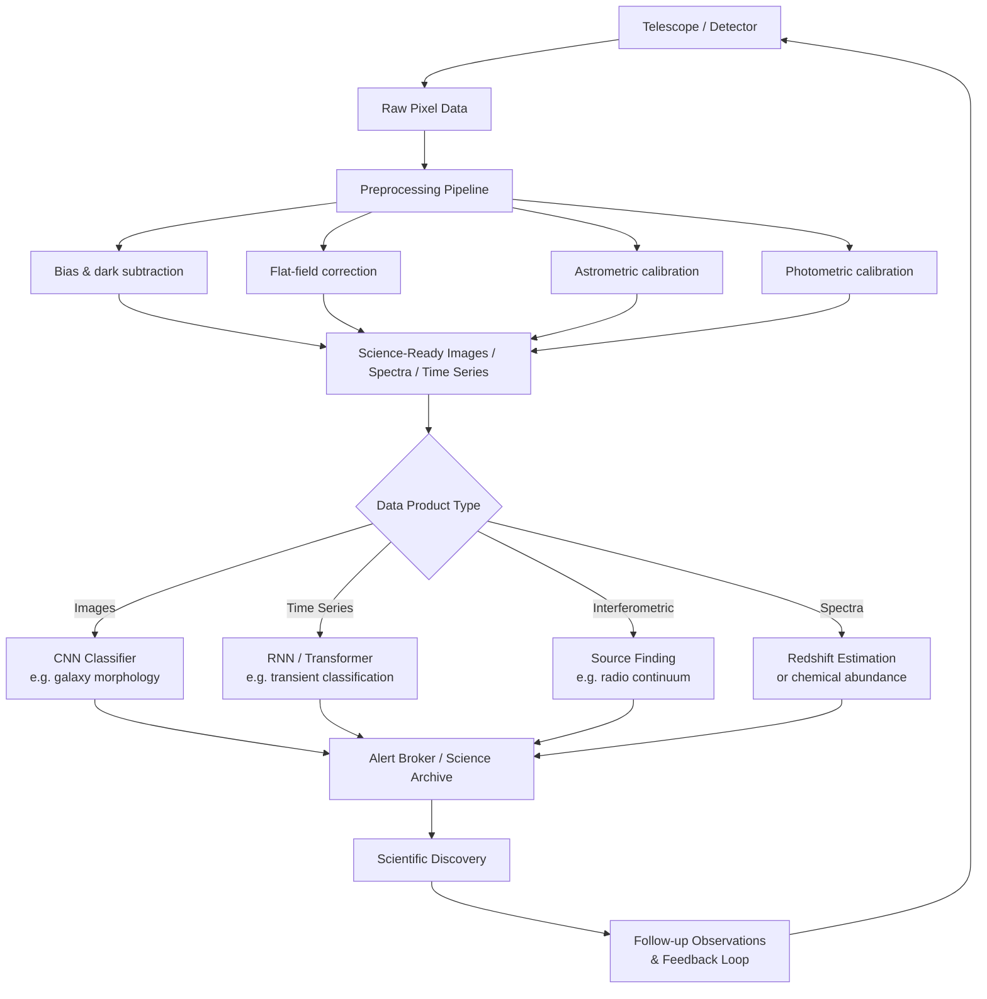

# Introduction to AI for Astronomy

## Overview

Astronomy has always been a data-driven science. For most of its history the constraint was scarcity: too few photons, too few nights, too few detectors. That era is over. The Vera C. Rubin Observatory's Legacy Survey of Space and Time (LSST) will photograph the entire southern sky every three nights, producing roughly 20 terabytes of raw pixel data per night and around 10 million alerts about transient or variable sources every 24 hours. The Square Kilometre Array (SKA), expected to reach full operation in the late 2020s, will generate data at a rate that exceeds the current global internet traffic — on the order of an exabyte per day before compression and filtering. For comparison, the Hubble Space Telescope, which launched in 1990 and spent decades as the premier imaging facility, produces roughly 10 gigabytes per week. The increase in data rate from Hubble to LSST to SKA spans roughly nine orders of magnitude.

No human team can inspect, classify, or interpret data at these scales. That is the core motivation for applying artificial intelligence to astronomy. A single LSST observing season will produce more galaxy images than all professional astronomers alive today could manually examine in their combined lifetimes. AI is not an optional enhancement to modern observational astronomy; it is a necessary infrastructure component without which the scientific value of these instruments cannot be extracted.

The data challenges in astronomy are characterized by three properties that together define the difficulty. **Volume**: raw data accumulates faster than it can be stored indefinitely, requiring on-the-fly processing and filtering. **Velocity**: transient events — supernovae, gamma-ray bursts, neutron star mergers — evolve on timescales of seconds to days and must be identified and followed up in near real time. **Variety**: a modern observatory produces images, spectra, time series, interferometric visibilities, and polarization maps, often for the same object at wavelengths spanning radio through gamma-ray. Effective AI systems must handle all of these modalities.

The historical trajectory of AI in astronomy mirrors the broader field of machine learning. Early work in the 1990s used decision trees and neural networks with a handful of handcrafted features to separate stars from galaxies in photometric surveys. The Galaxy Zoo project, launched in 2007 by Lintott et al., took a citizen science approach and enlisted hundreds of thousands of volunteers to classify galaxy morphologies from Sloan Digital Sky Survey images — generating over 40 million classifications for nearly one million galaxies and demonstrating both the scale of the problem and the power of distributed human intelligence. Galaxy Zoo's crowdsourced labels subsequently became training data for the deep learning models that superseded manual classification.

The modern era began around 2015 as deep convolutional neural networks became practical for astronomical images. Dieleman et al. (2015) trained a CNN on Galaxy Zoo labels to predict crowd-sourced morphological vote fractions directly from pixel data, winning the Galaxy Zoo Kaggle competition and establishing that CNNs could match or exceed human-level classification. In gravitational wave astronomy, George and Huerta (2018) showed that a CNN could detect binary black hole merger signals in simulated LIGO noise in milliseconds, compared to the hours required by matched filter pipelines searching a large template bank. In exoplanet science, Shallue and Vanderburg (2018) applied a CNN to Kepler light curves and discovered two new exoplanets, one of which — Kepler-90i — completed an eight-planet system, the largest known at the time.

The domains where AI has made the deepest impact in astronomy include: galaxy morphology classification and photometric redshift estimation from imaging surveys; gravitational wave detection and parameter estimation from interferometer strain data; exoplanet detection from transit photometry and radial velocity time series; source classification in radio surveys; strong gravitational lens finding; and real-time alert brokers for transient event classification. This course covers the most important of these applications with enough depth to understand both the astrophysics and the machine learning.

## Key Concepts

- **Data deluge**: Modern sky surveys generate data faster than human inspection can process; AI is required infrastructure, not optional enhancement
- **Signal-to-noise ratio (SNR)**: Astronomical signals are typically embedded in photon shot noise, detector read noise, sky background, and instrumental systematics; ML models must be robust to low SNR regimes
- **Multi-wavelength astronomy**: The same astrophysical object emits radiation across the electromagnetic spectrum; combining data from radio, infrared, optical, X-ray, and gamma-ray observatories (and now gravitational waves) provides a more complete physical picture
- **Time-domain astronomy**: Many astrophysical phenomena vary or are transient; detecting and classifying variability in real time is one of the primary use cases for ML in current and future surveys
- **Alert brokers**: Automated pipelines that receive raw transient detections from surveys like LSST and apply ML classifiers to prioritize follow-up observations; examples include ALeRCE, ANTARES, and Fink
- **Transfer learning**: Astronomical datasets are often too small to train deep models from scratch; pretrained features from ImageNet or other large datasets can be fine-tuned effectively on galaxy images and spectra

## Code Example: Signal-to-Noise Analysis and Data Volume Estimation

```python
"""
Astronomical data volume estimation and basic SNR calculation.
Demonstrates the scale of modern survey data and the fundamental
signal extraction challenge.
"""
import numpy as np
import matplotlib.pyplot as plt

# --- Data volume comparison across major surveys ---
surveys = {
    "Hubble (HST)": 10e9 / 3600,         # ~10 GB/week -> bytes/hour
    "Sloan (SDSS)": 200e9 / (365 * 24),  # ~200 GB/year -> bytes/hour
    "Rubin/LSST": 20e12 / 24,            # ~20 TB/night -> bytes/hour
    "SKA (projected)": 1e18 / 24,        # ~1 EB/day -> bytes/hour
}

print("Data rate comparison (bytes per hour):")
print("-" * 50)
for name, rate in surveys.items():
    if rate < 1e6:
        label = f"{rate/1e3:.1f} KB/hr"
    elif rate < 1e9:
        label = f"{rate/1e6:.1f} MB/hr"
    elif rate < 1e12:
        label = f"{rate/1e9:.1f} GB/hr"
    elif rate < 1e15:
        label = f"{rate/1e12:.1f} TB/hr"
    else:
        label = f"{rate/1e15:.1f} PB/hr"
    print(f"  {name:<25} {label}")

# LSST specifics
lsst_alerts_per_night = 10e6
lsst_nights_per_year = 365
lsst_survey_years = 10
total_alerts = lsst_alerts_per_night * lsst_nights_per_year * lsst_survey_years
print(f"\nLSST total transient alerts over 10-year survey: {total_alerts:.2e}")
print(f"Human review rate (1 per 30 sec, 8hr/day): "
      f"{(8*3600/30) * 365 * 10:.2e}")
print(f"Fraction a human team could inspect: "
      f"{(8*3600/30)*365*10 / total_alerts * 100:.4f}%")

# --- SNR calculation for a point source ---
# Signal-to-noise for a CCD observation:
# SNR = S * t / sqrt(S*t + n_pix*(B*t + R^2 + D*t))
# where S = source count rate (e-/s), t = exposure time (s),
# B = sky background (e-/s/pixel), R = read noise (e-), D = dark current (e-/s/pixel)

def compute_snr(source_rate, t_exp, sky_rate=50.0, read_noise=5.0,
                dark_current=0.01, n_pixels=25):
    """
    Compute CCD signal-to-noise ratio.

    Parameters
    ----------
    source_rate : float
        Source photon count rate in electrons/second
    t_exp : float
        Exposure time in seconds
    sky_rate : float
        Sky background rate in electrons/second/pixel (default: 50 e-/s/pix)
    read_noise : float
        CCD read noise in electrons RMS (default: 5 e-)
    dark_current : float
        Dark current in electrons/second/pixel (default: 0.01 e-/s/pix)
    n_pixels : int
        Number of pixels in the aperture (default: 25, a 5x5 aperture)
    """
    signal = source_rate * t_exp
    noise_source = signal                          # Poisson noise on source
    noise_sky = n_pixels * sky_rate * t_exp        # sky background
    noise_read = n_pixels * read_noise**2          # read noise (per pixel)
    noise_dark = n_pixels * dark_current * t_exp   # dark current

    total_noise_sq = noise_source + noise_sky + noise_read + noise_dark
    return signal / np.sqrt(total_noise_sq)

# SNR as a function of exposure time for a faint galaxy
t_values = np.logspace(1, 4, 200)  # 10 to 10000 seconds

# Bright source: 1000 e-/s (r~18 mag on a 4m telescope)
snr_bright = compute_snr(source_rate=1000.0, t_exp=t_values)
# Faint source: 1 e-/s (r~25 mag, typical LSST target)
snr_faint = compute_snr(source_rate=1.0, t_exp=t_values)
# Very faint source: 0.1 e-/s (pushing detection limits)
snr_veryfaint = compute_snr(source_rate=0.1, t_exp=t_values)

fig, ax = plt.subplots(figsize=(8, 5))
ax.loglog(t_values, snr_bright, label="Bright source (1000 e-/s)", color="steelblue")
ax.loglog(t_values, snr_faint, label="Faint source (1 e-/s)", color="darkorange")
ax.loglog(t_values, snr_veryfaint, label="Very faint (0.1 e-/s)", color="crimson")
ax.axhline(5, color="gray", linestyle="--", alpha=0.7, label="SNR = 5 (detection threshold)")
ax.set_xlabel("Exposure time (seconds)")
ax.set_ylabel("Signal-to-noise ratio")
ax.set_title("CCD SNR vs. Exposure Time for Different Source Brightnesses")
ax.legend()
ax.grid(True, alpha=0.3)
plt.tight_layout()
plt.savefig("snr_vs_exposure.png", dpi=150)
plt.show()

# Regime analysis
print("\nSNR regime analysis for faint source (1 e-/s):")
for t in [15, 30, 300, 3600]:
    snr = compute_snr(1.0, t)
    print(f"  t = {t:5d}s: SNR = {snr:.2f}")
```

The SNR formula for a CCD observation is:

$$\text{SNR} = \frac{S \cdot t}{\sqrt{S \cdot t + N_\text{pix}(B \cdot t + R^2 + D \cdot t)}}$$

where $S$ is the source count rate in electrons per second, $t$ is exposure time, $N_\text{pix}$ is the number of pixels in the photometric aperture, $B$ is the sky background rate per pixel, $R$ is the read noise in electrons, and $D$ is the dark current per pixel. In the source-dominated regime ($S \cdot t \gg N_\text{pix}(B \cdot t + R^2)$), the SNR scales as $\sqrt{t}$. In the sky-dominated regime, the same $\sqrt{t}$ scaling holds but with a lower prefactor. Reaching SNR = 5 for a very faint source can require hours of integration, during which the sky and telescope both contribute noise.

## Pipeline Diagram



## Exercises

1. **Data rate calculation**: The Rubin Observatory's camera has 3.2 gigapixels and reads out in approximately 2 seconds. Each pixel stores a 16-bit integer. A full focal plane readout is followed by a 15-second exposure. Calculate the raw data rate in GB/minute. How does this compare to your institution's internet bandwidth?

2. **SNR calculator**: Using the `compute_snr` function above, find the minimum exposure time needed to detect a source at SNR = 10 when the source rate is 0.5 electrons/second, the sky background is 100 electrons/second/pixel, and the aperture contains 36 pixels with read noise of 8 electrons.

3. **Scale comprehension**: LSST is projected to catalog approximately 20 billion galaxies over its 10-year survey. If training a morphological classifier requires human labels for 1% of the sample, how many labels are needed? At 30 seconds per classification with a volunteer workforce of 100,000 people working 2 hours per day, how many years would manual labeling take?

## Further Reading

- Lintott, C. J. et al. (2008). "Galaxy Zoo: morphologies derived from visual inspection of galaxies from the Sloan Digital Sky Survey." *Monthly Notices of the Royal Astronomical Society*, 389(3), 1179-1189. The original Galaxy Zoo paper establishing citizen science for morphology.
- Dieleman, S., Willett, K. W., & Dambre, J. (2015). "Rotation-invariant convolutional neural networks for galaxy morphology prediction." *Monthly Notices of the Royal Astronomical Society*, 450(2), 1441-1459. Landmark CNN application to galaxy classification.
- George, D., & Huerta, E. A. (2018). "Deep learning for real-time atrous convolutional neural networks for gravitational wave detection." *Physics Letters B*, 778, 64-70. CNN detection of GW signals.
- Ivezic, Z. et al. (2019). "LSST: From Science to Technology." *The Astrophysical Journal*, 873(2), 111. The LSST system paper describing survey design and expected data products.
- Ball, N. M., & Brunner, R. J. (2010). "Data mining and machine learning in astronomy." *International Journal of Modern Physics D*, 19(07), 1049-1106. A review of early ML applications across astronomical domains.
