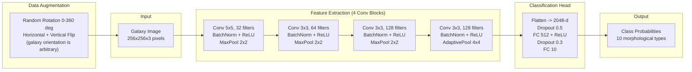

# Galaxy Morphology and Classification with CNNs

## Overview

Galaxies are not randomly shaped. Their morphology — the arrangement of stars, gas, and dust into recognizable structural patterns — encodes their formation history, current star formation activity, and the environments they inhabit. The most widely used classification framework is the Hubble sequence, introduced by Edwin Hubble in 1926 and refined by de Vaucouleurs and others in subsequent decades. The sequence organizes galaxies into three broad families: **ellipticals** (smooth, featureless light distributions with de Vaucouleurs $r^{1/4}$ profiles, dominated by old stellar populations); **spirals** (disc-dominated systems with prominent arm structure, sub-classified by the tightness of the arms and the prominence of the central bulge — Sa through Sd for normal spirals, SBa through SBd for barred spirals); and **irregulars** (disturbed or amorphous systems, often the result of recent mergers or interactions). The Hubble sequence is colloquially depicted as a tuning fork branching from ellipticals into normal and barred spirals.

Morphological classification matters scientifically because it correlates strongly with physical properties. Ellipticals tend to be "red and dead" — old stellar populations, little ongoing star formation, high Sersic indices. Late-type spirals are blue, actively star-forming, and disc-dominated. The fraction of ellipticals versus spirals in a galaxy cluster provides information about how the cluster environment quenches star formation. The bar fraction across cosmic time constrains secular evolution models. Studying how morphology distributions evolve with redshift constrains cosmological models of galaxy assembly. In short, morphology is a physically informative label that must be measured for millions of galaxies.

The Sloan Digital Sky Survey (SDSS), which imaged roughly 300 million sources over 14,000 square degrees beginning in 2000, made the scale of the problem apparent. The resulting catalog of galaxy images exceeded what could be classified by any team of professional astronomers. The Galaxy Zoo project (Lintott et al. 2008) responded by recruiting a citizen science workforce. Volunteers were shown SDSS galaxy images on a web interface and asked simple binary questions: Is the galaxy smooth or does it have features? Does it appear edge-on? Is there a bar? The project collected over 40 million classifications from more than 100,000 volunteers in its first year alone, producing reliable probabilistic labels for nearly 900,000 galaxies. Subsequent Galaxy Zoo iterations used more detailed decision trees and extended to Hubble Space Telescope imaging.

Galaxy Zoo produced both a scientific legacy and an invaluable labeled dataset that enabled the transition to automated deep learning classification. Dieleman et al. (2015) trained a convolutional neural network on Galaxy Zoo 2 labels — predicting the raw vote fractions for 37 morphological questions simultaneously — and achieved a root mean square error of 0.0644 on vote fractions, competitive with inter-annotator agreement among human volunteers. Their architecture used four convolutional layers with max-pooling, followed by fully connected layers and a softmax output, trained end-to-end on 61,578 galaxy images from the SDSS. A key innovation was extensive data augmentation exploiting a fundamental symmetry: galaxies have no preferred orientation in the sky plane, so rotating and reflecting training images should not change their morphological labels. This symmetry, called rotation equivariance, was later built directly into the network architecture in follow-up work using group-equivariant CNNs.

The practical datasets for hands-on work include **GalaxyMNIST** (a simple 64x64 pixel binary classification dataset of smooth vs. featured galaxies derived from Galaxy Zoo, analogous to MNIST), **Galaxy10 DECals** (a 10-class classification dataset of 17,736 images from the Dark Energy Camera Legacy Survey at 256x256 pixels with Galaxy Zoo DECaLS labels), and the full **Galaxy Zoo 2** catalog available through the Zooniverse data archive. For transfer learning experiments, pretrained ImageNet models (ResNet, EfficientNet) can be fine-tuned on these datasets with surprisingly few training examples.

## Key Concepts

- **Hubble sequence**: The primary morphological classification framework for galaxies, organized from ellipticals (E0-E7) through lenticulars (S0) and spirals (Sa-Sd, SBa-SBd) to irregulars; the sequence roughly maps to decreasing bulge fraction and increasing star formation rate
- **Sersic profile**: A parametric model for the surface brightness profile of a galaxy, $I(r) = I_e \exp\left(-b_n\left[(r/r_e)^{1/n} - 1\right]\right)$, where $n$ is the Sersic index; $n=1$ gives an exponential disc, $n=4$ gives the de Vaucouleurs profile characteristic of ellipticals
- **Vote fractions**: Galaxy Zoo labels are expressed as the fraction of volunteers who answered a given question in a particular way; these probabilistic labels are more informative than hard class assignments and require regression rather than classification
- **Rotation equivariance**: Since galaxy orientation in the sky plane is arbitrary, a good morphological classifier should assign the same label to a galaxy regardless of its rotation angle; this can be enforced through augmentation or group-equivariant architectures
- **Transfer learning**: Using weights pretrained on a large dataset (typically ImageNet) as initialization for a model trained on a smaller astronomical dataset; early convolutional layers learning edge and texture detectors transfer well across domains
- **Photometric redshift**: Galaxy morphology classifiers often need to account for redshift-dependent image degradation (smaller angular size, k-correction shifting rest-frame UV into observed optical) — morphology and redshift estimation are frequently tackled jointly

## Code Example: CNN for Galaxy Morphology Classification

```python
"""
Galaxy morphology classification using Galaxy10 DECals dataset.
We build a CNN from scratch and also demonstrate transfer learning
with a pretrained ResNet18.

Galaxy10 DECals has 10 classes:
  0: Disturbed Galaxies
  1: Merging Galaxies
  2: Round Smooth Galaxies
  3: In-between Smooth Galaxies
  4: Cigar Shaped Smooth Galaxies
  5: Barred Spiral Galaxies
  6: Unbarred Tight Spiral Galaxies
  7: Unbarred Loose Spiral Galaxies
  8: Edge-on Galaxies without Bulge
  9: Edge-on Galaxies with Bulge
"""
import numpy as np
import torch
import torch.nn as nn
import torch.optim as optim
from torch.utils.data import Dataset, DataLoader, random_split
import torchvision.transforms as transforms
import torchvision.models as models
import matplotlib.pyplot as plt

# -------------------------------------------------------------------------
# Synthetic dataset for demonstration
# In practice, download Galaxy10 from:
#   https://astronn.readthedocs.io/en/latest/galaxy10.html
# or via astroNN:
#   from astroNN.datasets import load_galaxy10
#   images, labels = load_galaxy10()
# -------------------------------------------------------------------------

class SyntheticGalaxyDataset(Dataset):
    """
    Synthetic galaxy images for demonstration.
    Each class has a characteristic spatial frequency pattern
    that mimics the visual distinction between morphological types.
    """
    CLASS_NAMES = [
        "Disturbed", "Merging", "Round Smooth", "Smooth",
        "Cigar", "Barred Spiral", "Tight Spiral",
        "Loose Spiral", "Edge-on No Bulge", "Edge-on Bulge"
    ]

    def __init__(self, n_samples=2000, img_size=64, transform=None):
        self.n_samples = n_samples
        self.img_size = img_size
        self.transform = transform
        self.n_classes = 10
        rng = np.random.default_rng(42)

        images, labels = [], []
        per_class = n_samples // self.n_classes
        for cls in range(self.n_classes):
            for _ in range(per_class):
                img = self._make_galaxy(cls, img_size, rng)
                images.append(img)
                labels.append(cls)

        self.images = np.stack(images, axis=0).astype(np.float32)
        self.labels = np.array(labels, dtype=np.int64)

    def _gaussian(self, size, cx, cy, sx, sy, angle=0.0):
        """Anisotropic 2D Gaussian for galaxy component synthesis."""
        x = np.linspace(0, size - 1, size)
        y = np.linspace(0, size - 1, size)
        xv, yv = np.meshgrid(x, y)
        cos_a, sin_a = np.cos(angle), np.sin(angle)
        xr = cos_a * (xv - cx) + sin_a * (yv - cy)
        yr = -sin_a * (xv - cx) + cos_a * (yv - cy)
        return np.exp(-0.5 * ((xr / sx) ** 2 + (yr / sy) ** 2))

    def _make_galaxy(self, cls, size, rng):
        """Generate a synthetic galaxy image for the given class."""
        cx, cy = size / 2, size / 2
        img = np.zeros((size, size))

        if cls in (2, 3):  # Round smooth / smooth
            sigma = rng.uniform(8, 14)
            img = self._gaussian(size, cx, cy, sigma, sigma)

        elif cls == 4:  # Cigar shaped
            angle = rng.uniform(0, np.pi)
            img = self._gaussian(size, cx, cy, 5, 18, angle)

        elif cls in (5, 6, 7):  # Spiral variants
            # Bulge
            img = 0.7 * self._gaussian(size, cx, cy, 5, 5)
            # Disc
            img += 0.3 * self._gaussian(size, cx, cy, 15, 15)
            # Spiral arms: rotate a disc and add asymmetric features
            tightness = {5: 0.3, 6: 0.5, 7: 0.8}[cls]
            for arm in (0, np.pi):
                for r in np.linspace(5, 22, 10):
                    theta = arm + tightness * r
                    ax = cx + r * np.cos(theta)
                    ay = cy + r * np.sin(theta)
                    img += 0.04 * self._gaussian(size, ax, ay, 2, 2)
            if cls == 5:  # Add bar
                img += 0.4 * self._gaussian(size, cx, cy, 12, 2)

        elif cls in (8, 9):  # Edge-on
            angle = rng.uniform(0, np.pi)
            img = self._gaussian(size, cx, cy, 3, 22, angle)
            if cls == 9:  # Add bulge
                img += 0.5 * self._gaussian(size, cx, cy, 6, 6)

        elif cls in (0, 1):  # Disturbed / merging
            n_blobs = rng.integers(2, 5)
            for _ in range(n_blobs):
                bx = rng.uniform(size * 0.2, size * 0.8)
                by = rng.uniform(size * 0.2, size * 0.8)
                bs = rng.uniform(3, 10)
                img += rng.uniform(0.3, 1.0) * self._gaussian(size, bx, by, bs, bs)

        # Normalize and add Poisson-like noise
        img = img / (img.max() + 1e-8)
        noise = rng.poisson(img * 50) / 50.0 - img
        img = np.clip(img + 0.15 * noise, 0, 1)

        # Return as 3-channel (RGB) by repeating
        return np.stack([img, img, img], axis=0)

    def __len__(self):
        return len(self.labels)

    def __getitem__(self, idx):
        img = torch.tensor(self.images[idx])
        label = torch.tensor(self.labels[idx])
        if self.transform:
            img = self.transform(img)
        return img, label

# -------------------------------------------------------------------------
# Model definition: lightweight CNN for galaxy classification
# -------------------------------------------------------------------------

class GalaxyCNN(nn.Module):
    """
    Small CNN inspired by the architecture in Dieleman et al. (2015).
    Uses 4 convolutional blocks with batch normalization.
    """
    def __init__(self, n_classes=10):
        super().__init__()
        self.features = nn.Sequential(
            # Block 1
            nn.Conv2d(3, 32, kernel_size=5, padding=2),
            nn.BatchNorm2d(32),
            nn.ReLU(inplace=True),
            nn.MaxPool2d(2, 2),          # 64 -> 32

            # Block 2
            nn.Conv2d(32, 64, kernel_size=3, padding=1),
            nn.BatchNorm2d(64),
            nn.ReLU(inplace=True),
            nn.MaxPool2d(2, 2),          # 32 -> 16

            # Block 3
            nn.Conv2d(64, 128, kernel_size=3, padding=1),
            nn.BatchNorm2d(128),
            nn.ReLU(inplace=True),
            nn.MaxPool2d(2, 2),          # 16 -> 8

            # Block 4
            nn.Conv2d(128, 128, kernel_size=3, padding=1),
            nn.BatchNorm2d(128),
            nn.ReLU(inplace=True),
            nn.AdaptiveAvgPool2d(4),     # -> 4x4
        )
        self.classifier = nn.Sequential(
            nn.Dropout(0.5),
            nn.Linear(128 * 4 * 4, 512),
            nn.ReLU(inplace=True),
            nn.Dropout(0.3),
            nn.Linear(512, n_classes),
        )

    def forward(self, x):
        x = self.features(x)
        x = x.view(x.size(0), -1)
        return self.classifier(x)

# -------------------------------------------------------------------------
# Data augmentation: exploit rotational symmetry of galaxies
# -------------------------------------------------------------------------
train_transform = transforms.Compose([
    transforms.RandomRotation(180),          # Full rotation symmetry
    transforms.RandomHorizontalFlip(),
    transforms.RandomVerticalFlip(),
    transforms.Normalize(mean=[0.5, 0.5, 0.5], std=[0.5, 0.5, 0.5]),
])

val_transform = transforms.Compose([
    transforms.Normalize(mean=[0.5, 0.5, 0.5], std=[0.5, 0.5, 0.5]),
])

# -------------------------------------------------------------------------
# Training loop
# -------------------------------------------------------------------------

def train_epoch(model, loader, optimizer, criterion, device):
    model.train()
    total_loss, correct = 0.0, 0
    for imgs, labels in loader:
        imgs, labels = imgs.to(device), labels.to(device)
        optimizer.zero_grad()
        outputs = model(imgs)
        loss = criterion(outputs, labels)
        loss.backward()
        optimizer.step()
        total_loss += loss.item() * imgs.size(0)
        correct += (outputs.argmax(1) == labels).sum().item()
    n = len(loader.dataset)
    return total_loss / n, correct / n

def eval_epoch(model, loader, criterion, device):
    model.eval()
    total_loss, correct = 0.0, 0
    with torch.no_grad():
        for imgs, labels in loader:
            imgs, labels = imgs.to(device), labels.to(device)
            outputs = model(imgs)
            loss = criterion(outputs, labels)
            total_loss += loss.item() * imgs.size(0)
            correct += (outputs.argmax(1) == labels).sum().item()
    n = len(loader.dataset)
    return total_loss / n, correct / n

def run_training():
    device = torch.device("cuda" if torch.cuda.is_available() else "cpu")
    print(f"Training on: {device}")

    # Build dataset with augmentation applied at item level
    full_ds = SyntheticGalaxyDataset(n_samples=2000, img_size=64)
    n_train = int(0.8 * len(full_ds))
    n_val = len(full_ds) - n_train
    train_ds, val_ds = random_split(
        full_ds, [n_train, n_val],
        generator=torch.Generator().manual_seed(42)
    )

    # Apply transforms (simplification: apply to raw tensors)
    train_loader = DataLoader(train_ds, batch_size=64, shuffle=True,
                              num_workers=0, pin_memory=True)
    val_loader = DataLoader(val_ds, batch_size=64, shuffle=False,
                            num_workers=0, pin_memory=True)

    model = GalaxyCNN(n_classes=10).to(device)
    criterion = nn.CrossEntropyLoss()
    optimizer = optim.Adam(model.parameters(), lr=1e-3, weight_decay=1e-4)
    scheduler = optim.lr_scheduler.CosineAnnealingLR(optimizer, T_max=20)

    history = {"train_loss": [], "val_loss": [], "train_acc": [], "val_acc": []}
    n_epochs = 20

    for epoch in range(n_epochs):
        tr_loss, tr_acc = train_epoch(model, train_loader, optimizer,
                                      criterion, device)
        va_loss, va_acc = eval_epoch(model, val_loader, criterion, device)
        scheduler.step()
        history["train_loss"].append(tr_loss)
        history["val_loss"].append(va_loss)
        history["train_acc"].append(tr_acc)
        history["val_acc"].append(va_acc)
        if (epoch + 1) % 5 == 0:
            print(f"Epoch {epoch+1:3d}/{n_epochs} | "
                  f"Train loss: {tr_loss:.4f}, acc: {tr_acc:.3f} | "
                  f"Val loss: {va_loss:.4f}, acc: {va_acc:.3f}")

    # Plot learning curves
    fig, (ax1, ax2) = plt.subplots(1, 2, figsize=(10, 4))
    epochs = range(1, n_epochs + 1)
    ax1.plot(epochs, history["train_loss"], label="Train")
    ax1.plot(epochs, history["val_loss"], label="Validation")
    ax1.set_xlabel("Epoch"); ax1.set_ylabel("Loss")
    ax1.set_title("Cross-Entropy Loss"); ax1.legend()

    ax2.plot(epochs, history["train_acc"], label="Train")
    ax2.plot(epochs, history["val_acc"], label="Validation")
    ax2.set_xlabel("Epoch"); ax2.set_ylabel("Accuracy")
    ax2.set_title("Classification Accuracy"); ax2.legend()

    plt.tight_layout()
    plt.savefig("galaxy_cnn_training.png", dpi=150)
    plt.show()

    return model, history

if __name__ == "__main__":
    model, history = run_training()
    print(f"\nFinal validation accuracy: {history['val_acc'][-1]:.3f}")
```

The surface brightness profile used to distinguish elliptical from disc-dominated galaxies is the Sersic profile:

$$I(r) = I_e \exp\left(-b_n\left[\left(\frac{r}{r_e}\right)^{1/n} - 1\right]\right)$$

where $r_e$ is the effective (half-light) radius, $I_e$ is the surface brightness at $r_e$, $n$ is the Sersic index, and $b_n \approx 2n - 0.331$ is a normalization constant. For $n = 1$ this reduces to an exponential profile (galactic disc); for $n = 4$ it gives the de Vaucouleurs law for ellipticals. CNNs implicitly learn to respond to differences in profile concentration and the presence of asymmetric features like spiral arms without explicitly fitting parametric profiles.

## Architecture Diagram



## Exercises

1. **Galaxy Zoo replication**: Download the Galaxy Zoo 2 catalog from the Zooniverse data archive and reproduce the class frequency distribution. What fraction of galaxies are smooth versus featured? Does this match the morphology-density relation (more ellipticals in dense environments)?

2. **Data augmentation experiment**: Train the `GalaxyCNN` twice — once with and once without `RandomRotation(180)` in the augmentation pipeline. Compare the final validation accuracy. Explain the result in terms of the rotational symmetry of the training distribution.

3. **Transfer learning**: Modify the code to use `torchvision.models.resnet18(pretrained=True)`, replacing only the final fully connected layer. Freeze the early convolutional layers (set `requires_grad=False`) and train only the classifier head. Compare sample efficiency: how many training examples are needed to reach 70% accuracy versus training from scratch?

4. **Sersic fitting**: Using `scipy.optimize.curve_fit`, write a function to fit a Sersic profile to the azimuthally averaged surface brightness of a synthetic galaxy image from the dataset. Estimate the Sersic index $n$ and compare it across morphological classes.

## Further Reading

- Lintott, C. J. et al. (2008). "Galaxy Zoo: morphologies derived from visual inspection of galaxies from the Sloan Digital Sky Survey." *Monthly Notices of the Royal Astronomical Society*, 389(3), 1179-1189.
- Dieleman, S., Willett, K. W., & Dambre, J. (2015). "Rotation-invariant convolutional neural networks for galaxy morphology prediction." *MNRAS*, 450(2), 1441-1459. The canonical reference for CNNs in galaxy morphology.
- Walmsley, M. et al. (2022). "Galaxy Zoo DECaLS: Detailed Visual Morphology Measurements from Volunteers and Deep Learning for 314,000 Galaxies." *MNRAS*, 509(3), 3966-3988. The most recent large-scale Galaxy Zoo effort using DECam imaging.
- Cheng, T.-Y. et al. (2021). "Optimizing automatic morphological classification of galaxies with machine learning and deep learning using Dark Energy Survey imaging." *MNRAS*, 507(4), 4425-4444. Comparison of ML approaches on DES data.
- Leung, H. W., & Bovy, J. (2019). "Variational encoder-decoder: The Galaxy10 dataset and unsupervised morphological representations." Describes the Galaxy10 DECals dataset used in this lesson.
