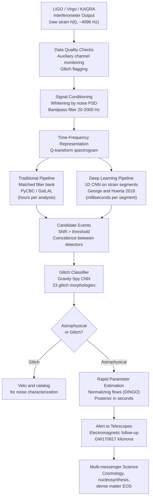

# Gravitational Wave Detection with Deep Learning

## Overview

Gravitational waves are perturbations of spacetime curvature that propagate at the speed of light. Einstein predicted their existence in 1916 as a consequence of general relativity, but their amplitude is so small that direct detection was not achieved until a century later. On September 14, 2015, the two LIGO interferometers simultaneously recorded a transient signal designated GW150914 — the merger of two black holes with masses of approximately 36 and 29 solar masses at a luminosity distance of roughly 410 megaparsecs. The peak strain amplitude was $h \approx 10^{-21}$, meaning the 4-kilometer LIGO arm length changed by less than one-thousandth the diameter of a proton. The observation was awarded the Nobel Prize in Physics in 2017.

The physical strain $h(t)$ that a passing gravitational wave induces in an interferometer arm of length $L$ is:

$$h(t) = \frac{\Delta L(t)}{L}$$

For the binary black hole systems that dominate LIGO's catalog, the waveform sweeps upward in both frequency and amplitude — a "chirp" — as the two objects inspiral and radiate energy. The instantaneous frequency evolves as:

$$f(t) = \frac{1}{\pi}\left[\frac{5}{256} \frac{1}{\mathcal{M}^{5/3}} (t_c - t)\right]^{3/8}$$

where $\mathcal{M} = (m_1 m_2)^{3/5}/(m_1 + m_2)^{1/5}$ is the chirp mass and $t_c$ is the coalescence time. The chirp mass is the single most precisely measurable parameter from a gravitational wave observation because it directly controls the rate of frequency evolution.

The traditional approach to searching for compact binary coalescence (CBC) signals is matched filtering. Given a noise power spectral density $S_n(f)$, the optimal SNR for a signal $h(t)$ buried in stationary Gaussian noise $n(t)$ is:

$$\rho = \left[4 \int_0^\infty \frac{|\tilde{h}(f)|^2}{S_n(f)} df\right]^{1/2}$$

where $\tilde{h}(f)$ is the Fourier transform of the expected waveform template. A search covers the parameter space of binary masses and spins by evaluating the matched filter integral against a discrete template bank containing thousands to hundreds of thousands of waveforms. Standard pipelines like PyCBC and GstLAL implement this approach and have been used to build the Gravitational-Wave Transient Catalog (GWTC), which as of GWTC-3 contains over 90 confirmed events from the first three observing runs.

Matched filtering is optimal for signals in stationary Gaussian noise when the signal morphology is known. In practice, LIGO data is neither stationary nor Gaussian. The detectors experience thousands of noise transients ("glitches") per day caused by environmental disturbances, instrumental artifacts, and poorly understood mechanical coupling. Glitches mimic astrophysical signals and produce false triggers. Distinguishing glitches from real signals requires auxiliary channel monitoring, signal consistency tests, and manual inspection — a bottleneck that limits the throughput of the search pipeline.

Deep learning addresses several limitations of matched filtering. George and Huerta (2018) demonstrated that a 1D CNN trained on simulated binary black hole waveforms injected into colored Gaussian noise could detect signals in real LIGO data with sensitivity comparable to matched filtering, but in milliseconds rather than hours. The network learned to recognize the characteristic chirp morphology without being given explicit template waveforms. Subsequent work extended this to binary neutron star systems (Gabbard et al. 2018), glitch classification (Zevin et al. 2017 — the Gravity Spy project), and rapid parameter estimation (Dax et al. 2021 — using normalizing flows to produce posterior distributions in seconds rather than the days required by Markov Chain Monte Carlo).

The Gravity Spy project applied CNNs to classify LIGO glitches into 23 morphological categories — blip glitches, scattered light, violin mode harmonics, koi fish, and so on — based on time-frequency spectrograms generated by the Q-transform. This citizen science plus ML hybrid approach has produced a labeled dataset of over 100,000 glitches that is publicly available and continues to be used for training improved classifiers.

## Key Concepts

- **Strain $h(t)$**: The dimensionless gravitational wave amplitude; LIGO measures strains of order $10^{-23}$ to $10^{-21}$, requiring laser interferometry at the limits of quantum and thermal noise
- **Chirp mass $\mathcal{M}$**: The combination of component masses that controls the gravitational wave frequency evolution; it is the best-measured parameter in a CBC event and spans from $\sim 1 M_\odot$ (binary neutron stars) to hundreds of $M_\odot$ (intermediate mass black holes)
- **Matched filtering**: The statistically optimal linear filter for detecting a known signal in stationary Gaussian noise; scales as $O(N_\text{templates} \times N_\text{samples})$ and requires accurate waveform models
- **Q-transform**: A time-frequency representation that tiles the time-frequency plane with constant-Q (quality factor) windows, producing spectrograms that reveal the frequency evolution of transients; standard for gravitational wave signal visualization
- **Glitches**: Non-Gaussian noise transients in LIGO data that mimic astrophysical signals; characterizing and vetoing glitches is one of the primary use cases for ML in gravitational wave astronomy
- **Normalizing flows**: A class of generative models that learn an invertible mapping from a simple distribution (e.g., Gaussian) to a complex target distribution; used by Dax et al. (2021) in the DINGO system for rapid gravitational wave parameter estimation

## Code Example: Chirp Signal Generation and 1D CNN Detection

```python
"""
Gravitational wave detection with a 1D CNN.
We simulate binary black hole chirp signals, inject them into
colored noise matching LIGO's sensitivity curve, and train a
CNN to classify segments as signal-present or noise-only.

Reference: George & Huerta (2018), Physics Letters B, 778, 64-70.
"""
import numpy as np
import torch
import torch.nn as nn
import torch.optim as optim
from torch.utils.data import Dataset, DataLoader, TensorDataset
import matplotlib.pyplot as plt
from scipy.signal import butter, sosfilt, welch

# -------------------------------------------------------------------------
# Signal generation
# -------------------------------------------------------------------------

def chirp_mass_to_component(Mc, q=1.0):
    """Convert chirp mass Mc and mass ratio q = m2/m1 to component masses."""
    m1 = Mc * (1 + q) ** (1/5) / q ** (3/5)
    m2 = q * m1
    return m1, m2

def generate_chirp(sample_rate=4096, duration=1.0, Mc=10.0, tc=0.9,
                   phase0=0.0, distance_Mpc=400.0):
    """
    Generate a post-Newtonian binary inspiral chirp waveform
    in the time domain using the stationary phase approximation.

    Parameters
    ----------
    sample_rate : int
        Sampling rate in Hz
    duration : float
        Segment duration in seconds
    Mc : float
        Chirp mass in solar masses
    tc : float
        Coalescence time in seconds from start of segment
    phase0 : float
        Initial orbital phase in radians
    distance_Mpc : float
        Luminosity distance in megaparsecs

    Returns
    -------
    t : ndarray
        Time array
    h : ndarray
        Gravitational wave strain h+(t)
    """
    G = 6.674e-11      # m^3 kg^-1 s^-2
    c = 3e8            # m/s
    M_sun = 1.989e30   # kg
    Mpc = 3.086e22     # m

    Mc_SI = Mc * M_sun
    dist_SI = distance_Mpc * Mpc

    t = np.linspace(0, duration, int(sample_rate * duration))
    tau = tc - t       # Time to coalescence (only valid for tau > 0)
    tau = np.clip(tau, 1e-3, None)

    # Instantaneous frequency (0-PN leading order)
    theta = (tau * c**3 / (5 * G * Mc_SI)) ** (1/8)
    f_inst = c**3 / (8 * np.pi * G * Mc_SI) * theta**(-3)

    # Clip to LIGO band [20 Hz, 2000 Hz]
    f_inst = np.clip(f_inst, 20, 2000)

    # Amplitude envelope (1/distance, increases near merger)
    A = (G * Mc_SI / c**2)**(5/4) / dist_SI * \
        (5 / (G * Mc_SI / c**3)) ** (1/4) * \
        (np.pi * f_inst) ** (2/3) * (G * Mc_SI / c**3) ** (-1/4)
    A = A / A.max() * 1e-21    # Normalize to realistic strain amplitude

    # Phase integral (leading order)
    phase = -2 * (tau * c**3 / (5 * G * Mc_SI)) ** (5/8) + phase0
    h = A * np.cos(phase)

    # Taper at boundaries to avoid spectral leakage
    taper_len = int(0.05 * len(t))
    window = np.ones(len(t))
    window[:taper_len] = np.sin(np.linspace(0, np.pi / 2, taper_len))
    window[-taper_len:] = np.cos(np.linspace(0, np.pi / 2, taper_len))
    h *= window

    return t, h

def generate_colored_noise(n_samples, sample_rate=4096, seed=None):
    """
    Generate noise colored by a simplified LIGO sensitivity curve.
    The Advanced LIGO design sensitivity scales roughly as f^(-7/6) at low
    frequencies and f^(2) at high frequencies, with a minimum near 100 Hz.
    """
    rng = np.random.default_rng(seed)
    white = rng.standard_normal(n_samples)
    freqs = np.fft.rfftfreq(n_samples, d=1.0 / sample_rate)
    freqs[0] = 1e-10  # Avoid division by zero

    # Simplified LSIGO-like PSD: high below ~40 Hz, minimum at ~100 Hz
    f0 = 100.0
    psd = (freqs / f0) ** (-14/6) + (freqs / f0) ** 4
    psd[freqs < 20] = 1e10   # Suppress below low-frequency wall
    amplitude = 1.0 / np.sqrt(psd + 1e-30)

    noise_fft = np.fft.rfft(white) * amplitude
    noise = np.fft.irfft(noise_fft, n=n_samples)
    noise = noise / (noise.std() + 1e-30)
    return noise

def make_dataset(n_signal=500, n_noise=500, sample_rate=4096,
                 duration=1.0, snr_range=(5, 20)):
    """
    Build a balanced binary dataset of signal+noise and noise-only segments.
    """
    rng = np.random.default_rng(0)
    n_samples = int(sample_rate * duration)
    X, y = [], []

    # Noise-only examples (label 0)
    for i in range(n_noise):
        noise = generate_colored_noise(n_samples, sample_rate, seed=i)
        X.append(noise.astype(np.float32))
        y.append(0)

    # Signal + noise examples (label 1)
    for i in range(n_signal):
        noise = generate_colored_noise(n_samples, sample_rate, seed=n_noise + i)
        Mc = rng.uniform(5, 50)
        tc = rng.uniform(0.7, 0.95)
        _, h = generate_chirp(sample_rate, duration, Mc, tc)
        target_snr = rng.uniform(*snr_range)
        # Rescale signal so its "matched filter" SNR is roughly target_snr
        signal_power = np.sqrt(np.mean(h**2))
        noise_power = np.sqrt(np.mean(noise**2))
        scale = target_snr * noise_power / (signal_power + 1e-30)
        segment = noise + scale * h
        X.append(segment.astype(np.float32))
        y.append(1)

    X = np.array(X)[:, np.newaxis, :]   # Shape: (N, 1, T)
    y = np.array(y, dtype=np.int64)
    idx = rng.permutation(len(y))
    return X[idx], y[idx]

# -------------------------------------------------------------------------
# 1D CNN model for GW detection
# -------------------------------------------------------------------------

class GravitationalWaveCNN(nn.Module):
    """
    1D CNN for binary classification of GW strain segments.
    Architecture inspired by George & Huerta (2018).
    Uses dilated convolutions to capture multi-scale temporal features.
    """
    def __init__(self):
        super().__init__()
        self.features = nn.Sequential(
            # Capture fast oscillations
            nn.Conv1d(1, 64, kernel_size=32, stride=2, padding=15),
            nn.BatchNorm1d(64),
            nn.ELU(),
            nn.MaxPool1d(4),

            # Capture chirp evolution
            nn.Conv1d(64, 128, kernel_size=16, dilation=2, padding=15),
            nn.BatchNorm1d(128),
            nn.ELU(),
            nn.MaxPool1d(4),

            # Long-range temporal context
            nn.Conv1d(128, 256, kernel_size=8, dilation=4, padding=14),
            nn.BatchNorm1d(256),
            nn.ELU(),
            nn.AdaptiveAvgPool1d(16),
        )
        self.classifier = nn.Sequential(
            nn.Flatten(),
            nn.Linear(256 * 16, 256),
            nn.ELU(),
            nn.Dropout(0.5),
            nn.Linear(256, 64),
            nn.ELU(),
            nn.Linear(64, 2),
        )

    def forward(self, x):
        return self.classifier(self.features(x))

# -------------------------------------------------------------------------
# Training and evaluation
# -------------------------------------------------------------------------

def train_gw_detector():
    device = torch.device("cuda" if torch.cuda.is_available() else "cpu")
    print(f"Training GW detector on: {device}")

    print("Generating dataset...")
    X, y = make_dataset(n_signal=800, n_noise=800)
    split = int(0.8 * len(y))
    X_train, y_train = torch.tensor(X[:split]), torch.tensor(y[:split])
    X_val, y_val = torch.tensor(X[split:]), torch.tensor(y[split:])

    train_dl = DataLoader(TensorDataset(X_train, y_train),
                          batch_size=64, shuffle=True)
    val_dl = DataLoader(TensorDataset(X_val, y_val),
                        batch_size=64, shuffle=False)

    model = GravitationalWaveCNN().to(device)
    optimizer = optim.Adam(model.parameters(), lr=1e-3)
    criterion = nn.CrossEntropyLoss()
    scheduler = optim.lr_scheduler.StepLR(optimizer, step_size=5, gamma=0.5)

    history = {"loss": [], "acc": [], "val_loss": [], "val_acc": []}

    for epoch in range(15):
        model.train()
        loss_sum, correct = 0.0, 0
        for Xb, yb in train_dl:
            Xb, yb = Xb.to(device), yb.to(device)
            optimizer.zero_grad()
            out = model(Xb)
            loss = criterion(out, yb)
            loss.backward()
            optimizer.step()
            loss_sum += loss.item() * Xb.size(0)
            correct += (out.argmax(1) == yb).sum().item()
        scheduler.step()

        model.eval()
        val_loss, val_correct = 0.0, 0
        with torch.no_grad():
            for Xb, yb in val_dl:
                Xb, yb = Xb.to(device), yb.to(device)
                out = model(Xb)
                val_loss += criterion(out, yb).item() * Xb.size(0)
                val_correct += (out.argmax(1) == yb).sum().item()

        n_tr, n_val = len(X_train), len(X_val)
        history["loss"].append(loss_sum / n_tr)
        history["acc"].append(correct / n_tr)
        history["val_loss"].append(val_loss / n_val)
        history["val_acc"].append(val_correct / n_val)

        if (epoch + 1) % 5 == 0:
            print(f"Epoch {epoch+1:2d} | "
                  f"Train acc: {correct/n_tr:.3f} | "
                  f"Val acc: {val_correct/n_val:.3f}")

    return model, history

def visualize_chirp():
    """Plot a synthetic chirp in time and time-frequency domain."""
    sample_rate = 4096
    t, h = generate_chirp(sample_rate=sample_rate, duration=1.0,
                           Mc=15.0, tc=0.9)
    noise = generate_colored_noise(len(h), sample_rate, seed=7)
    noisy_h = noise * 5e-22 + h

    fig, axes = plt.subplots(2, 1, figsize=(10, 6))

    # Time domain
    axes[0].plot(t, noisy_h, color="gray", alpha=0.5, linewidth=0.5,
                 label="Signal + noise")
    axes[0].plot(t, h, color="steelblue", linewidth=1.5, label="Clean chirp")
    axes[0].set_xlabel("Time (s)")
    axes[0].set_ylabel("Strain h(t)")
    axes[0].set_title("Simulated Binary Black Hole Chirp (Mc = 15 Msun)")
    axes[0].legend()
    axes[0].set_xlim(0.6, 1.0)

    # Spectrogram (Q-transform approximation via short-time Fourier)
    from scipy.signal import spectrogram
    f_sg, t_sg, Sxx = spectrogram(h, fs=sample_rate, nperseg=256,
                                   noverlap=200, scaling="density")
    mask = f_sg < 1000
    axes[1].pcolormesh(t_sg, f_sg[mask], np.log10(Sxx[mask] + 1e-50),
                       shading="auto", cmap="inferno")
    axes[1].set_xlabel("Time (s)")
    axes[1].set_ylabel("Frequency (Hz)")
    axes[1].set_title("Spectrogram of chirp (log power)")

    plt.tight_layout()
    plt.savefig("gw_chirp.png", dpi=150)
    plt.show()

if __name__ == "__main__":
    visualize_chirp()
    model, history = train_gw_detector()
    print(f"Final validation accuracy: {history['val_acc'][-1]:.3f}")
```

The matched filter SNR that deep learning attempts to replicate is:

$$\rho^2 = 4 \int_0^\infty \frac{|\tilde{h}(f)|^2}{S_n(f)} df$$

where $\tilde{h}(f)$ is the waveform Fourier transform and $S_n(f)$ is the one-sided noise power spectral density. A CNN that has internalized the characteristic frequency evolution $f(t) \propto (t_c - t)^{-3/8}$ is implicitly performing a form of time-frequency matched filtering without requiring an explicit template bank.

## Detection Pipeline Diagram



## Exercises

1. **Chirp mass estimation**: Modify the `generate_chirp` function to return the instantaneous frequency array $f(t)$. Fit a power law $f(t) \propto (t_c - t)^{-3/8}$ to the frequency evolution to extract the chirp mass $\mathcal{M}$ and compare with the input value.

2. **SNR scan**: Generate 100 signal+noise segments at SNR values ranging from 3 to 20. Plot the CNN detection probability (fraction of segments correctly classified as signal) as a function of SNR. What is the 90% detection threshold?

3. **Spectrogram classification**: Instead of 1D strain time series, convert each segment to a Q-transform spectrogram image and train a 2D CNN on the images. Compare performance with the 1D CNN. At what SNR do the two approaches diverge?

4. **Gravity Spy glitch exploration**: Download the Gravity Spy dataset from Zenodo (DOI: 10.5281/zenodo.1486046) and train a CNN to classify the 23 glitch morphologies. Visualize misclassified glitches using Grad-CAM to identify which time-frequency features the network uses.

## Further Reading

- Abbott, B. P. et al. (LIGO Scientific and Virgo Collaborations) (2016). "Observation of Gravitational Waves from a Binary Black Hole Merger." *Physical Review Letters*, 116, 061102. The GW150914 discovery paper.
- George, D., & Huerta, E. A. (2018). "Deep learning for real-time atrous convolutional neural networks for gravitational wave detection from binary chirp mass." *Physics Letters B*, 778, 64-70. The foundational CNN detection paper.
- Gabbard, H. et al. (2018). "Matching Matched Filtering with Deep Networks for Gravitational-Wave Astronomy." *Physical Review Letters*, 120, 141103.
- Zevin, M. et al. (2017). "Gravity Spy: integrating advanced LIGO detector characterization, machine learning, and citizen science." *Classical and Quantum Gravity*, 34(6), 064003. The glitch classification system.
- Dax, M. et al. (2021). "Real-Time Gravitational Wave Science with Neural Posterior Estimation." *Physical Review Letters*, 127, 241103. DINGO: normalizing flows for rapid parameter estimation.
- The Gravitational Wave Open Science Center (gwosc.org) provides public LIGO strain data for all detected events.
