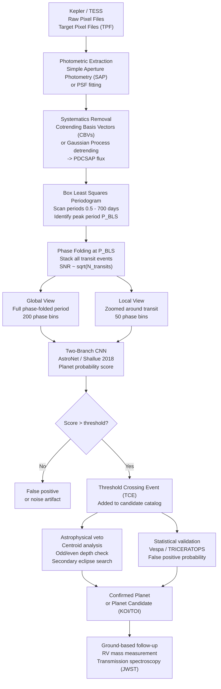

# Exoplanet Detection: ML for Transit and Radial Velocity Data

## Overview

The confirmed exoplanet count crossed 5,500 in 2022 and continues to grow. The majority of these detections come from two techniques: **transit photometry**, which measures the fractional dimming of a star's light when an orbiting planet passes in front of it, and **radial velocity** (RV), which measures the Doppler shift in stellar spectral lines caused by the star's reflex motion around the planet-star center of mass. Both techniques produce time series data that ML models are well suited to analyze.

The transit method was the dominant approach of the Kepler Space Telescope, which operated from 2009 to 2018 and produced nearly continuous photometric light curves for approximately 150,000 stars. Kepler's primary mission produced more than 2,300 confirmed planets and over 3,000 planet candidates (Borucki et al. 2010 for the instrument; Thompson et al. 2018 for the final catalog). Kepler was followed by TESS (Transiting Exoplanet Survey Satellite, launched 2018), which covers the entire sky in 27-day sectors and has already detected thousands of planet candidates. The upcoming PLATO mission will extend to bright solar-type stars with the precision needed to characterize Earth-sized planets in habitable zones.

The physical basis of the transit signal is the fractional flux decrement:

$$\delta = \left(\frac{R_p}{R_*}\right)^2$$

where $R_p$ is the planet radius and $R_*$ is the stellar radius. For an Earth-Sun analog, $\delta \approx 8 \times 10^{-5}$ — a dimming of roughly 80 parts per million. For a hot Jupiter around a solar-type star, $\delta \approx 10^{-2}$, or 1%. The transit duration is:

$$T_{14} = \frac{P}{\pi} \arcsin\left[\frac{1}{a}\sqrt{(R_* + R_p)^2 - (b R_*)^2}\right]$$

where $P$ is the orbital period, $a$ is the semi-major axis, and $b$ is the impact parameter (the sky-plane distance between the planet's transit chord and the stellar center in units of $R_*$). For typical hot Jupiters, $T_{14}$ ranges from 1 to 5 hours; for Earth-Sun analogs, it is approximately 13 hours.

The radial velocity signal has an amplitude:

$$K = \frac{2\pi G}{P} \frac{m_p \sin i}{(m_p + m_*)^{2/3}} \frac{1}{\sqrt{1 - e^2}}$$

For a Jupiter-mass planet in a 1-year orbit around a solar-mass star, $K \approx 13$ m/s. For an Earth-mass planet in the same orbit, $K \approx 9$ cm/s — below the current state-of-the-art RV precision of about 30 cm/s achieved by instruments like ESPRESSO on the VLT.

The central challenge in automated exoplanet detection is distinguishing true planetary transits from an extensive catalog of false positives and systematic artifacts. The main astrophysical false positives are **eclipsing binaries** (EB): a background star that is a binary system can produce a diluted eclipse that mimics a shallow transit. A grazing EB, where only the edge of one star eclipses the other, produces a flat-bottomed light curve similar to a planetary transit. **Systematic noise sources** include spacecraft pointing jitter, detector charge trapping, cosmic ray hits, and stellar variability (star spots, granulation, oscillations). Traditional de-trending algorithms like the Savitzky-Golay filter, Gaussian processes, and the Kepler-specific Cotrending Basis Vectors (CBVs) remove long-timescale trends but can distort shallow transit signals.

The landmark application of CNNs to exoplanet detection was Shallue and Vanderburg (2018), who trained a network called AstroNet on 15,000 labeled Kepler light curve segments. Their approach folded each light curve at the period identified by Box Least Squares (BLS) — a periodogram algorithm designed to find the period that maximizes the depth of a box-shaped dip — and then passed the phase-folded light curve to a two-branch CNN: a global view (covering the full orbital period) and a local view (zoomed in around the transit). The network predicted a probability of being a planet candidate versus a false positive. Applied to unlabeled Kepler candidates, AstroNet discovered two new planets: Kepler-90i (the eighth planet in the Kepler-90 system, making it the first known system with as many planets as the Solar System at the time) and Kepler-80g. Subsequent extensions of this approach were applied to TESS data by Yu et al. (2019) and Osborn et al. (2020).

Gaussian processes (GPs) have become the standard tool for modeling correlated noise — including stellar variability — in radial velocity time series. A GP with a quasi-periodic kernel can simultaneously model stellar activity (which produces RV signals at the stellar rotation period and its harmonics) and the Keplerian planet signal, enabling reliable planet detection even when stellar noise is dominant.

## Key Concepts

- **Transit depth $\delta$**: The fractional flux decrement during transit, equal to $(R_p/R_*)^2$; directly gives the planet-to-star radius ratio if the impact parameter is known
- **Phase folding**: Stacking multiple transit events by folding the light curve at the orbital period; this coherent addition increases the effective SNR of a shallow transit by a factor of $\sqrt{N_\text{transits}}$
- **Box Least Squares (BLS)**: A periodogram algorithm by Kovacs et al. (2002) that searches for the period minimizing the residuals to a step-function (box-shaped) transit model; the standard first step before CNN-based classification
- **False positive scenarios**: Astrophysical configurations that mimic planetary transits, primarily background eclipsing binaries and grazing eclipsing binaries; distinguishing these from planets requires centroid analysis, multicolor photometry, or spectroscopic follow-up
- **Gaussian processes for stellar activity**: A non-parametric Bayesian approach to modeling time-correlated noise; in RV time series, a GP with a quasi-periodic kernel simultaneously fits stellar rotation signals and Keplerian orbits
- **Transit timing variations (TTVs)**: Gravitational perturbations between planets in a multi-planet system cause deviations from strictly periodic transit times; TTVs can reveal non-transiting planets and constrain planet masses without RV measurements

## Code Example: Synthetic Transit Light Curve and ML Classifier

```python
"""
Exoplanet transit detection with machine learning.
We generate synthetic Kepler-like light curves with injected transits,
apply Box Least Squares to find candidate periods, phase-fold the data,
and use a simple CNN classifier to distinguish planets from false positives.

Reference: Shallue & Vanderburg (2018), AJ, 155, 94.
"""
import numpy as np
from scipy.signal import lombscargle
import matplotlib.pyplot as plt
import torch
import torch.nn as nn
import torch.optim as optim
from torch.utils.data import DataLoader, TensorDataset

# -------------------------------------------------------------------------
# Light curve generation
# -------------------------------------------------------------------------

def mandel_agol_transit(t, t0, P, Rp_Rs, a_Rs, b=0.0, u1=0.3, u2=0.2):
    """
    Simplified quadratic limb-darkened transit light curve using
    the small-planet approximation (Mandel & Agol 2002 simplified form).

    Parameters
    ----------
    t : ndarray
        Time array (same units as t0 and P)
    t0 : float
        Mid-transit time
    P : float
        Orbital period
    Rp_Rs : float
        Planet-to-star radius ratio (= sqrt(transit depth))
    a_Rs : float
        Semi-major axis in stellar radii
    b : float
        Impact parameter (0 = central transit)
    u1, u2 : float
        Quadratic limb darkening coefficients
    """
    phase = ((t - t0) % P) / P
    phase = np.where(phase > 0.5, phase - 1.0, phase)   # [-0.5, 0.5]

    # Sky-plane distance between planet center and star center (in R_star)
    sin_phi = np.sin(2 * np.pi * phase)
    z = np.sqrt((a_Rs * sin_phi) ** 2 + b ** 2)

    transit_depth = Rp_Rs ** 2
    k = Rp_Rs

    flux = np.ones_like(t)
    in_transit = z < (1.0 + k)

    for i in np.where(in_transit)[0]:
        zi = z[i]
        if zi <= abs(1.0 - k):
            # Planet fully inside stellar disc
            # Quadratic limb darkening at the transit center position
            r2 = min(zi, 0.99) ** 2
            I = 1.0 - u1 * (1.0 - np.sqrt(1.0 - r2)) - u2 * (1.0 - np.sqrt(1.0 - r2)) ** 2
            flux[i] = 1.0 - transit_depth * I
        elif zi < 1.0 + k:
            # Partial overlap (ingress/egress) -- use linear approximation
            overlap = 0.5 * (1.0 + k - zi) / k
            flux[i] = 1.0 - transit_depth * overlap
    return flux

def generate_light_curve(n_points=1500, cadence_min=30.0, seed=None,
                         planet=True, Rp_Rs=0.1, P_days=10.0,
                         noise_level=500e-6):
    """
    Generate a synthetic Kepler long-cadence light curve.

    Parameters
    ----------
    n_points : int
        Number of cadences
    cadence_min : float
        Cadence in minutes (Kepler long cadence = 29.4 min)
    seed : int
        Random seed
    planet : bool
        If True, inject a transit signal
    Rp_Rs : float
        Planet-to-star radius ratio
    P_days : float
        Orbital period in days
    noise_level : float
        RMS photometric noise (parts per unit flux)
    """
    rng = np.random.default_rng(seed)
    dt_days = cadence_min / 1440.0
    t = np.arange(n_points) * dt_days

    # Stellar variability: long-period sinusoid + granulation noise
    P_rot = rng.uniform(10, 30)    # stellar rotation period (days)
    A_spot = rng.uniform(0, 5e-3)  # spot amplitude
    stellar_var = A_spot * np.sin(2 * np.pi * t / P_rot + rng.uniform(0, 2*np.pi))

    # Gaussian white noise
    photon_noise = rng.normal(0, noise_level, n_points)

    # Systematic trend: slow drift
    trend = np.poly1d(rng.normal(0, 1e-4, 3))(np.linspace(-1, 1, n_points))

    flux = 1.0 + stellar_var + photon_noise + trend

    if planet:
        t0 = rng.uniform(0, P_days)
        a_Rs = (P_days / 0.03652) ** (2/3)   # Kepler's 3rd law, solar units
        transit = mandel_agol_transit(t, t0, P_days, Rp_Rs, a_Rs, b=0.0)
        flux *= transit

    return t, flux

# -------------------------------------------------------------------------
# Box Least Squares (simplified BLS periodogram)
# -------------------------------------------------------------------------

def bls_periodogram(t, flux, P_min=0.5, P_max=50.0, n_periods=5000,
                    q_min=0.01, q_max=0.1, n_phases=500):
    """
    Simplified BLS periodogram.
    Returns periods and their BLS power (Signal Residue).

    Reference: Kovacs et al. (2002), A&A, 391, 369.
    """
    periods = np.linspace(P_min, P_max, n_periods)
    sr = np.zeros(n_periods)

    flux_norm = flux - flux.mean()
    s_total = np.sum(flux_norm ** 2)

    for ip, P in enumerate(periods):
        phase = (t % P) / P
        # Slide a box of fractional duration q
        best_sr = 0.0
        for q in np.linspace(q_min, q_max, 5):
            for phi0 in np.linspace(0, 1 - q, 20):
                mask = (phase >= phi0) & (phase < phi0 + q)
                if mask.sum() < 2:
                    continue
                s_in = flux_norm[mask].sum()
                n_in = mask.sum()
                n_tot = len(flux_norm)
                signal_residue = s_in ** 2 / (n_in * (n_tot - n_in))
                if signal_residue > best_sr:
                    best_sr = signal_residue
        sr[ip] = best_sr

    return periods, sr

def phase_fold(t, flux, period, t0=0.0, n_bins=200):
    """Phase-fold and bin a light curve."""
    phase = ((t - t0) % period) / period
    phase = np.where(phase > 0.5, phase - 1.0, phase)
    sort_idx = np.argsort(phase)
    phase_sorted = phase[sort_idx]
    flux_sorted = flux[sort_idx]

    bins = np.linspace(-0.5, 0.5, n_bins + 1)
    binned_flux = np.zeros(n_bins)
    for i in range(n_bins):
        mask = (phase_sorted >= bins[i]) & (phase_sorted < bins[i+1])
        binned_flux[i] = flux_sorted[mask].mean() if mask.sum() > 0 else 1.0

    bin_centers = 0.5 * (bins[:-1] + bins[1:])
    return bin_centers, binned_flux

# -------------------------------------------------------------------------
# CNN classifier on phase-folded light curves
# -------------------------------------------------------------------------

class TransitCNN(nn.Module):
    """
    Two-branch CNN for transit classification.
    Global view: full phase-folded period (coarse context).
    Local view: zoomed-in transit region (fine transit shape).
    Architecture follows Shallue & Vanderburg (2018).
    """
    def __init__(self, global_len=200, local_len=50):
        super().__init__()

        def conv_branch(in_len):
            return nn.Sequential(
                nn.Conv1d(1, 16, kernel_size=5, padding=2),
                nn.ReLU(), nn.MaxPool1d(2),
                nn.Conv1d(16, 32, kernel_size=5, padding=2),
                nn.ReLU(), nn.MaxPool1d(2),
                nn.Conv1d(32, 64, kernel_size=5, padding=2),
                nn.ReLU(), nn.AdaptiveAvgPool1d(8),
                nn.Flatten(),
            )

        self.global_branch = conv_branch(global_len)
        self.local_branch = conv_branch(local_len)

        self.head = nn.Sequential(
            nn.Linear(64 * 8 * 2, 256),
            nn.ReLU(), nn.Dropout(0.5),
            nn.Linear(256, 64),
            nn.ReLU(),
            nn.Linear(64, 2),
        )

    def forward(self, global_view, local_view):
        g = self.global_branch(global_view.unsqueeze(1))
        l = self.local_branch(local_view.unsqueeze(1))
        x = torch.cat([g, l], dim=1)
        return self.head(x)

def build_training_data(n_planet=400, n_false=400,
                        global_bins=200, local_bins=50):
    """
    Generate labeled dataset of phase-folded light curves.
    Planet class (label 1): transit injected at correct period.
    False positive class (label 0): no transit or wrong period folded.
    """
    rng = np.random.default_rng(1)
    global_views, local_views, labels = [], [], []

    for i in range(n_planet):
        Rp_Rs = rng.uniform(0.05, 0.15)
        P = rng.uniform(2, 20)
        t, flux = generate_light_curve(seed=i, planet=True,
                                       Rp_Rs=Rp_Rs, P_days=P,
                                       noise_level=rng.uniform(200e-6, 1000e-6))
        # Detrend: subtract a 3rd-order polynomial
        coeffs = np.polyfit(t, flux, 3)
        flux = flux / np.polyval(coeffs, t)

        phase_g, folded_g = phase_fold(t, flux, P, n_bins=global_bins)
        # Local view: zoom to central 10% of phase
        mask_l = np.abs(phase_g) < 0.05
        local_raw = folded_g[mask_l]
        # Interpolate to fixed local_bins
        local_interp = np.interp(
            np.linspace(0, 1, local_bins),
            np.linspace(0, 1, len(local_raw)),
            local_raw
        )
        global_views.append(folded_g.astype(np.float32))
        local_views.append(local_interp.astype(np.float32))
        labels.append(1)

    for i in range(n_false):
        P_true = rng.uniform(2, 20)
        P_wrong = P_true * rng.uniform(0.7, 1.5)  # fold at wrong period
        t, flux = generate_light_curve(seed=n_planet + i, planet=False,
                                       P_days=P_true,
                                       noise_level=rng.uniform(200e-6, 1000e-6))
        coeffs = np.polyfit(t, flux, 3)
        flux = flux / np.polyval(coeffs, t)

        phase_g, folded_g = phase_fold(t, flux, P_wrong, n_bins=global_bins)
        mask_l = np.abs(phase_g) < 0.05
        local_raw = folded_g[mask_l]
        local_interp = np.interp(
            np.linspace(0, 1, local_bins),
            np.linspace(0, 1, max(len(local_raw), 2)),
            local_raw
        )
        global_views.append(folded_g.astype(np.float32))
        local_views.append(local_interp.astype(np.float32))
        labels.append(0)

    idx = rng.permutation(n_planet + n_false)
    G = torch.tensor(np.array(global_views)[idx])
    L = torch.tensor(np.array(local_views)[idx])
    Y = torch.tensor(np.array(labels)[idx], dtype=torch.long)
    return G, L, Y

def train_transit_classifier():
    device = torch.device("cuda" if torch.cuda.is_available() else "cpu")
    print(f"Training transit classifier on: {device}")

    G, L, Y = build_training_data(n_planet=400, n_false=400)
    n_train = int(0.8 * len(Y))
    train_ds = TensorDataset(G[:n_train], L[:n_train], Y[:n_train])
    val_ds = TensorDataset(G[n_train:], L[n_train:], Y[n_train:])
    train_dl = DataLoader(train_ds, batch_size=64, shuffle=True)
    val_dl = DataLoader(val_ds, batch_size=64)

    model = TransitCNN().to(device)
    optimizer = optim.Adam(model.parameters(), lr=1e-3)
    criterion = nn.CrossEntropyLoss()

    for epoch in range(20):
        model.train()
        correct = 0
        for gb, lb, yb in train_dl:
            gb, lb, yb = gb.to(device), lb.to(device), yb.to(device)
            optimizer.zero_grad()
            out = model(gb, lb)
            loss = criterion(out, yb)
            loss.backward()
            optimizer.step()
            correct += (out.argmax(1) == yb).sum().item()

        if (epoch + 1) % 5 == 0:
            model.eval()
            val_correct = 0
            with torch.no_grad():
                for gb, lb, yb in val_dl:
                    gb, lb, yb = gb.to(device), lb.to(device), yb.to(device)
                    val_correct += (model(gb, lb).argmax(1) == yb).sum().item()
            print(f"Epoch {epoch+1:2d} | Train acc: {correct/n_train:.3f} | "
                  f"Val acc: {val_correct/len(val_ds):.3f}")

    return model

def plot_example_transit():
    """Visualize a synthetic transit light curve and phase-folded view."""
    t, flux_planet = generate_light_curve(seed=5, planet=True,
                                           Rp_Rs=0.10, P_days=7.3,
                                           noise_level=400e-6)
    t, flux_none = generate_light_curve(seed=5, planet=False,
                                         P_days=7.3, noise_level=400e-6)

    phase_p, folded_p = phase_fold(t, flux_planet, 7.3, n_bins=200)
    phase_n, folded_n = phase_fold(t, flux_none, 7.3, n_bins=200)

    fig, axes = plt.subplots(2, 2, figsize=(12, 7))
    axes[0, 0].plot(t[:200], flux_planet[:200], ".", ms=2, color="steelblue")
    axes[0, 0].set_xlabel("Time (days)")
    axes[0, 0].set_ylabel("Relative flux")
    axes[0, 0].set_title("Transit light curve (raw, first 60 days)")

    axes[0, 1].plot(t[:200], flux_none[:200], ".", ms=2, color="gray")
    axes[0, 1].set_xlabel("Time (days)")
    axes[0, 1].set_ylabel("Relative flux")
    axes[0, 1].set_title("No-planet light curve (raw)")

    depth = (0.10)**2
    axes[1, 0].plot(phase_p, folded_p, ".", ms=3, color="steelblue")
    axes[1, 0].axhline(1.0 - depth, color="red", linestyle="--",
                        label=f"Expected depth = {depth*1e6:.0f} ppm")
    axes[1, 0].set_xlabel("Orbital phase")
    axes[1, 0].set_ylabel("Relative flux")
    axes[1, 0].set_title("Phase-folded at P = 7.3 days (planet)")
    axes[1, 0].legend(fontsize=8)
    axes[1, 0].set_xlim(-0.2, 0.2)

    axes[1, 1].plot(phase_n, folded_n, ".", ms=3, color="gray")
    axes[1, 1].set_xlabel("Orbital phase")
    axes[1, 1].set_ylabel("Relative flux")
    axes[1, 1].set_title("Phase-folded at P = 7.3 days (no planet)")
    axes[1, 1].set_xlim(-0.2, 0.2)

    plt.tight_layout()
    plt.savefig("transit_example.png", dpi=150)
    plt.show()

if __name__ == "__main__":
    plot_example_transit()
    model = train_transit_classifier()
```

The transit depth directly encodes the planet-to-star radius ratio:

$$\delta = \left(\frac{R_p}{R_*}\right)^2 \quad \Rightarrow \quad \frac{R_p}{R_*} = \sqrt{\delta}$$

For a transit of depth $\delta = 0.01$ (1%) around a solar-radius star ($R_* = 6.96 \times 10^8$ m), the planet radius is $R_p = 0.1 R_* \approx 1.1 R_\text{Jupiter}$. Detection of Earth-Sun analogs requires measuring $\delta \approx 84$ ppm with a photometric precision of better than 20 ppm per transit — the precision achieved by Kepler's photometer.

## Detection Pipeline Diagram



## Exercises

1. **Transit depth and radius**: A star has radius $R_* = 0.8 R_\odot$. A transit with depth $\delta = 0.005$ is detected. Calculate the planet's radius in Earth radii. Is this consistent with a hot Jupiter, Neptune-class, or super-Earth?

2. **Phase folding SNR**: Generate 10 individual transit events with noise level 1000 ppm and transit depth 200 ppm using the code above. Show that phase-folding and binning $N$ transits improves the SNR by approximately $\sqrt{N}$. At what $N$ does the transit become detectable at SNR > 7?

3. **BLS sensitivity**: Modify the `bls_periodogram` function to return the transit depth and duration at the best period in addition to the power. For a grid of planet radii from 1 to 10 $R_\oplus$ around a solar-type star, find the minimum orbital period detectable at SNR > 7 with 4 years of 30-minute cadence data and 500 ppm noise.

4. **False positive discrimination**: Implement an "odd-even test": compare the transit depth when folding at twice the detected period and looking at alternating events. An eclipsing binary with two unequal stars produces alternating deep and shallow eclipses; a planet produces identical events. Apply this test to synthetic EB and planet light curves.

5. **JWST transmission spectroscopy**: A planet's atmosphere imprints wavelength-dependent transit depths through molecular absorption. The amplitude of this signal is approximately $2 H \cdot R_p / R_*^2$ where $H = k_B T / (\mu g)$ is the atmospheric scale height. For a warm Jupiter ($T = 1500$ K, $\mu = 2.3 m_H$, $g = 25$ m/s$^2$, $R_p = 1.2 R_J$, $R_* = 1.0 R_\odot$), compute the scale height and the expected spectral variation in transit depth.

## Further Reading

- Shallue, C. J., & Vanderburg, A. (2018). "Identifying Exoplanets with Deep Learning: A Five-Planet Resonant Chain around Kepler-80 and an Eighth Planet around Kepler-90." *The Astronomical Journal*, 155(2), 94. The AstroNet paper.
- Kovacs, G., Zucker, S., & Mazeh, T. (2002). "A box-fitting algorithm in the search for periodic transits." *Astronomy and Astrophysics*, 391, 369-377. The BLS algorithm paper.
- Thompson, S. E. et al. (2018). "Planetary Candidates Observed by Kepler. VIII. A Fully Automated Catalog Based on 8 yr of Data." *The Astrophysical Journal Supplement*, 235(2), 38. The final Kepler planet catalog.
- Yu, L. et al. (2019). "Identifying Exoplanets with Deep Learning. III. Automated Triage and Vetting of TESS Candidates." *The Astronomical Journal*, 158(1), 25. Extension of AstroNet to TESS.
- Mandel, K., & Agol, E. (2002). "Analytic Light Curves for Planetary Transit Searches." *The Astrophysical Journal Letters*, 580, L171-L175. The standard limb-darkened transit model.
- Foreman-Mackey, D. et al. (2017). "The Occurrence of Small, Short-period Planets Younger than 300 Myr with K2." *The Astronomical Journal*, 154(6), 220. Demonstrates GP detrending for K2 light curves, which extends directly to TESS.
- The NASA Exoplanet Archive (exoplanetarchive.ipac.caltech.edu) provides access to all confirmed exoplanets, Kepler and TESS light curves, and planet candidate catalogs.
