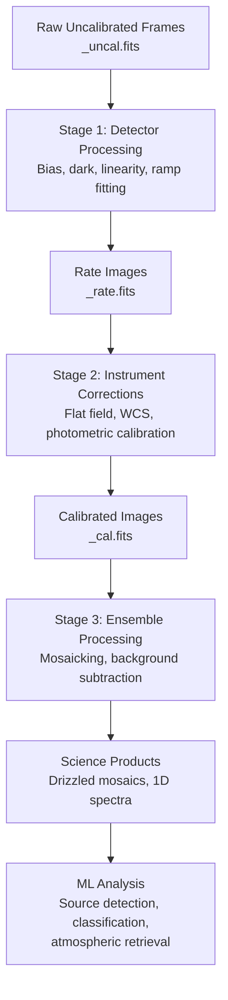

# JWST Data Analysis: From Images to Discoveries

The James Webb Space Telescope, launched in December 2021, represents the most powerful space observatory ever built. Its 6.5-meter segmented primary mirror -- nearly three times the diameter of Hubble's 2.4-meter mirror -- combined with infrared sensitivity down to 0.6 microns and out to 28 microns makes JWST uniquely capable of peering into the early universe and characterizing exoplanet atmospheres. Processing its data, however, demands sophisticated computational pipelines and increasingly, machine learning methods.

## The JWST Instrument Suite

JWST carries four science instruments, each serving distinct observational modes:

- **NIRCam** (Near Infrared Camera): primary imager covering 0.6--5 microns, used for deep field imaging and coronagraphy
- **NIRSpec** (Near Infrared Spectrograph): multi-object spectrograph with micro-shutter assembly (MSA) enabling simultaneous spectra of up to 100 sources
- **MIRI** (Mid-Infrared Instrument): covers 5--28 microns, essential for dust-obscured galaxies and protoplanetary disks
- **NIRISS** (Near Infrared Imager and Slitless Spectrograph): specializes in transit spectroscopy and aperture masking interferometry

Raw detector output from these instruments is processed through the official STScI pipeline (available as `jwst` Python package) in three stages: detector-level corrections, individual exposure corrections, and final mosaic/spectral extraction.

## The Data Pipeline



## Transmission Spectroscopy for Exoplanet Atmospheres

When an exoplanet transits its host star, starlight filters through the planet's atmosphere. Different molecules absorb at characteristic wavelengths, imprinting features on the transmission spectrum. The transit depth at wavelength $\lambda$ is:

$$\delta(\lambda) = \frac{R_p(\lambda)^2}{R_*^2}$$

where $R_p(\lambda)$ is the effective planet radius -- larger where the atmosphere is opaque. JWST's first major exoplanet result (WASP-39b, ERS program, Ahrer et al. 2023, Nature) detected CO$_2$ at $4.3\ \mu\text{m}$ with NIRSpec, the first unambiguous carbon dioxide detection in an exoplanet atmosphere.

Atmospheric retrieval codes (CHIMERA, petitRADTRANS, POSEIDON) use Bayesian inference -- typically nested sampling -- to fit model spectra to observations, recovering temperature-pressure profiles and molecular abundances. Machine learning accelerates this: neural network emulators replace expensive forward model calls (Nixon & Madhusudhan 2020), reducing retrieval time from days to minutes.

## High-Redshift Galaxy Discovery

JWST has found galaxies at redshifts $z > 10$, corresponding to light emitted when the universe was less than 500 million years old. The Lyman break technique identifies high-$z$ candidates: the intergalactic medium absorbs all flux blueward of Lyman-alpha ($\lambda = 121.6\ \text{nm}$ rest-frame), producing a sharp dropout in the observed SED at:

$$\lambda_{\text{obs}} = 121.6 \times (1 + z)\ \text{nm}$$

Photometric redshift codes (EAZY, BPZ) fit template SEDs to multi-band photometry. Convolutional neural networks trained on simulated JWST images (from IllustrisTNG and FIRE hydrodynamic simulations) now achieve photometric redshift precision of $\sigma_z / (1+z) \approx 0.02$ for bright sources (Huertas-Company et al. 2023).

## Neural Network Denoising for Astronomical Images

JWST images contain noise from multiple sources: Poisson photon noise, read noise, zodiacal light background, and detector artifacts. Denoising improves sensitivity for faint sources. Noise2Void (Krull et al. 2019) and its variants train denoising networks without clean reference images -- crucial for astronomy where ground truth is unavailable.

The point spread function (PSF) of JWST is wavelength-dependent and position-dependent across the detector. WebbPSF models the optical PSF from wavefront measurements, but machine learning refines empirical PSF models from crowded stellar fields. Sparse deconvolution and unrolled optimization networks improve upon classical CLEAN algorithms used in image reconstruction.

## Code Example: Spectral Denoising with a 1D Convolutional Autoencoder

```python
import numpy as np
import torch
import torch.nn as nn
import matplotlib.pyplot as plt

# Simulate a JWST NIRSpec transmission spectrum of an exoplanet atmosphere
# with CO2 absorption feature near 4.3 microns

np.random.seed(42)

# Wavelength grid in microns (NIRSpec G395H grating range)
wavelengths = np.linspace(2.87, 5.27, 300)

# True transmission spectrum: baseline with CO2 absorption
def co2_absorption(wl, center=4.3, width=0.15, depth=150e-6):
    """Gaussian approximation to CO2 band."""
    return depth * np.exp(-0.5 * ((wl - center) / width) ** 2)

def water_absorption(wl, center=2.9, width=0.08, depth=80e-6):
    return depth * np.exp(-0.5 * ((wl - center) / width) ** 2)

true_spectrum = (
    300e-6 * np.ones_like(wavelengths)  # flat transit depth baseline
    + co2_absorption(wavelengths)
    + water_absorption(wavelengths)
)

# Add realistic noise (photon noise + systematics)
noise_level = 40e-6
noisy_spectrum = true_spectrum + np.random.normal(0, noise_level, len(wavelengths))

# Convert to tensors: shape (batch, channels, length)
X = torch.FloatTensor(noisy_spectrum).unsqueeze(0).unsqueeze(0)  # (1, 1, 300)
Y = torch.FloatTensor(true_spectrum).unsqueeze(0).unsqueeze(0)

class SpectralDenoiser(nn.Module):
    """1D convolutional autoencoder for spectral denoising."""
    def __init__(self):
        super().__init__()
        self.encoder = nn.Sequential(
            nn.Conv1d(1, 16, kernel_size=7, padding=3),
            nn.ReLU(),
            nn.Conv1d(16, 32, kernel_size=5, padding=2),
            nn.ReLU(),
            nn.Conv1d(32, 16, kernel_size=5, padding=2),
            nn.ReLU(),
        )
        self.decoder = nn.Sequential(
            nn.Conv1d(16, 16, kernel_size=5, padding=2),
            nn.ReLU(),
            nn.Conv1d(16, 8, kernel_size=7, padding=3),
            nn.ReLU(),
            nn.Conv1d(8, 1, kernel_size=7, padding=3),
        )

    def forward(self, x):
        return self.decoder(self.encoder(x))

# Train on multiple noisy realizations of the same spectrum
model = SpectralDenoiser()
optimizer = torch.optim.Adam(model.parameters(), lr=1e-3)
loss_fn = nn.MSELoss()

# Generate training data: many noisy versions of the true spectrum
n_train = 500
noise_batch = (
    torch.FloatTensor(true_spectrum).unsqueeze(0).expand(n_train, -1)
    + torch.randn(n_train, len(wavelengths)) * noise_level
).unsqueeze(1)  # (500, 1, 300)
target_batch = torch.FloatTensor(true_spectrum).unsqueeze(0).unsqueeze(0).expand(n_train, -1, -1)

for epoch in range(200):
    model.train()
    optimizer.zero_grad()
    pred = model(noise_batch)
    loss = loss_fn(pred, target_batch)
    loss.backward()
    optimizer.step()
    if (epoch + 1) % 50 == 0:
        print(f"Epoch {epoch+1:3d} | Loss: {loss.item():.4e}")

# Evaluate on a fresh noisy spectrum
model.eval()
with torch.no_grad():
    test_noisy = (
        torch.FloatTensor(true_spectrum).unsqueeze(0).unsqueeze(0)
        + torch.randn(1, 1, len(wavelengths)) * noise_level
    )
    denoised = model(test_noisy).squeeze().numpy()

# Report signal-to-noise improvement
co2_idx = np.argmin(np.abs(wavelengths - 4.3))
snr_noisy = true_spectrum[co2_idx] / noise_level
residual_rms = np.std(denoised - true_spectrum)
snr_denoised = true_spectrum[co2_idx] / residual_rms

print(f"\nCO2 feature depth: {true_spectrum[co2_idx]*1e6:.0f} ppm")
print(f"Noise level (input): {noise_level*1e6:.0f} ppm")
print(f"Residual RMS (denoised): {residual_rms*1e6:.1f} ppm")
print(f"SNR improvement: {snr_denoised/snr_noisy:.2f}x")
```

## PSF Modeling with Neural Networks

The JWST PSF varies across the $5' \times 5'$ NIRCam field due to optical aberrations. Classical approaches interpolate PSF models from isolated stars. The `psfex` tool and its ML successors fit principal component decompositions of star images. More recently, Bernstein et al. (2023) and collaborators use implicit neural representations (coordinate networks) to model spatially-varying PSFs as continuous functions of detector position, enabling accurate PSF evaluation at any location -- critical for weak gravitational lensing measurements.

## Key Concepts Summary

- **JWST instrument suite**: NIRCam, NIRSpec, MIRI, NIRISS cover 0.6--28 microns across imaging and spectroscopy modes
- **Transmission spectroscopy**: transit depth variations with wavelength reveal atmospheric composition; CO$_2$ first detected in WASP-39b by JWST
- **High-redshift galaxies**: Lyman-break selection and photometric redshift codes find $z > 10$ galaxies; CNNs improve photo-$z$ precision
- **Neural network denoising**: Noise2Void and convolutional autoencoders improve sensitivity without requiring clean reference images
- **PSF modeling**: implicit neural representations capture spatially-varying PSFs for precision photometry and lensing

## Exercises

1. The CO$_2$ absorption feature in WASP-39b was detected at approximately $4.3\ \mu\text{m}$. At what observed wavelength would this feature appear for a planet at redshift $z = 0$ orbiting a nearby star? How does this differ from the CO$_2$ band in a galaxy spectrum at $z = 1$?

2. Modify the `SpectralDenoiser` code to use a residual connection (add the input to the output). Does this improve denoising performance? Why might skip connections help for spectral data?

3. JWST's NIRSpec can observe up to 100 objects simultaneously with its micro-shutter assembly. Design a machine learning pipeline to (a) select which 100 targets to observe from a catalog of 10,000 candidates to maximize the number of $z > 6$ galaxies, and (b) classify the resulting spectra by redshift.

4. Atmospheric retrieval for WASP-39b involves fitting for 10--15 free parameters (molecular abundances, temperature profile, cloud properties). If a single forward model evaluation takes 0.1 seconds and nested sampling requires $10^6$ likelihood calls, how long does a full retrieval take? How would a neural network emulator that evaluates in 1 ms change this?
