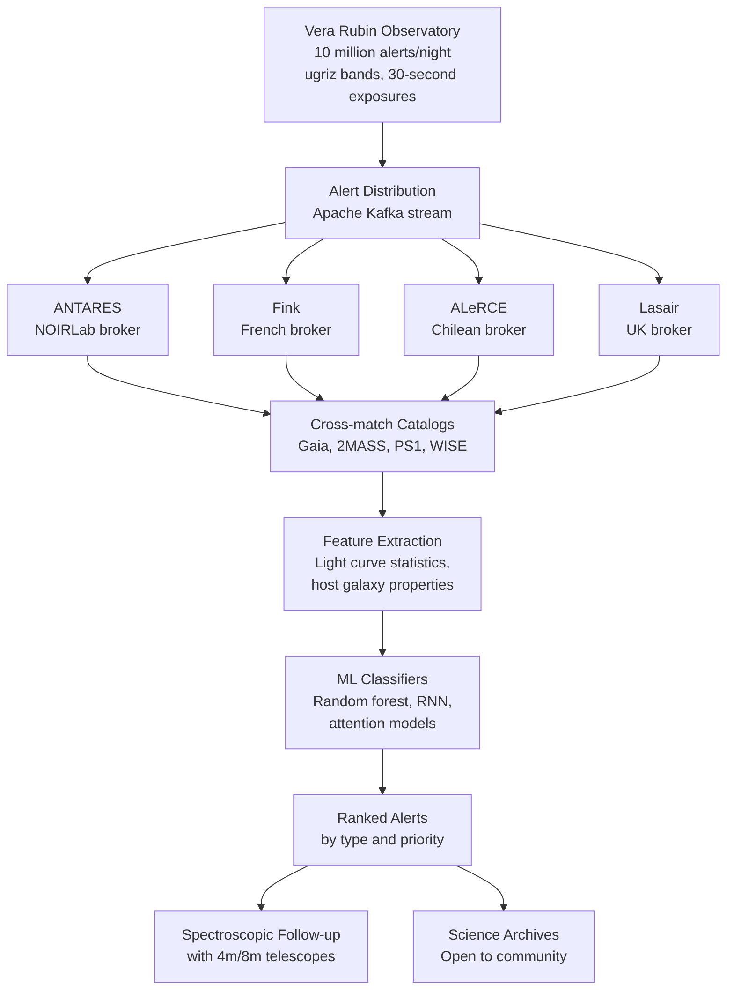

# Time-Domain Astronomy and Anomaly Detection

The night sky is not static. Stars pulsate, explode, merge, and flare. Planets periodically eclipse their host stars. Black holes shred passing stars. White dwarfs detonate. With the Vera C. Rubin Observatory (formerly LSST) beginning full science operations, the survey will image the entire southern sky every three nights, generating approximately 10 million alerts per night -- each flagging a source that changed brightness between observations. No human team can review 10 million alerts nightly. Machine learning is not an optional enhancement; it is the only path to science.

## The Transient Sky

Transient astronomical sources span enormous ranges in timescale and luminosity:

| Event type | Timescale | Peak luminosity (relative to Sun) |
|---|---|---|
| Classical novae | weeks--months | $10^4$ |
| Core-collapse supernovae (Type II) | weeks--months | $10^9$ |
| Thermonuclear supernovae (Type Ia) | weeks | $10^{10}$ |
| Kilonovae (neutron star mergers) | days | $10^{10}$ |
| Tidal disruption events (TDE) | months--years | $10^{11}$ |
| Fast radio bursts | milliseconds | $-$ |
| Gamma-ray bursts | seconds--minutes | $10^{15}$ |

Type Ia supernovae are standardizable candles: their peak luminosities can be calibrated using the Phillips relation ($\Delta m_{15}$, the magnitude decline 15 days after peak). This made them the tools used by Perlmutter, Schmidt, and Riess to discover the accelerating expansion of the universe (Nobel Prize 2011). Correctly classifying Type Ia vs. core-collapse supernovae from photometry alone -- without spectroscopic confirmation -- is therefore a high-stakes classification problem.

## Alert Broker Systems

The Rubin alert stream flows through community alert brokers that filter, annotate, and classify alerts before distributing to science teams:



The Zwicky Transient Facility (ZTF, Bellm et al. 2019) currently produces ~1 million alerts per night and has served as the proving ground for broker systems. ZTF has discovered thousands of supernovae, dozens of tidal disruption events, and enabled statistical cosmology with Type Ia supernovae at $z < 0.3$.

## Light Curve Classification

A light curve is a time series of flux measurements $f(t_i)$ with uncertainties $\sigma_i$, typically observed in multiple photometric bands. The challenge is that observations are:
- **Irregularly sampled**: weather, scheduling, and cadence create gaps
- **Incomplete**: classification must occur early, before the event peaks or ends
- **Multi-band**: color evolution carries physical information
- **Noisy**: photometric uncertainties of 1--5% are typical

**RAPID** (Muthukrishna et al. 2019, PASP) uses a recurrent neural network (bidirectional GRU) that classifies transients from the moment of first detection, outputting a probability vector over event types that updates with each new observation. The key insight is training the network on all time steps, not just the final light curve.

**SuperNNova** (Moller & de Boissiere 2020, MNRAS) uses a Bayesian recurrent architecture with variational dropout to produce calibrated uncertainties on photometric supernova classification. It achieves >95% accuracy on Type Ia identification in ZTF-like simulations when host galaxy photometric redshifts are available.

**ParSNIP** (Thrane & Talbot 2022) and **SCONE** (Qu et al. 2021) use variational autoencoders and convolutional networks respectively, trained on the PLAsTiCC simulation dataset (Kessler et al. 2019) which contains 18 transient classes under realistic LSST observing conditions.

## Code Example: Simulating Light Curves and Random Forest Classification

```python
import numpy as np
from sklearn.ensemble import RandomForestClassifier
from sklearn.model_selection import train_test_split
from sklearn.metrics import classification_report

np.random.seed(42)

# ---------------------------------------------------------------------------
# 1. Simulate light curves for three transient types
# ---------------------------------------------------------------------------

def bazin_profile(t, A, t0, t_fall, t_rise, B=0.0):
    """Bazin function: standard parameterization for SN light curves."""
    return A * np.exp(-(t - t0) / t_fall) / (1 + np.exp(-(t - t0) / t_rise)) + B

def simulate_type_ia(n=300):
    """Type Ia SN: symmetric, bright, ~20 day rise, ~40 day fall."""
    curves = []
    for _ in range(n):
        t = np.sort(np.random.uniform(-20, 80, 25))
        A     = np.random.normal(5.0, 0.3)   # peak flux (standardizable)
        t0    = np.random.normal(10, 3)
        tfall = np.random.normal(40, 5)
        trise = np.random.normal(10, 2)
        flux  = bazin_profile(t, A, t0, tfall, trise)
        noise = np.random.normal(0, 0.1, len(t))
        curves.append(flux + noise)
    return curves

def simulate_core_collapse(n=300):
    """Type II SN: slower rise, plateau phase, dimmer, more variable."""
    curves = []
    for _ in range(n):
        t = np.sort(np.random.uniform(-5, 120, 25))
        A     = np.random.normal(2.5, 0.8)   # dimmer, more scatter
        t0    = np.random.normal(20, 8)
        tfall = np.random.normal(80, 20)      # longer plateau/fall
        trise = np.random.normal(20, 5)
        flux  = bazin_profile(t, A, t0, tfall, trise)
        # Add plateau feature
        plateau = 0.5 * A * np.where((t > t0) & (t < t0 + 60), 1.0, 0.0)
        noise = np.random.normal(0, 0.15, len(t))
        curves.append(flux + plateau * 0.4 + noise)
    return curves

def simulate_variable_star(n=300):
    """Variable star (RR Lyrae-like): periodic, sinusoidal."""
    curves = []
    for _ in range(n):
        t = np.sort(np.random.uniform(0, 100, 25))
        period = np.random.uniform(0.3, 1.0)  # days, short periods
        amplitude = np.random.uniform(0.3, 1.5)
        baseline  = np.random.uniform(2.0, 4.0)
        flux  = baseline + amplitude * np.sin(2 * np.pi * t / period)
        noise = np.random.normal(0, 0.05, len(t))
        curves.append(flux + noise)
    return curves

# ---------------------------------------------------------------------------
# 2. Feature extraction (hand-crafted features for random forest)
# ---------------------------------------------------------------------------

def extract_features(flux_list):
    """
    Extract statistical features from light curves.
    Real pipelines also use color, host galaxy info, period-finding results.
    """
    features = []
    for flux in flux_list:
        f = np.array(flux)
        peak = f.max()
        feature_vec = [
            f.mean(),                          # mean flux
            f.std(),                           # variability
            f.max(),                           # peak flux
            f.min(),
            f.max() - f.min(),                 # amplitude
            f.max() / (f.mean() + 1e-6),       # peak-to-mean ratio
            np.diff(f).std(),                  # variability of flux changes
            np.percentile(f, 75) - np.percentile(f, 25),  # IQR
            # Asymmetry: skewness
            ((f - f.mean())**3).mean() / (f.std()**3 + 1e-6),
            # Duration above half-peak
            np.sum(f > peak/2) / len(f),
        ]
        features.append(feature_vec)
    return np.array(features)

# Generate data
ia_curves   = simulate_type_ia(400)
cc_curves   = simulate_core_collapse(400)
var_curves  = simulate_variable_star(400)

X = extract_features(ia_curves + cc_curves + var_curves)
y = np.array([0]*400 + [1]*400 + [2]*400)
labels = ["Type Ia SN", "Core-collapse SN", "Variable star"]

# ---------------------------------------------------------------------------
# 3. Train and evaluate random forest
# ---------------------------------------------------------------------------

X_train, X_test, y_train, y_test = train_test_split(
    X, y, test_size=0.2, stratify=y, random_state=42
)

clf = RandomForestClassifier(
    n_estimators=200,
    max_depth=10,
    min_samples_leaf=3,
    random_state=42,
    n_jobs=-1,
)
clf.fit(X_train, y_train)
y_pred = clf.predict(X_test)

print(classification_report(y_test, y_pred, target_names=labels))

# Feature importance
feature_names = [
    "mean", "std", "max", "min", "amplitude",
    "peak/mean", "diff_std", "IQR", "skewness", "duty_cycle"
]
importances = clf.feature_importances_
sorted_idx = np.argsort(importances)[::-1]
print("\nFeature importances:")
for i in sorted_idx:
    print(f"  {feature_names[i]:15s}: {importances[i]:.3f}")

# ---------------------------------------------------------------------------
# 4. Simulate early-time classification (incomplete light curve)
# ---------------------------------------------------------------------------

print("\nEarly-time classification accuracy (fraction of light curve observed):")
fractions = [0.2, 0.4, 0.6, 0.8, 1.0]
for frac in fractions:
    partial_curves = []
    for flux in (ia_curves + cc_curves + var_curves):
        n_obs = max(3, int(len(flux) * frac))
        partial_curves.append(flux[:n_obs])
    X_partial = extract_features(partial_curves)
    X_partial_test = X_partial[len(X_train):]
    acc = (clf.predict(X_partial_test) == y_test).mean()
    print(f"  {frac*100:3.0f}% of light curve: accuracy = {acc:.3f}")
```

## Anomaly Detection: Finding the Unknown

Classification assumes you know all the classes. Anomaly detection finds sources that don't match any known type -- potentially the most scientifically valuable discovery mode. Methods include:

**Isolation Forest** (Liu et al. 2008): randomly partitions the feature space; anomalies require fewer splits to isolate. Used in ANTARES for flagging unusual light curves.

**Autoencoders**: train to reconstruct normal transients; anomalies produce high reconstruction error. The key assumption is that the training set well-represents "normal" events.

**LOF (Local Outlier Factor)**: compares the local density of a point to its neighbors; anomalies have significantly lower local density.

**ANODE** (Nachman & Kasieczka 2020): a likelihood-ratio method using normalizing flows that detects anomalies by comparing learned distributions in signal vs. sideband regions. Applied in particle physics but transferable to astronomical surveys.

The Astronomaly framework (Lochner & Bassett 2021) provides an active learning loop: an anomaly detection algorithm identifies candidates, astronomers label a small subset, and the model updates -- enabling human-in-the-loop discovery with minimal expert time.

## Key Concepts Summary

- **Transient classification**: Type Ia vs. core-collapse supernovae, kilonovae, TDEs -- high-stakes because misclassification degrades cosmological measurements
- **Alert brokers**: ANTARES, Fink, ALeRCE, Lasair process Rubin's 10 million nightly alerts; cross-match catalogs, extract features, run classifiers
- **Light curve challenges**: irregular sampling, incomplete observations, multi-band data, noise -- RAPID, SuperNNova, ParSNIP address these with recurrent and variational architectures
- **Random forest features**: statistical summaries (amplitude, skewness, duty cycle) provide competitive baselines before deploying deep sequence models
- **Anomaly detection**: Isolation Forest, autoencoders, LOF, and active learning loops enable discovery of genuinely new phenomena

## Exercises

1. The PLAsTiCC challenge dataset (Kessler et al. 2019) contains 18 transient classes under realistic LSST conditions. Download it from Kaggle and train a gradient boosting classifier (XGBoost or LightGBM) on the provided handcrafted features. What is the log-loss on the test set? Which classes are most frequently confused?

2. RAPID classifies transients in real-time as observations accumulate. Describe in detail what architectural changes you would need to convert the random forest in the code example into a sequential classifier that updates its probability estimate with each new photometric observation. What are the tradeoffs vs. a GRU-based approach?

3. A kilonova (neutron star merger) fades by ~2 magnitudes in the first 24 hours after peak. The Rubin cadence visits each field every 3 nights. What fraction of kilonovae would be detectable at peak vs. in decline at first observation? How does this inform alert classification strategies?

4. Implement a simple autoencoder anomaly detector using the simulated light curves from the code example. Train on Type Ia and core-collapse supernovae only, then compute reconstruction error on variable stars. What threshold would you set to flag anomalies, and how does the false positive rate depend on this threshold?
