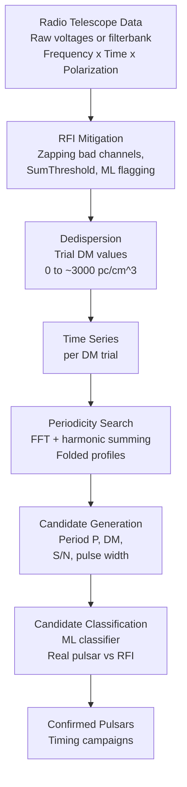

# AI for Radio Astronomy: Pulsars and Fast Radio Bursts

Radio astronomy observes the universe at wavelengths from millimeters to meters, revealing phenomena invisible at optical wavelengths: the cold interstellar medium, synchrotron radiation from relativistic electrons, molecular masers, and the most extreme compact objects -- pulsars and magnetars. Modern radio telescopes generate data at rates of terabytes per hour, and the signals of interest are buried in terrestrial radio frequency interference (RFI) that can be orders of magnitude brighter than the astrophysical signal. Machine learning has become central to radio astronomy data processing.

## Radio Interferometry Fundamentals

The Square Kilometre Array (SKA), now under construction in South Africa and Australia, will comprise thousands of antennas spanning thousands of kilometers. Individual dishes are combined through interferometry: the cross-correlation of signals between antenna pairs (baselines) samples the Fourier transform of the sky brightness distribution. The relationship between the measured visibilities $V(u,v)$ and the sky intensity $I(l,m)$ is:

$$V(u,v) = \int\int I(l,m)\, e^{-2\pi i (ul + vm)}\, dl\, dm$$

where $(u,v)$ are baseline coordinates in units of the observing wavelength, and $(l,m)$ are direction cosines on the sky. Reconstructing $I(l,m)$ from incomplete $(u,v)$ coverage is an ill-posed inverse problem. Classical CLEAN algorithms iteratively deconvolve the dirty image (the direct Fourier transform of sampled visibilities). Deep learning approaches (POLISH, Wiaux et al. groups) learn to solve this inverse problem end-to-end.

## Pulsars: Rotating Neutron Star Lighthouses

Pulsars are rapidly rotating neutron stars ($M \approx 1.4 M_\odot$, $R \approx 10$ km) emitting radio beams along their magnetic poles. As they rotate -- with periods from 1.4 ms (millisecond pulsars) to 8 seconds -- the beam sweeps past Earth, producing highly regular pulses. Their pulse periods are extraordinarily stable, rivaling atomic clocks: millisecond pulsars have $\dot{P} \sim 10^{-20}$ s/s.

Radio pulses travel through the ionized interstellar medium (ISM), which disperses them: higher-frequency components arrive earlier than lower-frequency components. The dispersion delay between frequencies $f_1$ and $f_2$ is:

$$\Delta t = \frac{e^2}{2\pi m_e c} \cdot \text{DM} \cdot \left(\frac{1}{f_2^2} - \frac{1}{f_1^2}\right)$$

where the dispersion measure $\text{DM} = \int_0^d n_e\, dl$ is the integrated free electron column density along the line of sight (units: pc cm$^{-3}$). Correcting for this effect -- **dedispersion** -- is the first step in pulsar signal processing.

## The Pulsar Search Pipeline



The HTRU (High Time Resolution Universe) survey (Keith et al. 2010) at the Parkes radio telescope generated millions of pulsar candidates. Zhu et al. (2014) trained an artificial neural network on 120,000 labeled candidates (1,196 real pulsars, rest RFI) from HTRU, achieving 98% accuracy -- enabling fully automated processing. Subsequent work by Bates et al., Eatough et al., and the LOTAAS survey teams applied random forests, SVMs, and deep CNNs on the 2D folded profile images (phase vs. frequency, and phase vs. time subplots).

## Fast Radio Bursts

Fast Radio Bursts (FRBs) are millisecond-duration extragalactic radio transients of unknown origin discovered by Lorimer et al. (2007) in archival Parkes data. Their DMs far exceed the Milky Way contribution, placing them at cosmological distances ($z \sim 0.1$ to $>1$). Key properties:

- Fluences of 1--1000 Jy ms in microseconds to milliseconds
- DMs of 100--2600 pc cm$^{-3}$ (Milky Way contributes $\lesssim 200$ pc cm$^{-3}$ along most lines of sight)
- Some repeat (FRB 20121102A, the first repeater, Spitler et al. 2016); most observed once
- Some show temporal substructure at microsecond scales (CHIME/FRB Collaboration)

The CHIME/FRB experiment (Canadian Hydrogen Intensity Mapping Experiment) operates as a dedicated FRB detector, discovering hundreds of FRBs with its real-time ML pipeline (AMBER + FETCH classifier). FETCH (Fast Extraction of Triggered Candidates from the Heavens, Agarwal et al. 2020) uses a 2D CNN on dynamic spectra to classify candidates with >99% precision at high S/N.

## Code Example: Simulating Dispersed Pulses and CNN Classification

```python
import numpy as np
import torch
import torch.nn as nn
from torch.utils.data import DataLoader, TensorDataset

# ---------------------------------------------------------------------------
# 1. Simulate dispersed radio pulses in frequency-time space
# ---------------------------------------------------------------------------

# Physical constants
K_DM = 4.148808e3  # MHz^2 pc^-1 cm^3 ms

def dispersion_delay_ms(freq_mhz, dm, ref_freq_mhz=1500.0):
    """
    Time delay relative to reference frequency in milliseconds.
    dm: pc cm^-3
    freq_mhz: observing frequency in MHz
    """
    return K_DM * dm * (freq_mhz**-2 - ref_freq_mhz**-2)

def simulate_dynamic_spectrum(dm, snr=10.0, pulse_width_ms=2.0,
                               n_freq=64, n_time=256,
                               f_low=1200., f_high=1800.,
                               t_start_ms=-50., t_end_ms=100.):
    """
    Simulate a dispersed radio pulse as a 2D dynamic spectrum
    (frequency channels x time samples).
    Returns: array of shape (n_freq, n_time)
    """
    freqs = np.linspace(f_high, f_low, n_freq)  # high to low (standard)
    times = np.linspace(t_start_ms, t_end_ms, n_time)
    dt    = times[1] - times[0]  # ms per sample

    spectrum = np.random.normal(0, 1, (n_freq, n_time))  # noise baseline

    for i, f in enumerate(freqs):
        delay = dispersion_delay_ms(f, dm)
        # Gaussian pulse centered at t=0 + dispersion delay
        pulse = snr * np.exp(-0.5 * ((times - delay) / pulse_width_ms)**2)
        spectrum[i] += pulse

    return spectrum.astype(np.float32)

def dedisperse(spectrum, dm, freqs, times):
    """Apply coherent dedispersion by shifting each frequency channel."""
    n_freq, n_time = spectrum.shape
    dt = times[1] - times[0]
    dedispersed = np.zeros_like(spectrum)
    for i, f in enumerate(freqs):
        delay_ms = dispersion_delay_ms(f, dm)
        shift = int(round(delay_ms / dt))
        if shift >= 0:
            dedispersed[i, :n_time-shift] = spectrum[i, shift:]
        else:
            dedispersed[i, -shift:] = spectrum[i, :n_time+shift]
    return dedispersed

# ---------------------------------------------------------------------------
# 2. Generate training dataset: real pulses vs. RFI vs. noise
# ---------------------------------------------------------------------------

np.random.seed(42)
N_each = 300  # samples per class

def make_rfi(n_freq=64, n_time=256):
    """Simulate broadband RFI: bright in all channels at one time."""
    spec = np.random.normal(0, 1, (n_freq, n_time)).astype(np.float32)
    # Random narrow-time broadband burst (RFI)
    t_rfi = np.random.randint(10, n_time - 10)
    width = np.random.randint(1, 5)
    amplitude = np.random.uniform(8, 20)
    spec[:, t_rfi:t_rfi+width] += amplitude
    return spec

def make_noise(n_freq=64, n_time=256):
    return np.random.normal(0, 1, (n_freq, n_time)).astype(np.float32)

# Real FRB/pulsar candidates: dispersed pulse at random DM and SNR
frb_spectra = np.stack([
    simulate_dynamic_spectrum(
        dm=np.random.uniform(50, 800),
        snr=np.random.uniform(6, 20),
        pulse_width_ms=np.random.uniform(0.5, 5.0)
    )
    for _ in range(N_each)
])

rfi_spectra  = np.stack([make_rfi()  for _ in range(N_each)])
noise_spectra = np.stack([make_noise() for _ in range(N_each)])

# Normalize each spectrum independently (zero mean, unit std)
def normalize(arr):
    mean = arr.mean(axis=(-2,-1), keepdims=True)
    std  = arr.std(axis=(-2,-1), keepdims=True) + 1e-6
    return (arr - mean) / std

X = normalize(np.concatenate([frb_spectra, rfi_spectra, noise_spectra]))
y = np.array([0]*N_each + [1]*N_each + [2]*N_each)  # 0=FRB, 1=RFI, 2=noise

# Add channel dimension for Conv2D: (N, 1, n_freq, n_time)
X = torch.FloatTensor(X[:, np.newaxis, :, :])
y = torch.LongTensor(y)

# Train/test split
n_total = len(y)
idx = torch.randperm(n_total)
n_train = int(0.8 * n_total)
train_idx, test_idx = idx[:n_train], idx[n_train:]
X_train, y_train = X[train_idx], y[train_idx]
X_test,  y_test  = X[test_idx],  y[test_idx]

# ---------------------------------------------------------------------------
# 3. CNN classifier (similar architecture to FETCH)
# ---------------------------------------------------------------------------

class FRBClassifier(nn.Module):
    """
    2D CNN for dynamic spectrum classification.
    Input: (batch, 1, 64, 256) normalized frequency-time images.
    Output: (batch, 3) logits for [FRB/pulsar, RFI, noise].
    """
    def __init__(self):
        super().__init__()
        self.features = nn.Sequential(
            nn.Conv2d(1, 16, kernel_size=(3,7), padding=(1,3)),
            nn.BatchNorm2d(16),
            nn.ReLU(),
            nn.MaxPool2d((2, 4)),         # -> (16, 32, 64)
            nn.Conv2d(16, 32, kernel_size=(3,5), padding=(1,2)),
            nn.BatchNorm2d(32),
            nn.ReLU(),
            nn.MaxPool2d((2, 4)),         # -> (32, 16, 16)
            nn.Conv2d(32, 64, kernel_size=3, padding=1),
            nn.BatchNorm2d(64),
            nn.ReLU(),
            nn.AdaptiveAvgPool2d((4, 4)), # -> (64, 4, 4)
        )
        self.classifier = nn.Sequential(
            nn.Flatten(),
            nn.Linear(64 * 4 * 4, 128),
            nn.ReLU(),
            nn.Dropout(0.3),
            nn.Linear(128, 3),
        )

    def forward(self, x):
        return self.classifier(self.features(x))

model = FRBClassifier()
optimizer = torch.optim.Adam(model.parameters(), lr=1e-3, weight_decay=1e-4)
loader = DataLoader(TensorDataset(X_train, y_train), batch_size=32, shuffle=True)

for epoch in range(30):
    model.train()
    total_loss = 0
    for xb, yb in loader:
        optimizer.zero_grad()
        loss = nn.functional.cross_entropy(model(xb), yb)
        loss.backward()
        optimizer.step()
        total_loss += loss.item() * len(yb)
    if (epoch + 1) % 10 == 0:
        model.eval()
        with torch.no_grad():
            test_acc = (model(X_test).argmax(1) == y_test).float().mean()
        print(f"Epoch {epoch+1:2d} | Loss: {total_loss/n_train:.4f} | Test acc: {test_acc:.3f}")

# Per-class accuracy
model.eval()
with torch.no_grad():
    preds = model(X_test).argmax(1)
class_names = ["FRB/Pulsar", "RFI", "Noise"]
for c, name in enumerate(class_names):
    mask = y_test == c
    acc  = (preds[mask] == y_test[mask]).float().mean()
    print(f"  {name:12s}: accuracy = {acc:.3f}")
```

## RFI Mitigation

Radio frequency interference from mobile phones, satellites, aircraft transponders, and industrial equipment is the primary enemy of radio astronomy. Classical mitigation techniques include:

- **SumThreshold** (Offringa et al. 2010): computes running statistics across time and frequency, flags samples exceeding a threshold
- **AOFlagger**: widely used automated flagging pipeline that combines multiple statistical tests
- **Deep learning approaches**: CNNs trained on labeled RFI masks (Akeret et al. 2017 with RFI-Net; Mosiane et al. 2023) achieve higher recall on faint RFI at the cost of some false positives

For real-time FRB searches, RFI must be excised before the dedispersion step -- a delay of more than a few seconds means the alert cannot trigger rapid follow-up observations.

## Gravitational Lens Detection with CNNs on Radio Maps

Strong gravitational lensing occurs when a massive foreground galaxy or cluster bends and amplifies light from a background source, creating arcs or Einstein rings. In radio surveys such as FIRST and the forthcoming EMU survey with ASKAP, lenses appear as distinctive ring morphologies in radio continuum maps. Hezaveh et al. (2017, Nature) demonstrated that a CNN trained on simulated lens images can detect and characterize lenses in real Hubble data -- with inference time of milliseconds vs. hours for traditional grid searches over lens model parameters.

## Key Concepts Summary

- **Radio interferometry**: cross-correlation of antenna pairs samples $V(u,v)$; reconstruction of sky brightness is an ill-posed inverse problem solved by CLEAN or neural network deconvolution
- **Dispersion measure**: integrated free electron column; delays lower frequencies by $\Delta t \propto \text{DM}/f^2$; dedispersion corrects this for pulsar/FRB searches
- **Pulsar candidate classification**: HTRU dataset and Zhu et al. (2014) ANN demonstrated automated classification; deep CNNs on folded profile images now standard
- **FRBs**: millisecond extragalactic radio transients; CHIME/FRB + FETCH CNN classifies candidates in real-time at the telescope
- **SKA data challenge**: $\sim 160$ TB/day of calibrated visibilities for SKA-Mid; ML at every stage from RFI flagging to source finding to gravitational lens detection

## Exercises

1. The dispersion delay between 1200 MHz and 1800 MHz for a pulsar with DM = 100 pc cm$^{-3}$ is approximately how many milliseconds? Calculate this using the formula given above. How does this compare to a typical pulsar period of 0.5 seconds?

2. The CHIME/FRB telescope operates at 400--800 MHz with 16,384 frequency channels. If you want to search DMs from 0 to 3000 pc cm$^{-3}$ in steps of 0.5 pc cm$^{-3}$, how many dedispersion trials are required? At 1 ms time resolution, how many floating-point operations does a single-step incoherent dedispersion require for a 10-minute observation?

3. Modify the `FRBClassifier` to output calibrated probabilities using temperature scaling. After training, hold out a validation set, sweep temperatures $T \in [0.5, 5.0]$, and find the $T$ that minimizes cross-entropy loss. Plot the reliability diagram (predicted probability vs. fraction of positives) before and after calibration.

4. Gravitational lens detection in radio surveys requires discriminating Einstein rings from other circular radio morphologies such as supernova remnants and planetary nebulae. Propose a data augmentation strategy for training a CNN lens finder that (a) improves sensitivity to partial arcs (the lens is not always a complete ring), and (b) reduces false positives from shell-like structures.
