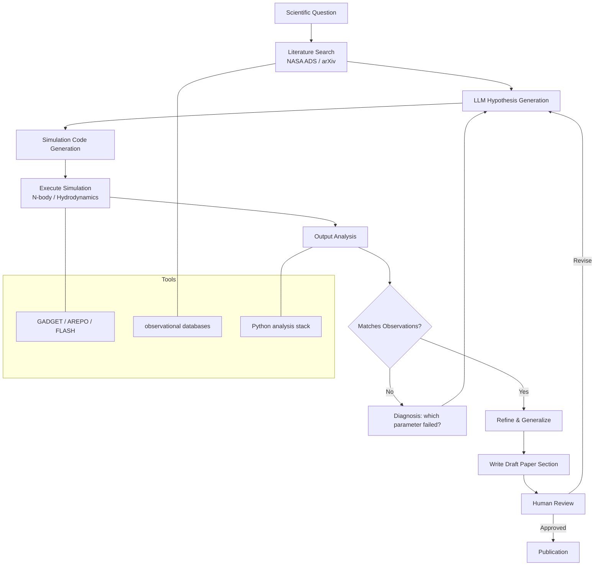

## AI Cosmologists: Autonomous Science Agents for Astrophysics

## The Scientific Discovery Loop

Science operates as a cycle: observe phenomena, form hypotheses, make predictions, test them, and refine understanding. Each step has historically required human insight. The question driving a new generation of AI research is which steps -- and eventually which complete loops -- machines can execute autonomously.

Astrophysics is particularly fertile ground for this inquiry. The data volumes from modern telescopes overwhelm human capacity to inspect. Physical laws governing phenomena from stellar structure to large-scale cosmology are expressed in precise mathematical form, making success verifiable. And simulations can reproduce hypothetical universes cheaply enough that agents can run experiments at scale.

## Symbolic Regression: Discovering Laws from Data

Perhaps the most striking form of autonomous scientific discovery is symbolic regression: finding a closed-form mathematical expression that fits observed data. Unlike neural networks that produce black-box functions, symbolic regression outputs interpretable equations -- the kind of relationships that appear in physics textbooks.

Udrescu and Tegmark (2020) introduced AI Feynman, a symbolic regression system that recovered 100 equations from the Feynman Lectures on Physics from numerical data alone. Their key insight was to decompose the problem using physical symmetries: if a function satisfies translational symmetry, it depends only on differences of its arguments, reducing dimensionality. If it satisfies dimensional analysis, the search space collapses further.

The underlying optimization is combinatorial: search over expression trees composed of arithmetic operations and elementary functions. Genetic programming -- evolutionary search over tree structures -- remains competitive with neural approaches. Modern systems like PySR (Cranmer 2023) combine genetic algorithms with gradient-based optimization and run efficiently on CPUs.

Kepler's third law provides a clean demonstration target. From observations of orbital period $T$ and semi-major axis $a$ for solar system bodies, the law $T^2 \propto a^3$ must emerge. In SI units with mass $M$:

$$T^2 = \frac{4\pi^2}{GM} a^3$$

A symbolic regression system searching over expressions of $a$, $G$, and $M$ should recover this relationship from data alone, without being told the functional form.

## Self-Driving Telescopes

The Robo-AO system at the Palomar 48-inch telescope demonstrated fully automated laser guide star adaptive optics observations in 2012 (Baranec et al. 2013). Each night, software selects targets from a queue, executes observations, assesses data quality in real time, and decides whether to reobserve. Over its operational lifetime, Robo-AO observed more than 50,000 targets -- far more than any human-operated program on the same telescope.

The Vera C. Rubin Observatory takes automation further. Its observing scheduler (Naghib et al. 2019) uses a modified greedy algorithm that scores candidate pointings by scientific return, accounting for seeing, airmass, filter constraints, and survey uniformity. Target-of-opportunity triggers automatically insert high-priority transients -- supernovae, gamma-ray bursts, gravitational wave counterparts -- into the queue.

Active learning formalizes optimal observation planning. Given a probabilistic model of the sky (what we currently know) and a cost model (observing time, feasibility), active learning selects the next observation to maximize expected information gain:

$$\text{next obs} = \arg\max_x \mathbb{E}[I(x, \theta)]$$

where $I$ is mutual information between observation $x$ and model parameters $\theta$. For transient classification, this means preferring objects where photometric classification is most uncertain -- typically near decision boundaries between supernova types.

## LLM-Based Science Agents

Large language models have demonstrated capacity to reason about scientific literature, write code, and plan multi-step tasks. Recent work connects LLMs to tool use -- code execution, literature search, simulation interfaces -- creating agents that can execute portions of the scientific workflow.

Boiko et al. (2023, Nature) demonstrated GPT-4 agents executing synthesis experiments in chemistry autonomously. In astrophysics, analogous systems are being developed for tasks like: searching NASA ADS for relevant papers, generating hypothesis lists, writing N-body simulation input files, running the simulation, parsing output, and comparing to observational constraints.

The agentic loop for astrophysics looks like:



Current limitations are significant. LLMs hallucinate citations, generate physically inconsistent parameter choices, and lack the domain-specific judgment to recognize when simulations have numerical artifacts. These systems are currently best described as AI-assisted rather than fully autonomous -- they accelerate skilled researchers rather than replace them.

## Code Example: Symbolic Regression for Kepler's Third Law

This example simulates orbital data for solar system bodies and applies a genetic programming approach to recover Kepler's third law symbolically.

```python
import numpy as np
from itertools import product
import warnings
warnings.filterwarnings('ignore')

rng = np.random.default_rng(42)

# Solar system semi-major axes (AU) and periods (years)
# Data from JPL Horizons
planets = {
    'Mercury': (0.387, 0.241),
    'Venus':   (0.723, 0.615),
    'Earth':   (1.000, 1.000),
    'Mars':    (1.524, 1.881),
    'Jupiter': (5.203, 11.862),
    'Saturn':  (9.537, 29.457),
    'Uranus':  (19.19, 84.011),
    'Neptune': (30.07, 164.79),
}

a_data = np.array([v[0] for v in planets.values()])  # AU
T_data = np.array([v[1] for v in planets.values()])  # years

print("Orbital data (AU, years):")
for name, (a, T) in planets.items():
    print(f"  {name:8s}: a = {a:6.3f} AU, T = {T:7.3f} yr")

# Simple symbolic regression: search over T = a^alpha expressions
# True law: T^2 = a^3, so T = a^1.5

print("\n--- Brute-force power law search: T = a^alpha ---")
alphas = np.linspace(0.5, 3.0, 500)
best_alpha = None
best_mse = np.inf

for alpha in alphas:
    T_pred = a_data ** alpha
    # Fit scale factor
    scale = np.sum(T_data * T_pred) / np.sum(T_pred ** 2)
    T_fitted = scale * T_pred
    mse = np.mean((T_fitted - T_data) ** 2)
    if mse < best_mse:
        best_mse = mse
        best_alpha = alpha
        best_scale = scale

print(f"Best fit: T = {best_scale:.4f} * a^{best_alpha:.3f}")
print(f"Expected: T = 1.000 * a^1.500  (Kepler's third law)")
print(f"MSE: {best_mse:.6f}")

# Genetic programming: evolve expression trees
# Simple implementation over 4 operations: +, -, *, power

class Node:
    """Expression tree node."""
    def __init__(self, op, left=None, right=None, value=None):
        self.op = op      # 'var', 'const', '+', '-', '*', 'pow'
        self.left = left
        self.right = right
        self.value = value

    def evaluate(self, x):
        if self.op == 'var':
            return x
        elif self.op == 'const':
            return np.full_like(x, self.value)
        elif self.op == '+':
            return self.left.evaluate(x) + self.right.evaluate(x)
        elif self.op == '-':
            return self.left.evaluate(x) - self.right.evaluate(x)
        elif self.op == '*':
            return self.left.evaluate(x) * self.right.evaluate(x)
        elif self.op == 'pow':
            exp = self.right.value if self.right.op == 'const' else 1.5
            val = np.abs(self.left.evaluate(x))
            return np.power(val, exp)

    def to_str(self):
        if self.op == 'var':
            return 'a'
        elif self.op == 'const':
            return f'{self.value:.2f}'
        elif self.op == 'pow':
            return f'({self.left.to_str()})^{self.right.to_str()}'
        else:
            return f'({self.left.to_str()} {self.op} {self.right.to_str()})'

def random_expr(depth=2):
    """Generate a random expression tree."""
    if depth == 0 or rng.random() < 0.4:
        if rng.random() < 0.6:
            return Node('var')
        else:
            return Node('const', value=rng.choice([0.5, 1.0, 1.5, 2.0, 3.0]))
    op = rng.choice(['+', '-', '*', 'pow'])
    left = random_expr(depth - 1)
    if op == 'pow':
        right = Node('const', value=rng.choice([0.5, 1.0, 1.5, 2.0, 2.5, 3.0]))
    else:
        right = random_expr(depth - 1)
    return Node(op, left, right)

def fitness(expr, x, y_true):
    """Lower is better. Returns MSE with penalty for invalid output."""
    try:
        y_pred = expr.evaluate(x)
        if np.any(~np.isfinite(y_pred)):
            return 1e9
        # Fit linear scale
        scale = np.sum(y_true * y_pred) / (np.sum(y_pred**2) + 1e-12)
        residuals = scale * y_pred - y_true
        return np.mean(residuals**2)
    except Exception:
        return 1e9

# Evolutionary search
population = [random_expr(depth=2) for _ in range(200)]
n_generations = 50

print("\n--- Genetic programming expression search ---")
for gen in range(n_generations):
    scores = [(fitness(e, a_data, T_data), e) for e in population]
    scores.sort(key=lambda x: x[0])

    if gen % 10 == 0:
        best_score, best_expr = scores[0]
        print(f"  Gen {gen:3d}: best MSE = {best_score:.5f}  "
              f"expr = {best_expr.to_str()}")

    # Selection: keep top 25%, regenerate rest with mutations
    survivors = [e for _, e in scores[:50]]
    new_pop = survivors[:]

    while len(new_pop) < 200:
        parent = rng.choice(survivors)
        # Mutation: create new random expression with same structure
        new_pop.append(random_expr(depth=rng.integers(1, 3)))

    population = new_pop

best_score, best_expr = min(
    [(fitness(e, a_data, T_data), e) for e in population],
    key=lambda x: x[0]
)

print(f"\nFinal best: T = scale * {best_expr.to_str()}")
print(f"Final MSE: {best_score:.6f}")
print(f"\nKepler's law verification:")
print(f"  T^2 / a^3 should be constant:")
ratios = T_data**2 / a_data**3
for name, ratio in zip(planets.keys(), ratios):
    print(f"  {name:8s}: {ratio:.4f}")
print(f"  Mean: {ratios.mean():.4f}, Std: {ratios.std():.4f}")
```

## Active Learning for Observation Scheduling

Active learning quantifies which observation would most reduce model uncertainty. For a binary classification task (e.g., Type Ia supernova vs. core-collapse), the most informative observation is the one where the current classifier is most uncertain -- near the decision boundary where predicted probability $p \approx 0.5$.

In practice, the Zwicky Transient Facility (ZTF) and its successors handle tens of thousands of new transient alerts per night. Automated brokers (ANTARES, ALeRCE, Fink) apply ML classifiers and active learning strategies to prioritize which objects receive expensive spectroscopic follow-up. The expected information gain criterion selects objects where a spectrum would most shift the posterior probability distribution over transient types.

## Exercises

1. PySR (available via `pip install pysr`) is a state-of-the-art symbolic regression package. Install it and apply it to the Kepler data. What expression does it recover with a complexity budget of 10 nodes? Compare to the genetic programming approach above.

2. The AI Feynman paper (Udrescu & Tegmark 2020, arXiv:1905.11481) exploits dimensional analysis to reduce search space. If you are searching for the gravitational force law $F = Gm_1 m_2 / r^2$, how many free parameters remain after applying dimensional analysis? What is the search space reduction compared to unconstrained symbolic regression?

3. Design an active learning strategy for classifying fast radio bursts (FRBs) from the CHIME catalog. The classification task is: repeating vs. non-repeating. What features would you include in the model, and what follow-up observations would be most informative for objects near the decision boundary?

4. Consider an LLM-based science agent tasked with investigating whether a proposed dark matter candidate is consistent with X-ray observations. Outline the tool calls (literature search, simulation, data retrieval) the agent should make in order, and identify the three most likely failure modes in current systems.
