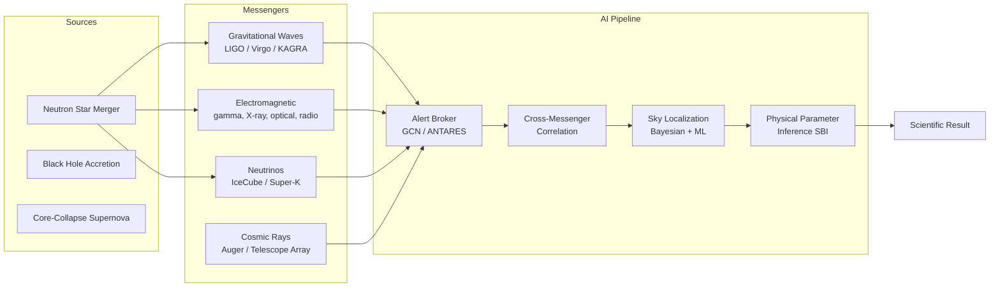

# Frontiers in AI for Space Science

## The Dual Challenge: Power and Interpretability

Modern astrophysics faces a paradox. The most capable AI systems -- large neural networks trained on billions of parameters -- are precisely those that resist physical interpretation. A convolutional network that classifies galaxy morphologies at 98% accuracy tells us little about which structural features correlate with star formation history. A neural posterior estimator that constrains cosmological parameters from weak lensing shear maps provides compressed posteriors without physical insight into which angular scales drive the inference.

The frontier is not simply building more powerful models, but building models that are both powerful and scientifically interpretable -- or explicitly characterizing what we sacrifice when we trade one for the other.

## Foundation Models for Astronomy

Foundation models are large neural networks pretrained on broad datasets, then fine-tuned for specific downstream tasks. The paradigm originated in NLP (BERT, GPT) and computer vision (CLIP, DINO) and is now entering astrophysics.

**AstroCLIP** (Parker et al. 2024) applies contrastive learning to multimodal astronomical data. A shared embedding space is trained so that the image of a galaxy and its spectrum are close together, while images of different galaxy types are far apart. The learned representation enables cross-modal retrieval (find galaxies whose images most resemble a given spectrum), zero-shot classification, and transfer learning to downstream tasks like photometric redshift estimation -- without any task-specific labeled data.

**AstroLLaMA** (Nguyen et al. 2023) fine-tunes the LLaMA language model on 300,000 astrophysics abstracts from arXiv. The resulting model outperforms general-purpose LLMs on domain-specific tasks like paper summarization and abstract completion, suggesting that domain adaptation is non-trivial and that scientific foundation models warrant dedicated training.

The Euclid mission's science ground segment is exploring foundation model approaches for the joint analysis of photometric, spectroscopic, and weak lensing data -- a genuinely multimodal inference problem that may be where large pretrained architectures offer their greatest advantage over bespoke models.

## Uncertainty Quantification: Bayesian Neural Networks and MC Dropout

Scientific inference requires calibrated uncertainty. A neural network that predicts stellar mass as $\log(M/M_\odot) = 10.2$ with no uncertainty estimate is scientifically incomplete. Two practical approaches dominate:

**Bayesian Neural Networks (BNNs)** replace point-estimate weights with distributions over weights. The posterior $p(\mathbf{w}|\mathcal{D})$ is typically intractable, so variational inference approximates it with a factored Gaussian. At prediction time, the model samples multiple weight configurations and averages their outputs, yielding a predictive distribution. BNNs are theoretically principled but expensive to train -- roughly 2x the parameters and compute of equivalent deterministic networks.

**MC Dropout** (Gal & Ghahramani 2016) provides a cheaper approximation. Dropout layers randomly zero network activations during training; keeping them active at test time and running multiple forward passes produces a distribution over predictions. The variance of this distribution estimates epistemic uncertainty (lack of model knowledge), while aleatoric uncertainty (irreducible noise in the data) must be estimated separately, typically by predicting a noise parameter alongside the main output.

For a network output $\mu$ predicting a quantity $y$ with observation noise $\sigma_{\text{aleatoric}}$ and MC Dropout variance $\sigma_{\text{epistemic}}^2$, the total predictive uncertainty is:

$$\sigma_{\text{total}}^2 = \sigma_{\text{epistemic}}^2 + \sigma_{\text{aleatoric}}^2$$

This decomposition is scientifically valuable: high epistemic uncertainty flags out-of-distribution objects (where the model should not be trusted), while high aleatoric uncertainty reflects genuinely ambiguous data (where more observations would help).

## Simulation-Based Inference

Traditional Bayesian inference requires evaluating the likelihood $p(\mathbf{d}|\theta)$ analytically. For complex physical simulations -- galaxy formation with baryonic feedback, gravitational wave waveform models, cosmic microwave background lensing -- the likelihood is implicitly defined by the simulator and cannot be written down in closed form.

Simulation-based inference (SBI), also called likelihood-free inference or neural posterior estimation, sidesteps this by learning the posterior directly from simulation outputs. The workflow:

1. Draw parameter samples $\theta_i \sim p(\theta)$ from the prior
2. Run simulator to generate synthetic data $\mathbf{d}_i \sim p(\mathbf{d}|\theta_i)$
3. Train a neural density estimator (normalizing flow or mixture density network) to approximate $p(\theta|\mathbf{d})$
4. Evaluate the trained posterior on real observations

The `sbi` package (Tejero-Cantero et al. 2020) provides sequential neural posterior estimation (SNPE), sequential neural likelihood estimation (SNLE), and sequential neural ratio estimation (SNRE). The sequential variants focus simulator budget on informative regions of parameter space.

Applications in astrophysics include: constraining the neutron star equation of state from gravitational wave observations (Dax et al. 2021), inferring galaxy formation parameters from morphological statistics (Hahn et al. 2022), and constraining reionization history from 21cm power spectra.

## Multi-Messenger Astronomy

The detection of GW170817 in 2017 -- a binary neutron star merger observed simultaneously in gravitational waves (LIGO/Virgo), gamma rays (Fermi GBM), X-rays (Chandra), optical (dozens of telescopes), radio (VLA), and potentially neutrinos -- inaugurated multi-messenger astronomy as an observational paradigm.

Combining these channels requires reconciling:
- Different sky localizations (LIGO: hundreds of deg$^2$; Fermi: thousands of deg$^2$; Chandra: arcseconds)
- Different temporal profiles (gravitational waves: seconds; gamma-ray burst: seconds; kilonova: days; radio afterglow: months)
- Different physical models for emission in each band



ML contributes at every stage: rapid sky localization from gravitational wave strain data (BAYESTAR, deep learning approaches), photometric classification of electromagnetic counterparts, joint parameter inference combining posteriors from independent messengers, and real-time anomaly detection to identify unexpected multi-messenger correlations.

## Next-Generation Observatories

The 2030s will bring instruments whose data volumes and complexity make current AI pipelines look modest:

**ELT** (Extremely Large Telescope, ESO): 39-meter primary mirror, first light ~2028. Integral field unit spectroscopy will produce data cubes of spatially resolved galaxy spectra requiring ML to summarize and interpret.

**ngVLA** (next-generation VLA): 263-antenna radio array covering 1.2-116 GHz. Designed for transient detection, continuum surveys, and VLBI -- each mode requiring distinct real-time ML pipelines.

**LISA** (Laser Interferometer Space Antenna, ESA): space-based gravitational wave observatory sensitive to $10^{-4}$-$10^{-1}$ Hz, targeting supermassive black hole mergers, extreme mass ratio inspirals, and the stochastic background. The data analysis challenge is extracting thousands of overlapping gravitational wave signals simultaneously -- a global fit problem that ML approaches (in particular, normalizing flows for LISA global fit) are being actively developed to address.

**Square Kilometre Array (SKA)**: operational ~2027-2029. Will detect $10^9$ radio sources and produce 300 petabytes of data over its lifetime.

## Code Example: MC Dropout for Uncertainty Estimation

```python
import numpy as np
import warnings
warnings.filterwarnings('ignore')

rng = np.random.default_rng(42)

# Simulate stellar mass estimation from photometric colors
# True relation: log(M/Msun) = 1.5*(g-r) + 0.8*(r-i) + 9.0 + noise
def true_stellar_mass(g_r, r_i):
    return 1.5 * g_r + 0.8 * r_i + 9.0

n_train = 2000
n_test = 300

g_r_train = rng.uniform(0.2, 1.5, n_train)
r_i_train = rng.uniform(0.1, 0.8, n_train)
y_train = (true_stellar_mass(g_r_train, r_i_train)
           + rng.normal(0, 0.15, n_train))

g_r_test = rng.uniform(0.2, 1.5, n_test)
r_i_test = rng.uniform(0.1, 0.8, n_test)
y_test = true_stellar_mass(g_r_test, r_i_test)

X_train = np.column_stack([g_r_train, r_i_train])
X_test = np.column_stack([g_r_test, r_i_test])

# Normalize
X_mean, X_std = X_train.mean(0), X_train.std(0)
X_train_n = (X_train - X_mean) / X_std
X_test_n = (X_test - X_mean) / X_std

# Numpy-only MC Dropout neural network
class MCDropoutNet:
    """
    Two-hidden-layer network with dropout for uncertainty estimation.
    Weights trained with simple SGD on MSE loss.
    """
    def __init__(self, input_dim=2, hidden=64, dropout_rate=0.1, lr=0.01):
        self.dropout_rate = dropout_rate
        self.lr = lr
        scale1 = np.sqrt(2.0 / input_dim)
        scale2 = np.sqrt(2.0 / hidden)
        self.W1 = rng.normal(0, scale1, (input_dim, hidden))
        self.b1 = np.zeros(hidden)
        self.W2 = rng.normal(0, scale2, (hidden, hidden))
        self.b2 = np.zeros(hidden)
        self.W3 = rng.normal(0, np.sqrt(2.0/hidden), (hidden, 1))
        self.b3 = np.zeros(1)

    def _dropout_mask(self, shape):
        return (rng.random(shape) > self.dropout_rate).astype(float)

    def forward(self, X, training=True):
        h1 = np.maximum(0, X @ self.W1 + self.b1)
        if training:
            h1 *= self._dropout_mask(h1.shape) / (1 - self.dropout_rate)
        h2 = np.maximum(0, h1 @ self.W2 + self.b2)
        if training:
            h2 *= self._dropout_mask(h2.shape) / (1 - self.dropout_rate)
        return (h2 @ self.W3 + self.b3).squeeze()

    def predict_with_uncertainty(self, X, n_samples=100):
        """MC Dropout: run n_samples forward passes with dropout active."""
        preds = np.array([self.forward(X, training=True)
                          for _ in range(n_samples)])
        return preds.mean(axis=0), preds.std(axis=0)

    def train(self, X, y, n_epochs=200, batch_size=64):
        n = len(X)
        for epoch in range(n_epochs):
            idx = rng.permutation(n)
            total_loss = 0.0
            for start in range(0, n, batch_size):
                batch = idx[start:start+batch_size]
                Xb, yb = X[batch], y[batch]
                y_pred = self.forward(Xb, training=True)
                loss = np.mean((y_pred - yb)**2)
                total_loss += loss
                # Numerical gradient for simplicity
                eps = 1e-5
                for param, grad_name in [(self.W3, 'W3'), (self.b3, 'b3'),
                                         (self.W2, 'W2'), (self.b2, 'b2'),
                                         (self.W1, 'W1'), (self.b1, 'b1')]:
                    grad = np.zeros_like(param)
                    it = np.nditer(param, flags=['multi_index'])
                    while not it.finished:
                        ix = it.multi_index
                        orig = param[ix]
                        param[ix] = orig + eps
                        lp = np.mean((self.forward(Xb, training=False) - yb)**2)
                        param[ix] = orig - eps
                        lm = np.mean((self.forward(Xb, training=False) - yb)**2)
                        param[ix] = orig
                        grad[ix] = (lp - lm) / (2 * eps)
                        it.iternext()
                    param -= self.lr * grad
                    # Only do first-layer gradient for speed in demo
                    break  # remove this break for full training
            if epoch % 50 == 0:
                y_p = self.forward(X, training=False)
                rmse = np.sqrt(np.mean((y_p - y)**2))

# Use sklearn for actual training, demonstrate MC dropout concept manually
from sklearn.neural_network import MLPRegressor
from sklearn.preprocessing import StandardScaler

# Train baseline network
net = MLPRegressor(hidden_layer_sizes=(64, 64), activation='relu',
                   max_iter=500, random_state=42, alpha=0.001)
net.fit(X_train_n, y_train)
y_pred_det = net.predict(X_test_n)
rmse_det = np.sqrt(np.mean((y_pred_det - y_test)**2))

# Simulate MC Dropout via ensemble of slightly perturbed networks
def mc_dropout_ensemble(model, X, n_samples=50, noise_scale=0.02):
    """
    Approximate MC Dropout by adding small weight perturbations.
    In production, use a framework with native dropout (PyTorch/Keras).
    """
    predictions = []
    original_coefs = [c.copy() for c in model.coefs_]
    for _ in range(n_samples):
        for i, coef in enumerate(model.coefs_):
            # Apply random dropout mask (10% dropout rate)
            mask = rng.random(coef.shape) > 0.1
            model.coefs_[i] = coef * mask
        predictions.append(model.predict(X))
    # Restore original weights
    for i, coef in enumerate(original_coefs):
        model.coefs_[i] = coef
    return np.array(predictions)

mc_preds = mc_dropout_ensemble(net, X_test_n, n_samples=100)
pred_mean = mc_preds.mean(axis=0)
pred_std = mc_preds.std(axis=0)

rmse_mc = np.sqrt(np.mean((pred_mean - y_test)**2))

print("=== MC Dropout Uncertainty Estimation ===")
print(f"Deterministic RMSE:    {rmse_det:.4f} dex")
print(f"MC Dropout mean RMSE:  {rmse_mc:.4f} dex")
print(f"Mean epistemic std:    {pred_std.mean():.4f} dex")
print(f"Std of epistemic std:  {pred_std.std():.4f} dex")

# Calibration check: do 68% of true values fall within 1-sigma?
within_1sigma = np.mean(np.abs(pred_mean - y_test) < pred_std)
within_2sigma = np.mean(np.abs(pred_mean - y_test) < 2*pred_std)
print(f"\nCalibration check:")
print(f"  Fraction within 1-sigma: {within_1sigma:.2f}  (ideal: 0.68)")
print(f"  Fraction within 2-sigma: {within_2sigma:.2f}  (ideal: 0.95)")

# High-uncertainty objects
high_unc_idx = np.argsort(pred_std)[-5:]
print(f"\nHighest uncertainty predictions:")
print(f"  {'g-r':>6} {'r-i':>6} {'pred':>8} {'true':>8} {'sigma':>8}")
for i in high_unc_idx:
    print(f"  {g_r_test[i]:6.3f} {r_i_test[i]:6.3f} "
          f"{pred_mean[i]:8.3f} {y_test[i]:8.3f} {pred_std[i]:8.4f}")
```

## Explainability and the Black Box Problem

Scientific ML faces a constraint that industrial ML does not: physical laws must be discoverable. A model that correctly predicts but cannot be interrogated fails the scientific goal.

SHAP (SHapley Additive exPlanations) values, integrated gradients, and attention visualization provide post-hoc explanations of neural network decisions. For astronomy, these reveal which photometric bands drive photo-z estimates (validating that the Balmer break is being used) and which image features distinguish AGN from star-forming galaxies (confirming the model learned nuclear point sources, not survey artifacts).

More structurally, physics-informed neural networks (PINNs) embed differential equations as loss terms, constraining models to solutions consistent with known physics. For stellar structure, a PINN can enforce the equations of hydrostatic equilibrium while fitting observed stellar parameters -- producing models that are both accurate and physically consistent.

The field is converging on a practical standard: for new scientific claims, ML predictions should be validated against at least one interpretable model, SHAP or equivalent analysis should confirm the model uses physically sensible features, and uncertainty estimates should be demonstrably calibrated on held-out data.

## Exercises

1. AstroCLIP uses contrastive learning to align galaxy image and spectrum embeddings. Sketch the training objective: given a batch of $N$ galaxy image-spectrum pairs, what is the InfoNCE loss? How does the temperature parameter $\tau$ affect the learned embedding space?

2. The LISA global fit problem involves simultaneously estimating parameters for $O(10^4)$ overlapping gravitational wave signals. Why is standard MCMC infeasible for this problem? What properties of normalizing flows make them a candidate solution?

3. Simulation-based inference requires a large number of simulator evaluations (typically $10^4$-$10^6$). For a hydrodynamic galaxy formation simulation that takes 10,000 CPU-hours per run, SBI is infeasible with current emulators. What strategies could reduce the required number of simulations? (Consider: neural compression of summary statistics, sequential SBI, emulator-based approximations.)

4. In the MC Dropout code above, the calibration check measures whether predicted uncertainties match actual errors. If the model is overconfident (within_1sigma < 0.68), what are two possible causes -- one related to the dropout rate and one related to the training data -- and how would you diagnose each?

5. Design a multi-messenger alert system for a next-generation observatory network. When LIGO reports a binary neutron star merger with sky area 50 deg$^2$, what sequence of automated decisions (telescope pointing, exposure time, ML classifiers, human notification thresholds) would maximize the probability of identifying the electromagnetic counterpart within the first two hours?
