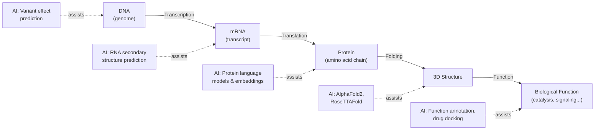
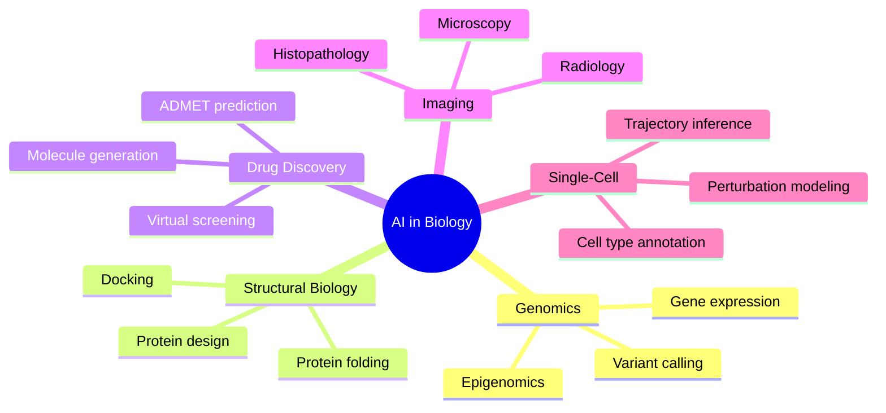

# Introduction to AI for Biology

## Overview

Biology has always been a data-rich science, but the past two decades have produced a data explosion unlike anything researchers anticipated. A single genome sequencing run generates gigabytes of raw reads. A fluorescence microscopy time-lapse of a dividing cell produces terabytes. A drug screening campaign tests millions of compound-protein interactions. Human intuition and classical statistics can no longer keep up. **AI is not just useful for biology — it is becoming essential.**

This lesson introduces why AI and biology make such a powerful pair, traces the history from early sequence alignment tools to modern deep learning, and surveys the major application domains where AI is transforming biological discovery.

---

## Why Biology Needs AI

### The Complexity Problem

Biological systems are characterized by staggering complexity. The human genome encodes roughly 20,000 protein-coding genes, but those genes interact through regulatory networks, splicing variants, post-translational modifications, and environmental signals in ways that multiply the effective complexity by orders of magnitude. A single protein may have hundreds of thousands of known variants in the human population, each with subtly different folding, stability, and function.

Classical reductionist experiments — mutate one gene, observe one phenotype — have served biology well for a century. But understanding emergent properties (why does a cancer cell behave the way it does?) requires modeling thousands of interacting components simultaneously. This is exactly what machine learning models are designed to do.

### The Data Explosion

Three technologies have created biology's data flood:

1. **Next-generation sequencing (NGS)**: The cost of sequencing a human genome has dropped from ~$3 billion (Human Genome Project, 2003) to under $200 today. Databases like GenBank now hold billions of nucleotide sequences. Single-cell RNA sequencing can profile gene expression in each of tens of thousands of individual cells from a single tissue sample.

2. **High-content imaging**: Automated fluorescence microscopes combined with robotic liquid handlers can capture millions of cell images per day. CellPainting assays represent cells in five fluorescence channels and extract thousands of morphological features per image.

3. **Structural biology at scale**: Cryo-electron microscopy (cryo-EM) can resolve protein structures in near-native conditions. The Protein Data Bank (PDB) now holds over 220,000 experimentally determined structures, and AlphaFold2 has predicted structures for virtually every known protein.

---

## A Brief History: From BLAST to Deep Learning

The marriage of computation and biology predates modern AI:

- **1970**: Needleman-Wunsch algorithm — dynamic programming for global sequence alignment. A foundational idea still used today.
- **1981**: Smith-Waterman algorithm — local alignment, enabling database searches for similar sequence regions.
- **1990**: BLAST (Basic Local Alignment Search Tool) — heuristic search making sequence database queries practical at scale. A biologist's daily workhorse for thirty years.
- **1994–present**: CASP (Critical Assessment of Structure Prediction) competitions expose the gap between known sequence and predicted structure, driving innovation.
- **2012**: Deep learning conquers ImageNet; biologists begin applying CNNs to microscopy images.
- **2018**: Transformer-based models (BERT, GPT) inspire protein language models like ESM-1b that learn amino acid representations from massive sequence databases.
- **2020**: AlphaFold2 achieves near-experimental accuracy in protein structure prediction — widely called the biggest breakthrough in structural biology in decades.
- **2021–present**: Diffusion models enter biology (RFdiffusion for protein design), multimodal models connect sequence, structure, and function, and AI-generated molecules enter clinical trials.

---

## The Central Dogma and Where AI Fits In

The Central Dogma of molecular biology, articulated by Francis Crick in 1958, describes the general flow of genetic information:



At every step from genome to function, AI models are now providing predictions, annotations, or designs that used to require years of wet-lab experiments.

---

## Key Application Areas

### 1. Protein Structure Prediction

Knowing a protein's three-dimensional structure is critical for understanding how it works and designing drugs that bind to it. AlphaFold2's use of multiple sequence alignments (MSAs) and attention-based neural networks to predict structures with Angstrom-level accuracy has made structural genomics tractable at proteome scale.

### 2. Genomics and Variant Interpretation

Whole-genome sequencing produces millions of single nucleotide polymorphisms (SNPs) per individual. Deep learning models like DeepVariant call variants from sequencing reads with superhuman accuracy, while models like Enformer predict the effect of non-coding variants on gene expression by learning from large chromatin accessibility datasets.

### 3. Drug Discovery

AI is compressing the drug discovery pipeline at every stage: virtual screening (using graph neural networks to score molecule-protein binding), ADMET prediction (pharmacokinetics modeling), de novo molecular generation (variational autoencoders, diffusion models), and clinical trial design. Insilico Medicine's AI-designed drug for idiopathic pulmonary fibrosis reached Phase II trials in under four years — a record pace.

### 4. Single-Cell and Spatial Genomics

Transformer-based models like scGPT and Geneformer treat gene expression profiles as "sentences" (genes as tokens), learning cell-type representations from millions of single-cell RNA-seq profiles. These models enable zero-shot cell type annotation, perturbation prediction, and tissue reconstruction.

### 5. Medical Imaging and Pathology

CNNs and vision transformers trained on histopathology slides detect cancers, grade tumors, and predict molecular subtypes directly from hematoxylin and eosin (H&E) stained images — without needing explicit molecular profiling.



---

## Getting Started: Loading a Protein Sequence with BioPython

BioPython is the standard Python library for bioinformatics. Here we fetch a protein record from NCBI and extract its sequence:

```python
from Bio import SeqIO, Entrez

# Always provide your email when using NCBI's Entrez API
Entrez.email = "your.email@example.com"

def fetch_protein_sequence(accession: str) -> str:
    """Fetch a protein sequence from NCBI by accession number."""
    handle = Entrez.efetch(
        db="protein",
        id=accession,
        rettype="fasta",
        retmode="text"
    )
    record = SeqIO.read(handle, "fasta")
    handle.close()
    return str(record.seq)

# Human hemoglobin subunit alpha (HBA1)
accession = "NP_000549.1"
sequence = fetch_protein_sequence(accession)

print(f"Accession:   {accession}")
print(f"Length:      {len(sequence)} amino acids")
print(f"Sequence:    {sequence[:60]}...")

# Basic composition analysis
from collections import Counter

composition = Counter(sequence)
print("\nAmino acid frequencies (top 5):")
for aa, count in composition.most_common(5):
    print(f"  {aa}: {count} ({100 * count / len(sequence):.1f}%)")
```

This pattern — fetch, parse, analyze — is a foundation you will build on throughout this learning track as sequences get embedded, aligned, and fed into neural networks.

---

## Key Concepts

- **Central Dogma**: The flow of biological information from DNA to RNA to protein to function
- **Next-generation sequencing**: High-throughput DNA/RNA sequencing technologies that generate massive datasets
- **AlphaFold2**: A deep learning model from DeepMind that predicts protein 3D structure from sequence with near-experimental accuracy
- **Protein language model**: A transformer trained on millions of protein sequences to learn evolutionary and structural representations
- **BLAST**: Basic Local Alignment Search Tool — the classical heuristic for sequence similarity search
- **CASP**: Critical Assessment of Structure Prediction — a biennial blind prediction competition that benchmarks structure prediction methods

## Exercises

1. **Scope**: List three biological questions that are well-suited to ML approaches and three that are not. What distinguishes them?
2. **History**: AlphaFold2 solved protein structure prediction "as a problem." What does that mean, and what problems remain?
3. **Code**: Install BioPython (`pip install biopython`) and modify the code above to fetch the beta subunit of hemoglobin (NP_000510.1). Compute the percentage of hydrophobic residues (A, V, I, L, M, F, W, P).

## Further Reading

- Senior, A.W. et al. (2020). "Improved protein structure prediction using potentials from deep learning." *Nature* 577, 706–710.
- Jumper, J. et al. (2021). "Highly accurate protein structure prediction with AlphaFold." *Nature* 596, 583–589.
- Zou, J. et al. (2019). "A primer on deep learning in genomics." *Nature Genetics* 51, 12–18.
- Eraslan, G. et al. (2019). "Deep learning: new computational modelling techniques for genomics." *Nature Reviews Genetics* 20, 389–403.
