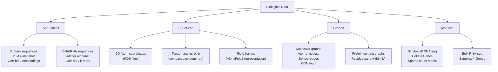

# Biological Data Representations

## Overview

Before a machine learning model can learn anything about biology, biological entities must be converted into numerical representations. This is not a trivial translation. A protein is not a sentence, a molecule is not an image, and a genome is not a spreadsheet — yet all of these analogies are used in practice, because the choice of representation fundamentally shapes what a model can learn.

This lesson walks through the major data types in computational biology and the representations used to make them tractable for ML: amino acid sequences, 3D protein coordinates, molecular graphs, gene expression matrices, and DNA/RNA sequences.

---

## Amino Acid Sequences

Proteins are linear polymers of amino acids. The standard alphabet has 20 canonical amino acids, each with a single-letter code (A, C, D, E, F, G, H, I, K, L, M, N, P, Q, R, S, T, V, W, Y). A protein sequence like `MVLSPADKTNVK...` is the primary structure — the order in which amino acids are strung together.

### One-Hot Encoding

The simplest representation treats each amino acid as a categorical variable and encodes it as a binary vector of length 20. For a protein of length $L$, the one-hot encoded matrix $X$ has shape $(L, 20)$:

$$X_{i,j} = \begin{cases} 1 & \text{if position } i \text{ has amino acid } j \\ 0 & \text{otherwise} \end{cases}$$

For example, if we label the amino acids $a_1, a_2, \ldots, a_{20}$ alphabetically (A=1, C=2, D=3, ...), then Alanine (A) at position $i$ becomes:

$$X_i = [1, 0, 0, 0, 0, 0, 0, 0, 0, 0, 0, 0, 0, 0, 0, 0, 0, 0, 0, 0]$$

One-hot encoding is lossless and unambiguous, but it treats all amino acids as equidistant from each other — ignoring the fact that Alanine and Valine (both small hydrophobic residues) are biochemically far more similar to each other than either is to Arginine (a large positively charged residue).

### Physicochemical Feature Vectors

An alternative is to encode each amino acid as a vector of known biochemical properties:

$$X_i = [\text{hydrophobicity}, \text{charge}, \text{molecular weight}, \text{aromaticity}, \ldots]$$

The BLOSUM matrices encode evolutionary substitution frequencies — amino acids that are often swapped in homologous proteins score highly. For position $i$ with amino acid $a$, using BLOSUM62:

$$X_i = \text{BLOSUM62}[a, \cdot] \in \mathbb{R}^{20}$$

This encodes evolutionary information: the vector for Leucine will be similar to the vector for Isoleucine, because they substitute frequently.

### Learned Embeddings

Modern protein language models (ESM-2, ProtTrans, Ankh) learn embeddings from massive unlabeled sequence databases. For a sequence $s = (s_1, s_2, \ldots, s_L)$, the model produces a context-aware representation:

$$\mathbf{h}_i = \text{PLM}(s)_i \in \mathbb{R}^{d}$$

where $d$ is typically 320–2560 depending on the model. Unlike one-hot or BLOSUM, these embeddings are **context-dependent**: the embedding for Leucine at a buried hydrophobic core position will differ from Leucine on a solvent-exposed loop. This is analogous to how "bank" has different embeddings in "river bank" vs "savings bank" in language models.

---

## Protein 3D Coordinates

A protein's three-dimensional structure is described by the Cartesian coordinates of each atom. For a protein of $L$ residues, there are typically $\sim 7L$ heavy atoms. The backbone geometry is described by torsion angles:

- $\phi$ (phi): rotation around $\text{N}-C_\alpha$
- $\psi$ (psi): rotation around $C_\alpha-\text{C}$
- $\omega$ (omega): rotation around $\text{C}-\text{N}$ (near-planar, ~180°)

A residue's backbone conformation can thus be summarized as $(\phi_i, \psi_i)$, plotted on a Ramachandran diagram. Representing a structure as a set of torsion angles $\{(\phi_i, \psi_i)\}_{i=1}^{L}$ is rotation-invariant and compact. Alternatively, AlphaFold2 uses **frames** — rigid body coordinate systems anchored to each residue — enabling equivariant reasoning about 3D geometry.

---

## Molecular Graphs

Small molecules (drugs, metabolites) are naturally represented as graphs, where atoms are nodes and bonds are edges:

$$G = (V, E, \mathbf{X}_V, \mathbf{X}_E)$$

- $V$: atoms (nodes), with features $\mathbf{X}_V$ encoding element type, charge, aromaticity, hybridization
- $E$: bonds (edges), with features $\mathbf{X}_E$ encoding bond type (single, double, triple, aromatic)

Graph Neural Networks (GNNs) operate directly on this structure, propagating information along bonds through message-passing:

$$\mathbf{h}_v^{(k+1)} = \text{UPDATE}\left(\mathbf{h}_v^{(k)},\ \text{AGGREGATE}\left(\{\mathbf{h}_u^{(k)} : u \in \mathcal{N}(v)\}\right)\right)$$

After $K$ layers, each node's embedding encodes information from its $K$-hop neighborhood. A global pooling operation (mean, sum, or attention-weighted) over all node embeddings produces a fixed-size molecular fingerprint for property prediction.

---

## Gene Expression Matrices

Single-cell RNA sequencing (scRNA-seq) produces a matrix $\mathbf{M} \in \mathbb{R}^{N \times G}$ where:

- $N$ = number of cells (typically 1,000–100,000)
- $G$ = number of genes profiled (typically 10,000–30,000)
- $M_{i,j}$ = count (or normalized expression) of gene $j$ in cell $i$

This matrix is **extremely sparse** (most genes are not expressed in any given cell) and **noisy** (low-count genes suffer from dropout — a gene may be expressed but not detected). Preprocessing steps include library-size normalization, log1p transformation, and highly variable gene selection before ML.

For bulk RNA-seq comparing conditions, the data is often a matrix $\mathbf{M} \in \mathbb{R}^{S \times G}$ where $S$ is the number of samples (patients, experimental conditions). Here ML tasks include predicting drug response, survival, or tissue type from expression profiles.

---

## DNA and RNA Sequences

DNA uses a 4-letter alphabet: A, C, G, T (with T replaced by U in RNA). One-hot encoding uses vectors of length 4. But unlike proteins, DNA is double-stranded — the reverse complement of a sequence carries equivalent information. Models processing DNA sequences must therefore be **strand-symmetric** or explicitly trained on both strands.

**k-mer representations** decompose a sequence into all overlapping subsequences of length $k$. For DNA with $k=6$, there are $4^6 = 4096$ possible hexamers. A sequence can be represented as a count vector over all hexamers, or hexamers can be treated as a vocabulary for a language model. Enformer and Basenji2 use convolutional + attention architectures over one-hot DNA sequences to predict chromatin accessibility and gene expression across the genome.

**Sequence similarity** between two sequences of equal length can be measured as Hamming distance — the fraction of positions that differ:

$$d_H(s, t) = \frac{1}{L} \sum_{i=1}^{L} \mathbb{1}[s_i \neq t_i]$$

For sequences of different lengths, the normalized edit distance (Levenshtein distance divided by the length of the longer sequence) is a common metric.

---

## Data Types at a Glance



---

## Python: One-Hot Encoding a Protein Sequence

```python
import numpy as np

# Standard 20 amino acid alphabet (sorted alphabetically)
AA_ALPHABET = "ACDEFGHIKLMNPQRSTVWY"
AA_TO_IDX = {aa: i for i, aa in enumerate(AA_ALPHABET)}

def one_hot_encode(sequence: str) -> np.ndarray:
    """
    One-hot encode a protein sequence.

    Args:
        sequence: A string of single-letter amino acid codes (uppercase).

    Returns:
        A numpy array of shape (L, 20) where L = len(sequence).
        Unknown characters (X, B, Z, etc.) are encoded as all-zeros.
    """
    L = len(sequence)
    encoding = np.zeros((L, len(AA_ALPHABET)), dtype=np.float32)
    for i, aa in enumerate(sequence.upper()):
        if aa in AA_TO_IDX:
            encoding[i, AA_TO_IDX[aa]] = 1.0
    return encoding

def decode_one_hot(encoding: np.ndarray) -> str:
    """Recover a sequence string from a one-hot encoded matrix."""
    indices = np.argmax(encoding, axis=1)
    return "".join(
        AA_ALPHABET[idx] if encoding[i].sum() > 0 else "X"
        for i, idx in enumerate(indices)
    )

# Example: first 10 residues of human ubiquitin
sequence = "MQIFVKTLTGK"

encoded = one_hot_encode(sequence)
print(f"Sequence:      {sequence}")
print(f"Shape:         {encoded.shape}  (length × 20 amino acids)")
print(f"Row for M (Met):  {encoded[0]}  → index {np.argmax(encoded[0])}")
print(f"Row for Q (Gln):  {encoded[1]}  → index {np.argmax(encoded[1])}")

# Verify round-trip
decoded = decode_one_hot(encoded)
print(f"Decoded:       {decoded}")
assert decoded == sequence, "Round-trip failed!"

# Compute amino acid composition from one-hot encoding
composition = encoded.sum(axis=0)  # sum over positions
print("\nAmino acid counts in sequence:")
for aa, count in zip(AA_ALPHABET, composition):
    if count > 0:
        print(f"  {aa}: {int(count)}")
```

---

## Key Concepts

- **One-hot encoding**: A binary vector representation where exactly one element is 1. Lossless but treats all categories as equally distant.
- **Protein language model (PLM)**: A transformer pre-trained on large sequence databases producing context-aware residue embeddings.
- **Molecular graph**: A representation of a molecule as a graph, with atoms as nodes and bonds as edges, suitable for Graph Neural Networks.
- **k-mer**: A contiguous subsequence of length $k$; k-mer frequencies can represent DNA sequences as fixed-size vectors.
- **scRNA-seq matrix**: A cells × genes count matrix representing gene expression in individual cells.
- **Hamming distance**: The fraction of positions at which two equal-length sequences differ.
- **BLOSUM62**: An amino acid substitution scoring matrix derived from evolutionary sequence alignments.

## Exercises

1. **Encoding comparison**: One-hot encode the sequence `ACGT` treating it as DNA (4-letter alphabet) and compute its Hamming distance from `ACCT`. Verify against the formula.
2. **Biochemical insight**: Why might a model trained on one-hot encodings underperform a model trained on BLOSUM embeddings on tasks involving evolutionarily distant homologs?
3. **Code extension**: Modify the one-hot encoding function to also accept and encode ambiguous amino acid codes: B (Asn or Asp) and Z (Gln or Glu) as the average of their two possible one-hot vectors.

## Further Reading

- Alley, E.C. et al. (2019). "Unified rational protein engineering with sequence-based deep representation learning." *Nature Methods* 16, 1315–1322.
- Lin, Z. et al. (2023). "Evolutionary-scale prediction of atomic-level protein structure with a language model." *Science* 379, 1123–1130.
- Gilmer, J. et al. (2017). "Neural Message Passing for Quantum Chemistry." *ICML 2017*.
