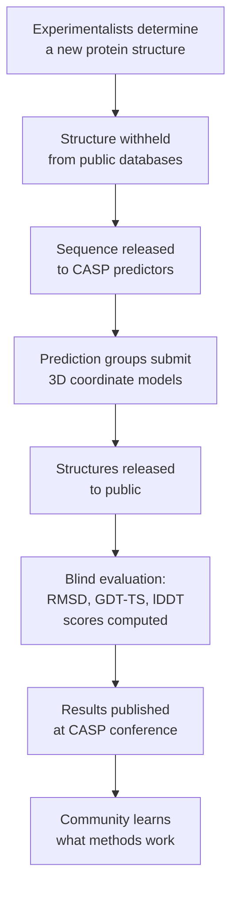

## Key Datasets and Benchmarks in Computational Biology

## Overview

Every mature ML field has canonical datasets and competitions that define progress. Computer vision has ImageNet; natural language processing has GLUE and SuperGLUE. Computational biology has its own ecosystem: the Protein Data Bank for structure, UniProt for sequence, CASP for benchmarking predictions, GEO for gene expression, and more. Knowing what these resources contain, how they were generated, and what their limitations are is essential before training or evaluating any biological model.

This lesson surveys the most important datasets and benchmarks in the field — what they hold, why they matter, and how to work with them programmatically.

---

## Protein Structure: The Protein Data Bank (PDB)

The **Protein Data Bank** (rcsb.org) is the world's single repository for experimentally determined 3D structures of biological macromolecules — proteins, nucleic acids, and their complexes. Founded in 1971 with just 7 structures, it now holds over **220,000 entries** (as of 2025).

### What it contains

Each PDB entry is a **structure**, not a sequence. It includes:
- Atomic coordinates (x, y, z in Ångströms) for every non-hydrogen atom
- Experimental metadata: resolution, R-factor, deposition date
- Biological assembly information (e.g., how many chains form the functional unit)
- Sequence of the crystallized protein (which may differ from the canonical UniProt sequence)

Structures are determined by **X-ray crystallography** (~85%), **cryo-electron microscopy** (~13%), and NMR spectroscopy (~2%). Resolution ranges from ~1 Å (atomic detail) to ~4 Å (domain-level accuracy). Structure prediction benchmarks generally measure Cα RMSD — the root-mean-square deviation of alpha-carbon positions:

$$\text{RMSD} = \sqrt{\frac{1}{L} \sum_{i=1}^{L} \lVert \mathbf{r}_i^{\text{pred}} - \mathbf{r}_i^{\text{true}} \rVert^2}$$

A prediction with RMSD < 2 Å is generally considered accurate.

### Limitations

- **Representation bias**: Structures of human proteins, drug targets, and crystallizable proteins are massively over-represented. Many membrane proteins and disordered regions are absent.
- **Static snapshots**: Crystal structures capture one conformation. Real proteins are dynamic.
- **Experimental noise**: Low-resolution structures (> 3.5 Å) have large positional uncertainty.

---

## Protein Sequence: UniProt

**UniProt** (uniprot.org) is the definitive resource for protein sequences and functional annotations. It has two divisions:

- **Swiss-Prot**: ~570,000 manually reviewed, expert-curated entries. High quality, rich functional annotations, with experimental evidence tags.
- **TrEMBL**: ~250 million automatically annotated entries from sequencing projects. Much larger but less reliable.

Together they form **UniProtKB** — the reference sequence database for almost all protein ML. Features per entry include: sequence, taxonomy, subcellular localization, post-translational modifications, known disease variants, active site annotations, and cross-references to PDB structures.

Protein language models like ESM-2 are pre-trained on UniRef90 — a non-redundant clustering of UniProt at 90% sequence identity — which contains ~65 million sequences and represents most of known protein space.

---

## Structure Prediction Benchmarking: CASP

**CASP** (Critical Assessment of Structure Prediction) is a biennial blind prediction experiment running since 1994. Organizers collect proteins with structures determined but not yet publicly deposited. Participants are given only the sequences and must submit 3D structure predictions before the experimental structures are released.



The key metrics used in CASP evaluation:

- **GDT-TS** (Global Distance Test — Total Score): the fraction of residues within 1, 2, 4, and 8 Å of their true position, averaged:
  $$\text{GDT\_TS} = \frac{1}{4}(P_1 + P_2 + P_4 + P_8)$$
  A GDT-TS of 100 means all residues are within 1 Å of their true position.

- **lDDT** (Local Distance Difference Test): a reference-free score that measures whether predicted interatomic distances match the experimental structure within thresholds of 0.5, 1, 2, and 4 Å. Used by AlphaFold2 as its internal confidence metric (pLDDT).

CASP14 (2020) is where AlphaFold2 achieved median GDT-TS > 90 across all targets, a performance so far beyond prior methods that many researchers declared the protein folding problem solved.

---

## Protein Classification: CATH and SCOPe

Two complementary hierarchical classification databases organize known protein structures into evolutionary and structural families:

**CATH** (Class, Architecture, Topology, Homologous superfamily):
- Class: secondary structure composition (all-α, all-β, α/β mixed, few secondary structure elements)
- Architecture: overall shape (barrel, sandwich, roll, etc.)
- Topology: arrangement of secondary structures in 3D
- Homologous superfamily: evolutionarily related proteins

**SCOPe** (Structural Classification of Proteins — extended):
- Class, Fold, Superfamily, Family hierarchy
- Emphasizes evolutionary relationships inferred from structural comparison

These databases are used to construct ML benchmarks with **structure-based train/test splits** — ensuring that test proteins are genuinely novel folds unseen during training, not merely distant sequence homologs. This is critical because models trained on PDB structures can overfit to known fold space.

---

## Genomics: GenBank

**GenBank** (ncbi.nlm.nih.gov/genbank), maintained by NCBI, is the primary repository for nucleotide sequences. It contains:
- Complete genome sequences (bacteria, archaea, eukaryotes, viruses)
- mRNA sequences and expressed sequence tags (ESTs)
- Genomic loci with annotation (gene models, intron/exon boundaries, regulatory elements)

GenBank sequences can be fetched programmatically via the NCBI Entrez API (as shown in Lesson 1). It is the training corpus for many DNA language models (HyenaDNA, Nucleotide Transformer) and the source for genome-scale analysis pipelines.

---

## Gene Expression: Gene Expression Omnibus (GEO)

**GEO** (ncbi.nlm.nih.gov/geo) is the world's largest public repository for gene expression data. It contains:
- Over **5 million samples** across tens of thousands of studies
- Both microarray and RNA-seq experiments
- Single-cell RNA-seq datasets (via both GEO and its specialized companion CELLxGENE at cziscience.com)

Each GEO dataset (GSE accession) includes a data matrix (genes × samples), experimental metadata, and sample annotations (tissue, disease state, treatment). GEO is used extensively for training gene expression classifiers, transfer learning experiments, and meta-analysis.

---

## Molecular ML: MoleculeNet

**MoleculeNet** is a benchmark suite specifically designed for molecular machine learning, introduced by Wu et al. (2018). It aggregates datasets across multiple task types:

| Category | Example Datasets | Task |
|---|---|---|
| Quantum mechanics | QM7, QM8, QM9 | Predict electronic properties (energy, dipole moment) |
| Physical chemistry | ESOL, FreeSolv | Aqueous solubility, solvation energy |
| Biophysics | BBBP, HIV | Blood-brain barrier permeability, HIV inhibition |
| Physiology | SIDER, ClinTox | Drug side effects, clinical toxicity |

MoleculeNet standardizes train/test splits (random, scaffold-based, or scaffold × time) and evaluation metrics (ROC-AUC for classification, RMSE for regression), enabling fair model comparisons. Scaffold splits — grouping molecules by their core ring system (Bemis-Murcko scaffold) — are the most realistic because they test generalization to structurally novel compounds.

---

## Protein Representation Benchmarking: TAPE

**TAPE** (Tasks Assessing Protein Embeddings), introduced by Rao et al. (2019), is a benchmark suite for evaluating protein representations across five biologically meaningful tasks:

1. **Secondary structure prediction**: Predict helix/sheet/coil for each residue (3-class)
2. **Contact prediction**: Predict which residue pairs are within 8 Å in 3D structure
3. **Remote homology detection**: Classify proteins into SCOP families given only distant homologs
4. **Fluorescence prediction**: Predict GFP brightness from sequence variants (regression)
5. **Stability prediction**: Predict protein thermodynamic stability from single mutants

TAPE was instrumental in establishing that pre-trained protein language models significantly outperform one-hot or hand-crafted features on all tasks, even without fine-tuning. It played a role analogous to GLUE in NLP — motivating the development of better protein representations.

---

## Python: Fetching a PDB Structure

The `biotite` library and the Biopython PDB module both support programmatic PDB access. Here we use Biopython's `PDBList` and PDB parser:

```python
from Bio.PDB import PDBList, PDBParser, PPBuilder
import numpy as np

def fetch_and_analyze_pdb(pdb_id: str, chain_id: str = "A") -> dict:
    """
    Download a PDB structure and extract basic structural information.

    Args:
        pdb_id:   4-character PDB accession code (e.g., "1TIM")
        chain_id: Chain to analyze (default "A")

    Returns:
        Dictionary with sequence, residue count, and backbone geometry.
    """
    # Download structure (saved to ./pdb_files/ by default)
    pdbl = PDBList()
    pdb_file = pdbl.retrieve_pdb_file(pdb_id, file_type="pdb", pdir="./pdb_files")

    # Parse structure
    parser = PDBParser(QUIET=True)
    structure = parser.get_structure(pdb_id, pdb_file)

    model = structure[0]  # First model (important for NMR, which has many)
    chain = model[chain_id]

    # Extract sequence from polypeptide builder
    ppb = PPBuilder()
    polypeptides = ppb.build_peptides(chain)
    sequence = "".join(str(pp.get_sequence()) for pp in polypeptides)

    # Collect Cα coordinates for backbone geometry
    ca_coords = []
    for residue in chain:
        if residue.get_id()[0] == " " and "CA" in residue:  # ATOM records only
            ca_coords.append(residue["CA"].get_vector().get_array())

    ca_coords = np.array(ca_coords)

    # Compute Cα–Cα distances for adjacent residues (should be ~3.8 Å)
    if len(ca_coords) > 1:
        diffs = ca_coords[1:] - ca_coords[:-1]
        ca_distances = np.linalg.norm(diffs, axis=1)
        mean_ca_dist = ca_distances.mean()
    else:
        mean_ca_dist = float("nan")

    return {
        "pdb_id": pdb_id.upper(),
        "chain": chain_id,
        "sequence_length": len(sequence),
        "sequence_preview": sequence[:30] + "..." if len(sequence) > 30 else sequence,
        "n_residues_with_ca": len(ca_coords),
        "mean_ca_ca_distance_angstroms": round(mean_ca_dist, 3),
    }

# Triosephosphate isomerase (TIM barrel — a classic fold)
result = fetch_and_analyze_pdb("1TIM", chain_id="A")

for key, value in result.items():
    print(f"{key:40s}: {value}")
```

Expected output (approximate):
```text
pdb_id                                  : 1TIM
chain                                   : A
sequence_length                         : 247
sequence_preview                        : RPSQPLVGSSGNWKCNGTALEFDSQHRELIAA...
n_residues_with_ca                      : 247
mean_ca_ca_distance_angstroms           : 3.803
```

The mean Cα–Cα distance of ~3.8 Å is a geometric constant of protein backbone geometry — a useful sanity check that the structure was parsed correctly.

---

## Key Concepts

- **PDB**: The Protein Data Bank — the global archive of experimentally determined macromolecular structures, searchable at rcsb.org
- **UniProt**: The reference protein sequence and functional annotation database (Swiss-Prot + TrEMBL)
- **CASP**: A biennial blind structure prediction competition that defines the state of the art
- **GDT-TS / lDDT**: Standard metrics for evaluating protein structure prediction accuracy
- **CATH / SCOPe**: Hierarchical databases classifying protein structures into evolutionary and structural families
- **GenBank**: The NCBI nucleotide sequence archive, covering whole genomes and individual gene sequences
- **GEO**: The Gene Expression Omnibus — the largest public collection of gene expression datasets
- **MoleculeNet**: A benchmark suite for molecular property prediction spanning quantum, physical, and biological endpoints
- **TAPE**: A multi-task benchmark for evaluating protein sequence embeddings and representations
- **Scaffold split**: A train/test split strategy for molecular datasets grouping molecules by core ring system to test generalization to novel chemical scaffolds

## Exercises

1. **Data audit**: Go to rcsb.org and search for structures of "insulin." How many structures are available? What experimental methods were used? Which has the highest resolution (lowest Å value)?
2. **Benchmark design**: You are training a model to predict whether a mutation destabilizes a protein. Why would a random train/test split give an overly optimistic estimate of performance? What split strategy would you use instead?
3. **Code**: Modify the PDB fetching code to compute the radius of gyration of the chain — a measure of how compact the structure is: $R_g = \sqrt{\frac{1}{N}\sum_{i=1}^{N} \lVert \mathbf{r}_i - \bar{\mathbf{r}} \rVert^2}$ where $\bar{\mathbf{r}}$ is the centroid of the Cα atoms.

## Further Reading

- Berman, H.M. et al. (2000). "The Protein Data Bank." *Nucleic Acids Research* 28(1), 235–242.
- The UniProt Consortium (2023). "UniProt: the Universal Protein Knowledgebase in 2023." *Nucleic Acids Research* 51(D1), D523–D531.
- Wu, Z. et al. (2018). "MoleculeNet: A Benchmark for Molecular Machine Learning." *Chemical Science* 9, 513–530.
- Rao, R. et al. (2019). "Evaluating Protein Transfer Learning with TAPE." *NeurIPS 2019*.
- Kryshtafovych, A. et al. (2021). "Critical assessment of methods of protein structure prediction (CASP) — Round XIV." *Proteins* 89(12), 1607–1617.
