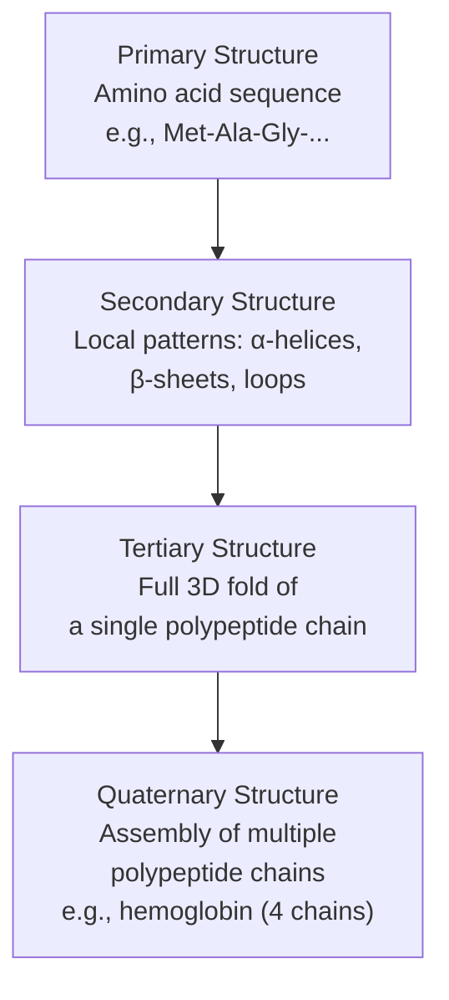
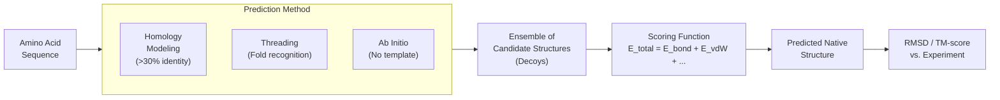

# Protein Structure Prediction

## Overview

Every biological process — from oxygen transport to DNA repair to immune defense — is carried out by proteins. A protein's function is almost entirely determined by its three-dimensional shape. The central challenge of structural biology is: given only a protein's amino acid sequence, can we predict what shape it folds into? For decades this was considered one of the hardest open problems in science. Today, AI has largely solved it.

### The Protein Folding Problem

Proteins are chains of amino acids. The human body uses 20 different amino acids, and a typical protein contains 100–1,000 of them. Once synthesized by a ribosome, the chain spontaneously folds into a precise 3D structure in milliseconds.

In 1969, Cyrus Levinthal pointed out a striking paradox. If a protein with $N$ residues has just 3 possible conformations per backbone bond (there are roughly 2 bonds per residue), the number of possible configurations is:

$$\Omega \approx 3^{2N}$$

For a modest 100-residue protein, this gives:

$$\Omega \approx 3^{200} \approx 10^{95}$$

If the protein sampled conformations at $10^{13}$ per second (the fastest physically possible rate), exhaustive search would take:

$$t \approx \frac{10^{95}}{10^{13}} = 10^{82} \text{ seconds}$$

The age of the universe is only $\sim 4 \times 10^{17}$ seconds. Yet proteins fold in milliseconds. This is **Levinthal's paradox**: nature cannot be searching randomly. There must be a folding pathway — a funnel-shaped energy landscape that guides the chain toward its native structure.

### Levels of Protein Structure

Protein structure is described at four levels of organization:



- **Primary**: The raw sequence of amino acids, encoded in DNA. This is the input to any structure prediction method.
- **Secondary**: Short-range hydrogen bonds create repeating local patterns — right-handed alpha-helices and flat beta-sheets account for most of a protein's secondary structure.
- **Tertiary**: The complete 3D arrangement of all atoms. This is what determines function. Two proteins with very different sequences can have nearly identical tertiary structures and perform the same biological role.
- **Quaternary**: Many proteins only function as multi-chain complexes. Hemoglobin has four subunits; the ribosome has dozens.

### Traditional Computational Approaches

Before deep learning, three major computational strategies existed:

**Homology Modeling (Template-Based)**
If your target protein shares >30% sequence identity with a protein of known structure, you can use the known structure as a template. The target is threaded onto the template and refined. This works well when a good template exists, but fails for novel protein families.

**Threading (Fold Recognition)**
Even without sequence similarity, proteins sometimes adopt similar folds. Threading methods score how well a query sequence fits each known fold using a statistical potential, without requiring sequence identity. More general than homology modeling, but less accurate.

**Ab Initio (Free Modeling)**
Build up the structure from scratch using physics-based energy functions. No template required — in principle, any protein is tractable. In practice, this was enormously expensive and only reliable for small proteins (<150 residues) as of the early 2010s.

### Scoring Functions and Energy Landscapes

What all these methods share is a **scoring function**: a way to evaluate how good a proposed structure is. A purely physical energy function sums:

$$E_{\text{total}} = E_{\text{bond}} + E_{\text{angle}} + E_{\text{torsion}} + E_{\text{vdW}} + E_{\text{elec}} + E_{\text{solvation}}$$

Statistical potentials learned from the Protein Data Bank (PDB) complement pure physics: if certain atom-atom distances are observed frequently in known structures, they get rewarded.

The energy landscape metaphor is central. The native fold sits at the global energy minimum — a deep funnel. The protein finds this minimum not by random search, but by following gradient descent on the folding funnel, which is why folding is fast despite the astronomical search space.

### Evaluating Structure Predictions: RMSD

The standard metric for comparing a predicted structure to the true experimental structure is **Root Mean Square Deviation (RMSD)**. Given $N$ equivalent atoms with positions $\hat{r}_i$ (predicted) and $r_i$ (true), after optimal superposition:

$$\text{RMSD} = \sqrt{\frac{1}{N} \sum_{i=1}^{N} \|\hat{r}_i - r_i\|^2}$$

An RMSD below ~2 Angstroms (Å) is generally considered a good prediction. For reference, a typical C–C bond is 1.5 Å.

A newer metric, **TM-score**, is less sensitive to local errors and better captures global topology:

$$\text{TM-score} = \frac{1}{N} \sum_{i=1}^{N} \frac{1}{1 + (d_i / d_0)^2}$$

where $d_i$ is the distance between the $i$-th pair of residues and $d_0$ is a normalization factor depending on protein length. TM-score > 0.5 indicates the same overall fold.

## Key Concepts

- **Levinthal's Paradox**: Exhaustive conformational search is physically impossible; folding must follow a guided pathway
- **Energy Landscape / Folding Funnel**: The native structure occupies a global energy minimum reached by gradient descent, not random search
- **Primary → Quaternary**: Four levels of protein structure, each building on the last
- **Homology Modeling**: Template-based prediction using known structures; reliable when sequence identity >30%
- **Ab Initio Modeling**: Physics-based prediction from first principles; expensive but template-free
- **RMSD**: Root Mean Square Deviation — the standard measure of structural accuracy

## Code Examples

```python
import numpy as np

def align_and_rmsd(coords_pred: np.ndarray, coords_true: np.ndarray) -> float:
    """
    Compute RMSD between two sets of 3D coordinates after Kabsch alignment.

    Args:
        coords_pred: (N, 3) array of predicted C-alpha positions
        coords_true:  (N, 3) array of true C-alpha positions

    Returns:
        RMSD in the same units as the input coordinates (typically Angstroms)
    """
    assert coords_pred.shape == coords_true.shape, "Coordinate arrays must match"
    N = coords_pred.shape[0]

    # Center both structures
    pred_c = coords_pred - coords_pred.mean(axis=0)
    true_c = coords_true - coords_true.mean(axis=0)

    # Kabsch algorithm: find optimal rotation via SVD
    H = pred_c.T @ true_c
    U, S, Vt = np.linalg.svd(H)

    # Correct for reflection (ensure proper rotation, det = +1)
    d = np.linalg.det(Vt.T @ U.T)
    correction = np.diag([1, 1, d])
    R = Vt.T @ correction @ U.T  # Optimal rotation matrix

    # Rotate predicted coords
    pred_aligned = pred_c @ R.T

    # Compute RMSD
    diff = pred_aligned - true_c
    rmsd = np.sqrt((diff ** 2).sum() / N)
    return rmsd

# Example: two small "structures" with some noise
np.random.seed(42)
true_structure = np.random.randn(50, 3) * 10   # 50 C-alpha atoms
noise = np.random.randn(50, 3) * 0.8            # ~0.8 Å noise
pred_structure = true_structure + noise

rmsd_val = align_and_rmsd(pred_structure, true_structure)
print(f"RMSD after Kabsch alignment: {rmsd_val:.3f} Å")
# Expected: ~0.7–0.9 Å, reflecting the added noise
```

## Diagrams

**Protein Folding Pipeline (Traditional)**



## Exercises

1. **Levinthal's Paradox**: A protein has 300 residues. At $3^2 = 9$ conformations per residue and sampling at $10^{13}$/s, how many times longer than the age of the universe would exhaustive search take?
2. **RMSD calculation**: Two structures have C-alpha pairs with distances (in Å): [0.5, 1.2, 0.8, 2.1, 0.3]. Compute RMSD by hand.
3. **Code challenge**: Modify the RMSD code to also return the TM-score. Use $d_0 = 1.24(N - 15)^{1/3} - 1.8$ for the normalization factor.

## Further Reading

- Anfinsen, C. (1973). "Principles that Govern the Folding of Protein Chains" — Nobel Lecture
- Levinthal, C. (1969). "How to Fold Graciously" — The original paradox paper
- Dill, K. & MacCallum, J. (2012). "The Protein-Folding Problem, 50 Years On." *Science*
- Protein Data Bank (rcsb.org) — 200,000+ experimentally determined structures
