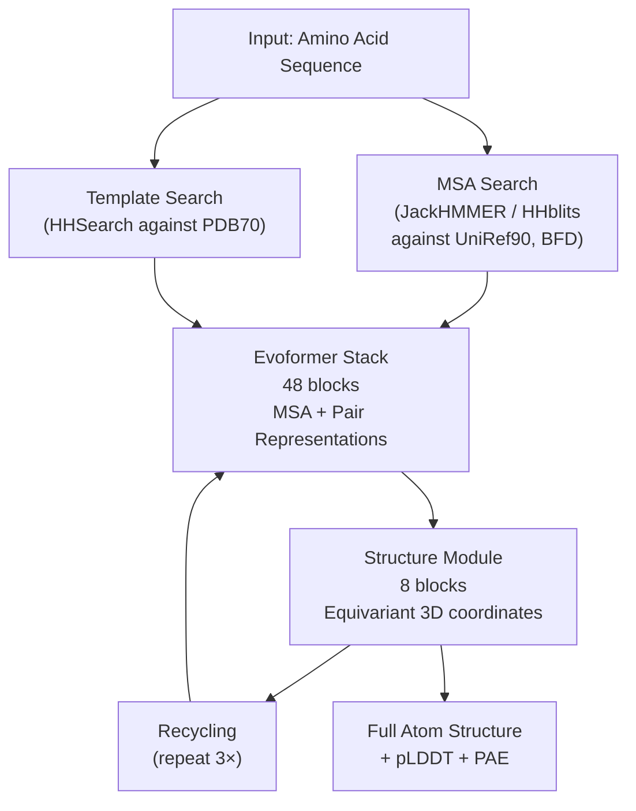

## AlphaFold: Architecture and Impact

## Overview

In December 2020, DeepMind's AlphaFold2 entered the Critical Assessment of Protein Structure Prediction (CASP14) competition and shocked the scientific world. It achieved median backbone RMSD below 1 Å on free-modeling targets — essentially solving the protein structure prediction problem for single chains. In 2024, the Nobel Prize in Chemistry was awarded to the AlphaFold team. This lesson dissects exactly how AlphaFold2 works and why it was such a breakthrough.

### Why Prior AI Approaches Fell Short

Before AlphaFold2, deep learning methods treated structure prediction as a 2D problem: predict a **distance map** (the pairwise $C_\alpha$ distances for all residue pairs), then reconstruct 3D coordinates from that map. This worked but had a fundamental mismatch: the network learned in 2D space, while the geometry it needed to satisfy was 3D.

AlphaFold2 addressed this by adding a full **equivariant 3D structure module** that reasons directly in physical 3D space and ensures the output is geometrically consistent.

### Multiple Sequence Alignments: The Evolutionary Signal

The most important input to AlphaFold2 is not just the target sequence — it is a **Multiple Sequence Alignment (MSA)**: a collection of homologous sequences from other organisms that share evolutionary ancestry with the target. The MSA encodes millions of years of evolutionary experiments.

The key insight: if positions $i$ and $j$ in the sequence tend to mutate together across species (**coevolution**), they are probably in physical contact in the 3D structure. This **evolutionary covariation** is a powerful structural signal that AlphaFold2 exploits.

### AlphaFold2 Architecture

The pipeline has five main stages:



**1. Input Embeddings**

The target sequence is embedded into two representations:
- **MSA representation** $\mathbf{m} \in \mathbb{R}^{S \times L \times c_m}$: $S$ sequences in the MSA, $L$ residue positions, $c_m$ channels
- **Pair representation** $\mathbf{z} \in \mathbb{R}^{L \times L \times c_z}$: one vector per ordered pair of residue positions, encoding their relationship

**2. The Evoformer**

The Evoformer is AlphaFold2's core innovation — a transformer variant that jointly updates both the MSA and pair representations so they can inform each other.

**MSA row-wise attention** applies attention across the sequence dimension (across columns of the MSA) using the pair representation to bias attention weights. For MSA row $s$ at positions $i$ and $j$:

$$a_{ij}^{(s)} = \frac{1}{\sqrt{d}} q_i^{(s)} \cdot k_j^{(s)} + b_{ij}$$

where $b_{ij}$ is a learned bias derived from the pair representation $\mathbf{z}_{ij}$. This allows pair geometry to gate how the MSA attends — residues known to be close can influence each other more.

**MSA column-wise attention** applies attention down each column (across sequences in the MSA for a fixed position), allowing the network to compare how different species handle the same residue.

**Pair update via outer product mean**: The pair representation is updated using a summary of the MSA:

$$\Delta \mathbf{z}_{ij} = \text{Linear}\!\left(\frac{1}{S}\sum_s \mathbf{m}_{si} \otimes \mathbf{m}_{sj}\right)$$

This outer product captures how the two residue positions co-vary across sequences.

**Triangle attention and multiplicative updates**: The pair representation also has dedicated attention operations that enforce triangle inequalities — if residue $i$ is close to $j$ and $j$ is close to $k$, then $i$ and $k$ should not be too far apart. Two triangle operations enforce this geometrically:

$$\Delta \mathbf{z}_{ij} = \sum_k a_{ijk} \cdot \mathbf{v}_{kj}$$

where the gating uses either the $ik$ or $kj$ edge.

**3. Structure Module: Equivariant 3D Reasoning**

The structure module takes the final pair and MSA representations and outputs explicit 3D coordinates. It represents each residue as a **rigid body frame** — a local coordinate system defined by three backbone atoms (N, $C_\alpha$, C). The network predicts:
- A rotation $R_i \in SO(3)$ and translation $t_i \in \mathbb{R}^3$ for each residue frame
- Torsion angles for side-chain placement

The module uses **Invariant Point Attention (IPA)**, a form of attention that is equivariant under global rotations and translations. The attention score between residues $i$ and $j$ includes a geometric term:

$$a_{ij} = w_L \cdot \frac{1}{\sqrt{d}} q_i \cdot k_j + w_C \sum_{h=1}^{N_q} \left\| R_i \vec{q}_{ih} + t_i - R_j \vec{k}_{jh} - t_j \right\|^2$$

The second term measures the squared distance between query and key points transformed into the global frame. This makes attention aware of current 3D geometry, not just learned embeddings.

**4. Iterative Recycling**

The entire pipeline (Evoformer + structure module) is run 3 times, feeding the previous iteration's 3D coordinates back as additional input. This lets the network refine its predictions — a form of learned iterative refinement analogous to traditional energy minimization.

**5. Confidence Scores**

AlphaFold2 outputs two confidence measures alongside the structure:

- **pLDDT** (predicted Local Distance Difference Test, 0–100): Per-residue confidence. Values >90 indicate very high confidence; <50 suggests the region is likely disordered. This is visualized as a color in structure viewers.
- **PAE** (Predicted Aligned Error, in Å): A matrix where $\text{PAE}[i,j]$ estimates the expected error at residue $j$'s position when the structure is aligned on residue $i$. Low off-diagonal PAE indicates confident inter-domain positioning.

### CASP14 and Impact

Before AlphaFold2, the best methods at CASP13 (2018) achieved median GDT_TS scores around 40 on hard free-modeling targets (higher = better). AlphaFold2 at CASP14 achieved **median GDT_TS of 92.4** — comparable to experimental precision. The gap to second place was larger than the entire progress made in the previous decade.

The impact was immediate and profound:
- **AlphaFold DB** (alphafold.ebi.ac.uk): By 2022, DeepMind released predicted structures for virtually all ~200 million proteins in UniProt — the entire known protein universe
- **Drug discovery**: Structures for drug targets that were previously intractable by crystallography
- **Nobel Prize 2024**: Awarded to Demis Hassabis, John Jumper (AlphaFold), and David Baker (protein design)
- **Follow-on models**: RoseTTAFold, ESMFold (uses language models instead of MSA), AlphaFold3 (extends to DNA, RNA, small molecules)

## Key Concepts

- **MSA (Multiple Sequence Alignment)**: Evolutionary covariation in an MSA reveals physical contacts
- **Evoformer**: Joint transformer over MSA + pair representations, with triangle-aware pair updates
- **Invariant Point Attention**: Attention that is equivariant to global rotations/translations, operating in 3D space
- **Rigid Frames**: Each residue represented as a rotation + translation in 3D; side chains predicted via torsion angles
- **Recycling**: Iterative refinement by feeding 3D output back as input
- **pLDDT / PAE**: Per-residue and inter-residue confidence scores produced alongside the structure

## Code Examples

```python
# Using ColabFold's simplified API to run AlphaFold2 predictions
# ColabFold wraps AlphaFold2 with faster MMseqs2-based MSA search
# Install: pip install colabfold[alphafold]

from colabfold.batch import get_queries, run
from colabfold.download import default_data_dir
import os

# Define your target sequence
sequence = (
    "MTEYKLVVVGAGGVGKSALTIQLIQNHFVDEYDPTIEDSY"  # KRAS protein fragment
    "RKQVVIDGETCLLDILDT"
)

# Save to a FASTA file
fasta_path = "/tmp/target.fasta"
with open(fasta_path, "w") as f:
    f.write(f">target_protein\n{sequence}\n")

# Parse queries
queries, is_complex = get_queries(fasta_path)

# Run prediction (will download weights on first run, ~4 GB)
results = run(
    queries=queries,
    result_dir="/tmp/alphafold_output",
    use_templates=False,       # Faster without template search
    num_recycles=3,            # Standard recycling iterations
    model_type="alphafold2_ptm",  # Outputs pLDDT + PAE
    data_dir=default_data_dir(),
    keep_existing_results=False,
    zip_results=False,
)

# The output directory contains:
#   target_protein_relaxed_rank_1.pdb   — best structure
#   target_protein_scores_rank_1.json   — pLDDT scores per residue
#   target_protein_PAE_rank_1.png       — PAE matrix heatmap

# Parse pLDDT from output
import json
import numpy as np

scores_file = "/tmp/alphafold_output/target_protein_scores_rank_1.json"
with open(scores_file) as f:
    scores = json.load(f)

plddt = np.array(scores["plddt"])
print(f"Mean pLDDT: {plddt.mean():.1f}")
print(f"Residues with pLDDT > 90 (high confidence): {(plddt > 90).sum()}")
print(f"Residues with pLDDT < 50 (likely disordered): {(plddt < 50).sum()}")
```

## Exercises

1. **Attention bias**: In the Evoformer's row-wise attention, the pair representation adds a bias $b_{ij}$ to the attention logit. What is the effect of this on attention when $b_{ij}$ is very negative? What structural interpretation could a large negative $b_{ij}$ encode?
2. **pLDDT interpretation**: You download an AlphaFold2 structure for a transcription factor. The DNA-binding domain has mean pLDDT 88, but the N-terminal "activation domain" has mean pLDDT 32. What does this tell you biologically?
3. **Code challenge**: Load a predicted `.pdb` file with `biopython` (Bio.PDB), extract all C-alpha coordinates, and plot pLDDT as a color-mapped scatter plot of the 3D structure.

## Further Reading

- Jumper, J. et al. (2021). "Highly accurate protein structure prediction with AlphaFold." *Nature* 596, 583–589
- Evans, R. et al. (2022). "Protein complex prediction with AlphaFold-Multimer." *bioRxiv*
- Lin, Z. et al. (2023). "Evolutionary-scale prediction of atomic-level protein structure with a language model." *Science* (ESMFold)
- AlphaFold Protein Structure Database: alphafold.ebi.ac.uk
