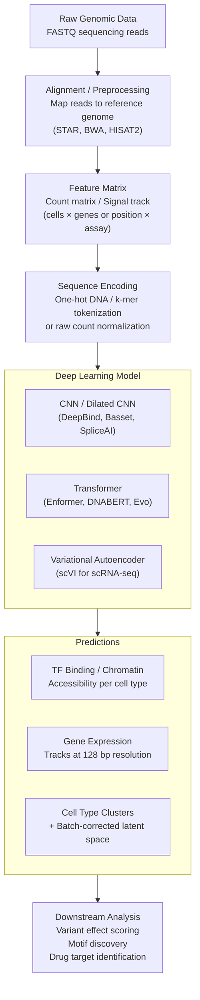

# Genomics and Gene Expression with Deep Learning

## Overview

The genome is the complete instruction manual for a living organism — 3 billion base pairs in a human cell, encoding roughly 20,000 protein-coding genes plus vast regulatory machinery. Deep learning has transformed genomics by treating DNA as a language and learning the rules of that language directly from data: which sequences bind transcription factors, which variants disrupt splicing, how chromatin is organized, and what drives gene expression differences between cell types.

### DNA as a Sequence Modeling Problem

DNA consists of four nucleotides: Adenine (A), Thymine (T), Cytosine (C), and Guanine (G). Any genomic analysis starts by encoding this alphabet into a numeric representation the network can process. The standard approach is **one-hot encoding**:

$$\text{A} \to [1,0,0,0], \quad \text{C} \to [0,1,0,0], \quad \text{G} \to [0,0,1,0], \quad \text{T} \to [0,0,0,1]$$

A sequence of length $L$ becomes a matrix $X \in \{0,1\}^{L \times 4}$.

### CNNs for Regulatory Sequence: DeepBind and Basset

The first major deep learning success in genomics was learning **transcription factor binding** from sequence. Given a short DNA window (typically 101–1000 bp), can the model predict whether a protein binds there?

A 1D convolution over a one-hot encoded DNA sequence is the natural operation. A single filter of width $w$ applied to position $i$ computes:

$$z_i = \sum_{k=0}^{w-1} \sum_{b \in \{A,C,G,T\}} W_{k,b} \cdot X_{i+k,b} + \text{bias}$$

This is mathematically equivalent to computing a **position weight matrix (PWM) score** — the classic bioinformatics tool for motif matching — but learned end-to-end from data rather than hand-curated. A model with 300 filters learns 300 sequence motifs simultaneously, many of which correspond to known transcription factor binding motifs.

**DeepBind (2015)** demonstrated this principle, outperforming existing motif-scanning tools on ChIP-seq data for dozens of transcription factors. **Basset (2016)** scaled this to predicting chromatin accessibility across 164 cell types simultaneously, learning a hierarchy: early layers detected motifs, later layers learned which motif combinations open chromatin in specific cell types.

### Basenji and Enformer: Long-Range Gene Regulation

Transcription factor binding is local (~10–20 bp motifs), but gene regulation is not. An **enhancer** — a regulatory element that activates a gene — can be 1 million base pairs away from the gene it controls. Capturing these long-range interactions requires processing very long sequences.

**Basenji (2018)** processed 131 kb windows using dilated convolutions (which increase receptive field exponentially without increasing parameter count) and predicted CAGE (transcription initiation) and ChIP-seq tracks across hundreds of cell types at 128 bp resolution.

**Enformer (2021)** replaced Basenji's dilated CNN trunk with a Transformer, processing 200 kb input sequences and predicting 5,313 genomic tracks (gene expression, histone marks, TF binding) in human and mouse. The attention mechanism directly learns which distant regulatory elements influence a gene's promoter — a computational model of long-range gene regulation.

### Variant Effect Prediction

A single nucleotide change (SNP) in a regulatory sequence can disrupt transcription factor binding, alter splicing, or change gene expression. Deep learning has transformed variant interpretation.

**In silico mutagenesis**: Run the same model on the reference sequence and the alternate allele, then take the difference in predicted output. For a model predicting TF binding:

$$\Delta \text{score} = f(\text{alt sequence}) - f(\text{ref sequence})$$

A large $|\Delta \text{score}|$ predicts a functional consequence.

**SpliceAI (2019)** trained a deep residual CNN on 10,000 bp windows to predict splicing at single-nucleotide resolution, learning the full splicing code. It identified 6,000 genetic variants that create or destroy splice sites — many missed by rule-based tools.

**CADD (Combined Annotation-Dependent Depletion)** integrates dozens of genomic features and ML to score every possible single-nucleotide variant in the human genome (8.6 billion variants) on a unified scale of deleteriousness.

### Single-Cell RNA-seq and Autoencoders

Single-cell RNA sequencing (scRNA-seq) measures gene expression in thousands of individual cells simultaneously, revealing cell type diversity within a tissue. The data is a sparse count matrix $X \in \mathbb{Z}^{C \times G}$ (cells × genes), often with $C > 10,000$ cells and $G > 30,000$ genes, dominated by dropout noise (many zero counts due to technical limits).

**scVI (single-cell Variational Inference)** models scRNA-seq counts with a variational autoencoder (VAE). The encoder maps each cell's expression profile to a low-dimensional latent space $z \in \mathbb{R}^{d}$ (typically $d=10$), and the decoder reconstructs counts using a **Negative Binomial distribution** to model the overdispersion and sparsity of scRNA-seq data:

$$\text{encoder:} \quad [\mu_z, \sigma_z] = g_\phi(x_c)$$
$$z_c \sim \mathcal{N}(\mu_z, \sigma_z^2)$$
$$\text{decoder:} \quad x_c \sim \text{NegBin}(\mu_{cg}, \theta_g)$$

The latent space $z$ captures cell-type identity and biological variation, removing technical batch effects. UMAP visualization of $z$ reveals cell clusters corresponding to biological cell types.

### Foundation Models for Genomics

The success of language model pre-training on text has inspired equivalent models for DNA.

**DNABERT (2021)** applies BERT-style masked language modeling to DNA k-mers. Pre-trained on the human reference genome, it can be fine-tuned for promoter prediction, splice site detection, and transcription factor binding — with far less labeled data than training from scratch.

**Evo (2024, Arc Institute)** is a 7-billion-parameter autoregressive model trained on 2.7 million prokaryotic and phage genomes at the single-nucleotide level with a 131 kb context window. It learns the statistical regularities of whole genomes — gene structure, operon organization, regulatory logic — and can generate novel functional sequences.

The genomics ML pipeline, end-to-end:



## Key Concepts

- **One-Hot Encoding**: Represent each nucleotide as a 4-dimensional binary vector; a sequence becomes an $L \times 4$ matrix
- **1D Convolution on DNA**: Learns sequence motifs end-to-end; mathematically equivalent to learned PWM scoring
- **Dilated Convolutions**: Exponentially expand receptive field without adding parameters, enabling long-range sequence modeling
- **Enformer**: Transformer-based model that learns long-range (200 kb) regulatory interactions to predict gene expression
- **In Silico Mutagenesis**: Predict variant effect by scoring reference vs. alternate sequence; enables genome-wide variant interpretation
- **scVI**: Variational autoencoder for single-cell RNA-seq that denoises data and learns a biologically meaningful latent space
- **Foundation Models (DNABERT, Evo)**: Self-supervised pre-training on whole genomes; fine-tuned for diverse downstream tasks

## Code Examples

```python
import numpy as np
import torch
import torch.nn as nn
import torch.nn.functional as F

# ── 1. One-hot encode a DNA sequence ──────────────────────────────────────────

def one_hot_encode(sequence: str) -> torch.Tensor:
    """Encode a DNA string to a (L, 4) float tensor."""
    mapping = {'A': 0, 'C': 1, 'G': 2, 'T': 3}
    L = len(sequence)
    encoded = torch.zeros(L, 4)
    for i, nucleotide in enumerate(sequence.upper()):
        if nucleotide in mapping:
            encoded[i, mapping[nucleotide]] = 1.0
        # N (ambiguous) stays all zeros
    return encoded

# ── 2. Simple 1D CNN for TF binding site classification ───────────────────────

class TFBindingCNN(nn.Module):
    """
    Predict transcription factor binding from a fixed-length DNA sequence.
    Architecture mirrors DeepBind: motif detection → pooling → FC layers.
    """
    def __init__(self, seq_len: int = 101, n_filters: int = 128,
                 filter_width: int = 19, n_classes: int = 1):
        super().__init__()
        self.conv1 = nn.Conv1d(
            in_channels=4,           # A, C, G, T
            out_channels=n_filters,
            kernel_size=filter_width,
            padding=filter_width // 2
        )
        self.conv2 = nn.Conv1d(n_filters, n_filters * 2, kernel_size=7, padding=3)
        self.pool = nn.AdaptiveMaxPool1d(output_size=1)   # Global max pooling
        self.fc1 = nn.Linear(n_filters * 2, 128)
        self.dropout = nn.Dropout(0.3)
        self.fc2 = nn.Linear(128, n_classes)

    def forward(self, x: torch.Tensor) -> torch.Tensor:
        # x: (batch, L, 4) → permute to (batch, 4, L) for Conv1d
        x = x.permute(0, 2, 1)
        x = F.relu(self.conv1(x))
        x = F.relu(self.conv2(x))
        x = self.pool(x).squeeze(-1)    # (batch, n_filters*2)
        x = F.relu(self.fc1(x))
        x = self.dropout(x)
        return self.fc2(x).squeeze(-1)  # (batch,) logits

# ── 3. Train on synthetic data ────────────────────────────────────────────────

def make_synthetic_data(n_pos=500, n_neg=500, seq_len=101):
    """
    Positive class: sequences containing the TGASTCA AP-1 motif.
    Negative class: random sequences.
    """
    motif = "TGASTCA"  # S = C or G
    bases = list("ACGT")
    seqs, labels = [], []

    for _ in range(n_pos):
        seq = [np.random.choice(bases) for _ in range(seq_len)]
        # Plant motif at random position
        pos = np.random.randint(0, seq_len - len(motif))
        for j, b in enumerate(motif.replace("S", np.random.choice(["C", "G"]))):
            seq[pos + j] = b
        seqs.append("".join(seq))
        labels.append(1)

    for _ in range(n_neg):
        seq = "".join(np.random.choice(bases) for _ in range(seq_len))
        seqs.append(seq)
        labels.append(0)

    X = torch.stack([one_hot_encode(s) for s in seqs])   # (N, L, 4)
    y = torch.tensor(labels, dtype=torch.float32)
    return X, y

X, y = make_synthetic_data()
model = TFBindingCNN(seq_len=101)
optimizer = torch.optim.Adam(model.parameters(), lr=1e-3)

# Simple training loop
for epoch in range(10):
    logits = model(X)
    loss = F.binary_cross_entropy_with_logits(logits, y)
    optimizer.zero_grad()
    loss.backward()
    optimizer.step()
    preds = (logits > 0).float()
    acc = (preds == y).float().mean().item()
    if (epoch + 1) % 2 == 0:
        print(f"Epoch {epoch+1:2d}  loss={loss.item():.4f}  acc={acc:.3f}")

# ── 4. In silico mutagenesis: score every single-base substitution ────────────

def in_silico_mutagenesis(model: nn.Module, seq: str) -> np.ndarray:
    """
    For each position in seq, try all 3 possible substitutions.
    Return (L, 4) array of predicted score changes.
    """
    model.eval()
    bases = "ACGT"
    ref_tensor = one_hot_encode(seq).unsqueeze(0)   # (1, L, 4)
    with torch.no_grad():
        ref_score = torch.sigmoid(model(ref_tensor)).item()

    L = len(seq)
    delta = np.zeros((L, 4))
    for i in range(L):
        for j, b in enumerate(bases):
            if b == seq[i]:
                delta[i, j] = 0.0
                continue
            mut_seq = seq[:i] + b + seq[i+1:]
            tensor = one_hot_encode(mut_seq).unsqueeze(0)
            with torch.no_grad():
                score = torch.sigmoid(model(tensor)).item()
            delta[i, j] = score - ref_score
    return delta  # Positive = mutation increases binding prediction
```

## Exercises

1. **Receptive field**: A dilated CNN uses 5 convolutional layers with filter width 3 and dilation rates [1, 2, 4, 8, 16]. What is the total receptive field (in base pairs)? Show your calculation.
2. **Motif visualization**: After training TFBindingCNN, extract the weights from `conv1`. For each filter, construct the PWM by taking the softmax of the filter weights. What biological motif does it resemble? Use BioPython or Logomaker to visualize.
3. **scVI exercise**: Download a published scRNA-seq dataset (e.g., `scvi-tools` provides the PBMC 10k dataset). Train an scVI model and visualize the latent space with UMAP. Label clusters by cell type using marker genes.

## Further Reading

- Alipanahi, B. et al. (2015). "Predicting the sequence specificities of DNA- and RNA-binding proteins by deep learning." *Nature Biotechnology* (DeepBind)
- Avsec, Z. et al. (2021). "Effective gene expression prediction from sequence by integrating long-range interactions." *Nature Methods* (Enformer)
- Jaganathan, K. et al. (2019). "Predicting Splicing from Primary Sequence with Deep Learning." *Cell* (SpliceAI)
- Lopez, R. et al. (2018). "Deep generative modeling for single-cell transcriptomics." *Nature Methods* (scVI)
- Nguyen, E. et al. (2024). "Sequence modeling and design from molecular to genome scale with Evo." *Science* (Evo)
