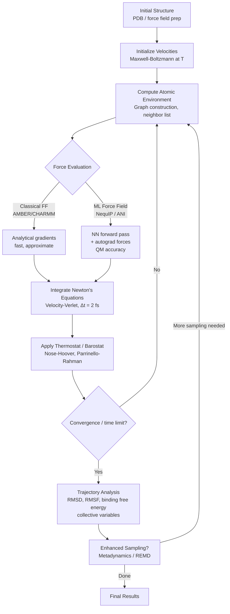

# Molecular Dynamics and Machine Learning Force Fields

## Overview

Proteins fold, enzymes catalyze reactions, drug molecules bind pockets — all of these are events driven by atomic forces playing out over time. **Molecular dynamics (MD)** simulates this motion by applying Newton's equations of motion to every atom in a system, generating trajectories that reveal how structure and function emerge from physics. But the central challenge is brutal: biologically relevant processes (protein folding, conformational changes, ligand binding/unbinding) happen on timescales of microseconds to seconds, while the timestep of a simulation must be on the order of femtoseconds ($10^{-15}$ s) to resolve the fastest bond vibrations. Bridging this gap — a factor of $10^{9}$ to $10^{15}$ — has been one of the grand computational challenges of the past 40 years.

Machine learning is now reshaping MD by replacing its most expensive component: the **force field**.

## Classical Molecular Dynamics

In classical MD, atoms are treated as point masses interacting through empirical potential energy functions. Newton's second law is integrated numerically:

$$m_i \ddot{\mathbf{r}}_i = \mathbf{F}_i = -\frac{\partial V}{\partial \mathbf{r}_i}$$

where $m_i$ is the mass of atom $i$, $\mathbf{r}_i$ is its position vector, and $V$ is the total potential energy of the system. Forces are derived from $V$ analytically.

### Classical Force Fields

Force fields like **AMBER**, **CHARMM**, and **GROMOS** decompose the potential energy into bonded and non-bonded terms:

$$V = V_{\text{bonds}} + V_{\text{angles}} + V_{\text{dihedrals}} + V_{\text{vdW}} + V_{\text{elec}}$$

Each term has a simple functional form with empirically fitted parameters:

$$V_{\text{bonds}} = \sum_{\text{bonds}} K_b (r - r_0)^2$$

$$V_{\text{angles}} = \sum_{\text{angles}} K_\theta (\theta - \theta_0)^2$$

$$V_{\text{dihedrals}} = \sum_{\text{dihedrals}} \frac{V_n}{2} \left[1 + \cos(n\phi - \delta)\right]$$

$$V_{\text{vdW}} = \sum_{i<j} 4\varepsilon_{ij} \left[ \left(\frac{\sigma_{ij}}{r_{ij}}\right)^{12} - \left(\frac{\sigma_{ij}}{r_{ij}}\right)^{6} \right]$$

$$V_{\text{elec}} = \sum_{i<j} \frac{q_i q_j}{4\pi\varepsilon_0 r_{ij}}$$

The Lennard-Jones 12-6 potential captures the Pauli repulsion (short range, $r^{-12}$) and London dispersion attraction (long range, $r^{-6}$). These functional forms are fast to evaluate but baked-in physics — they cannot capture polarization effects, bond breaking/forming, or the quantum mechanical nature of electrons.

### Why MD is Expensive

Even with classical force fields, a typical MD simulation of a solvated protein system contains $\sim 10^5$ atoms and requires $\sim 10^7$–$10^9$ timesteps (each $\sim 2$ fs) to simulate a single microsecond. Force evaluation is $O(N^2)$ naively (all pairs) and $O(N \log N)$ with particle-mesh Ewald for long-range electrostatics. Specialized hardware like **Anton** (D.E. Shaw Research) achieves millisecond-scale simulations but remains inaccessible to most researchers.

The deeper limitation is **quantum accuracy**. AMBER/CHARMM parameters are fit to quantum mechanics (QM) calculations, but the functional forms themselves are approximate. Reactions, charge transfer, and metalloproteins remain out of reach for classical MD.

## Machine Learning Force Fields

The key insight: QM calculations (density functional theory, coupled cluster) are exact enough to be ground truth, but scale as $O(N^3)$ to $O(N^7)$, limiting them to ~100 atoms. What if we trained a neural network to **learn the potential energy surface** from a database of QM calculations, then evaluate it at classical MD speed?

This is the foundation of ML force fields (MLFFs). The network takes atomic positions and predicts the total energy $E$; forces are then obtained by automatic differentiation:

$$\mathbf{F}_i = -\frac{\partial E_{\text{NN}}}{\partial \mathbf{r}_i}$$

This guarantees energy-force consistency — a critical property for stable dynamics.

### Key Architectures

**ANI (ANAKIN-ME)**: One of the first practical MLFFs. Uses atom-centered symmetry functions (ACSFs) as invariant descriptors of the local chemical environment, fed into per-element feedforward networks. Achieves near-CCSD(T) accuracy on organic molecules.

**SchNet**: A continuous-filter convolutional neural network where atoms interact through learnable radial basis function filters. Scalar-valued; respects rotational and translational invariance by construction through pairwise distances.

**NequIP (Neural Equivariant Interatomic Potentials)**: Uses **E(3)-equivariant** graph neural networks — message passing where features transform as irreducible representations of the 3D rotation group. Achieves DFT accuracy with up to $10^4$ times fewer training samples than SchNet. The key advance: instead of throwing away directional information (as invariant methods do), NequIP transforms vectors and tensors consistently with the geometry.

### Equivariance: Why It Matters

A function $f$ is **equivariant** under rotation $R$ if:

$$f(R \cdot \mathbf{x}) = R \cdot f(\mathbf{x})$$

For forces, this is physically essential: if you rotate the molecule, the predicted forces should rotate with it. Invariant networks (like SchNet) satisfy $f(R \cdot \mathbf{x}) = f(\mathbf{x})$ — fine for energy, wrong for forces (which are vectors). Equivariant networks satisfy both simultaneously, and their inductive bias dramatically improves sample efficiency.

### Enhanced Sampling

Even with fast MLFFs, rare events remain hard to sample. The **free energy barrier** for a conformational change might be 20–40 $k_BT$, making spontaneous transitions exponentially rare. Enhanced sampling methods bias the simulation to explore important regions:

- **Metadynamics**: Adds a history-dependent Gaussian bias $V_{\text{bias}}(\mathbf{s}, t) = \sum_{t'<t} w\, e^{-|\mathbf{s}-\mathbf{s}(t')|^2/(2\sigma^2)}$ along collective variables $\mathbf{s}$ to discourage re-visiting configurations.
- **Replica exchange (REMD)**: Runs multiple copies at different temperatures, periodically swapping configurations.
- **Steered MD and umbrella sampling**: Apply external forces to pull the system along a reaction coordinate.

## The MD Simulation Loop with ML



## Code Example: Energy Calculation with ASE and a ML Potential

The **Atomic Simulation Environment (ASE)** provides a unified Python interface to both classical and ML force fields. Here we show how to set up a molecule, attach an ML calculator (MACE, a state-of-the-art equivariant MLFF), and compute energy and forces.

```python
from ase import Atoms
from ase.build import molecule
import numpy as np

# ── 1. Build a small molecule (alanine dipeptide, key MD benchmark) ──
# For demo, use water; in practice load from PDB with ase.io.read()
water = molecule('H2O')
print("Atoms:", water.get_chemical_symbols())
print("Positions (Å):\n", water.get_positions())

# ── 2. Attach an ML calculator (MACE-OFF23 for organic molecules) ──
# Install: pip install mace-torch
try:
    from mace.calculators import mace_off
    calc = mace_off(model="small", device="cpu")
    water.calc = calc

    energy = water.get_potential_energy()          # eV
    forces = water.get_forces()                    # eV/Å, shape (N_atoms, 3)
    stress = water.get_stress()                    # eV/ų

    print(f"\nPotential energy: {energy:.4f} eV")
    print(f"Forces (eV/Å):\n{forces.round(4)}")
    print(f"Max force component: {np.abs(forces).max():.4f} eV/Å")

except ImportError:
    print("MACE not installed. Demonstrating with a toy Lennard-Jones calculator.")

    from ase.calculators.lj import LennardJones
    water.calc = LennardJones(epsilon=0.01, sigma=2.0)
    energy = water.get_potential_energy()
    forces = water.get_forces()
    print(f"LJ energy: {energy:.4f} eV")
    print(f"LJ forces:\n{forces.round(4)}")

# ── 3. Run a short MD trajectory with ASE's VelocityVerlet ──
from ase.md.velocitydistribution import MaxwellBoltzmannDistribution
from ase.md.verlet import VelocityVerlet
from ase import units

# Set initial velocities at 300 K
MaxwellBoltzmannDistribution(water, temperature_K=300)

# 2 fs timestep
dyn = VelocityVerlet(water, timestep=2 * units.fs)

print("\nRunning 5-step MD trajectory:")
print(f"{'Step':>4}  {'Epot (eV)':>12}  {'Ekin (eV)':>12}  {'Etot (eV)':>12}")
for step in range(5):
    dyn.run(1)
    epot = water.get_potential_energy()
    ekin = water.get_kinetic_energy()
    print(f"{step+1:>4}  {epot:>12.4f}  {ekin:>12.4f}  {epot+ekin:>12.4f}")
```

The key point is that switching from a classical LJ calculator to `mace_off` requires changing exactly one line. The forces returned by the ML calculator are obtained via automatic differentiation through the neural network: $\mathbf{F}_i = -\partial E_\theta / \partial \mathbf{r}_i$.

## Key Concepts

- **Potential energy surface (PES)**: A hypersurface $V(\mathbf{r}_1, \ldots, \mathbf{r}_N)$ whose gradient gives atomic forces. Classical FFs use simple analytical forms; MLFFs learn the PES from QM data.
- **Equivariance**: Forces are vectors — a neural network predicting them must transform consistently under rotations, translations, and reflections of the input geometry.
- **Graph neural network for molecules**: Atoms are nodes, bonds/interactions are edges. Message passing aggregates neighbor information to build local descriptors.
- **Active learning**: Train an MLFF on a small dataset, run MD, identify high-uncertainty configurations (via committee disagreement), compute new QM labels for those, retrain. This iterative loop can build accurate MLFFs with far fewer QM calculations.
- **Timestep stability**: MLFFs occasionally produce unphysical forces on configurations far outside the training distribution ("extrapolation terror"), causing simulations to explode. Uncertainty quantification is an active research area.

## Exercises

1. **Force field comparison**: Using ASE with a Lennard-Jones calculator, simulate an argon cluster at 300 K for 1 ps. Plot the radial distribution function $g(r)$. How does it change at 100 K vs. 500 K?

2. **Symmetry check**: Write a test that rotates a water molecule by a random rotation matrix $R$, recomputes forces, and verifies $\mathbf{F}_{\text{rotated}} = R \cdot \mathbf{F}_{\text{original}}$ to numerical precision. Does your calculator pass?

3. **Energy conservation**: Run NVE (constant energy) MD for 10 ps. Plot total energy vs. time. How much does it drift? What happens if you double the timestep?

4. **Collective variable**: Define the $\phi$ backbone dihedral angle of alanine dipeptide. Run a short metadynamics simulation using ASE + PLUMED and reconstruct the free energy profile along $\phi$.

## Further Reading

- [ANI-1 (Smith et al., 2017)](https://pubs.rsc.org/en/content/articlelanding/2017/sc/c6sc05720a)
- [SchNet (Schütt et al., 2018)](https://arxiv.org/abs/1802.07399)
- [NequIP (Batzner et al., 2022)](https://www.nature.com/articles/s41467-022-29939-5)
- [MACE (Batatia et al., 2023)](https://arxiv.org/abs/2206.07697)
- [OpenMM: GPU-Accelerated MD](https://openmm.org/)
- [PLUMED: Enhanced Sampling](https://www.plumed.org/)
