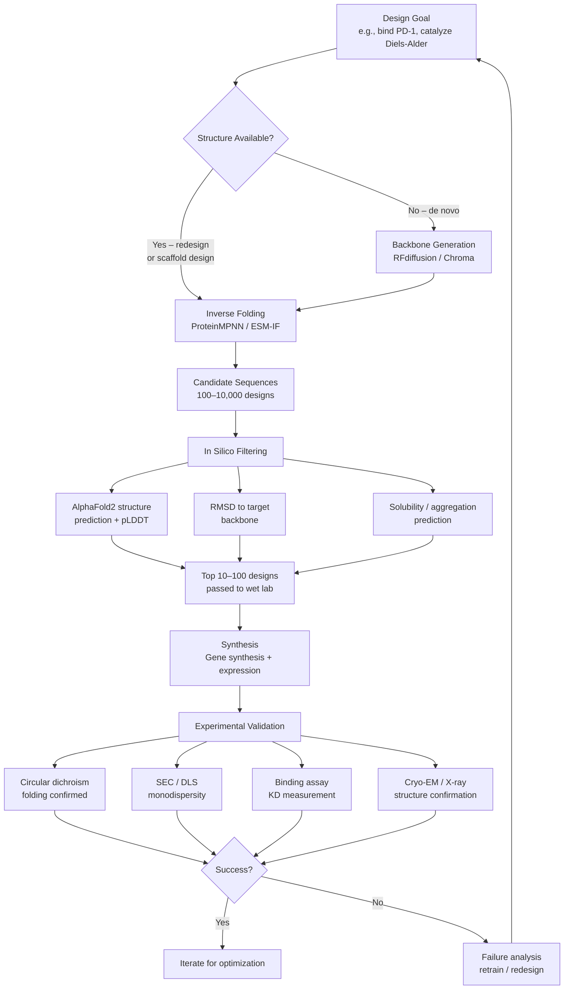

# Protein Design and Inverse Folding

## Overview

AlphaFold solved the **forward problem**: given a sequence, predict the structure. Protein design tackles the **inverse problem**: given a desired 3D structure (or function), find sequences that fold into it. This is harder — the mapping from structure to sequence is one-to-many, the design space is astronomically large ($20^{100}$ possible sequences for a 100-residue protein), and "folds correctly in a test tube" is far from guaranteed even in simulation.

The last five years have produced a revolution: deep learning methods now design proteins with experimentally verified, novel folds at scale. This lesson covers the key methods — ProteinMPNN, RFdiffusion, hallucination-based design — and the applications they enable: custom enzymes, therapeutic binders, biosensors, and molecular machines.

## The Inverse Folding Problem

Given a backbone structure $\mathcal{B}$ (the positions of $N$, $C\alpha$, $C$, $O$ atoms for each residue), find a sequence $\mathbf{s} = (s_1, s_2, \ldots, s_L)$ that:

1. Folds stably into $\mathcal{B}$
2. Is soluble and not aggregation-prone
3. (Optionally) has a specific functional property at a binding site

The inverse folding objective is to maximize the conditional log-probability of the sequence given the structure:

$$\mathcal{L}(\theta) = \sum_{i=1}^{L} \log p_\theta(s_i \mid \mathcal{B}, s_{<i})$$

This is an autoregressive factorization — we predict each residue given the backbone geometry and previously predicted residues. The model must learn that a buried hydrophobic core needs large nonpolar residues, surface positions prefer polar and charged residues, and beta-sheets require alternating hydrophobic/hydrophilic patterns.

A better sequence scores higher under the native structure than under any decoy:

$$\Delta G_{\text{fold}} \approx -k_BT \log \frac{p(\mathcal{B} \mid \mathbf{s})}{p(\mathcal{B}_{\text{unfolded}} \mid \mathbf{s})} \ll 0$$

## ProteinMPNN: Message Passing Neural Network for Protein Design

**ProteinMPNN** (Dauparas et al., 2022, Science) is the most widely used inverse folding model. It treats the protein backbone as a geometric graph and uses **message passing** to propagate structural context across the chain before predicting each residue.

### Architecture

The backbone graph $G = (V, E)$ has:
- **Nodes** $V$: one per residue, with features encoding local backbone geometry (dihedral angles $\phi, \psi, \omega$, and the $C\beta$ position)
- **Edges** $E$: connecting each residue to its $k=32$ nearest neighbors in 3D space (not just sequence neighbors), with features encoding relative distances and orientations of all backbone atoms

Node and edge features are updated through $L = 3$ rounds of message passing. At round $\ell$:

$$\mathbf{h}_i^{(\ell+1)} = \text{MLP}\!\left(\mathbf{h}_i^{(\ell)}, \bigoplus_{j \in \mathcal{N}(i)} \text{MLP}\!\left([\mathbf{h}_i^{(\ell)}, \mathbf{h}_j^{(\ell)}, \mathbf{e}_{ij}]\right)\right)$$

where $[\cdot,\cdot,\cdot]$ is concatenation and $\bigoplus$ is element-wise sum aggregation. After message passing, a linear layer maps node representations to 20-dimensional logits over amino acid identity.

**Decoding order** matters. ProteinMPNN uses random decoding order during training: some residues are masked (unknown) while others are already revealed. This forces the model to be robust to partial information and makes it possible to fix residues at a binding site while freely designing the rest of the scaffold.

**Tied sampling** for oligomers: when designing a homomeric complex, ProteinMPNN can tie the sequence of each subunit, ensuring all chains get the same sequence from a structurally averaged prediction.

### Why It Works

ProteinMPNN's spatial edge connectivity is critical: a residue "sees" its 3D neighbors regardless of sequence distance. A residue at position 10 and one at position 95 that form a disulfide bond or a hydrophobic contact are directly connected in the graph, letting the model enforce their mutual compatibility. This is something sequence-only methods fundamentally cannot do.

Benchmarks: ProteinMPNN achieves ~52% sequence recovery on CATH benchmark structures (vs. ~32% for Rosetta FastRelax). More importantly, ~50–80% of its designs for novel scaffolds experimentally fold correctly, compared to <5% for older computational approaches.

## RFdiffusion: Diffusion for Backbone Generation

Inverse folding presupposes you already have a target backbone. But what if you want to generate an entirely new protein de novo — one with no evolutionary precedent? **RFdiffusion** (Watson et al., 2023, Nature) applies denoising diffusion to protein backbone generation.

The forward diffusion process gradually adds noise to backbone coordinates over $T$ timesteps:

$$q(\mathcal{B}_t \mid \mathcal{B}_{t-1}) = \mathcal{N}\!\left(\sqrt{1-\beta_t}\,\mathcal{B}_{t-1},\; \beta_t\mathbf{I}\right)$$

The reverse (generative) process learns to denoise:

$$p_\theta(\mathcal{B}_{t-1} \mid \mathcal{B}_t) = \mathcal{N}\!\left(\mu_\theta(\mathcal{B}_t, t),\; \sigma_t^2\mathbf{I}\right)$$

where $\mu_\theta$ is predicted by a modified RoseTTAFold network. Starting from pure Gaussian noise $\mathcal{B}_T \sim \mathcal{N}(0, \mathbf{I})$, iterative denoising produces a coherent protein backbone. ProteinMPNN is then applied to design a sequence that folds into this backbone.

RFdiffusion can be **conditioned** on:
- Target binding site: diffuse a binder around a fixed receptor surface patch
- Functional motifs: hold specific secondary structure or active-site geometry fixed while designing the scaffold
- Symmetry: generate symmetric oligomers (C3, C6, icosahedral)

### Hallucination-Based Design

An earlier approach, **protein hallucination**, directly optimizes sequence or structure to maximize a score from a structure prediction network:

$$\mathbf{s}^* = \arg\max_{\mathbf{s}}\; p_{\text{AF}}(\mathcal{B}_{\text{target}} \mid \mathbf{s}) - \lambda \cdot \mathcal{R}(\mathbf{s})$$

where $p_{\text{AF}}$ is the AlphaFold confidence (pLDDT, PAE) and $\mathcal{R}$ is a regularizer penalizing low-complexity sequences. Optimization proceeds via gradient ascent through AlphaFold's parameters or via MCMC sequence-space exploration. Hallucination is flexible but computationally expensive (requires many forward passes through AlphaFold) and produces less diverse designs than diffusion methods.

## The Protein Design Pipeline



## Applications

**Enzyme design**: RFdiffusion + ProteinMPNN designed Diels-Alderase enzymes with up to 100× better activity than previous computational designs. The diffusion model generated novel scaffolds that position catalytic residues with sub-angstrom precision.

**Therapeutic proteins**: De novo binders for PD-L1, IL-2 receptor, and EGFR have been designed with nanomolar affinity, bypassing the need for antibody libraries or immunization. These "mini-binders" (40–80 residues) are small, stable, and easy to manufacture.

**Biosensors**: Designed switchable proteins that undergo large conformational changes upon ligand binding, enabling FRET-based biosensors for metabolites and pathogens.

**Molecular machines**: Symmetric assemblies — cages, rings, filaments — designed by combining symmetry-conditioned diffusion with ProteinMPNN, opening possibilities for drug delivery and nanotechnology.

## Code Example: Sequence Design with ESM-IF

ESM-IF (Hsu et al., 2022) is Meta's inverse folding model, available via the `esm` package. It uses a GVP-Transformer (Geometric Vector Perceptron) encoder on backbone coordinates.

```python
import torch
import esm
import esm.inverse_folding
from Bio.PDB import PDBParser
import numpy as np

# ── 1. Load a PDB structure ──
# Download example: wget https://files.rcsb.org/download/1VII.pdb
def design_sequences(pdb_path: str, chain_id: str = "A", num_samples: int = 5,
                     temperature: float = 1.0):
    """
    Use ESM-IF to sample sequences for a given backbone structure.
    Returns sampled sequences and their average log-likelihoods.
    """
    # Load ESM-IF model
    model, alphabet = esm.pretrained.esm_if1_gvp4_t16_142M_UR50()
    model = model.eval()

    # Load structure and extract coordinates
    structure = esm.inverse_folding.util.load_structure(pdb_path, chain_id)
    coords, native_seq = esm.inverse_folding.util.extract_coords_from_structure(structure)

    print(f"Chain {chain_id}: {len(native_seq)} residues")
    print(f"Native sequence: {native_seq}")

    # ── 2. Score the native sequence ──
    with torch.no_grad():
        ll_native, _ = esm.inverse_folding.util.score_sequence(
            model, alphabet, coords, native_seq
        )
    print(f"\nNative sequence log-likelihood: {ll_native:.3f} nats/residue")

    # ── 3. Sample new sequences at given temperature ──
    print(f"\nSampling {num_samples} sequences (T={temperature}):")
    sampled = []
    for i in range(num_samples):
        with torch.no_grad():
            sampled_seq = esm.inverse_folding.util.sample_sequence(
                model, coords, partial_seq=None,
                temperature=temperature, device="cpu"
            )
        # Score the sampled sequence
        with torch.no_grad():
            ll_sampled, _ = esm.inverse_folding.util.score_sequence(
                model, alphabet, coords, sampled_seq
            )
        # Sequence identity to native
        identity = sum(a == b for a, b in zip(sampled_seq, native_seq)) / len(native_seq)
        sampled.append((sampled_seq, ll_sampled, identity))
        print(f"  [{i+1}] LL={ll_sampled:.3f}  ID={identity:.1%}  {sampled_seq[:30]}...")

    return sampled

# ── 4. Fixed-residue design (protect a binding site) ──
def design_with_fixed_residues(pdb_path: str, chain_id: str,
                                fixed_positions: list, num_samples: int = 3):
    """
    Design sequences while keeping specified residue positions fixed.
    Useful for preserving catalytic triads, binding contacts, etc.
    """
    model, alphabet = esm.pretrained.esm_if1_gvp4_t16_142M_UR50()
    model = model.eval()

    structure = esm.inverse_folding.util.load_structure(pdb_path, chain_id)
    coords, native_seq = esm.inverse_folding.util.extract_coords_from_structure(structure)

    # Build partial sequence: fixed residues known, rest = None (masked)
    partial_seq = [None] * len(native_seq)
    for pos in fixed_positions:
        partial_seq[pos] = native_seq[pos]

    print(f"Designing with {len(fixed_positions)} fixed positions: {fixed_positions}")
    for i in range(num_samples):
        with torch.no_grad():
            s = esm.inverse_folding.util.sample_sequence(
                model, coords, partial_seq=partial_seq,
                temperature=1.0, device="cpu"
            )
        # Verify fixed positions are preserved
        assert all(s[p] == native_seq[p] for p in fixed_positions), "Fixed positions violated!"
        print(f"  Design {i+1}: {s}")

# Example usage (requires 1VII.pdb downloaded)
# designs = design_sequences("1VII.pdb", chain_id="A", num_samples=5, temperature=1.0)
# design_with_fixed_residues("1VII.pdb", "A", fixed_positions=[0, 5, 10, 15], num_samples=3)

# ── 5. Quick demo without a PDB file: synthetic coordinates ──
print("Demo: scoring with synthetic coordinates")
L = 20  # 20-residue chain
# Idealized alpha-helix coordinates (N, CA, C for each residue)
# In a real helix: rise 1.5Å/residue, 3.6 residues/turn
coords_demo = np.zeros((L, 3, 3))  # (L, 3 backbone atoms, 3 xyz)
for i in range(L):
    phi = i * (2 * np.pi / 3.6)   # helical rotation
    coords_demo[i, 1] = [1.5 * np.cos(phi), 1.5 * np.sin(phi), i * 1.5]  # CA
    coords_demo[i, 0] = coords_demo[i, 1] + np.array([-1.2, 0.0, 0.0])   # N
    coords_demo[i, 2] = coords_demo[i, 1] + np.array([1.2, 0.0, 0.0])    # C

print(f"Synthetic helix backbone: {L} residues")
print(f"CA positions (first 5):\n{coords_demo[:5, 1].round(2)}")
print("\nIn a real pipeline, these coordinates feed directly into ESM-IF or ProteinMPNN.")
```

The `temperature` parameter controls diversity: $T \to 0$ maximizes likelihood (conservative, high identity to native), $T > 1$ increases diversity at the cost of average sequence quality. In practice, $T = 1.0$ is standard; multiple temperatures are sampled and designs are filtered computationally before wet-lab synthesis.

## Key Concepts

- **Sequence recovery**: Fraction of native residues recovered by a design model on held-out structures. ProteinMPNN achieves ~52% vs. ~32% for Rosetta; AlphaFold can be used to verify whether a designed sequence actually folds back to the target structure.
- **pLDDT self-consistency**: After designing a sequence, run AlphaFold2 on it. If pLDDT > 80 and RMSD(predicted, target) < 2Å, the design likely folds correctly — this is the primary computational filter before synthesis.
- **Diffusion in structure space**: RFdiffusion operates on backbone frames (rotation + translation per residue, parameterized as $\text{SE}(3)$ elements), not atom coordinates, enabling equivariant denoising.
- **Binding site scaffolding**: Provide a known pharmacophore or catalytic geometry as a fixed "motif"; diffusion generates a new protein scaffold around it. This is called **motif scaffolding**.

## Exercises

1. **Sequence recovery benchmark**: Download 10 diverse PDB structures. Run ESM-IF at temperatures $T \in \{0.5, 1.0, 1.5\}$. Plot the distribution of native sequence recovery at each temperature. At what temperature is recovery highest? Is that always desirable?

2. **Self-consistency filter**: For each ESM-IF design, run AlphaFold2 (via ColabFold API). Compute RMSD between the predicted structure and the original backbone. What fraction of designs pass a 2Å cutoff?

3. **Fixed-site design**: Take an enzyme with a known catalytic triad (e.g., subtilisin: Asp32, His64, Ser221). Fix those three residues and design the rest of the protein. Does ProteinMPNN tend to preserve the surrounding microenvironment?

4. **Diversity analysis**: Use ESM-IF to generate 100 sequences for the same backbone. Cluster them by pairwise sequence identity. How many distinct "families" emerge? What does this tell you about the degeneracy of the sequence-to-structure mapping?

## Further Reading

- [ProteinMPNN (Dauparas et al., 2022)](https://www.science.org/doi/10.1126/science.add2187)
- [ESM-IF (Hsu et al., 2022)](https://proceedings.mlr.press/v162/hsu22a.html)
- [RFdiffusion (Watson et al., 2023)](https://www.nature.com/articles/s41586-023-06415-8)
- [Hallucination-based design (Anishchenko et al., 2021)](https://www.nature.com/articles/s41586-021-04184-w)
- [De novo enzyme design (Yim et al., 2024)](https://www.science.org/doi/10.1126/science.adq1741)
- [ProteinMPNN Colab notebook](https://colab.research.google.com/github/dauparas/ProteinMPNN/blob/main/colab_notebooks/quickstart_monomer.ipynb)
