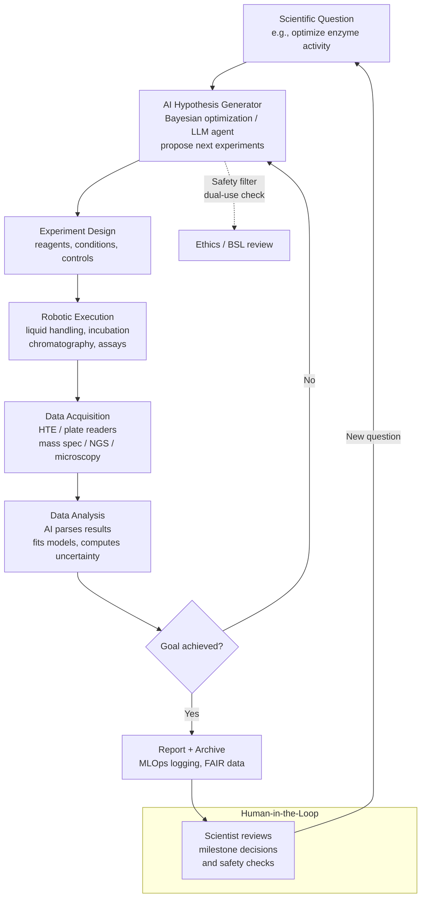
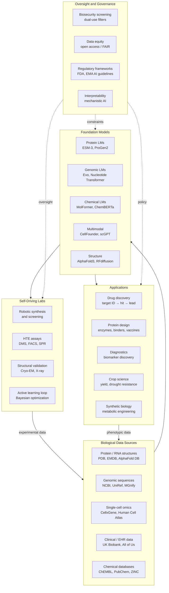

# Frontiers and Future Directions in AI for Biology

## Overview

We are at an inflection point. In five years, deep learning moved from peripheral curiosity to the central engine of structural biology, genomics, and drug discovery. AlphaFold2 predicted nearly all known protein structures. ProteinMPNN and RFdiffusion design novel proteins from scratch. Large language models trained on genomic sequences can predict the effects of mutations and engineer new biological functions.

What comes next is not incremental. The convergence of foundation models, robotic laboratories, multimodal biological data, and AI-driven hypothesis generation is creating a qualitatively new kind of science — one where AI does not just assist biologists but acts as an autonomous agent in the discovery loop. This lesson surveys the current frontier, the unresolved technical challenges, and the ethical questions that will define how this technology is deployed.

## AlphaFold3 and Beyond: Structural Biology at Molecular Scale

**AlphaFold2** solved single-chain protein structure prediction. **AlphaFold3** (Abramson et al., 2024, Nature) extends this to the full molecular ecosystem:

- **Protein-ligand complexes**: Predicts small-molecule binding poses with accuracy rivaling or exceeding Glide/AutoDock Vina on many benchmarks, without requiring a crystal structure of the holo form.
- **Protein-nucleic acid complexes**: DNA-binding proteins, RNA-binding domains, ribosomes — all can now be modeled with AF3.
- **Covalent modifications**: Glycosylation, phosphorylation, disulfide bonds, and other post-translational modifications are explicitly represented.

The architectural shift from AF2 to AF3 is significant. AF2 used Evoformer (attention over multiple sequence alignments) plus structure module (equivariant transformer). AF3 replaces this with a **diffusion-based structure generation** approach: after encoding the input tokens (residues, atoms, ligands) through a new Pairformer, it denoises a cloud of atomic coordinates rather than predicting frames directly. This makes it naturally handle heterogeneous inputs (amino acids + nucleotides + small molecules + ions) in a unified framework.

**RoseTTAFold2NA** (Baek et al., 2024) takes a different approach for nucleic acids, using dedicated track representations for RNA/DNA secondary structure. For RNA, where sequence-to-structure prediction remains harder than proteins (many non-Watson-Crick interactions, pseudoknots, ribozyme catalysis), specialized models are still competitive.

The benchmark frontier has moved to **dynamics**: not just the single lowest-energy structure but the ensemble of conformations a protein or complex visits at physiological temperature. Models like **AlphaFlow** (Jing et al., 2024) generate structural ensembles by diffusing over AlphaFold's latent space, beginning to bridge the gap between static structure prediction and molecular dynamics.

## Foundation Models for Biology

Just as GPT-3 demonstrated that language models trained on vast text corpora develop emergent capabilities far beyond their training objectives, biology now has foundation models trained on genomic and protein sequence data at scale.

### Protein Language Models: ESM Family

Meta's **ESM-2** (Lin et al., 2023) trained a 15-billion parameter transformer on 250 million protein sequences from UniRef. The representations it learns encode structure, function, and evolutionary relationships — without ever seeing a 3D coordinate during pretraining. ESM-2 embeddings:

- Predict residue contacts and full 3D structure (via ESMFold, a single-sequence structure predictor comparable to AlphaFold2 MSA-free)
- Capture the effect of mutations on protein stability and function
- Enable zero-shot fitness prediction: the log-odds of a mutant vs. wild-type correlates with experimental deep mutational scanning data

**ESM3** (Hayes et al., 2024, Science) is multimodal: it jointly models sequence, structure (represented as quantized tokens via a VQ-VAE on backbone coordinates), and function (GO terms, keywords). Any modality can serve as conditioning for generation of the others. It generated "ESM C IterDist" — a protein unlike anything in evolutionary databases, with a novel fold — demonstrating generalization beyond natural protein space.

### Genomic Foundation Models: Evo

**Evo** (Nguyen et al., 2024) trains a 7-billion parameter model (using the StripedHyena architecture, not a transformer — structured state space models scale better to genomic context lengths) on 2.7 million prokaryotic genomes at single-nucleotide resolution with a 131,000-token context window. Key capabilities:

- Predict the fitness effects of mutations across coding and non-coding regions
- Design novel CRISPR guide RNAs and transposable elements
- Generate entire synthetic genomic loci that are predicted to be functional

The scale of genomic context matters enormously: a gene's function depends on its regulatory elements (promoters, enhancers, insulators) often tens of kilobases away. Transformers with quadratic attention cannot efficiently process such sequences; Hyena and other SSMs provide linear-time long-range modeling.

## AI-Driven Lab Automation and Self-Driving Labs

Foundation models are most powerful when connected to physical infrastructure. A **self-driving lab** (SDL) closes the loop between AI hypothesis generation and robotic experiment execution:



**Concrete examples in production:**
- **Emerald Cloud Lab** and **Arctoris**: fully remote, robotically executed biochemistry pipelines where scientists write protocols in code.
- **Ada** (Pasteur Labs): AI system for protein engineering that integrates structure prediction, sequence design, and robotic expression/purification.
- **A/B Scientific**: LLM agents that autonomously search literature, design experiments, execute them via lab APIs, and write up findings.

**Active learning** is the statistical engine: rather than screening all possibilities (combinatorially infeasible), the AI maintains a probabilistic model of the fitness landscape and selects experiments that maximize information gain (uncertainty sampling) or expected improvement over the current best. For a protein engineering campaign with a combinatorial library of $20^{10}$ sequences, active learning can find near-optimal variants with $\sim 10^3$ wet-lab measurements.

## Multimodal Biological AI

Single-modality models leave information on the table. A protein's behavior depends on its sequence, structure, expression level, interaction partners, cellular localization, and the phenotypic consequences of perturbation. Multimodal models that jointly reason over these data types are nascent but rapidly maturing.

**Cell foundation models**: **scGPT** and **Geneformer** treat single-cell RNA-seq profiles as "sentences" (genes as tokens, expression as context), learning cell-type representations that generalize across tissues and diseases. Perturbation prediction — what happens to the transcriptome if you knock out gene X? — is emerging as a zero-shot capability.

**Image + sequence**: **DINO-based** models applied to histopathology images learn tissue representations that correlate with genomic subtypes without explicit supervision. Combining image embeddings with mutation profiles produces better cancer prognosis models than either alone.

**Structure + dynamics**: Integrating cryo-EM density maps (3D images) with sequence and known dynamics into a unified generative model would allow direct structure determination from sparse experimental data, guided by a prior over biologically plausible conformations.

The mathematical objective for multimodal pretraining is often a contrastive loss across modalities:

$$\mathcal{L}_{\text{contrastive}} = -\frac{1}{N}\sum_{i=1}^{N} \log \frac{e^{s(\mathbf{z}_i^{(1)}, \mathbf{z}_i^{(2)}) / \tau}}{\sum_{j=1}^{N} e^{s(\mathbf{z}_i^{(1)}, \mathbf{z}_j^{(2)}) / \tau}}$$

where $\mathbf{z}^{(1)}, \mathbf{z}^{(2)}$ are embeddings from two modalities (e.g., sequence and structure), $s(\cdot,\cdot)$ is cosine similarity, and $\tau$ is temperature. This aligns the representation spaces so that structure and sequence of the same protein are nearby, while different proteins are far apart.

## Unsolved Challenges

Despite the headlines, fundamental limitations remain.

**Data quality and distribution shift**: PDB structures are biased toward stable, well-expressing, crystallizable proteins. UniRef is biased toward sequenced organisms (mostly microbes). Models trained on this data may fail silently on: disordered proteins, membrane proteins, extremophiles, or synthetic sequences outside natural evolutionary space.

**Generalization vs. memorization**: Do protein language models understand biochemistry, or have they memorized statistical patterns from training data? When ESM-2 accurately predicts the effect of a point mutation, is it computing physical energy changes or pattern-matching to similar mutations in homologs? The answer matters enormously for designing proteins in unexplored sequence space.

**Interpretability**: What has ESM-2 "learned" in its 15B parameters? Probing studies show attention heads that specialize in contacts, secondary structure, and evolutionary conservation. But we cannot yet extract mechanistic, human-readable rules from these representations. This is a fundamental barrier to using AI models as scientific instruments rather than black-box predictors.

**The wet-lab validation gap**: Computational metrics (pLDDT, AlphaFold RMSD self-consistency, predicted $\Delta\Delta G$) are necessary but not sufficient filters. Proteins that look perfect in silico frequently fail in the lab due to: aggregation during expression, incorrect disulfide pairing, instability at physiological pH, off-target interactions in cell context. Closing this gap requires better in silico models of expression, solubility, and cellular fitness — currently weak points.

**Causal vs. correlational**: Deep mutational scanning reveals which mutations are tolerated, not why. Predicting the mechanism of a new enzyme, designing allosteric switches, or understanding disease mutations requires causal models that go beyond correlation in training data.

## Ethical Considerations

### Dual-Use and Biosecurity

The same capabilities that enable pandemic preparedness (designing broad-spectrum antivirals, predicting viral evolution) also lower barriers to biological harm. Language models trained on pathogen sequences can, in principle, suggest mutations that increase transmissibility or immune evasion. Protein design models can potentially design novel toxins or pathogen components.

This is not hypothetical. The field is actively grappling with:
- **Screening frameworks**: Tools like BioContainment and the NTI's biosecurity evaluations attempt to flag dangerous outputs before deployment.
- **Differential access**: Should models capable of designing enhanced pathogens be restricted to verified biosafety labs? Who decides?
- **Unintended dual-use**: An enzyme designer optimized for industrial applications might produce something with unintended toxicity.

No technical solution exists yet. The current approach — model providers (Meta, Google, Evolutionary Scale) maintain internal safety classifiers and restrict API access for high-risk queries — is imperfect and does not cover open-weight models.

### Equitable Access

AI in biology has concentrated capability in well-funded labs at large tech companies and top research universities. Low-income countries, where infectious disease burden is highest, have minimal access to:
- Compute for training or fine-tuning large models
- High-quality sequencing and structural data from their local pathogen and crop varieties
- Scientists trained to use and critically evaluate these tools

This is not merely a fairness issue — it is a scientific problem. If AI models are trained primarily on data from a few organisms and contexts, they will systematically underperform on the problems most relevant to global health.

## Code Example: ESM-2 Protein Embedding Extraction

```python
import torch
import esm
import numpy as np
from typing import List, Tuple

def extract_esm2_embeddings(
    sequences: List[Tuple[str, str]],
    model_name: str = "esm2_t6_8M_UR50D",   # small model for demo
    repr_layer: int = 6,
    device: str = "cpu"
) -> dict:
    """
    Extract per-residue and mean-pooled embeddings from ESM-2.

    Args:
        sequences: List of (label, sequence) tuples
        model_name: ESM-2 variant. Options:
            esm2_t6_8M_UR50D      (8M params, 6 layers)
            esm2_t12_35M_UR50D    (35M params)
            esm2_t30_150M_UR50D   (150M params)
            esm2_t33_650M_UR50D   (650M params)
            esm2_t36_3B_UR50D     (3B params)
            esm2_t48_15B_UR50D    (15B params)
        repr_layer: Which transformer layer to extract from
        device: "cpu" or "cuda"

    Returns:
        dict with per-residue embeddings and sequence-level embeddings
    """
    # Load model
    model, alphabet = esm.pretrained.load_model_and_alphabet(model_name)
    model = model.eval().to(device)
    batch_converter = alphabet.get_batch_converter()

    print(f"Loaded {model_name}: {sum(p.numel() for p in model.parameters()):,} parameters")

    # Tokenize
    _, _, batch_tokens = batch_converter(sequences)
    batch_tokens = batch_tokens.to(device)
    batch_lens = (batch_tokens != alphabet.padding_idx).sum(1)

    # Forward pass (no gradient needed)
    with torch.no_grad():
        results = model(
            batch_tokens,
            repr_layers=[repr_layer],
            return_contacts=True      # also returns predicted contact map
        )

    token_representations = results["representations"][repr_layer]  # (B, L+2, D)
    contact_maps = results["contacts"]                               # (B, L, L)

    output = {}
    for i, (label, seq) in enumerate(sequences):
        seq_len = batch_lens[i] - 2  # remove BOS and EOS tokens

        # Per-residue embeddings: shape (L, D)
        per_residue = token_representations[i, 1:seq_len+1].cpu().numpy()

        # Mean-pooled sequence embedding: shape (D,)
        seq_embedding = per_residue.mean(axis=0)

        # Predicted contact map: shape (L, L), values in [0,1]
        contacts = contact_maps[i, :seq_len, :seq_len].cpu().numpy()

        output[label] = {
            "sequence": seq,
            "length": int(seq_len),
            "per_residue_embeddings": per_residue,    # (L, 768) for 650M model
            "sequence_embedding": seq_embedding,       # (768,)
            "predicted_contacts": contacts,            # (L, L)
        }

        print(f"\n{label} ({seq_len} residues)")
        print(f"  Per-residue shape: {per_residue.shape}")
        print(f"  Sequence embedding norm: {np.linalg.norm(seq_embedding):.3f}")
        top_contacts = np.unravel_index(np.argsort(contacts.ravel())[-5:], contacts.shape)
        print(f"  Top 5 predicted contacts (i, j): {list(zip(*top_contacts))}")

    return output

# ── Zero-shot mutation effect prediction ──
def score_mutations(
    wild_type: str,
    mutations: List[str],
    model,
    alphabet,
    repr_layer: int
) -> dict:
    """
    Score mutations using ESM-2 masked marginal log-likelihood.

    For mutation X42Y: mask position 42, compute log p(Y | context) - log p(X | context).
    Positive = mutation is predicted beneficial; negative = deleterious.
    """
    batch_converter = alphabet.get_batch_converter()
    scores = {}

    for mut in mutations:
        # Parse mutation string (e.g., "A5G" = Ala at position 5 → Gly)
        wt_aa, pos, mut_aa = mut[0], int(mut[1:-1]) - 1, mut[-1]  # 1-indexed input
        assert wild_type[pos] == wt_aa, f"Mismatch: expected {wt_aa} at pos {pos+1}"

        # Create masked sequence
        masked_seq = wild_type[:pos] + alphabet.mask_token + wild_type[pos+1:]
        _, _, tokens = batch_converter([("masked", masked_seq)])

        with torch.no_grad():
            logits = model(tokens, repr_layers=[])["logits"]  # (1, L+2, vocab)

        # Log-odds at the masked position (+1 for BOS token offset)
        log_probs = torch.log_softmax(logits[0, pos + 1], dim=-1)
        wt_idx = alphabet.get_idx(wt_aa)
        mut_idx = alphabet.get_idx(mut_aa)
        score = (log_probs[mut_idx] - log_probs[wt_idx]).item()
        scores[mut] = score

    return scores

# Example usage
example_sequences = [
    ("villin_hp36",  "LSDEDFKAVFGMTRSAFANLPLWKQQNLKKEKGLF"),
    ("trp_cage",     "NLYIQWLKDGGPSSGRPPPS"),
]

print("=== ESM-2 Embedding Extraction Demo ===\n")
embeddings = extract_esm2_embeddings(example_sequences, model_name="esm2_t6_8M_UR50D")

# Cosine similarity between the two proteins
e1 = embeddings["villin_hp36"]["sequence_embedding"]
e2 = embeddings["trp_cage"]["sequence_embedding"]
cos_sim = np.dot(e1, e2) / (np.linalg.norm(e1) * np.linalg.norm(e2))
print(f"\nCosine similarity (villin vs. trp-cage): {cos_sim:.4f}")
print("(Both are fast-folding proteins; moderate similarity expected)")

# ── Downstream: cluster sequences by embedding ──
from sklearn.decomposition import PCA   # pip install scikit-learn

all_embeddings = np.stack([v["sequence_embedding"] for v in embeddings.values()])
pca = PCA(n_components=2)
coords_2d = pca.fit_transform(all_embeddings)
print(f"\nPCA of sequence embeddings:")
for (label, _), coord in zip(example_sequences, coords_2d):
    print(f"  {label}: PC1={coord[0]:.3f}, PC2={coord[1]:.3f}")
print(f"Variance explained: {pca.explained_variance_ratio_.sum():.1%}")
```

The key insight is that ESM-2 is a **frozen feature extractor**: the embeddings it produces (without any task-specific fine-tuning) already encode enough biological information to predict structure, function, and mutational effects. This is analogous to using ImageNet-pretrained ResNet features for medical imaging — the representation transfers across domains.

## The Future AI-Biology Ecosystem



## Key Concepts

- **Foundation model**: A large model trained on diverse data at scale, designed for fine-tuning or zero-shot use across downstream tasks. In biology: ESM-2/3 (proteins), Evo (genomes), scGPT (single-cell).
- **Self-driving lab**: Closed-loop system combining AI hypothesis generation with robotic execution, enabling autonomous iterative experimentation.
- **Masked marginal scoring**: Zero-shot mutation effect prediction by comparing log-probabilities of wild-type and mutant residues at masked positions, without training on any labeled fitness data.
- **Active learning**: Sequential experimental design strategy that selects the most informative experiments to run next, using uncertainty quantification to explore the fitness landscape efficiently.
- **Multimodal alignment**: Contrastive or generative training objectives that bring representations of the same biological entity (e.g., a protein's sequence and structure) close together in embedding space.

## Exercises

1. **Embedding space exploration**: Extract ESM-2 embeddings for 50 proteins spanning diverse SCOP folds. Apply UMAP for visualization. Do proteins cluster by fold class? By function? What do neighboring proteins share?

2. **Zero-shot fitness benchmark**: Download the ProteinGym substitution benchmark (2.5M labeled mutations across 217 proteins). Score all mutations using ESM-2 masked marginals. Plot predicted vs. experimental fitness. How does performance vary across protein families?

3. **Multimodal comparison**: For a set of 100 proteins, compare cosine similarities in (a) ESM-2 sequence embedding space vs. (b) TM-score structural similarity. Where do sequence and structure disagree most? What biological phenomena explain the outliers?

4. **Active learning simulation**: Simulate a protein engineering campaign on a known fitness landscape (e.g., GB1, available in ProteinGym). Compare random sampling vs. Bayesian optimization with a GP surrogate. How many experiments does active learning need to find the top 1% of variants?

5. **Biosecurity scenario**: Read the NTI Biosecurity AI review. Identify three specific model capabilities discussed in this lesson track that have clear dual-use risk. For each, propose a technical mitigation (e.g., output filtering, access control, watermarking) and explain its limitations.

## Further Reading

- [AlphaFold3 (Abramson et al., 2024)](https://www.nature.com/articles/s41586-024-07487-w)
- [ESM3 (Hayes et al., 2024)](https://www.science.org/doi/10.1126/science.ads0018)
- [Evo (Nguyen et al., 2024)](https://www.science.org/doi/10.1126/science.ado9336)
- [Self-driving labs review (Abolhasani & Kumacheva, 2023)](https://www.nature.com/articles/s41557-022-01118-9)
- [ProteinGym benchmark](https://proteingym.org/)
- [Biosecurity and Dual-Use AI in Biology (NTI, 2023)](https://www.nti.org/analysis/articles/biosecurity-and-dual-use-risks-of-ai-in-biology/)
- [scGPT (Cui et al., 2024)](https://www.nature.com/articles/s41592-024-02201-0)
