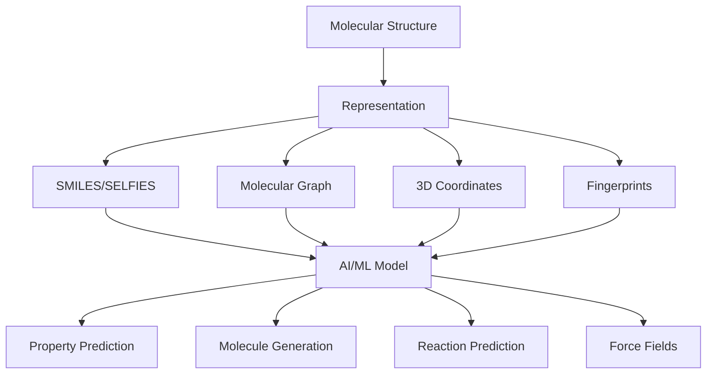

# Introduction to AI for Chemistry

## Overview

Chemistry has always been a data-rich science. From the periodic table to crystallographic databases, chemists have long organized knowledge into structured systems that lend themselves naturally to computational methods. The marriage of artificial intelligence with chemistry represents one of the most transformative developments in modern science, accelerating discovery timelines from years to weeks.

The history of computational chemistry stretches back to the 1930s with Hammett's linear free-energy relationships — among the first quantitative structure-activity relationships (QSARs). These early empirical models established the principle that molecular properties could be predicted from structural features, a concept that underpins modern AI approaches. The 1960s brought Hansch analysis and the birth of cheminformatics as a formal discipline. By the 1990s, combinatorial chemistry and high-throughput screening generated massive datasets that demanded automated analysis.

The deep learning revolution, beginning around 2012, changed everything. Neural networks could now learn complex, nonlinear relationships between molecular structure and properties directly from data, bypassing the need for hand-crafted descriptors. Key milestones include: the development of graph neural networks for molecules (2015-2017), AlphaFold's protein structure prediction breakthrough (2020), and generative models that design novel molecules with desired properties (2018-present).

Today, AI for chemistry spans an enormous range of applications. In drug discovery, ML models predict binding affinity, toxicity, and pharmacokinetics orders of magnitude faster than traditional methods. In materials science, neural networks predict crystal stability and band gaps, guiding the search for next-generation batteries and solar cells. In synthetic chemistry, transformer models plan retrosynthetic routes and predict reaction outcomes. And in molecular simulation, ML force fields achieve quantum-mechanical accuracy at a fraction of the computational cost.

What makes chemistry particularly well-suited for AI? First, molecules have natural graph structure — atoms as nodes, bonds as edges — that maps perfectly onto graph neural networks. Second, the chemical space is vast (estimated $10^{60}$ drug-like molecules) yet highly structured, making it ideal for generative modeling. Third, physics-based constraints provide strong inductive biases that improve data efficiency. Finally, experimental automation enables closed-loop "self-driving labs" where AI designs experiments, robots execute them, and results feed back into improved models.

This course will take you from molecular representations and basic property prediction through advanced topics like ML force fields, reaction prediction, and autonomous discovery. By the end, you'll understand how AI is reshaping every subdomain of chemistry and have hands-on experience with the key tools and algorithms.

## Key Concepts

- **Cheminformatics**: The application of informatics methods to solve chemical problems, including molecular representation, database searching, and property prediction
- **QSAR/QSPR**: Quantitative Structure-Activity/Property Relationships — mathematical models relating molecular structure to biological activity or physical properties
- **Chemical space**: The theoretical set of all possible molecules; drug-like chemical space alone contains an estimated $10^{60}$ compounds
- **Molecular descriptors**: Numerical features computed from molecular structure (e.g., molecular weight, LogP, topological indices) used as ML inputs
- **Inverse design**: Using AI to design molecules with desired target properties, rather than screening existing libraries
- **Self-driving laboratories**: Automated systems combining AI-driven experimental design with robotic execution for autonomous scientific discovery

## Code Examples

```python
"""
Getting started: exploring molecules with RDKit
RDKit is the foundational open-source toolkit for cheminformatics in Python.
"""
from rdkit import Chem
from rdkit.Chem import Descriptors, Draw

# Parse a molecule from SMILES notation
aspirin = Chem.MolFromSmiles('CC(=O)Oc1ccccc1C(=O)O')

# Compute basic molecular properties
print(f"Molecular formula: {Chem.rdMolDescriptors.CalcMolFormula(aspirin)}")
print(f"Molecular weight: {Descriptors.MolWt(aspirin):.2f}")
print(f"LogP (lipophilicity): {Descriptors.MolLogP(aspirin):.2f}")
print(f"Number of H-bond donors: {Descriptors.NumHDonors(aspirin)}")
print(f"Number of H-bond acceptors: {Descriptors.NumHAcceptors(aspirin)}")
print(f"Number of rotatable bonds: {Descriptors.NumRotatableBonds(aspirin)}")

# Check Lipinski's Rule of Five (drug-likeness)
def check_lipinski(mol):
    mw = Descriptors.MolWt(mol)
    logp = Descriptors.MolLogP(mol)
    hbd = Descriptors.NumHDonors(mol)
    hba = Descriptors.NumHAcceptors(mol)
    violations = sum([mw > 500, logp > 5, hbd > 5, hba > 10])
    return violations <= 1, violations

is_druglike, n_violations = check_lipinski(aspirin)
print(f"\nDrug-like (Lipinski): {is_druglike} ({n_violations} violations)")
```

## Mathematical Formalism

The classical Hansch equation represents one of the earliest QSAR models:

$$\log\left(\frac{1}{C}\right) = a\pi + b\sigma + c \cdot ES + d$$

where $C$ is the molar concentration producing a biological response, $\pi$ is the hydrophobic constant, $\sigma$ is the Hammett electronic parameter, $ES$ is the Taft steric parameter, and $a, b, c, d$ are regression coefficients.

Modern neural network approaches replace this linear model with:

$$y = f_\theta(\mathbf{x})$$

where $\mathbf{x}$ is a learned molecular representation and $f_\theta$ is a deep neural network parameterized by $\theta$, trained to minimize:

$$\mathcal{L} = \frac{1}{N}\sum_{i=1}^{N}\left(y_i - f_\theta(\mathbf{x}_i)\right)^2$$

## Diagrams



## Exercises/Projects

1. **Install and explore RDKit**: Install RDKit via `conda install -c conda-forge rdkit`. Parse 5 common drug molecules from SMILES and compute their Lipinski properties. Which ones pass the Rule of Five?

2. **Chemical space visualization**: Use RDKit to compute Morgan fingerprints for 100 molecules from the ZINC database. Apply t-SNE or UMAP to visualize them in 2D. Do similar molecules cluster together?

3. **Historical timeline**: Research and create a timeline of key milestones in AI for chemistry, from Hammett (1937) to present. Identify which advances in ML (CNNs, GNNs, transformers, diffusion) enabled which chemistry applications.

## Further Reading

- Murcko, M. "The Future of Drug Discovery" (2025). Overview of AI-driven pharma.
- Butler et al. "Machine learning for molecular and materials science" Nature 559, 547-555 (2018)
- Sanchez-Lengeling & Aspuru-Guzik. "Inverse molecular design using machine learning" Science 361, 360-365 (2018)
