# Molecular Representations

## Overview

Before any machine learning model can process a molecule, that molecule must be encoded into a mathematical representation. The choice of representation fundamentally determines what information is available to the model and often dictates which architectures are appropriate. This lesson covers the major molecular representations used in AI for chemistry, from string-based encodings to graph structures and 3D coordinates.

**SMILES (Simplified Molecular-Input Line-Entry System)** is the most widely used string representation. Developed by David Weininger in 1988, SMILES encodes molecular structure as a linear string of ASCII characters. Atoms are represented by their atomic symbols, bonds by special characters (= for double, # for triple), and rings by matching digits. Branches are denoted with parentheses. For example, ethanol is `CCO`, benzene is `c1ccccc1`, and aspirin is `CC(=O)Oc1ccccc1C(=O)O`. SMILES is compact and human-readable, but has limitations: the same molecule can have multiple valid SMILES (canonical SMILES resolves this partially), and not all character sequences correspond to valid molecules — making generation challenging.

**SELFIES (Self-Referencing Embedded Strings)** was introduced in 2020 to address SMILES' validity problem. SELFIES uses a formal grammar that guarantees every string decodes to a valid molecule. This makes it ideal for generative models — any random mutation or crossover in SELFIES space produces a valid molecule. The encoding uses tokens like `[C]`, `[=O]`, `[Branch1]`, and `[Ring1]` with a derivation system ensuring chemical validity.

**Molecular graphs** represent molecules as attributed graphs $G = (V, E)$ where nodes $V$ are atoms and edges $E$ are bonds. Node features typically include atomic number, formal charge, hybridization, aromaticity, and number of hydrogens. Edge features encode bond type (single, double, triple, aromatic), stereochemistry, and conjugation. This representation preserves the full topology and is the natural input for graph neural networks.

**Molecular fingerprints** are fixed-length binary or count vectors encoding structural features. Morgan fingerprints (Extended-Connectivity Fingerprints, ECFP) assign each atom an identifier based on its circular neighborhood up to a given radius, then hash these into a fixed-length vector. MACCS keys encode the presence/absence of 166 predefined structural patterns. Fingerprints enable fast similarity searching and are excellent inputs for classical ML models.

**3D conformations** represent molecules with explicit atomic coordinates $(x, y, z)$. These capture stereochemistry, conformational preferences, and the spatial arrangement that determines protein-ligand binding. Multiple conformers may exist for a single molecule. 3D representations are essential for modeling interactions but require geometry optimization or experimental structures.

## Key Concepts

- **SMILES**: Compact string encoding; non-unique but widely supported; can produce invalid molecules during generation
- **SELFIES**: Grammar-based string encoding guaranteeing 100% validity; slightly less interpretable but ideal for generative models
- **Molecular graph**: Attributed graph with atom/bond features; preserves full topology; input for GNNs
- **Morgan fingerprints (ECFP)**: Fixed-length circular fingerprints capturing local atomic environments; radius parameter controls information depth
- **Tanimoto similarity**: Standard metric for comparing molecular fingerprints: $T(A,B) = \frac{|A \cap B|}{|A \cup B|}$
- **Conformer**: A specific 3D arrangement of atoms; flexible molecules have many low-energy conformers

## Code Examples

```python
"""
Molecular representations with RDKit: SMILES, fingerprints, and graphs
"""
from rdkit import Chem
from rdkit.Chem import AllChem, Draw, DataStructs
from rdkit.Chem import rdMolDescriptors
import numpy as np

# SMILES parsing and canonicalization
smiles_variants = ['c1ccccc1', 'C1=CC=CC=C1', 'c1ccc(cc1)']  # All benzene
for smi in smiles_variants:
    mol = Chem.MolFromSmiles(smi)
    if mol:
        print(f"{smi:20s} -> canonical: {Chem.MolToSmiles(mol)}")

# Morgan fingerprint (ECFP4 equivalent: radius=2, 2048 bits)
caffeine = Chem.MolFromSmiles('Cn1cnc2c1c(=O)n(c(=O)n2C)C')
fp = AllChem.GetMorganFingerprintAsBitVect(caffeine, radius=2, nBits=2048)
arr = np.zeros(2048)
DataStructs.ConvertToNumpyArray(fp, arr)
print(f"\nCaffeine ECFP4: {int(arr.sum())} bits set out of 2048")

# Tanimoto similarity between two molecules
mol1 = Chem.MolFromSmiles('CC(=O)Oc1ccccc1C(=O)O')  # Aspirin
mol2 = Chem.MolFromSmiles('CC(=O)Nc1ccc(O)cc1')     # Acetaminophen
fp1 = AllChem.GetMorganFingerprintAsBitVect(mol1, 2, nBits=2048)
fp2 = AllChem.GetMorganFingerprintAsBitVect(mol2, 2, nBits=2048)
similarity = DataStructs.TanimotoSimilarity(fp1, fp2)
print(f"Tanimoto(aspirin, acetaminophen) = {similarity:.3f}")

# Convert molecule to graph representation (for PyG)
def mol_to_graph(mol):
    """Convert RDKit mol to node features and edge index."""
    # Node features: atomic number, degree, formal charge, hybridization
    node_features = []
    for atom in mol.GetAtoms():
        node_features.append([
            atom.GetAtomicNum(),
            atom.GetDegree(),
            atom.GetFormalCharge(),
            int(atom.GetHybridization()),
            int(atom.GetIsAromatic())
        ])
    
    # Edge index (COO format)
    edge_index = []
    for bond in mol.GetBonds():
        i, j = bond.GetBeginAtomIdx(), bond.GetEndAtomIdx()
        edge_index.extend([[i, j], [j, i]])  # Undirected
    
    return np.array(node_features), np.array(edge_index).T

mol = Chem.MolFromSmiles('c1ccccc1')  # Benzene
nodes, edges = mol_to_graph(mol)
print(f"\nBenzene graph: {nodes.shape[0]} atoms, {edges.shape[1]} directed edges")

# Generate 3D conformer
mol_3d = Chem.AddHs(Chem.MolFromSmiles('CCCC'))  # Butane
AllChem.EmbedMolecule(mol_3d, randomSeed=42)
AllChem.MMFFOptimizeMolecule(mol_3d)
conf = mol_3d.GetConformer()
print(f"\nButane 3D coordinates ({conf.GetNumAtoms()} atoms with H):")
for i in range(min(4, conf.GetNumAtoms())):
    pos = conf.GetAtomPosition(i)
    print(f"  C{i}: ({pos.x:.2f}, {pos.y:.2f}, {pos.z:.2f})")
```

## Mathematical Formalism

The Tanimoto coefficient for binary fingerprints:

$$T(A, B) = \frac{|A \cap B|}{|A| + |B| - |A \cap B|} = \frac{c}{a + b - c}$$

where $a = |A|$, $b = |B|$, and $c = |A \cap B|$ are the number of set bits.

Morgan fingerprints use iterative neighborhood aggregation. At iteration $t$, each atom $i$ receives an identifier:

$$h_i^{(t)} = \text{hash}\left(h_i^{(t-1)}, \{h_j^{(t-1)} : j \in \mathcal{N}(i)\}\right)$$

where $\mathcal{N}(i)$ is the set of atoms bonded to atom $i$ and $h_i^{(0)}$ is the initial atom invariant. After $r$ iterations (radius), the set of all unique identifiers is folded into a fixed-length bit vector.

## Diagrams

```mermaid
graph LR
    subgraph "String Representations"
        A[SMILES: CC=O]
        B[SELFIES: &#91;C&#93;&#91;C&#93;&#91;=O&#93;]
    end
    subgraph "Graph Representation"
        C((C)) --- D((C))
        D --- E((O))
    end
    subgraph "Fingerprint"
        F[0 1 0 0 1 1 0 1 ...]
    end
    subgraph "3D Conformation"
        G["(x,y,z) for each atom"]
    end
```



## Exercises/Projects

1. **SMILES exploration**: Write a function that generates all valid SMILES for ethanol. How many unique SMILES can you find? Verify they all produce the same canonical SMILES.

2. **Fingerprint similarity matrix**: Compute pairwise Tanimoto similarity for 10 common drugs. Visualize as a heatmap. Do pharmacologically similar drugs cluster?

3. **SELFIES robustness**: Install `selfies` (`pip install selfies`). Generate 1000 random SELFIES strings by randomly sampling tokens. What percentage decode to valid molecules? Compare with random SMILES strings.

4. **Graph featurization**: Extend the `mol_to_graph` function to include edge features (bond type, aromaticity, conjugation). Test on molecules with diverse bond types.

## Further Reading

- Weininger, D. "SMILES, a chemical language and information system" J. Chem. Inf. Comput. Sci. 28, 31-36 (1988)
- Krenn et al. "Self-referencing embedded strings (SELFIES)" Machine Learning: Science and Technology 1, 045024 (2020)
- Rogers & Hahn. "Extended-connectivity fingerprints" J. Chem. Inf. Model. 50, 742-754 (2010)
