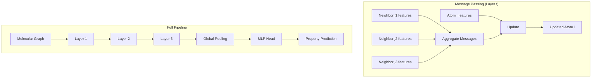

# Graph Neural Networks for Molecules

## Overview

Molecules are naturally graphs — atoms are nodes, bonds are edges. Graph Neural Networks (GNNs) exploit this structure directly, learning molecular representations that respect the topology without requiring hand-crafted descriptors. GNNs have become the dominant architecture for molecular property prediction, achieving state-of-the-art results across drug discovery, materials science, and quantum chemistry benchmarks.

The core mechanism shared by all molecular GNNs is **message passing**. Each atom starts with an initial feature vector (encoding atomic number, charge, hybridization, etc.). Over multiple rounds of message passing, atoms aggregate information from their neighbors, progressively building representations that encode larger structural neighborhoods. After $K$ layers, each atom's representation encodes its $K$-hop neighborhood. A final readout function (sum, mean, or attention-weighted pooling) aggregates atom representations into a single molecular embedding.

**Message Passing Neural Networks (MPNNs)**, formalized by Gilmer et al. (2017), provide the unifying framework. At each layer $t$, three functions operate: a message function $M_t$ that computes messages between neighbors, an update function $U_t$ that updates atom states, and a readout function $R$ that produces the final graph-level prediction. Most molecular GNNs are special cases of this framework.

**SchNet** (Schütt et al., 2017) was one of the first architectures to incorporate 3D geometry. Instead of using bond connectivity, SchNet uses continuous-filter convolutions on interatomic distances. This makes it naturally equivariant to rotation and translation — critical for predicting energy and forces. The key innovation is the use of radial basis functions to expand distances into feature vectors, which then parameterize the convolutional filters.

**WeaveNet** (Kearnes et al., 2016) processes both atom and bond ("pair") features simultaneously. Unlike standard MPNNs that only update atom features, WeaveNet maintains and updates an atom-pair matrix, enabling richer bond-level reasoning. This was particularly effective for predicting properties that depend on specific bond patterns.

**Directed Message Passing Neural Networks (D-MPNN)**, used in Chemprop, send messages along directed edges rather than nodes. This avoids "information leaking" where a message sent from atom A to atom B immediately bounces back in the next iteration. D-MPNN achieves strong results with simple architecture choices and is widely used in industry.

The choice of atom and bond featurization significantly impacts performance. Typical atom features include: atomic number (one-hot), degree, formal charge, number of hydrogens, hybridization state, aromaticity, and whether the atom is in a ring. Bond features include: bond type, conjugation, ring membership, and stereochemistry. These are usually concatenated into fixed-length vectors.

## Key Concepts

- **Message passing**: Iterative neighborhood aggregation where each node collects and processes information from its neighbors
- **Readout/pooling**: Aggregating node-level representations into a graph-level embedding (sum, mean, attention)
- **MPNN framework**: The general message-update-readout paradigm unifying most molecular GNNs
- **Continuous-filter convolution**: SchNet's approach using interatomic distances to parameterize filters, enabling 3D-aware learning
- **D-MPNN**: Directed message passing that prevents information loops by passing messages on directed edges
- **Over-smoothing**: The problem where too many GNN layers cause all node representations to converge, losing local information

## Code Examples

```python
"""
Building a molecular GNN with PyTorch Geometric (PyG)
"""
import torch
import torch.nn.functional as F
from torch_geometric.nn import GCNConv, global_mean_pool
from torch_geometric.data import Data
from rdkit import Chem
import numpy as np

# Convert molecule to PyG Data object
def mol_to_pyg(smiles, y=None):
    mol = Chem.MolFromSmiles(smiles)
    
    # Atom features: [atomic_num, degree, formal_charge, aromatic]
    x = []
    for atom in mol.GetAtoms():
        x.append([
            atom.GetAtomicNum(),
            atom.GetDegree(),
            atom.GetFormalCharge(),
            int(atom.GetIsAromatic()),
        ])
    x = torch.tensor(x, dtype=torch.float)
    
    # Edge index
    edge_index = []
    for bond in mol.GetBonds():
        i, j = bond.GetBeginAtomIdx(), bond.GetEndAtomIdx()
        edge_index += [[i, j], [j, i]]
    edge_index = torch.tensor(edge_index, dtype=torch.long).t().contiguous()
    
    data = Data(x=x, edge_index=edge_index)
    if y is not None:
        data.y = torch.tensor([y], dtype=torch.float)
    return data

# Simple GCN model for molecular property prediction
class MoleculeGCN(torch.nn.Module):
    def __init__(self, in_channels=4, hidden_channels=64, out_channels=1):
        super().__init__()
        self.conv1 = GCNConv(in_channels, hidden_channels)
        self.conv2 = GCNConv(hidden_channels, hidden_channels)
        self.conv3 = GCNConv(hidden_channels, hidden_channels)
        self.lin = torch.nn.Linear(hidden_channels, out_channels)
    
    def forward(self, x, edge_index, batch):
        # Message passing layers
        x = F.relu(self.conv1(x, edge_index))
        x = F.relu(self.conv2(x, edge_index))
        x = F.relu(self.conv3(x, edge_index))
        
        # Readout: aggregate node features to graph level
        x = global_mean_pool(x, batch)  # [batch_size, hidden_channels]
        
        # Predict property
        x = self.lin(x)
        return x

# Example: create data for caffeine
caffeine_data = mol_to_pyg('Cn1cnc2c1c(=O)n(c(=O)n2C)C', y=1.0)
print(f"Caffeine graph: {caffeine_data.num_nodes} atoms, "
      f"{caffeine_data.num_edges} edges")

# Initialize and run model
model = MoleculeGCN()
out = model(caffeine_data.x, caffeine_data.edge_index, 
            torch.zeros(caffeine_data.num_nodes, dtype=torch.long))
print(f"Predicted property: {out.item():.4f}")
```

## Mathematical Formalism

The general MPNN framework defines three phases:

**Message phase** (for $t = 1, \ldots, T$):

$$m_i^{(t)} = \sum_{j \in \mathcal{N}(i)} M_t\left(h_i^{(t-1)}, h_j^{(t-1)}, e_{ij}\right)$$

**Update phase**:

$$h_i^{(t)} = U_t\left(h_i^{(t-1)}, m_i^{(t)}\right)$$

**Readout phase**:

$$\hat{y} = R\left(\{h_i^{(T)} : i \in V\}\right)$$

For GCN specifically, the update rule is:

$$h_i^{(t)} = \sigma\left(\sum_{j \in \mathcal{N}(i) \cup \{i\}} \frac{1}{\sqrt{d_i d_j}} W^{(t)} h_j^{(t-1)}\right)$$

where $d_i$ is the degree of node $i$ and $W^{(t)}$ is a learnable weight matrix.

SchNet's continuous-filter convolution:

$$h_i^{(t)} = h_i^{(t-1)} + \sum_{j \neq i} h_j^{(t-1)} \circ W\left(\|r_i - r_j\|\right)$$

where $W(d) = \text{MLP}(\text{RBF}(d))$ parameterizes the filter from the interatomic distance.

## Diagrams



## Exercises/Projects

1. **Implement message passing from scratch**: Without using PyG, implement a single layer of message passing for a water molecule (H-O-H). Hand-trace the computation.

2. **GNN depth experiment**: Train the MoleculeGCN above with 1, 2, 3, 5, and 8 layers on a small molecular dataset. Plot validation loss vs. depth. At what point does over-smoothing degrade performance?

3. **Feature ablation**: Remove one atom feature at a time and measure impact on prediction accuracy. Which features matter most?

4. **Compare architectures**: Implement both GCN and a simple sum-aggregation MPNN. Compare on the same dataset. When does the symmetric normalization in GCN help vs. hurt?

## Further Reading

- Gilmer et al. "Neural Message Passing for Quantum Chemistry" ICML 2017
- Schütt et al. "SchNet: A continuous-filter convolutional neural network for modeling quantum interactions" NeurIPS 2017
- Yang et al. "Analyzing Learned Molecular Representations for Property Prediction" J. Chem. Inf. Model. 59, 3370-3388 (2019) — Chemprop/D-MPNN
