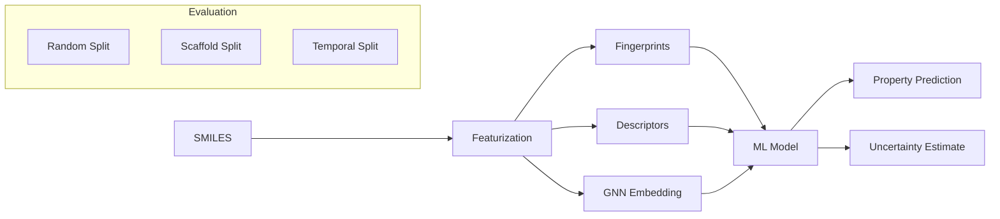

# Property Prediction with ML

## Overview

Predicting molecular properties from structure is the foundational task in computational chemistry and drug discovery. Given a molecule, can we predict its solubility, toxicity, binding affinity, or melting point without expensive experiments or quantum calculations? This is the domain of Quantitative Structure-Activity Relationships (QSAR) and Quantitative Structure-Property Relationships (QSPR), now supercharged by modern machine learning.

The QSAR paradigm follows a simple pipeline: represent molecules as feature vectors, split data into train/test sets, train a model, and evaluate predictions. Classical approaches used hand-crafted descriptors (molecular weight, LogP, topological indices) with linear models or random forests. Modern approaches use learned representations (GNNs, transformers) that jointly optimize the featurization and prediction.

**Dataset splitting** deserves special attention in molecular ML. Random splits dramatically overestimate model performance because similar molecules end up in both train and test sets. Scaffold splits — grouping molecules by their core ring structure — provide a much more realistic estimate of generalization to novel chemical series. Temporal splits (train on older data, test on newer) simulate prospective prediction.

**MoleculeNet** is the standard benchmark suite for molecular property prediction, containing 17 datasets spanning quantum mechanics (QM7, QM8, QM9), physical chemistry (ESOL, FreeSolv, Lipophilicity), biophysics (PCBA, MUV, HIV), and physiology (BBBP, Tox21, ClinTox, SIDER). It established standardized splits and evaluation metrics, enabling fair comparison of methods.

For **regression tasks** (predicting continuous values like solubility or binding free energy), the standard metrics are RMSE, MAE, and $R^2$. For **classification tasks** (active/inactive, toxic/non-toxic), we use AUROC, AUPRC, and balanced accuracy. Class imbalance is pervasive in molecular datasets — actives may represent <1% of screened compounds — making AUPRC particularly informative.

**Uncertainty quantification** is crucial for deployment. Ensemble methods (training multiple models with different random seeds) provide calibrated uncertainty estimates. Molecules far from the training distribution should have high predicted uncertainty. This guides experimental prioritization: high-confidence predictions can be trusted, while uncertain predictions flag molecules needing experimental validation.

State-of-the-art methods include Chemprop (D-MPNN), Uni-Mol (3D transformer pretrained on 209M conformations), and various GNN architectures fine-tuned on specific tasks. Pretraining on large unlabeled molecular databases followed by task-specific fine-tuning has emerged as a powerful paradigm, analogous to BERT in NLP.

## Key Concepts

- **QSAR/QSPR**: Mathematical models relating molecular structure to biological activity or physical properties
- **Scaffold split**: Splitting data by Bemis-Murcko scaffolds to test generalization to novel chemical series
- **MoleculeNet**: Standard benchmark suite with 17 datasets and standardized evaluation protocols
- **Class imbalance**: Most screening datasets have very few actives (<1%), requiring appropriate metrics and training strategies
- **Uncertainty quantification**: Estimating confidence in predictions; critical for deciding which molecules to synthesize
- **Pretraining**: Learning general molecular representations from large unlabeled data before task-specific fine-tuning

## Code Examples

```python
"""
Property prediction pipeline with scikit-learn and RDKit fingerprints
Predicting aqueous solubility (ESOL dataset)
"""
import numpy as np
from rdkit import Chem
from rdkit.Chem import AllChem, Descriptors, DataStructs
from sklearn.ensemble import RandomForestRegressor, GradientBoostingRegressor
from sklearn.model_selection import cross_val_score
from sklearn.metrics import mean_squared_error, r2_score

# Example ESOL data (SMILES, measured logS)
esol_data = [
    ('c1ccc2c(c1)cc1ccc3cccc4ccc2c1c34', -7.87),  # Pyrene
    ('CC(=O)OC1=CC=CC=C1C(=O)O', -1.63),           # Aspirin
    ('OCC(O)C(O)C(O)C(O)CO', 0.58),                 # Sorbitol
    ('CCO', 0.31),                                     # Ethanol
    ('c1ccccc1', -0.77),                               # Benzene
    ('CC(C)CC1=CC=C(C=C1)C(C)C(=O)O', -3.18),      # Ibuprofen
    ('CN1C=NC2=C1C(=O)N(C(=O)N2C)C', -0.55),       # Caffeine
]

# Featurization: Morgan fingerprints + descriptors
def featurize(smiles):
    mol = Chem.MolFromSmiles(smiles)
    # Morgan fingerprint (2048 bits)
    fp = AllChem.GetMorganFingerprintAsBitVect(mol, 2, nBits=2048)
    arr = np.zeros(2048)
    DataStructs.ConvertToNumpyArray(fp, arr)
    # Add computed descriptors
    desc = [
        Descriptors.MolLogP(mol),
        Descriptors.MolWt(mol),
        Descriptors.TPSA(mol),
        Descriptors.NumRotatableBonds(mol),
        Descriptors.NumHDonors(mol),
        Descriptors.NumHAcceptors(mol),
    ]
    return np.concatenate([arr, desc])

X = np.array([featurize(smi) for smi, _ in esol_data])
y = np.array([sol for _, sol in esol_data])

# Train model
rf = RandomForestRegressor(n_estimators=100, random_state=42)
rf.fit(X, y)
y_pred = rf.predict(X)
print(f"Training R² = {r2_score(y, y_pred):.3f}")
print(f"Training RMSE = {np.sqrt(mean_squared_error(y, y_pred)):.3f} log mol/L")

# Uncertainty via ensemble disagreement
from sklearn.ensemble import BaggingRegressor
ensemble = BaggingRegressor(
    estimator=RandomForestRegressor(n_estimators=50),
    n_estimators=5, random_state=42
)
ensemble.fit(X, y)
predictions = np.array([est.predict(X) for est in ensemble.estimators_])
uncertainty = predictions.std(axis=0)
print(f"\nPrediction uncertainties: {uncertainty.round(3)}")

# Scaffold-aware evaluation (concept demonstration)
from rdkit.Chem.Scaffolds import MurckoScaffold

def get_scaffold(smiles):
    mol = Chem.MolFromSmiles(smiles)
    scaffold = MurckoScaffold.GetScaffoldForMol(mol)
    return Chem.MolToSmiles(scaffold)

print("\nScaffolds:")
for smi, _ in esol_data[:4]:
    print(f"  {smi[:30]:30s} -> {get_scaffold(smi)}")
```

## Mathematical Formalism

For regression, the loss function is typically MSE:

$$\mathcal{L}_{\text{MSE}} = \frac{1}{N}\sum_{i=1}^N (y_i - \hat{y}_i)^2$$

For binary classification with class imbalance, weighted binary cross-entropy:

$$\mathcal{L}_{\text{BCE}} = -\frac{1}{N}\sum_{i=1}^N \left[w_+ y_i \log(\hat{p}_i) + w_- (1-y_i)\log(1-\hat{p}_i)\right]$$

where $w_+ = N / (2 \cdot N_+)$ and $w_- = N / (2 \cdot N_-)$ rebalance the classes.

Ensemble uncertainty (epistemic) for $M$ models:

$$\mu(\mathbf{x}) = \frac{1}{M}\sum_{m=1}^M f_m(\mathbf{x}), \quad \sigma^2(\mathbf{x}) = \frac{1}{M}\sum_{m=1}^M \left(f_m(\mathbf{x}) - \mu(\mathbf{x})\right)^2$$

## Diagrams



## Exercises/Projects

1. **ESOL benchmark**: Download the ESOL dataset from MoleculeNet. Train a Random Forest with Morgan fingerprints and compare against a simple linear model. Report RMSE on scaffold split.

2. **Feature importance**: For your ESOL model, compute feature importances. Which bits of the Morgan fingerprint are most predictive of solubility? Can you map them back to substructures?

3. **Classification challenge**: Train a model on the BBBP (blood-brain barrier penetration) dataset. Handle class imbalance with oversampling or class weights. Report AUROC on scaffold split.

4. **Uncertainty calibration**: Train an ensemble of 10 models. Plot predicted uncertainty vs. actual error. Is your model well-calibrated? Do high-uncertainty predictions correspond to scaffold-novel molecules?

## Further Reading

- Wu et al. "MoleculeNet: A Benchmark for Molecular Machine Learning" Chemical Science 9, 513-530 (2018)
- Yang et al. "Analyzing Learned Molecular Representations for Property Prediction" J. Chem. Inf. Model. 2019
- Zhou et al. "Uni-Mol: A Universal 3D Molecular Representation Learning Framework" ICLR 2023
