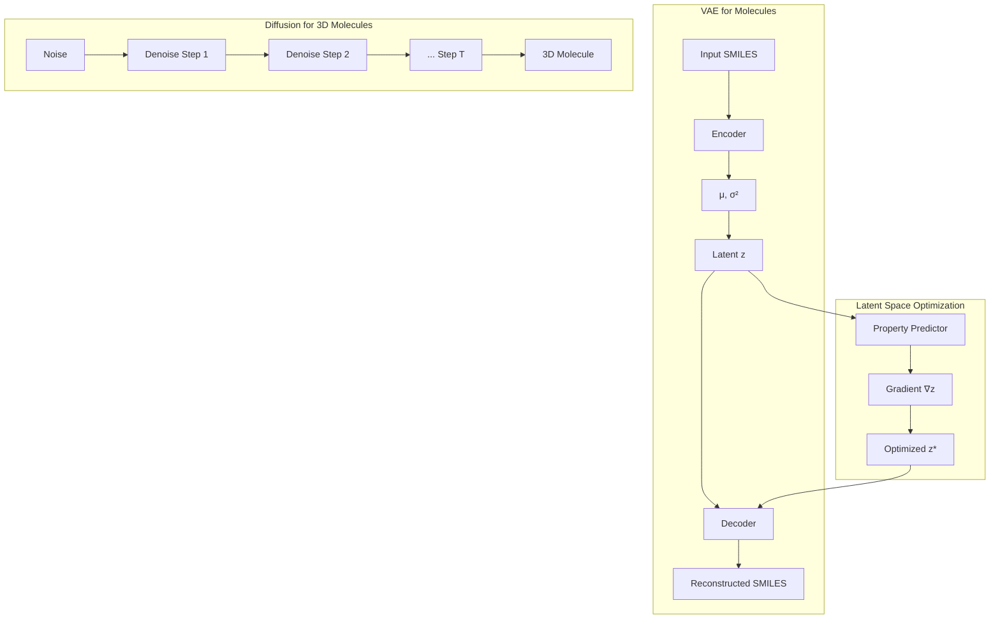

# Generative Models for Molecule Design

## Overview

While property prediction asks "what are this molecule's properties?", generative modeling asks the inverse: "what molecule has these desired properties?" This is the problem of **inverse molecular design** — generating novel molecules optimized for specific targets. Generative models for molecules have exploded in recent years, enabling the design of drug candidates, catalysts, and materials with tailored properties.

The challenge is enormous: chemical space contains an estimated $10^{60}$ drug-like molecules, far too many to enumerate. We need models that can efficiently navigate this space, generating valid, synthesizable molecules with desired property profiles. Several generative paradigms have been adapted for molecules, each with distinct strengths.

**Variational Autoencoders (VAEs)** learn a continuous latent space where molecules are encoded as points. The encoder maps molecules to latent vectors, and the decoder reconstructs molecules from latent vectors. The key advantage is that the smooth latent space enables interpolation between molecules and optimization via gradient descent. Junction Tree VAE (JT-VAE) generates molecules by assembling molecular substructures (tree decomposition), guaranteeing 100% chemical validity.

**Generative Adversarial Networks (GANs)** for molecules pit a generator against a discriminator. MolGAN (2018) generates small molecular graphs in one shot using a graph-based generator and a reward network for property optimization. While GANs can produce diverse outputs, they suffer from mode collapse and training instability.

**Autoregressive models** generate molecules token-by-token (for SMILES) or atom-by-atom (for graphs). GraphDF uses discrete normalizing flows to generate molecular graphs autoregressively, modeling the joint distribution over atoms and bonds. SMILES-based autoregressive models (using RNNs or transformers) are simple and effective but can generate invalid strings.

**Diffusion models** have recently emerged as the state-of-the-art for molecular generation. They learn to denoise molecular structures from random noise, generating 3D molecular conformations or graphs through iterative refinement. EDM (Equivariant Diffusion Models) generates 3D molecules with correct geometry. DiffSBDD and TargetDiff generate protein-bound ligands conditioned on binding pocket structure.

**Reinforcement learning** approaches frame generation as a sequential decision process. An agent builds molecules action-by-action (adding atoms, bonds), receiving rewards for desired properties. REINVENT and related methods use policy gradient algorithms to optimize molecular generators toward multi-objective property profiles.

The key challenge across all approaches is balancing **validity** (generated molecules must be chemically sound), **novelty** (they should differ from training data), **diversity** (avoiding mode collapse), and **property optimization** (achieving target profiles). Modern methods typically achieve >95% validity and can optimize multiple properties simultaneously.

## Key Concepts

- **Inverse molecular design**: Generating molecules with desired target properties, rather than predicting properties of given molecules
- **Latent space optimization**: Using the smooth latent space of a VAE to find molecules with optimal predicted properties via gradient ascent
- **Validity rate**: Percentage of generated molecules that are chemically valid; 100% for SELFIES/JT-VAE methods
- **Novelty**: Fraction of generated molecules not present in the training set
- **Mode collapse**: A failure mode where the generative model produces limited diversity, generating the same few molecules repeatedly
- **Multi-objective optimization**: Simultaneously optimizing multiple properties (e.g., high potency + low toxicity + good solubility)

## Code Examples

```python
"""
Molecular generation with a SMILES-based VAE (simplified)
"""
import torch
import torch.nn as nn
import torch.nn.functional as F
from rdkit import Chem

# Character-level SMILES vocabulary
CHARS = ' CNOcnos()=#123456789+-[]@/\\.'
char_to_idx = {c: i for i, c in enumerate(CHARS)}
idx_to_char = {i: c for i, c in enumerate(CHARS)}
VOCAB_SIZE = len(CHARS)
MAX_LEN = 60

def smiles_to_tensor(smiles, max_len=MAX_LEN):
    """One-hot encode a SMILES string."""
    tensor = torch.zeros(max_len, VOCAB_SIZE)
    for i, c in enumerate(smiles[:max_len]):
        if c in char_to_idx:
            tensor[i, char_to_idx[c]] = 1.0
    return tensor

# VAE architecture
class MoleculeVAE(nn.Module):
    def __init__(self, latent_dim=128):
        super().__init__()
        self.latent_dim = latent_dim

        # Encoder
        self.encoder = nn.GRU(VOCAB_SIZE, 256, batch_first=True)
        self.fc_mu = nn.Linear(256, latent_dim)
        self.fc_logvar = nn.Linear(256, latent_dim)

        # Decoder
        self.fc_decode = nn.Linear(latent_dim, 256)
        self.decoder = nn.GRU(VOCAB_SIZE + 256, 256, batch_first=True)
        self.output = nn.Linear(256, VOCAB_SIZE)

    def encode(self, x):
        _, h = self.encoder(x)
        h = h.squeeze(0)
        return self.fc_mu(h), self.fc_logvar(h)

    def reparameterize(self, mu, logvar):
        std = torch.exp(0.5 * logvar)
        eps = torch.randn_like(std)
        return mu + eps * std

    def decode(self, z, max_len=MAX_LEN):
        h = self.fc_decode(z).unsqueeze(0)
        # Teacher forcing omitted for brevity
        outputs = []
        input_token = torch.zeros(z.size(0), 1, VOCAB_SIZE)
        for _ in range(max_len):
            context = z.unsqueeze(1).expand(-1, 1, -1)
            dec_input = torch.cat([input_token, context], dim=-1)
            out, h = self.decoder(dec_input, h)
            logits = self.output(out)
            outputs.append(logits)
            input_token = F.softmax(logits, dim=-1)
        return torch.cat(outputs, dim=1)

    def forward(self, x):
        mu, logvar = self.encode(x)
        z = self.reparameterize(mu, logvar)
        recon = self.decode(z)
        return recon, mu, logvar

# VAE loss: reconstruction + KL divergence
def vae_loss(recon_x, x, mu, logvar):
    recon_loss = F.cross_entropy(
        recon_x.view(-1, VOCAB_SIZE),
        x.argmax(dim=-1).view(-1),
        reduction='mean'
    )
    kl_loss = -0.5 * torch.mean(1 + logvar - mu.pow(2) - logvar.exp())
    return recon_loss + kl_loss

# Sampling: generate molecules from random latent vectors
def sample_molecules(model, n=5, latent_dim=128):
    model.eval()
    with torch.no_grad():
        z = torch.randn(n, latent_dim)
        logits = model.decode(z)
        indices = logits.argmax(dim=-1)

        molecules = []
        for i in range(n):
            smiles = ''.join([idx_to_char.get(idx.item(), '')
                            for idx in indices[i]]).strip()
            mol = Chem.MolFromSmiles(smiles)
            molecules.append((smiles, mol is not None))
    return molecules

# Demo
model = MoleculeVAE(latent_dim=128)
print(f"Model parameters: {sum(p.numel() for p in model.parameters()):,}")
print("\nSample latent space interpolation concept:")
print("  z1 (molecule A) ---interpolate--- z2 (molecule B)")
print("  Decoding intermediate z values yields molecular transitions")
```

## Mathematical Formalism

The VAE objective (Evidence Lower Bound):

$$\mathcal{L}_{\text{VAE}} = \mathbb{E}_{q_\phi(\mathbf{z}|\mathbf{x})}\left[\log p_\theta(\mathbf{x}|\mathbf{z})\right] - D_{\text{KL}}\left(q_\phi(\mathbf{z}|\mathbf{x}) \| p(\mathbf{z})\right)$$

where the first term is reconstruction quality and the second regularizes the latent space toward $\mathcal{N}(0, I)$.

For property optimization in latent space, we maximize:

$$\mathbf{z}^* = \arg\max_{\mathbf{z}} f(\text{decode}(\mathbf{z})) \quad \text{subject to} \quad \|\mathbf{z}\| \leq R$$

The GAN objective for molecular generation (MolGAN):

$$\min_G \max_D \; \mathbb{E}_{\mathbf{x} \sim p_{\text{data}}}[\log D(\mathbf{x})] + \mathbb{E}_{\mathbf{z} \sim p(\mathbf{z})}[\log(1 - D(G(\mathbf{z})))] + \lambda \cdot \text{Reward}(G(\mathbf{z}))$$

## Diagrams



## Exercises/Projects

1. **SMILES generation with RNN**: Train a character-level LSTM on a SMILES dataset (e.g., ZINC-250K). Sample 1000 molecules and compute validity rate, uniqueness, and novelty.

2. **Latent space exploration**: Using a pretrained molecular VAE, encode 100 molecules and visualize the latent space with t-SNE colored by a property (e.g., LogP). Do property gradients exist?

3. **Constrained optimization**: Starting from a known drug molecule in latent space, use gradient ascent to optimize predicted solubility while staying within a Tanimoto similarity threshold of 0.4.

4. **SELFIES generation**: Repeat exercise 1 using SELFIES instead of SMILES. Compare validity rates. Is the diversity comparable?

## Further Reading

- Gómez-Bombarelli et al. "Automatic Chemical Design Using a Data-Driven Continuous Representation of Molecules" ACS Central Science 4, 268-276 (2018)
- Jin et al. "Junction Tree Variational Autoencoder for Molecular Graph Generation" ICML 2018
- De Cao & Kipf. "MolGAN: An implicit generative model for small molecular graphs" ICML 2018 Workshop
- Hoogeboom et al. "Equivariant Diffusion for Molecule Generation in 3D" ICML 2022
